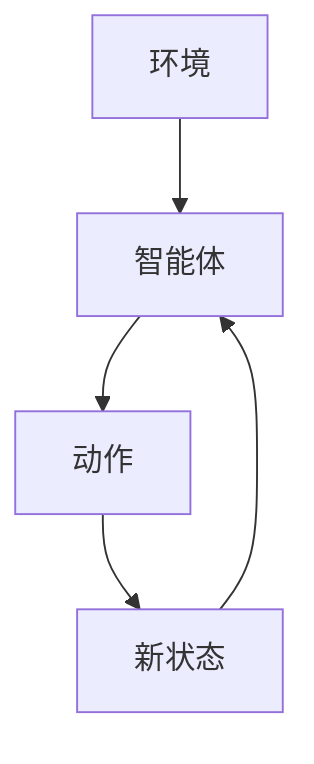
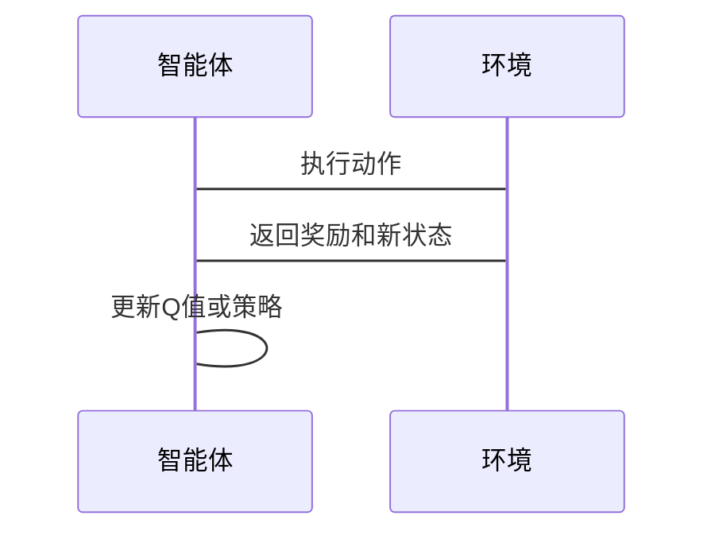

                 

# 开发具有强化学习能力的AI Agent

> 关键词：强化学习，AI Agent，Q-learning，Deep Q-learning，Actor-Critic，系统架构

> 摘要：本文详细探讨了开发具有强化学习能力的AI Agent的各个方面，从基础概念到核心算法，再到系统架构和项目实战，帮助读者全面理解并掌握强化学习在AI Agent中的应用。

---

## 第1章: 强化学习与AI Agent概述

### 1.1 强化学习的基本概念

#### 1.1.1 强化学习的定义
强化学习（Reinforcement Learning, RL）是一种机器学习范式，通过智能体与环境的交互，智能体通过试错的方式学习如何采取适当的行动以最大化累积的奖励。强化学习的核心在于智能体通过不断尝试和错误，逐步优化其策略，以实现目标。

#### 1.1.2 强化学习的核心要素
- **状态（State）**：智能体所处的环境信息。
- **动作（Action）**：智能体在某一状态下选择的行为。
- **奖励（Reward）**：智能体在执行动作后获得的反馈，通常表现为数值形式，表示该动作的好坏程度。
- **策略（Policy）**：智能体选择动作的规则，可以用数学表达式表示为：$\pi(a|s)$，即在状态$s$下选择动作$a$的概率。
- **值函数（Value Function）**：衡量某状态下采取某种行动后的期望累积奖励。

#### 1.1.3 AI Agent的基本概念
AI Agent（人工智能代理）是一种能够感知环境并采取行动以实现目标的智能实体。AI Agent可以是软件程序、机器人或其他智能系统，其核心能力在于通过感知和决策实现目标。

### 1.2 强化学习与AI Agent的关系

#### 1.2.1 强化学习在AI Agent中的作用
强化学习为AI Agent提供了自主学习和优化决策的能力。通过强化学习，AI Agent能够在动态和不确定的环境中自适应地调整策略，以实现长期目标的最大化。

#### 1.2.2 AI Agent的类型与应用场景
- **反应式AI Agent**：基于当前感知做出即时反应，不依赖历史信息。
- **认知式AI Agent**：具备复杂推理和规划能力，能够根据目标和环境信息做出决策。
- **强化学习AI Agent**：通过与环境交互，不断优化策略以获得最大累积奖励。

#### 1.2.3 强化学习与监督学习的区别
- **监督学习**：数据由标签指导，学习过程基于输入-输出对。
- **强化学习**：通过与环境交互，基于累积奖励优化策略。

### 1.3 强化学习的核心算法

#### 1.3.1 Q-learning算法
Q-learning是一种经典的强化学习算法，适用于离散状态和动作空间。其核心思想是通过维护一个Q表，记录每个状态-动作对的期望累积奖励，逐步更新Q值以逼近最优策略。

#### 1.3.2 Deep Q-learning算法
Deep Q-learning将Q值函数近似为深度神经网络，适用于高维状态空间。通过经验回放和目标网络，优化了Q-learning的训练效率和稳定性。

#### 1.3.3 Policy Gradient方法
Policy Gradient直接优化策略，通过计算策略梯度，逐步调整参数以最大化累积奖励。Actor-Critic架构结合了策略评估和策略改进，提高了算法的收敛性和稳定性。

### 1.4 强化学习的数学基础

#### 1.4.1 状态、动作、奖励的定义
- 状态$s$：环境信息的表示，可以是向量形式。
- 动作$a$：智能体在状态$s$下选择的行为。
- 奖励$r$：执行动作$a$后获得的反馈，通常为标量。

#### 1.4.2 Q值函数的数学表达
Q值函数表示在状态$s$下采取动作$a$后的期望累积奖励：
$$ Q(s, a) = \mathbb{E}[R | s, a] $$
其中，$R$表示从当前状态和动作开始的累积奖励。

#### 1.4.3 动态规划与近似方法
动态规划通过迭代更新Q值函数逼近最优策略，而近似方法（如神经网络）则用于处理高维状态空间和复杂环境。

### 1.5 本章小结
本章介绍了强化学习和AI Agent的基本概念、核心要素、算法类型以及数学基础，为后续章节的深入探讨奠定了基础。

---

## 第2章: Q-learning算法详解

### 2.1 Q-learning的基本原理

#### 2.1.1 Q值更新公式
Q-learning通过贝尔曼方程更新Q值：
$$ Q(s, a) \leftarrow Q(s, a) + \alpha [r + \gamma \max Q(s', a')] $$
其中，$\alpha$为学习率，$\gamma$为折扣因子。

#### 2.1.2 探索与利用策略
- **探索**：尝试未访问或较少访问的动作，避免陷入局部最优。
- **利用**：基于当前知识，选择当前最优的动作。

#### 2.1.3 算法的收敛性分析
Q-learning在离散状态和动作空间下具有收敛性，但需要满足马尔可夫假设和适当的学习率衰减策略。

### 2.2 Deep Q-learning网络结构

#### 2.2.1 DQN网络架构
DQN由两个深度神经网络组成：主网络和目标网络。主网络用于当前策略，目标网络用于稳定价值函数的更新。

#### 2.2.2 经验回放机制
经验回放通过存储历史交互记录，减少样本偏差，提高训练效率。

#### 2.2.3 网络训练流程
- 采样经验：从经验回放中随机采样一批样本。
- 计算目标值：根据目标网络计算目标Q值。
- 更新主网络：通过最小化预测值与目标值的差异，更新主网络参数。

### 2.3 算法实现与优化

#### 2.3.1 算法实现步骤
1. 初始化Q网络和目标网络。
2. 与环境交互，记录经验。
3. 训练网络，更新Q值。
4. 定期更新目标网络。

#### 2.3.2 网络参数调整
- 学习率：$\alpha$，通常采用衰减策略。
- 折扣因子：$\gamma$，平衡当前与未来奖励的重要性。

#### 2.3.3 算法性能评估
通过累积奖励、收敛速度和稳定性指标评估Q-learning的性能。

### 2.4 本章小结
本章详细探讨了Q-learning算法的原理、网络结构和实现优化，为开发强化学习AI Agent提供了理论基础。

---

## 第3章: Policy Gradient方法

### 3.1 Policy Gradient的基本原理

#### 3.1.1 Policy Gradient的定义
Policy Gradient直接优化策略，通过计算策略梯度，调整参数以最大化累积奖励。

#### 3.1.2 梯度计算方法
- 暂时略过，后续章节详细讲解。

#### 3.1.3 算法的收敛性分析
Policy Gradient在连续动作空间下具有较好的收敛性，但需要处理策略的稳定性问题。

### 3.2 Actor-Critic架构

#### 3.2.1 Actor网络的作用
Actor网络负责生成动作，直接优化策略。

#### 3.2.2 Critic网络的作用
Critic网络评估当前状态-动作对的Q值，为Actor提供梯度信息。

#### 3.2.3 算法流程
1. Actor选择动作。
2. 环境返回奖励和新状态。
3. Critic评估Q值，计算梯度。
4. Actor更新策略，优化参数。

### 3.3 本章小结
本章介绍了Policy Gradient的基本原理和Actor-Critic架构，为开发更复杂的强化学习AI Agent提供了思路。

---

## 第4章: 强化学习AI Agent的系统架构设计

### 4.1 系统功能设计

#### 4.1.1 系统架构图

#### 4.1.2 系统交互序列

### 4.2 系统实现

#### 4.2.1 环境接口设计
定义环境与智能体的交互接口，包括获取状态、执行动作、返回奖励等操作。

#### 4.2.2 智能体实现
实现智能体的感知、决策和学习功能，具体包括状态处理、动作选择和Q值更新。

### 4.3 本章小结
本章详细探讨了强化学习AI Agent的系统架构设计，为实际开发提供了指导。

---

## 第5章: 项目实战

### 5.1 环境安装与配置

#### 5.1.1 安装依赖
安装Python、TensorFlow、Keras等开发工具。

#### 5.1.2 配置环境
设置强化学习环境，如OpenAI Gym。

### 5.2 核心实现

#### 5.2.1 Q-learning实现
实现Q表更新、动作选择和奖励计算。

#### 5.2.2 Deep Q-learning实现
实现经验回放、网络训练和目标网络更新。

### 5.3 测试与优化

#### 5.3.1 测试环境
在预设环境中测试智能体的性能。

#### 5.3.2 参数调优
调整学习率、折扣因子等参数，优化算法性能。

### 5.4 本章小结
本章通过具体项目实战，展示了强化学习AI Agent的开发过程。

---

## 第6章: 强化学习的优化与进阶

### 6.1 算法优化

#### 6.1.1 网络架构优化
改进网络结构，提升近似能力。

#### 6.1.2 算法加速
采用经验回放、优先经验回放等方法，加速训练过程。

### 6.2 系统优化

#### 6.2.1 并行计算
利用多线程或多进程加速训练。

#### 6.2.2 模型压缩
优化模型大小，提升部署效率。

### 6.3 研究热点与未来趋势

#### 6.3.1 多智能体协同
研究多个AI Agent协同工作，提升整体性能。

#### 6.3.2 强化学习可解释性
探索如何提高强化学习决策的可解释性。

### 6.4 本章小结
本章探讨了强化学习的优化方法和未来研究方向，为读者提供了进一步学习的指引。

---

## 作者：AI天才研究院/AI Genius Institute & 禅与计算机程序设计艺术 /Zen And The Art of Computer Programming

---

### 总结
本文从强化学习的基本概念出发，详细探讨了Q-learning和Policy Gradient的核心算法，系统分析了AI Agent的架构设计，并通过具体项目实战展示了算法实现过程。同时，本文还介绍了强化学习的优化方法和未来研究方向，为读者全面理解并开发具有强化学习能力的AI Agent提供了深入的指导。

