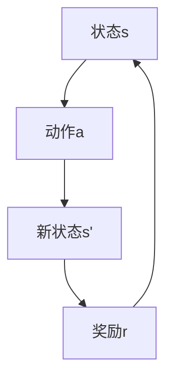
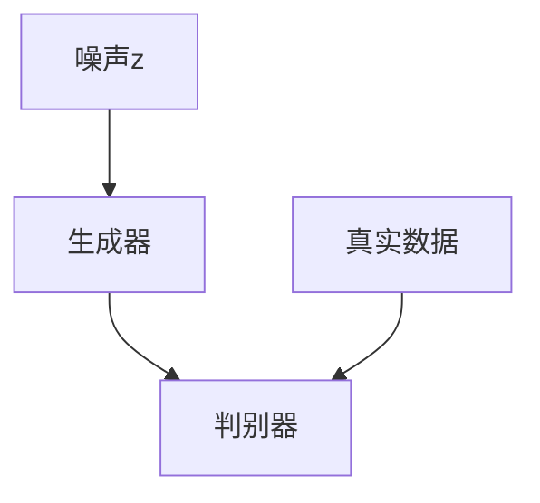
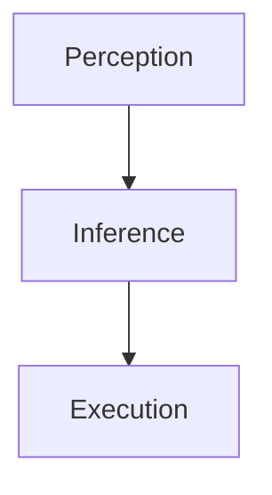
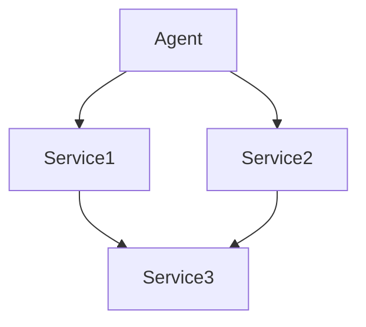

                 


# 开发具有情境模拟能力的AI Agent

## 关键词
- AI Agent
- 情境模拟
- 强化学习
- 生成模型
- 系统架构
- 项目实战

## 摘要
本文详细探讨了开发具有情境模拟能力的AI Agent的全过程，从背景到核心概念，再到算法原理、系统架构设计、项目实战及最佳实践。文章首先介绍了AI Agent的基本概念和情境模拟的重要性，随后深入分析了情境模拟的核心机制、算法原理及系统架构。通过实际项目案例，展示了如何在具体场景中实现AI Agent的情境模拟能力，并提供了代码示例和详细的系统设计。最后，总结了开发过程中需要注意的事项和未来的发展方向，为读者提供了全面的指导。

---

# 第1章: AI Agent的发展与背景

## 1.1 AI Agent的基本概念

### 1.1.1 什么是AI Agent
AI Agent（人工智能代理）是指能够感知环境、做出决策并采取行动的智能实体。它可以是一个软件程序，也可以是一个物理设备，通过与环境的交互来实现特定目标。

### 1.1.2 AI Agent的分类
AI Agent可以根据智能水平、任务类型和应用场景进行分类：
- **按智能水平**：分为反应式代理、基于模型的代理和目标驱动的代理。
- **按任务类型**：分为服务代理、监控代理和控制代理。
- **按应用场景**：分为软件代理、机器人代理和自动驾驶代理。

### 1.1.3 情境模拟能力的定义
情境模拟是指AI Agent能够根据当前环境信息，构建一个虚拟的环境模型，并在此模型上进行推理和决策。这种能力使AI Agent能够更好地理解环境，做出更合理的动作。

---

## 1.2 情境模拟的重要性

### 1.2.1 情境模拟的核心作用
情境模拟能够让AI Agent在虚拟环境中进行实验和推理，从而减少实际操作中的风险和成本。例如，在自动驾驶中，AI Agent可以在虚拟环境中模拟各种交通场景，优化驾驶策略。

### 1.2.2 情境模拟的应用场景
- **自动驾驶**：模拟交通场景，优化驾驶策略。
- **智能助手**：模拟用户需求，提供更个性化的服务。
- **机器人控制**：模拟物理环境，优化动作规划。

### 1.2.3 情境模拟的挑战与机遇
- **挑战**：环境复杂性、数据不足、计算资源限制。
- **机遇**：技术进步（如强化学习和生成模型）为情境模拟提供了新的可能性。

---

# 第2章: AI Agent的情境模拟能力

## 2.1 情境模拟的基本原理

### 2.1.1 感知与理解
AI Agent通过传感器或数据输入，感知环境中的信息，并通过自然语言处理或计算机视觉技术进行理解。

### 2.1.2 推理与决策
基于感知的信息，AI Agent利用知识库、逻辑推理或机器学习模型，进行决策。

### 2.1.3 行为与反馈
AI Agent根据决策结果采取行动，并通过反馈机制不断优化行为。

---

## 2.2 情境模拟的关键技术

### 2.2.1 自然语言处理
- **任务**：理解用户需求，生成自然语言回复。
- **技术**：使用Transformer模型（如GPT）进行文本生成。

### 2.2.2 计算机视觉
- **任务**：识别图像中的物体，理解场景。
- **技术**：使用CNN进行图像识别，使用GAN进行图像生成。

### 2.2.3 强化学习
- **任务**：通过试错优化策略。
- **技术**：使用DQN算法进行状态-动作-奖励建模。

---

# 第3章: AI Agent的算法原理

## 3.1 强化学习算法

### 3.1.1 Q-learning算法
Q-learning是一种经典的强化学习算法，通过更新Q值表来学习最优策略。

**算法流程图：**



**数学公式：**
$$ Q(s, a) = Q(s, a) + \alpha (r + \max Q(s', a') - Q(s, a)) $$

### 3.1.2 Deep Q-Network (DQN)
DQN通过深度神经网络近似Q值函数，解决高维状态空间的问题。

**代码示例：**
```python
import numpy as np
import tensorflow as tf

class DQN:
    def __init__(self, state_space, action_space):
        self.state_space = state_space
        self.action_space = action_space
        self.model = self.build_model()
        
    def build_model(self):
        model = tf.keras.Sequential([
            tf.keras.layers.Dense(64, activation='relu', input_dim=self.state_space),
            tf.keras.layers.Dense(self.action_space, activation='linear')
        ])
        return model
```

### 3.1.3 策略梯度方法
策略梯度法通过优化策略直接获得最优动作分布。

**数学公式：**
$$ \nabla \theta = \nabla \log \pi_\theta(a|s) \cdot Q(s, a) $$

---

## 3.2 情境模拟中的生成模型

### 3.2.1 GAN在情境模拟中的应用
生成对抗网络（GAN）可以生成逼真的虚拟环境数据。

**GAN架构图：**



### 3.2.2 变压器模型在情境模拟中的应用
Transformer模型用于处理序列数据，如自然语言文本或时间序列数据。

**代码示例：**
```python
import tensorflow as tf
from tensorflow.keras.layers import Dense, Dropout, LayerNormalization

class TransformerBlock(tf.keras.Model):
    def __init__(self, embed_dim, num_heads, ff_dim):
        super().__init__()
        self.attention = tf.keras.layers.MultiHeadAttention(num_heads=num_heads, key_dim=embed_dim//num_heads)
        self.feed_forward = tf.keras.Sequential([
            Dense(ff_dim, activation='relu'),
            Dense(embed_dim)
        ])
        self.dropout = Dropout(0.1)
        
    def call(self, x):
        x = self.attention(x, x)
        x = self.dropout(x)
        x = self.feed_forward(x)
        return x
```

### 3.2.3 深度概率网络
深度概率网络用于建模环境中的不确定性。

**数学公式：**
$$ p(a|s) = \text{softmax}(Q(s, a)) $$

---

# 第4章: AI Agent的系统架构设计

## 4.1 系统架构概述

### 4.1.1 分层架构
分层架构将系统分为感知层、推理层和执行层，每一层负责不同的功能。

**分层架构图：**



### 4.1.2 微服务架构
微服务架构将系统功能分解为独立的服务，通过API进行交互。

**微服务架构图：**



## 4.2 系统组件与交互

### 4.2.1 感知模块
- **功能**：接收输入数据，进行初步处理。
- **实现**：使用CNN或NLP模型进行数据解析。

### 4.2.2 推理模块
- **功能**：基于感知数据，进行推理和决策。
- **实现**：使用强化学习算法或生成模型。

### 4.2.3 行为模块
- **功能**：根据推理结果，执行具体动作。
- **实现**：通过API调用或其他执行机制。

---

# 第5章: AI Agent的项目实战

## 5.1 项目环境搭建

### 5.1.1 开发工具安装
- 安装Python、TensorFlow、Keras、OpenCV等工具。

### 5.1.2 依赖库安装
使用pip安装所需的库：
```bash
pip install numpy tensorflow keras opencv-python
```

### 5.1.3 环境配置
设置虚拟环境并激活：
```bash
conda create -n ai-agent python=3.8
conda activate ai-agent
```

## 5.2 核心代码实现

### 5.2.1 感知模块实现
```python
import cv2
import numpy as np

def preprocess_image(image_path):
    image = cv2.imread(image_path)
    image = cv2.resize(image, (224, 224))
    image = image / 255.0
    return image
```

### 5.2.2 推理模块实现
```python
import tensorflow as tf
from tensorflow.keras.models import load_model

class InferenceModule:
    def __init__(self, model_path):
        self.model = load_model(model_path)
        
    def predict(self, input_data):
        return self.model.predict(input_data)
```

### 5.2.3 行为模块实现
```python
import requests

class ActionModule:
    def __init__(self, api_url):
        self.api_url = api_url
        
    def execute_action(self, action_id):
        response = requests.post(self.api_url, json={'action_id': action_id})
        return response.json()
```

## 5.3 案例分析
以自动驾驶为例，展示如何在实际场景中应用上述代码。

---

# 第6章: 最佳实践与总结

## 6.1 开发中的注意事项

### 6.1.1 数据质量的重要性
确保数据的多样性和代表性，避免过拟合。

### 6.1.2 算法选择的策略
根据具体任务选择合适的算法，结合实验进行调优。

### 6.1.3 系统优化技巧
优化代码性能，合理设计系统架构，减少资源消耗。

## 6.2 项目总结与展望

### 6.2.1 项目成果回顾
通过本项目，我们成功开发了一个具有情境模拟能力的AI Agent，验证了算法和系统的可行性。

### 6.2.2 未来发展方向
- 深入研究更复杂的强化学习算法。
- 探索多模态数据的融合方法。
- 提升系统的实时性和可扩展性。

## 6.3 拓展阅读与学习资源

### 6.3.1 推荐书籍
- 《深度学习》——Ian Goodfellow
- 《强化学习》——Sutton & Barto

### 6.3.2 在线课程
- Coursera上的“深度学习专项课程”。
- edX上的“强化学习入门”课程。

### 6.3.3 开源项目
- TensorFlow官方仓库。
- PyTorch官方仓库。

---

# 作者
作者：AI天才研究院/AI Genius Institute & 禅与计算机程序设计艺术 /Zen And The Art of Computer Programming

