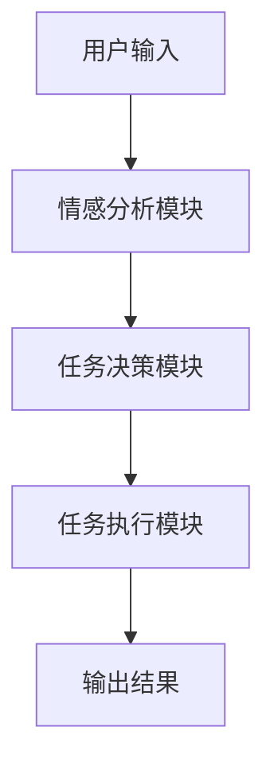

                 


```markdown
# 开发具有情感分析能力的AI Agent

## 关键词：AI Agent，情感分析，自然语言处理，深度学习，机器学习，文本挖掘

## 摘要：  
本文将详细探讨如何开发一个具有情感分析能力的AI Agent。首先，我们将介绍情感分析和AI Agent的基本概念及其重要性。接着，我们将深入分析情感分析的核心算法及其在AI Agent中的应用。然后，我们将讨论AI Agent的系统架构设计，并结合实际案例展示如何实现一个情感分析驱动的AI Agent。最后，我们将总结开发过程中需要注意的关键点，并展望未来的发展方向。

---

## 第一部分: 情感分析与AI Agent基础

### 第1章: 情感分析的基本概念

#### 1.1 情感分析的定义与背景
- 情感分析的定义
- 情感分析的发展历程
- 情感分析在自然语言处理中的地位

#### 1.2 AI Agent的基本概念
- AI Agent的定义
- AI Agent的核心功能
- AI Agent与传统程序的主要区别

#### 1.3 情感分析在AI Agent中的作用
- 情感分析如何增强AI Agent的交互能力
- 情感分析在任务决策中的应用
- 情感分析对提升用户体验的重要性

---

### 第2章: 情感分析的核心概念

#### 2.1 情感分析的分类与特征
- 情感极性分析
- 情感强度分析
- 情感主题分析

#### 2.2 情感分析的特征提取
- 文本特征提取方法
- 词袋模型与词嵌入
- 情感特征的表示方式

#### 2.3 情感分析的核心要素
- 情感分析的输入与输出
- 情感分析的评价指标
- 情感分析的边界与外延

---

## 第二部分: 情感分析算法原理

### 第3章: 情感分析的基础算法

#### 3.1 朴素贝叶斯算法
- 朴素贝叶斯的原理
- 朴素贝叶斯在情感分析中的应用
- 代码实现示例

#### 3.2 支持向量机（SVM）算法
- SVM的基本原理
- SVM在情感分析中的优势
- 代码实现示例

#### 3.3 随机森林算法
- 随机森林的原理
- 随机森林在情感分析中的应用
- 代码实现示例

### 第4章: 深度学习算法在情感分析中的应用

#### 4.1 循环神经网络（RNN）
- RNN的基本原理
- RNN在情感分析中的应用
- 代码实现示例

#### 4.2 Transformer架构
- Transformer的原理
- Transformer在情感分析中的优势
- 代码实现示例

#### 4.3 BERT模型在情感分析中的应用
- BERT模型的基本原理
- BERT在情感分析中的应用
- 代码实现示例

---

## 第三部分: AI Agent的系统架构与实现

### 第5章: AI Agent的系统架构设计

#### 5.1 系统功能设计
- 情感分析模块
- 任务执行模块
- 交互接口模块

#### 5.2 系统架构设计


#### 5.3 接口设计与交互流程
- 系统接口设计
- 交互流程图


### 第6章: 项目实战

#### 6.1 环境安装与配置
- Python环境的安装
- 相关库的安装（如TensorFlow、Keras、NLTK等）

#### 6.2 情感分析模块的实现
- 代码实现
- 代码解读与分析

#### 6.3 AI Agent的整体实现
- 代码实现
- 代码解读与分析

#### 6.4 案例分析与结果展示
- 具体案例分析
- 结果展示与解释

---

## 第四部分: 总结与扩展

### 第7章: 总结与最佳实践

#### 7.1 本章小结
- 本文的核心内容总结
- 关键点回顾

#### 7.2 最佳实践
- 开发过程中的注意事项
- 提升情感分析准确性的方法
- 提高AI Agent交互能力的建议

#### 7.3 未来展望
- 情感分析与AI Agent的未来发展方向
- 新技术对情感分析的影响
- 情感分析在更多领域的应用潜力

---

## 作者：AI天才研究院/AI Genius Institute & 禅与计算机程序设计艺术 /Zen And The Art of Computer Programming
```

