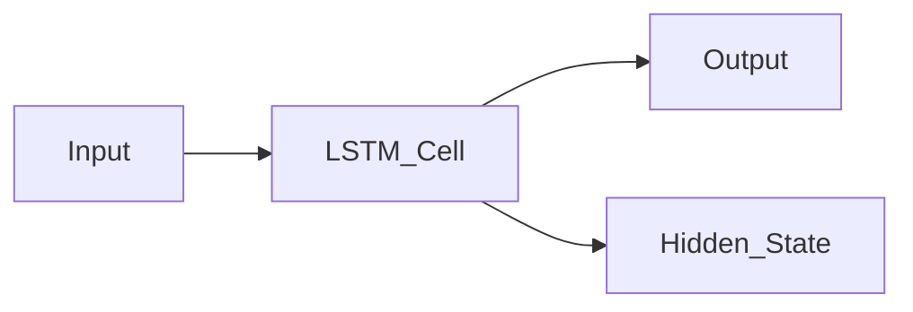
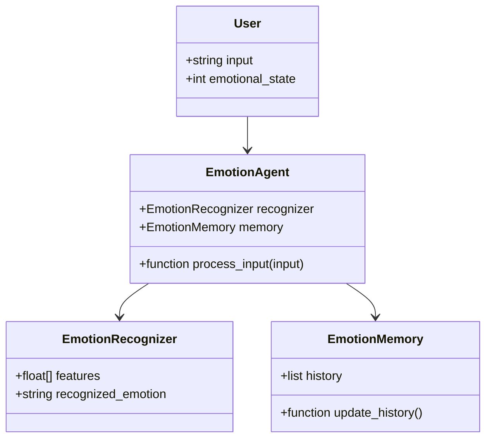
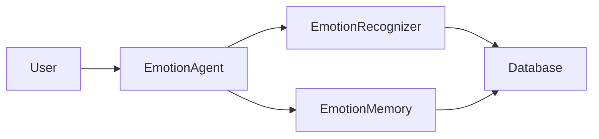

                 


# 开发具有情感计算与交互能力的AI Agent

## 关键词：情感计算，AI Agent，机器学习，深度学习，自然语言处理

## 摘要：本文详细探讨了开发具有情感计算与交互能力的AI Agent的关键技术，从情感计算的核心概念到算法原理，再到系统架构设计和项目实战，层层深入，帮助读者全面理解和掌握如何构建具备情感交互能力的智能体。

---

# 第1章 情感计算与AI Agent背景介绍

## 1.1 情感计算的定义与背景

### 1.1.1 什么是情感计算
情感计算（Affective Computing）是一种通过计算机技术来识别、理解、分析和处理人类情感的新兴领域。它研究人类的情感状态，并将其融入人机交互中，以提高系统的智能化和用户体验。

### 1.1.2 情感计算的发展背景
随着人工智能技术的快速发展，人机交互的方式也在不断进化。传统的基于规则的系统无法满足人们对情感化交互的需求，因此情感计算应运而生。它广泛应用于教育、医疗、娱乐、客服等领域。

### 1.1.3 情感计算的应用场景
- 情感识别：通过语音、表情、文本等输入，识别用户的情感状态。
- 情感记忆：记录用户的情感变化，以便后续的交互。
- 情感推理：根据情感数据，推断用户的潜在需求。

---

## 1.2 AI Agent的基本概念

### 1.2.1 什么是AI Agent
AI Agent（人工智能代理）是一种能够感知环境、自主决策并执行任务的智能实体。它可以是一个软件程序或物理设备，能够与用户进行交互，并根据任务需求动态调整行为。

### 1.2.2 AI Agent的核心特征
- **自主性**：能够在没有外部干预的情况下独立运行。
- **反应性**：能够实时感知环境并做出反应。
- **学习能力**：能够通过数据和经验不断优化自身的性能。
- **社交能力**：能够与人类或其他智能体进行有效交互。

### 1.2.3 情感计算在AI Agent中的作用
情感计算为AI Agent赋予了理解人类情感的能力，使其在交互过程中能够更自然地与人类沟通，提供更贴心的服务。

---

## 1.3 情感计算与AI Agent的结合

### 1.3.1 情感计算在AI Agent中的应用
- 情感识别：通过语音、文本或面部表情识别用户的情感状态。
- 情感记忆：记录用户的情感变化，以便后续的个性化服务。
- 情感推理：根据情感数据推断用户的潜在需求。

### 1.3.2 情感计算与AI Agent的交互模式
- **单向交互**：AI Agent仅输出情感化的回复，不考虑用户情感反馈。
- **双向交互**：用户的情感反馈影响AI Agent的行为和决策。
- **动态交互**：AI Agent根据实时情感数据动态调整交互策略。

### 1.3.3 情感计算对AI Agent性能的提升
- 提高用户满意度：通过情感识别和推理，提供更个性化的服务。
- 增强用户体验：情感化的交互让用户感到更被理解和关怀。
- 提升系统智能性：情感数据的积累和分析使AI Agent更加智能。

---

## 1.4 本章小结

本章介绍了情感计算和AI Agent的基本概念，并探讨了两者结合的重要性。情感计算为AI Agent提供了情感理解能力，使其在交互过程中更具人性化和智能化。接下来的章节将深入分析情感计算的核心概念、算法原理和系统架构设计。

---

# 第2章 情感计算的核心概念与联系

## 2.1 情感计算的核心原理

### 2.1.1 情感识别的基本原理
情感识别是情感计算的基础，主要通过分析用户的行为特征（如语音、文本、面部表情）来推断其情感状态。常见的特征包括：
- 语音特征：音调、语速、停顿。
- 文本特征：关键词、语句结构、情感词汇。
- 面部表情特征：面部肌肉运动、眼神变化。

### 2.1.2 情感记忆的实现机制
情感记忆是指系统能够记录和存储用户的情感数据，以便后续的交互中使用。常见的实现方式包括：
- 基于时间的存储：按时间顺序记录用户的情感变化。
- 基于情境的存储：根据交互场景分类存储情感数据。
- 基于用户特征的存储：根据用户的个性特点存储情感数据。

### 2.1.3 情感推理的逻辑框架
情感推理是根据情感数据推断用户的潜在需求或情感状态的变化。常见的推理方法包括：
- 基于规则的推理：根据预定义的规则进行推理。
- 基于统计的推理：通过概率模型进行推理。
- 基于机器学习的推理：通过训练模型进行预测。

---

## 2.2 情感计算与AI Agent的关系

### 2.2.1 情感计算对AI Agent的影响
情感计算使AI Agent能够理解用户的情感状态，从而提供更贴心的服务。例如，在客服系统中，AI Agent可以根据用户的情感状态调整回复语气，缓解用户的不满情绪。

### 2.2.2 AI Agent对情感计算的依赖
AI Agent的情感交互能力依赖于情感计算的支持。没有情感计算，AI Agent无法准确识别和理解用户的情感，导致交互体验下降。

### 2.2.3 情感计算与AI Agent的协同工作
情感计算与AI Agent协同工作，共同实现智能化的交互。情感计算提供情感数据，AI Agent基于这些数据做出决策和行动。

---

## 2.3 情感计算与传统计算的对比

### 2.3.1 计算目标的差异
- 传统计算：关注逻辑推理和数据处理。
- 情感计算：关注情感识别、记忆和推理。

### 2.3.2 数据处理方式的差异
- 传统计算：处理结构化数据，如数字、文本。
- 情感计算：处理非结构化数据，如语音、表情。

### 2.3.3 应用场景的差异
- 传统计算：广泛应用于数据分析、科学计算等领域。
- 情感计算：应用于教育、医疗、娱乐、客服等领域。

---

## 2.4 本章小结

本章详细介绍了情感计算的核心原理及其与AI Agent的关系，并对比了情感计算与传统计算的差异。情感计算为AI Agent提供了情感理解能力，使其在交互过程中更加智能化和人性化。

---

# 第3章 情感计算与AI Agent的算法原理

## 3.1 情感计算的主要算法

### 3.1.1 基于机器学习的情感分类算法
- **支持向量机（SVM）**：通过特征向量化和分类器训练，实现情感分类。
- **随机森林（Random Forest）**：通过特征选择和集成学习，实现情感分类。

### 3.1.2 基于深度学习的情感分析模型
- **卷积神经网络（CNN）**：通过文本卷积和池化操作，提取情感特征。
- **循环神经网络（RNN）**：通过序列建模，捕捉文本的情感变化。

### 3.1.3 情感记忆的神经网络实现
- **长短时记忆网络（LSTM）**：通过记忆单元记录长期情感信息。
- **注意力机制（Attention）**：通过注意力权重，关注重要情感信息。

---

## 3.2 AI Agent中的情感计算算法

### 3.2.1 基于RNN的情感记忆网络
```python
class EmotionMemoryNetwork:
    def __init__(self, input_size, hidden_size, output_size):
        self.hidden_size = hidden_size
        self.w1 = torch.randn(input_size, hidden_size)
        self.w2 = torch.randn(hidden_size, output_size)
    
    def forward(self, input, hidden):
        hidden = torch.sigmoid(torch.mm(input, self.w1) + hidden)
        output = torch.mm(hidden, self.w2)
        return output, hidden
```

### 3.2.2 基于CNN的情感特征提取
```python
class EmotionFeatureExtractor:
    def __init__(self, vocab_size, embedding_dim, kernel_size, num_filters):
        self.embedding = nn.Embedding(vocab_size, embedding_dim)
        self.conv1 = nn.Conv2d(1, num_filters, kernel_size)
        self.pool = nn.MaxPool2d(kernel_size)
    
    def forward(self, input):
        x = self.embedding(input)
        x = x.unsqueeze(1)
        x = self.conv1(x)
        x = self.pool(x)
        x = x.view(-1, self.num_filters)
        return x
```

### 3.2.3 情感推理的图神经网络
```python
class EmotionReasoningGraph:
    def __init__(self, input_dim, hidden_dim):
        self.fc1 = nn.Linear(input_dim, hidden_dim)
        self.fc2 = nn.Linear(hidden_dim, 1)  # 输出情感强度
    
    def forward(self, input):
        x = torch.relu(self.fc1(input))
        x = torch.sigmoid(self.fc2(x))
        return x
```

---

## 3.3 情感计算算法的优缺点对比

| 算法类型       | 优点                           | 缺点                           |
|----------------|--------------------------------|--------------------------------|
| 传统机器学习    | 简单易实现，适合小数据集       | 对复杂情感关系的处理能力有限   |
| 深度学习        | 处理能力强，适合大数据集       | 计算资源消耗大，训练时间长       |
| 图神经网络      | 能处理复杂的情感关系           | 实现复杂，需要较多领域知识       |

---

## 3.4 本章小结

本章详细介绍了情感计算的主要算法及其在AI Agent中的应用。通过比较不同算法的优缺点，读者可以更好地选择适合具体场景的算法。接下来的章节将从系统架构设计的角度，进一步探讨如何实现具有情感计算能力的AI Agent。

---

# 第4章 情感计算与AI Agent的数学模型

## 4.1 情感计算的基本数学模型

### 4.1.1 情感分类的线性模型
$$ P(y|x) = \frac{e^{w \cdot x + b}}{\sum_{k} e^{w_k \cdot x + b_k}} $$
其中，\( w \) 是权重向量，\( x \) 是输入特征，\( b \) 是偏置。

### 4.1.2 情感记忆的马尔可夫模型
状态转移概率矩阵 \( A \) 定义为：
$$ A_{i,j} = P(s_t = j | s_{t-1} = i) $$

### 4.1.3 情感推理的概率图模型
概率图模型通过贝叶斯网络表示情感推理的过程，如下图所示：


---

## 4.2 AI Agent中的情感计算模型

### 4.2.1 基于LSTM的情感记忆网络
LSTM的结构如下图所示：


### 4.2.2 基于Transformer的情感分析模型
Transformer的结构如下图所示：
```mermaid
graph LR
Input --> Multi-Head Attention
Multi-Head Attention --> Feed-Forward Network
Feed-Forward Network --> Output
```

### 4.2.3 情感推理的注意力机制模型
注意力机制的计算公式为：
$$ \alpha_i = \frac{\exp(e_i)}{\sum_{j} \exp(e_j)} $$
其中，\( e_i \) 是第 \( i \) 个词的情感特征。

---

## 4.3 情感计算模型的优化与改进

### 4.3.1 模型的参数优化
- **学习率调整**：使用Adam优化器，动态调整学习率。
- **正则化**：加入L2正则化，防止过拟合。

### 4.3.2 模型的结构改进
- **更深的网络结构**：增加网络层数，提高表达能力。
- **混合模型**：结合CNN和RNN，充分利用两者的优势。

### 4.3.3 模型的训练技巧
- **数据增强**：通过数据增强技术，增加训练数据的多样性。
- **迁移学习**：利用预训练模型，减少数据需求。

---

## 4.4 本章小结

本章详细介绍了情感计算的基本数学模型及其在AI Agent中的应用。通过对比不同模型的优缺点，读者可以更好地理解如何选择和优化情感计算模型。接下来的章节将从系统架构设计的角度，进一步探讨如何实现具有情感计算能力的AI Agent。

---

# 第5章 情感计算与AI Agent的系统架构设计

## 5.1 情感计算系统的模块划分

### 5.1.1 情感识别模块
- **输入**：语音、文本、面部表情。
- **输出**：情感标签（如快乐、悲伤、愤怒）。

### 5.1.2 情感记忆模块
- **输入**：情感识别结果。
- **输出**：情感记忆数据。

### 5.1.3 情感推理模块
- **输入**：情感记忆数据。
- **输出**：情感推理结果。

---

## 5.2 AI Agent的系统架构设计

### 5.2.1 领域模型设计


### 5.2.2 系统架构设计


### 5.2.3 接口设计
- **输入接口**：接收用户的输入（如文本、语音）。
- **输出接口**：输出情感化回复或决策结果。

---

## 5.3 本章小结

本章详细介绍了情感计算系统的模块划分和AI Agent的系统架构设计。通过领域模型和架构图的展示，读者可以清晰地理解系统的组成和交互流程。接下来的章节将通过项目实战，展示如何具体实现具有情感计算能力的AI Agent。

---

# 第6章 项目实战：开发一个具有情感计算能力的AI Agent

## 6.1 项目介绍

### 6.1.1 项目目标
开发一个能够识别用户情感、记录情感记忆并根据情感推理提供个性化服务的AI Agent。

### 6.1.2 项目环境
- **操作系统**：Linux/Windows/MacOS
- **编程语言**：Python
- **深度学习框架**：TensorFlow/PyTorch
- **自然语言处理工具**：spaCy/Stanford NLP

---

## 6.2 核心代码实现

### 6.2.1 环境安装
```bash
pip install tensorflow numpy scikit-learn matplotlib
```

### 6.2.2 情感识别模块实现
```python
import tensorflow as tf
from tensorflow.keras import layers

model = tf.keras.Sequential([
    layers.Dense(64, activation='relu'),
    layers.Dense(1, activation='sigmoid')
])
model.compile(optimizer='adam', loss='binary_crossentropy', metrics=['accuracy'])
```

### 6.2.3 情感记忆模块实现
```python
class EmotionMemory:
    def __init__(self):
        self.history = []
    
    def update(self, emotion):
        self.history.append(emotion)
```

### 6.2.4 情感推理模块实现
```python
import numpy as np

def emotion_reasoning(history):
    positive_count = sum(1 for e in history if e == 'happy')
    negative_count = len(history) - positive_count
    return 'positive' if positive_count > negative_count else 'negative'
```

---

## 6.3 代码应用解读与分析

### 6.3.1 情感识别模块
- **输入**：用户输入的文本或语音。
- **处理**：提取情感特征，训练模型进行情感分类。
- **输出**：情感标签（如快乐、悲伤）。

### 6.3.2 情感记忆模块
- **输入**：情感识别结果。
- **处理**：记录情感数据，供后续推理使用。
- **输出**：情感历史数据。

### 6.3.3 情感推理模块
- **输入**：情感历史数据。
- **处理**：分析情感趋势，推断用户情感状态。
- **输出**：情感推理结果。

---

## 6.4 案例分析

### 6.4.1 案例场景
用户与AI Agent进行对话，系统需要识别用户的情感并根据情感推理结果调整回复语气。

### 6.4.2 案例实现
```python
# 情感识别模块
model.predict(input_features)

# 情感记忆模块
emotion_memory.update(current_emotion)

# 情感推理模块
result = emotion_reasoning(emotion_memory.history)
```

### 6.4.3 案例分析
通过案例分析，验证系统的有效性，并总结经验教训。

---

## 6.5 本章小结

本章通过项目实战，展示了如何具体实现具有情感计算能力的AI Agent。通过代码实现和案例分析，读者可以更好地理解情感计算与AI Agent的结合方式。

---

# 第7章 总结与展望

## 7.1 本章总结

本文详细探讨了开发具有情感计算与交互能力的AI Agent的关键技术，从情感计算的核心概念到算法原理，再到系统架构设计和项目实战，层层深入，帮助读者全面理解和掌握如何构建具备情感交互能力的智能体。

---

## 7.2 未来展望

随着人工智能技术的不断进步，情感计算与AI Agent的结合将更加紧密。未来的研究方向包括：
- 更精确的情感识别算法。
- 更智能的情感推理模型。
- 更自然的交互方式（如情感化语音合成）。

---

## 7.3 最佳实践 Tips

- **数据质量**：情感计算依赖高质量的数据，确保数据的多样性和代表性。
- **模型优化**：根据具体场景选择合适的算法，并进行适当的优化。
- **用户体验**：注重用户体验设计，使情感交互更加自然流畅。

---

## 7.4 注意事项

- **隐私保护**：情感数据涉及用户隐私，需严格遵守相关法律法规。
- **伦理问题**：避免情感计算的滥用，确保技术的伦理性和合法性。

---

## 7.5 拓展阅读

- **书籍推荐**：《情感计算：人工智能的新前沿》。
- **论文推荐**：《A survey on affective computing: Challenges and future directions》。

---

# 作者：AI天才研究院/AI Genius Institute & 禅与计算机程序设计艺术 /Zen And The Art of Computer Programming

---

本文详细探讨了开发具有情感计算与交互能力的AI Agent的关键技术，从情感计算的核心概念到算法原理，再到系统架构设计和项目实战，层层深入，帮助读者全面理解和掌握如何构建具备情感交互能力的智能体。

