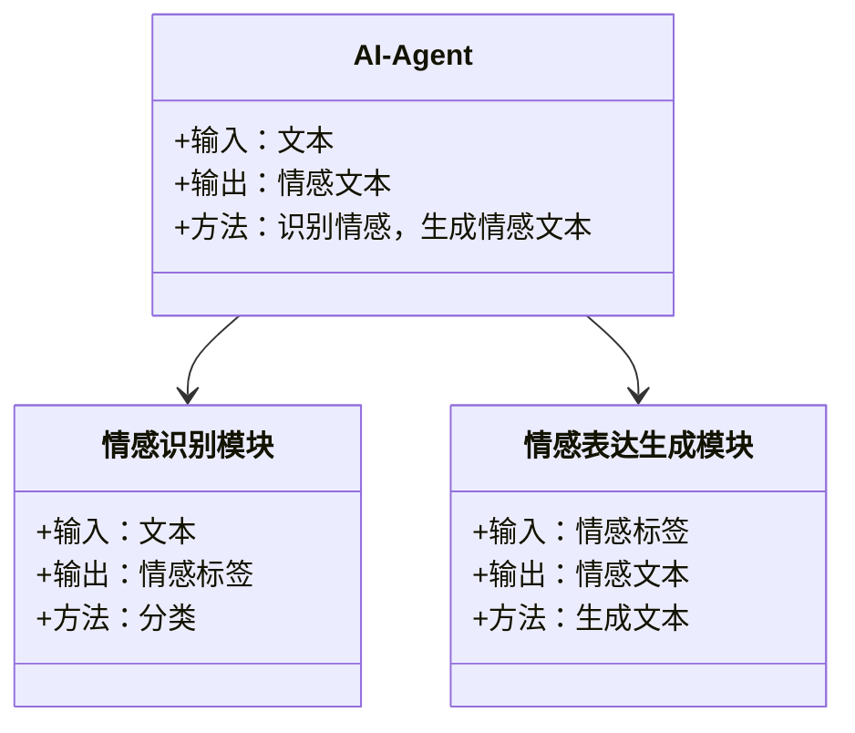
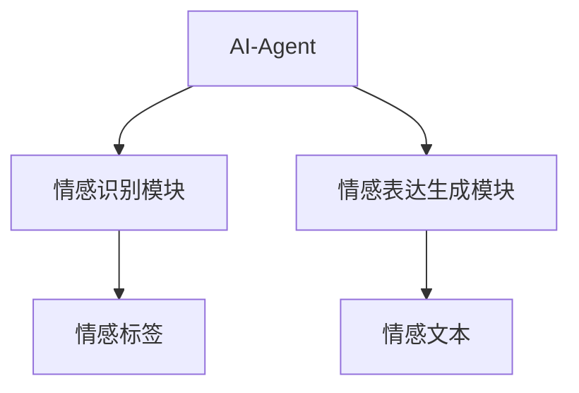
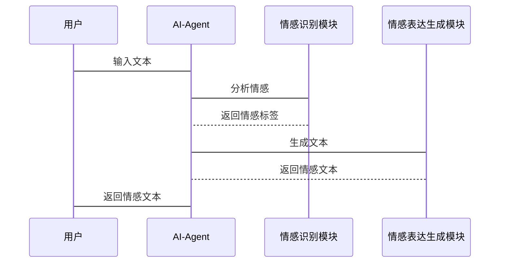

                 


# 开发具有情感识别与表达能力的AI Agent

> 关键词：AI Agent，情感识别，情感表达，自然语言处理，生成式模型，深度学习

> 摘要：本文详细探讨了开发具有情感识别与表达能力的AI Agent的技术细节，从情感识别的核心算法到情感表达的生成模型，从系统架构设计到项目实战，全面解析了AI Agent在情感交互中的实现方法。

---

## 第1章 情感识别与表达的背景与概念

### 1.1 AI Agent的基本概念

#### 1.1.1 AI Agent的定义
AI Agent（人工智能代理）是指能够感知环境、执行任务并做出决策的智能实体。它通过与用户或环境交互，完成特定目标，例如回答问题、提供建议或执行复杂任务。

#### 1.1.2 情感识别与表达的定义
情感识别是指通过自然语言处理技术，分析文本或语音中的情感倾向（如快乐、悲伤、愤怒等）；情感表达则是指AI Agent能够生成符合特定情感的文本或语音输出。

#### 1.1.3 情感识别与表达的重要性
在人机交互中，情感识别与表达能够让AI Agent更加贴近人类的沟通方式，提升用户体验，使其更具智能化和人性化。

### 1.2 情感识别与表达的背景

#### 1.2.1 人机交互的发展历程
从简单的命令式交互到现在的自然语言交互，人机交互的演变推动了情感识别与表达技术的发展。

#### 1.2.2 情感计算的研究现状
情感计算（Affective Computing）是研究如何通过计算方法识别、理解和模拟人类情感的学科，已在医疗、教育、娱乐等领域得到广泛应用。

#### 1.2.3 情感识别与表达的实际应用
例如智能客服、情感聊天机器人、情感辅助治疗等。

---

## 第2章 情感识别的核心概念与技术

### 2.1 情感识别的基本原理

#### 2.1.1 情感识别的输入与输出
- **输入**：文本、语音、图像等多模态数据。
- **输出**：情感标签（如正面、负面、中性）或情感强度（如0.5表示轻微负面）。

#### 2.1.2 情感识别的主要技术
1. **基于规则的方法**：通过预定义的情感词典匹配关键词。
2. **机器学习方法**：使用特征提取和分类器（如SVM、随机森林）。
3. **深度学习方法**：利用词嵌入（如Word2Vec）、卷积神经网络（CNN）和循环神经网络（RNN）。

#### 2.1.3 情感识别的分类方法
- **二分类**：正面与负面。
- **多分类**：愤怒、悲伤、快乐、惊讶等。

### 2.2 情感表达的核心技术

#### 2.2.1 文本生成的基本原理
文本生成是通过模型生成符合特定情感的文本输出。

#### 2.2.2 情感驱动的生成策略
- **基于规则的生成**：根据情感标签选择预定义的句子模板。
- **基于模型的生成**：利用生成式模型（如GPT）生成自然文本。

#### 2.2.3 情感表达的多样性
通过同义词替换、句式变化等方法，生成多样化的表达方式。

---

## 第3章 情感识别与表达的数学模型

### 3.1 情感识别的数学模型

#### 3.1.1 基于概率的分类模型
使用贝叶斯定理计算条件概率，公式为：
$$P(y|x) = \frac{P(x|y)P(y)}{P(x)}$$

#### 3.1.2 基于深度学习的情感分析模型
使用卷积神经网络（CNN）提取文本特征，公式为：
$$f(x) = \text{ReLU}(Wx + b)$$

#### 3.1.3 情感识别的评价指标
- **准确率（Accuracy）**：正确分类的比例。
- **精确率（Precision）**：预测为正类的样本中实际为正类的比例。
- **召回率（Recall）**：实际为正类的样本中被正确分类的比例。
- **F1值**：精确率和召回率的调和平均。

### 3.2 情感表达的生成模型

#### 3.2.1 基于规则的文本生成
通过预定义的规则和模板生成文本。

#### 3.2.2 基于生成对抗网络的生成模型
生成器和判别器的对抗训练，公式为：
$$\min_{G} \max_{D} \mathbb{E}_{x}[ \log D(x)] + \mathbb{E}_{z}[ \log (1 - D(G(z)))]$$

#### 3.2.3 基于预训练模型的生成策略
利用如GPT等预训练模型进行微调，生成符合情感的文本。

---

## 第4章 情感识别与表达的算法实现

### 4.1 情感识别算法

#### 4.1.1 基于规则的分类算法
```python
def情感分类(文本):
    for 关键词 in 正面词汇:
        if 关键词 in 文本:
            return 正面
    for 关键词 in 负面词汇:
        if 关键词 in 文本:
            return 负面
    return 中性
```

#### 4.1.2 基于机器学习的情感分析算法
使用特征提取（如TF-IDF）和分类器（如SVM）进行训练和预测。

#### 4.1.3 基于深度学习的情感分析算法
使用CNN或RNN模型训练情感分类器。

### 4.2 情感表达生成算法

#### 4.2.1 基于模板的生成算法
根据情感标签选择预定义的句子模板，填充关键词生成文本。

#### 4.2.2 基于生成对抗网络的生成算法
训练生成器和判别器，生成符合情感的文本。

#### 4.2.3 基于预训练模型的生成算法
利用如GPT进行微调，生成多样化的表达方式。

---

## 第5章 情感识别与表达的系统架构

### 5.1 系统功能设计

#### 5.1.1 情感识别模块
负责接收输入并输出情感标签。

#### 5.1.2 情感表达生成模块
根据情感标签生成相应的文本输出。

#### 5.1.3 交互模块
负责与用户进行实时交互，接收输入并传递给情感识别模块，再将生成的文本返回给用户。

### 5.2 系统架构设计

#### 5.2.1 领域模型类图


#### 5.2.2 系统架构图


#### 5.2.3 接口设计
- **输入接口**：接收用户输入的文本。
- **输出接口**：返回情感识别结果和生成的情感文本。

#### 5.2.4 交互流程图


---

## 第6章 项目实战

### 6.1 环境安装

安装必要的库：
```bash
pip install numpy scikit-learn tensorflow
```

### 6.2 核心实现

#### 6.2.1 情感识别模块实现
```python
from sklearn.feature_extraction.text import TfidfVectorizer
from sklearn.svm import SVC

def 情感分类(文本):
    vectorizer = TfidfVectorizer()
    X = vectorizer.fit_transform([文本])
    clf = SVC()
    clf.fit(X, [1])
    return clf.predict(X)[0]
```

#### 6.2.2 情感表达生成模块实现
```python
def 生成文本(情感标签):
    if 情感标签 == '正面':
        return '那真是太好了！'
    elif 情感标签 == '负面':
        return '听起来有些遗憾。'
    else:
        return '好的，我理解了。'
```

### 6.3 代码应用解读与分析
结合具体案例，解读代码实现和实际效果。

### 6.4 实际案例分析
分析一个实际案例，展示系统的输入、输出和处理过程。

---

## 第7章 高级主题与最佳实践

### 7.1 情感识别与表达的优化

#### 7.1.1 模型优化
通过数据增强、超参数调优等方式提升模型性能。

#### 7.1.2 训练策略
采用迁移学习、在线学习等策略提升模型的泛化能力。

### 7.2 实际应用中的注意事项

#### 7.2.1 数据隐私问题
注意用户数据的隐私保护。

#### 7.2.2 情感表达的自然性
避免生成过于生硬的文本，提升表达的自然流畅度。

#### 7.2.3 多模态情感识别
结合文本、语音、图像等多种模态数据，提升情感识别的准确性。

### 7.3 未来的研究方向

#### 7.3.1 情感记忆与学习
研究如何让AI Agent具备情感记忆和学习能力。

#### 7.3.2 情感适应性
研究如何让AI Agent根据上下文调整情感表达策略。

#### 7.3.3 多语言情感识别与表达
研究跨语言的情感识别与表达技术。

---

## 结语

开发具有情感识别与表达能力的AI Agent是一项复杂而富有挑战性的任务。通过结合自然语言处理、深度学习和生成式模型，我们可以构建出更加智能化和人性化的AI系统。未来，随着技术的进步，AI Agent在情感交互中的应用将更加广泛和深入。

---

## 作者：AI天才研究院/AI Genius Institute & 禅与计算机程序设计艺术 /Zen And The Art of Computer Programming

