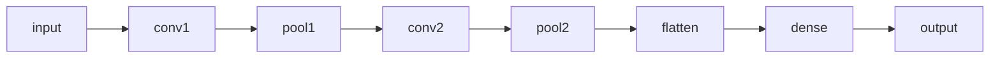
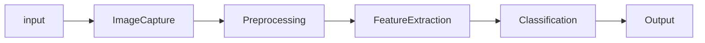
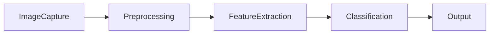
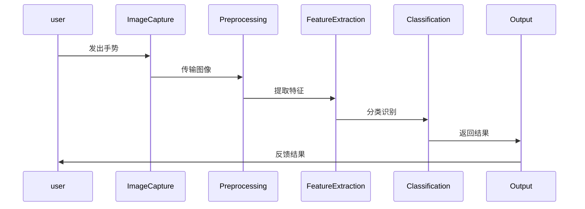

                 


# 开发具有手势识别能力的AI Agent

> 关键词：手势识别、AI Agent、人工智能、计算机视觉、深度学习、系统架构

> 摘要：本文详细探讨了开发具有手势识别能力的AI Agent的过程，从核心概念到算法实现，再到系统架构设计和项目实战，最后展望了未来的发展方向。文章通过深入分析和具体案例，展示了如何将手势识别技术集成到AI Agent中，实现高效的人机交互。

---

# 第一部分: 开发具有手势识别能力的AI Agent概述

## 第1章: AI Agent与手势识别概述

### 1.1 AI Agent的基本概念

#### 1.1.1 什么是AI Agent
AI Agent（人工智能代理）是指能够感知环境、自主决策并执行任务的智能实体。它可以是一个软件程序、机器人或其他智能系统，具备以下核心特征：
- **自主性**：能够在没有外部干预的情况下独立运作。
- **反应性**：能够根据环境变化调整行为。
- **目标导向**：为了实现特定目标而行动。
- **学习能力**：通过经验改进性能。

#### 1.1.2 AI Agent的核心特征
AI Agent的核心特征包括：
- **环境感知**：通过传感器或其他输入方式获取环境信息。
- **决策能力**：基于感知信息做出决策。
- **行动执行**：通过执行机构或输出接口实现决策。
- **学习与适应**：通过机器学习算法不断优化性能。

#### 1.1.3 手势识别在AI Agent中的作用
手势识别是AI Agent与用户进行自然交互的重要方式之一。通过识别用户的手势，AI Agent能够更直观地理解用户的意图，从而提供更高效、更自然的交互体验。手势识别在AI Agent中的作用包括：
- **输入方式**：替代传统的键盘、鼠标输入，提供更便捷的操作方式。
- **交互反馈**：通过手势提供实时反馈，增强用户体验。
- **多模态交互**：结合语音、视觉等多种交互方式，提升交互的多样性和灵活性。

### 1.2 手势识别的背景与应用

#### 1.2.1 手势识别的发展历程
手势识别技术起源于20世纪60年代，经历了从简单的二维手势识别到复杂的三维手势识别的演变。近年来，随着深度学习技术的发展，手势识别的准确性和实时性得到了显著提升。

#### 1.2.2 手势识别的主要应用场景
手势识别技术广泛应用于多个领域，包括：
- **虚拟现实（VR）与增强现实（AR）**：用于实现更自然的交互方式。
- **智能助手**：通过手势控制智能家居设备。
- **医疗领域**：用于手术辅助或康复训练。
- **公共领域**：用于远程操控或紧急情况下的快速响应。

#### 1.2.3 手势识别技术的挑战与未来方向
尽管手势识别技术已经取得了显著进展，但仍面临一些挑战：
- **准确性**：在复杂环境下，手势识别的准确性可能受到影响。
- **实时性**：需要在实时场景中实现快速识别。
- **普适性**：需要适应不同用户的手势习惯和环境条件。

未来的发展方向包括：
- **多模态融合**：结合其他传感器信息，提升识别的准确性和鲁棒性。
- **轻量化设计**：优化算法以适应资源受限的环境。
- **个性化定制**：根据用户需求提供定制化服务。

### 1.3 本章小结
本章介绍了AI Agent和手势识别的基本概念，探讨了手势识别在AI Agent中的作用及其应用场景。同时，分析了当前技术的挑战和未来发展方向，为后续章节的深入探讨奠定了基础。

---

## 第2章: 手势识别的核心概念与原理

### 2.1 手势识别的关键技术

#### 2.1.1 基于深度学习的手势识别
基于深度学习的手势识别技术利用卷积神经网络（CNN）提取图像特征，通过训练大量数据实现高精度识别。主要方法包括：
- **单 Shot 方法**：直接将手势图像映射到类别标签。
- **两阶段方法**：先定位手势区域，再进行分类。

#### 2.1.2 基于传统计算机视觉的手势识别
传统方法依赖于图像处理技术，如边缘检测、特征提取和模板匹配。尽管准确性和实时性有限，但在某些场景下仍具有应用价值。

#### 2.1.3 手势识别的分类与对比
手势识别可以分为以下几类：
- **静态手势**：单个手势的识别，如“停止”。
- **动态手势**：连续手势的识别，如“挥手”。
- **部分遮挡手势**：部分被遮挡的手势识别，更具挑战性。

下表对比了不同手势识别方法的优缺点：

| 方法类型                | 优点                          | 缺点                          |
|-------------------------|-------------------------------|-------------------------------|
| 基于深度学习             | 高精度，强泛化能力             | 需要大量数据和计算资源         |
| 基于传统计算机视觉       | 实时性高，实现简单             | 准确性较低                     |

### 2.2 手势识别的算法流程

#### 2.2.1 数据采集与预处理
数据采集是手势识别的关键步骤，通常包括：
1. **图像采集**：使用摄像头获取手势图像。
2. **预处理**：包括灰度化、二值化、平滑处理等，以提升后续处理的效果。

#### 2.2.2 特征提取
特征提取是将图像转换为可用于分类的特征向量。常用方法包括：
- **手工设计特征**：如HOG（水平梯度直方图）。
- **深度学习特征**：如CNN提取的高层特征。

#### 2.2.3 分类与识别
分类器是手势识别的核心，常用算法包括：
- **支持向量机（SVM）**：适用于小规模数据。
- **随机森林**：适用于特征较多的场景。
- **卷积神经网络（CNN）**：适用于大规模图像数据。

### 2.3 手势识别的数学模型

#### 2.3.1 基于卷积神经网络的模型
卷积神经网络（CNN）是当前手势识别的主流方法，其结构通常包括：
1. **卷积层**：提取图像的空间特征。
2. **池化层**：降低计算复杂度，提取更抽象特征。
3. **全连接层**：将特征向量映射到类别标签。

以下是一个简单的CNN模型结构图：



#### 2.3.2 基于区域的卷积神经网络
基于区域的卷积神经网络（R-CNN）常用于目标检测，也可以应用于手势识别。其流程包括：
1. **候选区域生成**：使用滑动窗口或区域建议网络（RPN）生成候选区域。
2. **特征提取**：对每个候选区域提取特征。
3. **分类与回归**：对每个候选区域进行分类和位置调整。

#### 2.3.3 手势识别的损失函数与优化方法
常用的损失函数包括：
- **交叉熵损失函数**：用于分类任务。
- **均方误差损失函数**：用于回归任务。

优化方法通常采用随机梯度下降（SGD）或Adam优化器。

### 2.4 本章小结
本章详细介绍了手势识别的核心技术，包括基于深度学习和传统方法的对比，算法流程和数学模型的讲解。通过分析不同方法的优缺点，为后续章节的系统设计提供了理论基础。

---

## 第3章: AI Agent与手势识别的结合

### 3.1 AI Agent的交互需求

#### 3.1.1 人机交互的多样性
AI Agent需要支持多种交互方式，包括语音、文本和手势。手势交互的优势在于其直观性和非侵入性。

#### 3.1.2 手势识别在交互中的优势
手势识别在交互中的优势包括：
- **直观性**：用户可以通过手势自然地表达意图。
- **非侵入性**：无需依赖键盘或鼠标等外设。
- **多模态支持**：可以结合其他交互方式，提升用户体验。

#### 3.1.3 手势识别与其他交互方式的对比
以下是手势识别与其他交互方式的对比：

| 交互方式 | 优点                          | 缺点                          |
|----------|-------------------------------|-------------------------------|
| 语音     | 自然、便捷                     | 易受环境噪声影响               |
| 文本      | 精确性高                      | 需要用户输入文本               |
| 手势     | 直观、非侵入性                 | 学习成本较高                   |

### 3.2 AI Agent中手势识别的实现

#### 3.2.1 数据采集与处理
在AI Agent中，手势识别的实现通常包括以下步骤：
1. **图像采集**：通过摄像头获取手势图像。
2. **预处理**：对图像进行灰度化、平滑处理等。
3. **特征提取**：提取手势的特征向量。
4. **分类识别**：将特征向量输入分类器，得到识别结果。

#### 3.2.2 手势识别算法的集成
在AI Agent中，手势识别算法需要与系统其他部分无缝集成。通常包括：
1. **数据预处理模块**：对输入图像进行标准化处理。
2. **特征提取模块**：使用CNN提取图像特征。
3. **分类模块**：基于训练好的模型进行分类。

#### 3.2.3 手势识别结果的反馈与应用
识别结果可以通过多种方式反馈给用户，例如：
- **视觉反馈**：在屏幕上显示识别结果。
- **声音反馈**：通过语音播报识别结果。
- **执行动作**：根据识别结果执行相应的操作。

### 3.3 手势识别的优化与提升

#### 3.3.1 提高识别准确率的方法
- **数据增强**：通过旋转、缩放等方式增加训练数据的多样性。
- **模型优化**：采用更深的网络结构或更有效的优化算法。

#### 3.3.2 优化识别速度的技术
- **轻量化设计**：减少模型的参数量，降低计算复杂度。
- **并行计算**：利用GPU加速计算。

#### 3.3.3 手势识别的鲁棒性提升
- **多模态融合**：结合其他传感器信息，如深度传感器和惯性传感器，提高识别的鲁棒性。
- **自适应算法**：根据环境变化动态调整识别参数。

### 3.4 本章小结
本章探讨了AI Agent中手势识别的实现方法，分析了其在交互中的优势，并提出了优化和提升的策略，为后续章节的系统设计提供了实践指导。

---

## 第4章: 手势识别的系统架构与设计

### 4.1 系统架构概述

#### 4.1.1 分层架构设计
手势识别系统通常采用分层架构，包括：
1. **数据采集层**：负责数据的采集和预处理。
2. **特征提取层**：对数据进行特征提取。
3. **分类识别层**：对特征进行分类，得到识别结果。
4. **反馈与执行层**：根据识别结果进行反馈和执行。

#### 4.1.2 模块化设计
模块化设计便于系统的扩展和维护。主要模块包括：
- **图像采集模块**：负责获取手势图像。
- **特征提取模块**：对图像进行特征提取。
- **分类识别模块**：对特征进行分类。
- **反馈与执行模块**：根据识别结果进行反馈和执行。

#### 4.1.3 手势识别系统的功能模块划分
以下是功能模块的划分：



### 4.2 手势识别系统的详细设计

#### 4.2.1 问题场景介绍
假设我们开发一个智能家居控制的AI Agent，用户可以通过手势控制家中的灯光、空调等设备。

#### 4.2.2 系统功能设计
系统功能设计包括：
- **数据采集**：通过摄像头采集用户的手势图像。
- **特征提取**：提取手势的特征向量。
- **分类识别**：识别手势类型。
- **反馈与执行**：根据识别结果执行相应的操作。

#### 4.2.3 系统架构设计
系统架构设计采用分层架构，各层之间的接口清晰，便于模块化开发。



#### 4.2.4 系统接口设计
系统接口设计包括：
- **输入接口**：摄像头输入。
- **输出接口**：显示屏输出。
- **执行接口**：与智能家居设备的通信接口。

#### 4.2.5 系统交互设计
系统交互设计采用序列图，展示用户与系统之间的交互流程。



### 4.3 本章小结
本章详细介绍了手势识别系统的架构设计，包括分层架构、模块化设计和系统交互设计，为后续章节的项目实战奠定了基础。

---

## 第5章: 项目实战——开发具有手势识别能力的AI Agent

### 5.1 项目环境安装与配置

#### 5.1.1 安装开发环境
需要安装以下环境：
- **操作系统**：Windows 10或更高版本。
- **开发工具**：PyCharm或Visual Studio。
- **深度学习框架**：TensorFlow或Keras。
- **摄像头驱动**：确保摄像头驱动程序安装正确。

#### 5.1.2 安装必要的库
安装以下Python库：
- `opencv-python`：用于图像处理。
- `tensorflow`：用于深度学习模型的训练。
- `matplotlib`：用于数据可视化。

### 5.2 系统核心实现源代码

#### 5.2.1 数据采集模块
数据采集模块使用OpenCV库实现。

```python
import cv2

def capture_gesture():
    cap = cv2.VideoCapture(0)
    while True:
        ret, frame = cap.read()
        cv2.imshow('Gesture Capture', frame)
        if cv2.waitKey(1) & 0xFF == ord('q'):
            break
    cap.release()
    cv2.destroyAllWindows()
    return frame
```

#### 5.2.2 特征提取模块
特征提取模块使用预训练的卷积神经网络模型。

```python
import tensorflow as tf
from tensorflow.keras import layers

def feature_extractor():
    model = tf.keras.Sequential()
    model.add(layers.Conv2D(32, (3,3), activation='relu', input_shape=(224, 224, 3)))
    model.add(layers.MaxPooling2D((2,2)))
    model.add(layers.Conv2D(64, (3,3), activation='relu'))
    model.add(layers.MaxPooling2D((2,2)))
    model.add(layers.Flatten())
    return model
```

#### 5.2.3 分类识别模块
分类识别模块使用随机森林算法。

```python
from sklearn.ensemble import RandomForestClassifier

def gesture_classifier(features, labels):
    clf = RandomForestClassifier(n_estimators=100)
    clf.fit(features, labels)
    return clf
```

### 5.3 代码应用解读与分析

#### 5.3.1 数据采集模块解读
数据采集模块通过摄像头获取手势图像，并实时显示在窗口中，用户可以通过按键（q）结束采集。

#### 5.3.2 特征提取模块解读
特征提取模块使用卷积神经网络提取图像的高层特征，通常需要在训练数据上进行预训练。

#### 5.3.3 分类识别模块解读
分类识别模块使用随机森林算法对提取的特征进行分类，具有较高的准确性和鲁棒性。

### 5.4 实际案例分析和详细讲解剖析
以智能家居控制为例，用户可以通过手势控制家中的灯光和空调。系统会实时捕捉用户的手势，提取特征并进行分类，最后执行相应的操作。

### 5.5 项目小结
本章通过实际案例展示了如何开发具有手势识别能力的AI Agent，详细讲解了数据采集、特征提取和分类识别的实现过程，为读者提供了实践指导。

---

## 第6章: 手势识别的优化与未来展望

### 6.1 优化策略

#### 6.1.1 提高识别准确率的方法
- **数据增强**：增加训练数据的多样性和数量。
- **模型优化**：采用更深的网络结构或更有效的优化算法。

#### 6.1.2 优化识别速度的技术
- **轻量化设计**：减少模型的参数量，降低计算复杂度。
- **并行计算**：利用GPU加速计算。

### 6.2 未来研究方向

#### 6.2.1 多模态融合
结合其他传感器信息，如深度传感器和惯性传感器，提高识别的鲁棒性。

#### 6.2.2 自适应算法
根据环境变化动态调整识别参数，提升系统的自适应能力。

#### 6.2.3 手势识别的个性化服务
根据用户的个性化需求，提供定制化服务。

### 6.3 本章小结
本章总结了手势识别的优化策略，并展望了未来的研究方向，为读者提供了进一步研究的参考。

---

## 第7章: 结语

### 7.1 总结
开发具有手势识别能力的AI Agent是一项具有挑战性的任务，需要结合深度学习、计算机视觉和系统架构设计等多方面的知识。通过本文的探讨，读者可以系统地了解手势识别的核心技术及其在AI Agent中的应用。

### 7.2 展望
随着人工智能和计算机视觉技术的不断发展，手势识别在AI Agent中的应用前景广阔。未来的研究将更加注重多模态融合、自适应算法和个性化服务，以满足用户多样化的交互需求。

---

## 附录: 参考文献

1. LeCun, Y., Bengio, Y., & Hinton, G. (2015). Deep learning. Nature, 521(7555), 436-444.
2. Redmon, J., Divvala, S., & Farhadi, A. (2016). YOLO9000: Better, faster, stronger. arXiv preprint arXiv:1612.08024.
3. Szegedy, C., Liu, W., & Yang, Q. (2015). Going deeper with convolutions. In Proceedings of the IEEE conference on computer vision and pattern recognition (pp. 1-9).

---

作者：AI天才研究院/AI Genius Institute & 禅与计算机程序设计艺术/Zen And The Art of Computer Programming

