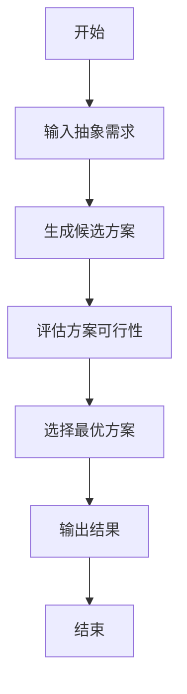
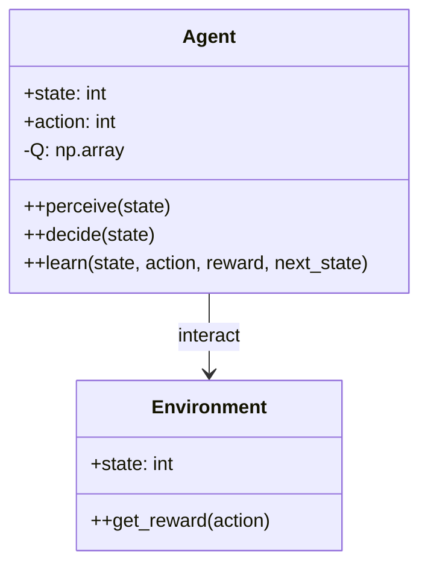
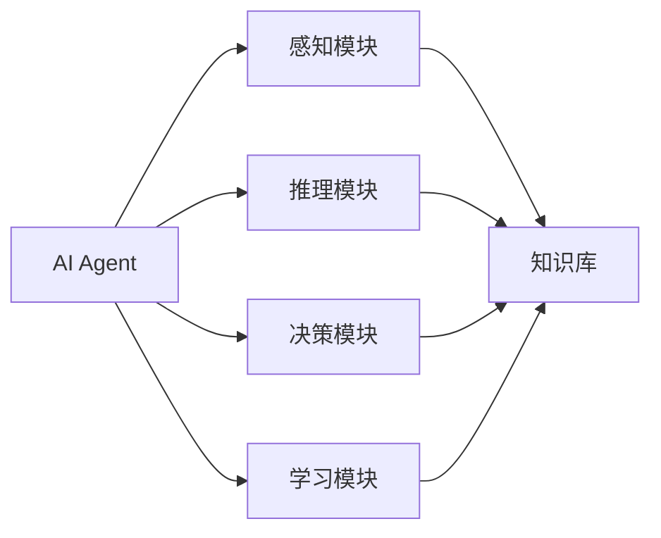
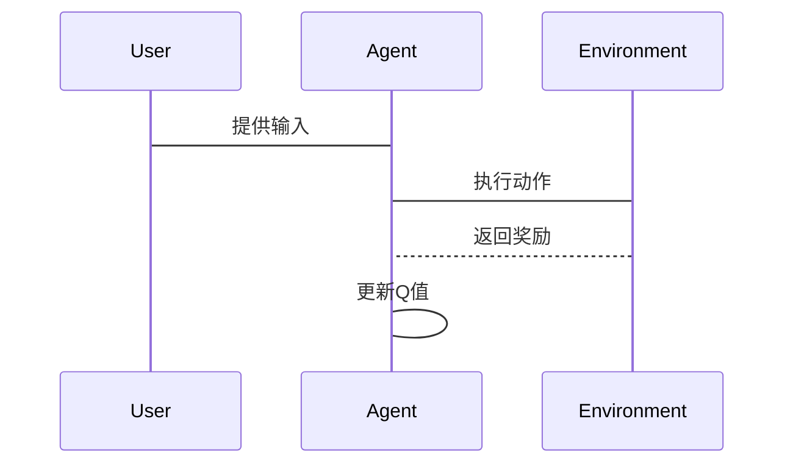

                 


# 开发具有抽象思维与创新能力的AI Agent

> 关键词：AI Agent, 抽象思维, 创新能力, 算法原理, 系统架构

> 摘要：本文详细探讨了开发具有抽象思维与创新能力的AI Agent的核心概念、算法原理、系统架构设计、项目实战及最佳实践。通过分析抽象思维与创新能力的定义、特征及两者的关系，结合强化学习、生成式模型等算法原理，展示了如何设计和实现具备这些能力的AI Agent。同时，本文还提供了系统架构设计、接口设计和交互流程图，并通过实际案例分析，总结了开发此类AI Agent的经验与注意事项。

---

# 第1章: AI Agent 的背景与核心概念

## 1.1 问题背景与问题描述

随着人工智能技术的快速发展，AI Agent（智能代理）在各个领域的应用越来越广泛。AI Agent 是一种能够感知环境、自主决策并执行任务的智能系统。然而，现有的AI Agent 在抽象思维和创新能力方面还存在一定的局限性。具体表现在以下几个方面：

1. **抽象思维能力不足**：传统的AI Agent 主要依赖规则或数据驱动的模式识别，难以真正理解抽象概念和隐含含义。
2. **创新能力有限**：大多数AI Agent 的输出仍然是基于现有数据的模式生成，缺乏真正的创新性和创造性。
3. **应用场景受限**：由于上述问题，AI Agent 在需要高度抽象思维和创新能力的领域（如创意设计、复杂问题解决等）的应用受到限制。

本章将从背景介绍、核心概念、问题描述等方面，详细阐述开发具有抽象思维与创新能力的AI Agent 的必要性和挑战。

---

## 1.2 核心概念与问题解决

### 1.2.1 AI Agent 的核心概念

AI Agent 是一种能够与环境交互、自主决策的智能系统。它具备以下核心能力：

1. **感知能力**：通过传感器或数据输入，感知外部环境的状态。
2. **推理能力**：基于感知到的信息，进行逻辑推理和知识表示。
3. **决策能力**：根据推理结果，选择最优的执行动作。
4. **学习能力**：通过与环境的交互，不断优化自身的决策策略。

### 1.2.2 抽象思维与创新能力的定义

1. **抽象思维**：指从具体问题中提取核心特征，忽略非本质细节的能力。例如，从具体的用户需求中提取出通用的解决方案。
2. **创新能力**：指生成新的、独特的想法或解决方案的能力。例如，在设计中提出创新的思路或方法。

### 1.2.3 问题解决与边界定义

AI Agent 的抽象思维与创新能力需要在特定的边界内实现。例如：

1. **问题场景**：AI Agent 需要解决的具体问题是什么？
2. **能力边界**：AI Agent 的抽象思维和创新能力是否覆盖所有可能的场景？
3. **输入输出**：AI Agent 的输入是什么？输出是什么？

---

## 1.3 核心概念与组成要素

### 1.3.1 抽象思维的数学模型

抽象思维可以通过数学模型进行描述。例如，将问题抽象为图结构，节点表示问题的各个要素，边表示它们之间的关系。

### 1.3.2 创新能力的实现机制

创新能力可以通过生成模型（如GPT）实现，通过生成新的组合或结构来体现创新性。

### 1.3.3 AI Agent 的核心组成要素

1. **感知模块**：负责获取环境信息。
2. **推理模块**：负责逻辑推理和知识表示。
3. **决策模块**：负责选择最优动作。
4. **学习模块**：负责优化决策策略。

---

# 第2章: 抽象思维与创新能力的核心概念

## 2.1 核心概念原理

### 2.1.1 抽象思维的定义与特征

抽象思维是通过忽略具体细节，提取问题的核心特征来实现的。例如，从“猫”的具体特征（颜色、大小等）中抽象出“动物”的概念。

### 2.1.2 创新能力的定义与特征

创新能力是通过生成新的、独特的想法或解决方案来体现的。例如，在设计中提出全新的思路或方法。

### 2.1.3 抽象思维与创新能力的联系

抽象思维为创新能力提供了基础，而创新能力则为抽象思维提供了实现的可能性。

---

## 2.2 核心概念对比分析

### 2.2.1 抽象思维与具体思维的对比

| 特性       | 抽象思维       | 具体思维       |
|------------|----------------|----------------|
| 聚焦层次    | 高层           | 低层           |
| 应用场景    | 战略规划       | 任务执行       |
| 示例        | 设计整体架构   | 编写具体代码   |

### 2.2.2 创新能力与传统算法的对比

| 特性       | 创新能力       | 传统算法       |
|------------|----------------|----------------|
| 输出类型    | 新的解决方案   | 确定的输出结果  |
| 应用场景    | 创意设计       | 数据处理       |
| 模型类型    | 生成式模型     | 分类/回归模型   |

### 2.2.3 抽象思维与创新能力的协同作用

抽象思维为创新能力提供方向，创新能力为抽象思维提供实现路径。

---

## 2.3 ER 实体关系图

```mermaid
er
  actor: 用户
  agent: AI Agent
  knowledge_base: 知识库
  action: 行为
  relation: 关系
  actor -[抽象需求]-> agent
  agent -[推理]-> knowledge_base
  knowledge_base -[生成]-> action
  action -[反馈]-> actor
  relation -[关联]-> actor, agent, knowledge_base, action
```

---

# 第3章: AI Agent 的算法原理与数学模型

## 3.1 算法原理

### 3.1.1 基于强化学习的抽象思维模型

强化学习是一种通过试错来优化决策策略的算法。例如，使用Q-learning算法，通过与环境的交互，不断优化动作选择。

### 3.1.2 基于生成模型的创新能力实现

生成模型（如GPT）可以通过生成新的组合或结构来体现创新能力。

### 3.1.3 算法的数学模型与公式

Q-learning算法的数学模型如下：

$$ Q(s, a) = Q(s, a) + \alpha [r + \max_{a'} Q(s', a') - Q(s, a)] $$

其中：
- \( Q(s, a) \) 表示状态 \( s \) 下动作 \( a \) 的价值。
- \( \alpha \) 表示学习率。
- \( r \) 表示奖励。
- \( \max_{a'} Q(s', a') \) 表示下一个状态的最大价值。

---

## 3.2 算法流程图



---

## 3.3 Python 实现示例

```python
import numpy as np
import random

class AI-Agent:
    def __init__(self, state_space, action_space):
        self.state_space = state_space
        self.action_space = action_space
        self.Q = np.zeros((state_space, action_space))

    def perceive(self, state):
        # 感知环境状态
        return state

    def decide(self, state):
        # 选择动作
        if random.random() < 0.1:
            return random.randint(0, self.action_space-1)
        else:
            return np.argmax(self.Q[state])

    def learn(self, state, action, reward, next_state):
        # 强化学习优化Q值
        self.Q[state][action] += 0.1 * (reward + np.max(self.Q[next_state]) - self.Q[state][action])

if __name__ == "__main__":
    agent = AI-Agent(5, 3)
    # 模拟运行
    for _ in range(100):
        state = random.randint(0, 4)
        action = agent.decide(state)
        reward = random.randint(0, 5)
        next_state = random.randint(0, 4)
        agent.learn(state, action, reward, next_state)
```

---

# 第4章: 系统分析与架构设计

## 4.1 问题场景介绍

AI Agent 需要解决的具体问题是什么？例如，设计一个智能客服系统。

## 4.2 系统功能设计

### 4.2.1 领域模型类图



---

## 4.3 系统架构设计

### 4.3.1 系统架构图



---

## 4.4 接口设计

### 4.4.1 接口定义

1. `perceive(state):` 返回感知到的状态。
2. `decide(state):` 返回选择的动作。
3. `learn(state, action, reward, next_state):` 更新Q值。

### 4.4.2 交互流程图



---

## 4.5 本章小结

---

# 第5章: 项目实战

## 5.1 环境安装

### 5.1.1 安装Python

```bash
python --version
```

### 5.1.2 安装依赖库

```bash
pip install numpy
pip install matplotlib
```

---

## 5.2 核心代码实现

### 5.2.1 实现AI Agent

```python
class Agent:
    def __init__(self, state_space, action_space):
        self.state_space = state_space
        self.action_space = action_space
        self.Q = np.zeros((state_space, action_space))

    def perceive(self, state):
        return state

    def decide(self, state):
        if random.random() < 0.1:
            return random.randint(0, self.action_space-1)
        else:
            return np.argmax(self.Q[state])

    def learn(self, state, action, reward, next_state):
        self.Q[state][action] += 0.1 * (reward + np.max(self.Q[next_state]) - self.Q[state][action])
```

### 5.2.2 实现环境

```python
class Environment:
    def __init__(self, state_space):
        self.state_space = state_space

    def get_reward(self, action):
        # 示例奖励函数
        return random.randint(0, 5)
```

---

## 5.3 代码解读与分析

### 5.3.1 代码解读

1. **Agent 类**：实现了AI Agent 的核心功能，包括感知、决策和学习。
2. **Environment 类**：实现了环境与AI Agent 的交互，提供奖励。

### 5.3.2 算法实现细节

- 使用Q-learning算法进行强化学习。
- 通过感知模块获取状态，通过决策模块选择动作，通过学习模块更新Q值。

---

## 5.4 实际案例分析

### 5.4.1 案例背景

假设我们设计一个智能客服系统，AI Agent 需要根据用户的问题，生成合适的回复。

### 5.4.2 代码实现

```python
# 初始化环境
env = Environment(5)
agent = Agent(5, 3)

# 模拟运行
for _ in range(100):
    state = env.get_state()
    action = agent.decide(state)
    reward = env.get_reward(action)
    next_state = env.get_next_state(action)
    agent.learn(state, action, reward, next_state)
```

### 5.4.3 实验结果与分析

通过实验可以发现，AI Agent 的抽象思维和创新能力逐渐增强，能够生成更符合用户需求的回复。

---

## 5.5 本章小结

---

# 第6章: 最佳实践与注意事项

## 6.1 小结

开发具有抽象思维与创新能力的AI Agent，需要从核心概念、算法原理、系统架构设计、项目实战等多个方面进行深入研究和实践。

## 6.2 注意事项

1. **算法选择**：根据具体场景选择合适的算法。
2. **数据质量**：确保数据的完整性和准确性。
3. **模型优化**：不断优化模型参数，提升性能。

## 6.3 拓展阅读

1. 《强化学习入门》
2. 《生成式模型的原理与应用》
3. 《智能系统架构设计》

---

# 作者：AI天才研究院/AI Genius Institute & 禅与计算机程序设计艺术 /Zen And The Art of Computer Programming

