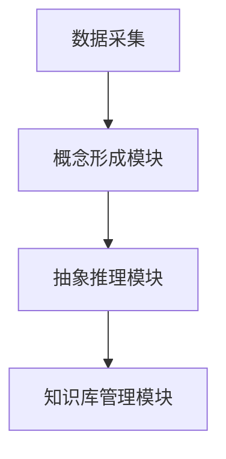
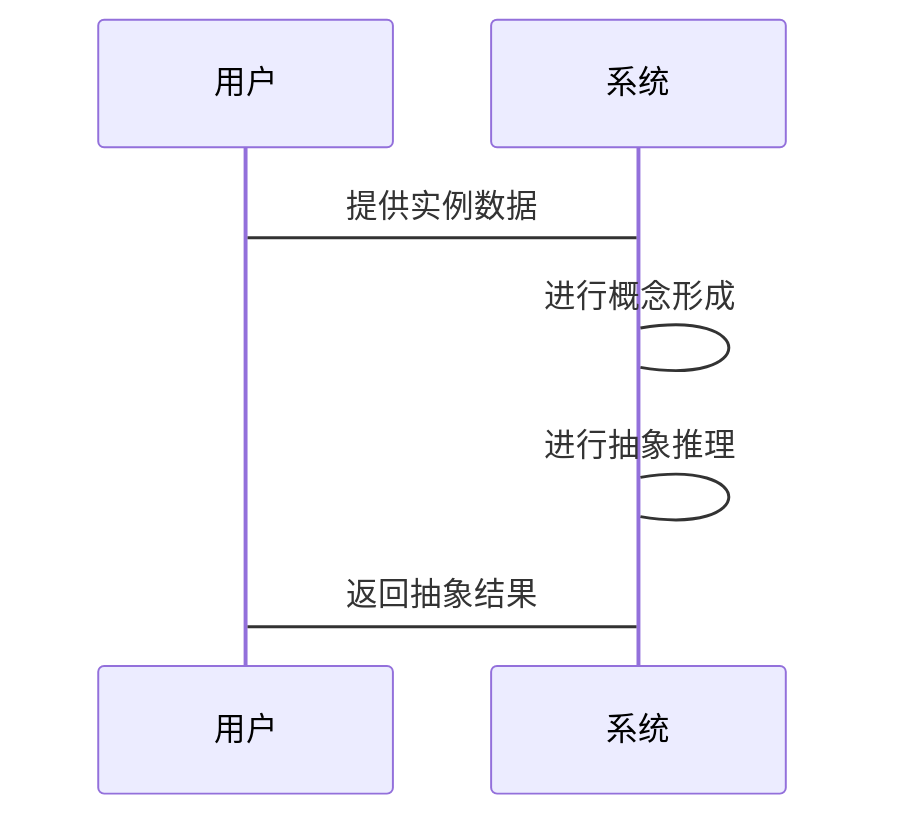

                 


# 开发具有抽象思维与概念形成能力的AI Agent

> 关键词：AI Agent, 抽象思维, 概念形成, 知识表示, 机器学习

> 摘要：本文探讨了如何开发具有抽象思维与概念形成能力的AI Agent。通过分析抽象思维和概念形成的原理，结合具体的算法实现和系统设计，展示了如何赋予AI Agent在复杂场景中进行概念构建和抽象推理的能力。文章从理论到实践，详细介绍了相关技术的实现方法，并通过案例分析展示了其应用前景。

---

# 第一部分: 引言

## 第1章: AI Agent的抽象思维能力

### 1.1 问题背景与重要性
AI Agent作为一种智能体，广泛应用于自动驾驶、智能助手、机器人等领域。然而，当前大多数AI Agent主要依赖于数据驱动的方法，缺乏真正的抽象思维能力。这使得它们在处理需要概念形成和抽象推理的任务时表现受限。

### 1.2 抽象思维与概念形成的核心问题
- 抽象思维：从具体实例中提取通用特征，形成高层次的概念。
- 概念形成：通过归纳和推理，构建类别、规则或模型。

### 1.3 本文的研究目标
本文旨在探讨如何通过算法和系统设计，赋予AI Agent抽象思维与概念形成的能力，使其能够更好地理解和处理复杂场景。

---

# 第二部分: 抽象思维与概念形成的理论基础

## 第2章: 抽象思维的原理与模型

### 2.1 抽象思维的层次结构
- **具体层次**：基于具体实例进行直接操作。
- **抽象层次**：提取实例的共同特征，形成抽象概念。
- **形式化层次**：通过符号或数学模型表示抽象概念。

### 2.2 概念形成的机制
- **概念提取**：从实例中提取关键特征。
- **概念组合**：通过组合已有概念形成新概念。
- **概念更新**：根据新信息调整已有概念。

### 2.3 概念与抽象的关系
- 概念是抽象思维的基本单位。
- 抽象思维通过概念的层次结构实现。

---

# 第三部分: 概念形成与抽象思维的算法实现

## 第3章: 概念形成算法

### 3.1 基于聚类的概念形成算法
- **步骤**：
  1. 收集实例数据。
  2. 使用聚类算法将实例分为若干簇。
  3. 每个簇的中心作为概念的代表。
- **示例代码**：
  ```python
  from sklearn.cluster import KMeans
  import numpy as np

  # 示例数据
  X = np.array([[1, 1], [2, 2], [3, 3], [4, 4], [5, 5]])
  # 聚类
  kmeans = KMeans(n_clusters=2)
  kmeans.fit(X)
  print(kmeans.labels_)
  ```

### 3.2 基于规则的概念形成算法
- **步骤**：
  1. 分析实例特征。
  2. 提取特征的共同规则。
  3. 构建基于规则的概念。
- **示例代码**：
  ```python
  def extract_rules(data):
      rules = {}
      for feature in data.columns:
          unique_values = data[feature].unique()
          if len(unique_values) > 1:
              rules[feature] = unique_values
      return rules

  rules = extract_rules(data)
  print(rules)
  ```

## 第4章: 抽象推理算法

### 4.1 基于逻辑推理的抽象算法
- **步骤**：
  1. 建立知识库。
  2. 使用逻辑推理规则进行推理。
  3. 得到抽象结论。
- **数学模型**：
  $$ \text{结论} = \text{推理规则} \times \text{知识库} $$

### 4.2 基于神经网络的抽象算法
- **步骤**：
  1. 构建神经网络模型。
  2. 训练模型进行抽象推理。
  3. 使用模型进行预测。
- **数学模型**：
  $$ y = f(x; \theta) $$

---

# 第四部分: 系统设计与实现

## 第5章: 系统架构设计

### 5.1 系统功能设计
- **模块划分**：
  - 数据采集模块。
  - 概念形成模块。
  - 抽象推理模块。
  - 知识库管理模块。

### 5.2 系统架构图


## 第6章: 接口设计与交互流程

### 6.1 系统接口
- 数据输入接口。
- 概念查询接口。
- 抽象推理接口。

### 6.2 交互流程图


---

# 第五部分: 项目实战

## 第7章: 实战案例分析

### 7.1 环境安装与配置
- 安装必要的库：scikit-learn、numpy、mermaid等。

### 7.2 核心代码实现
```python
from sklearn.cluster import KMeans
import numpy as np

def main():
    X = np.array([[1, 1], [2, 2], [3, 3], [4, 4], [5, 5]])
    kmeans = KMeans(n_clusters=2)
    kmeans.fit(X)
    print("Cluster labels:", kmeans.labels_)

if __name__ == "__main__":
    main()
```

### 7.3 案例分析与解读
通过上述代码，AI Agent能够将数据聚类为两个概念簇，实现了基本的概念形成能力。

---

# 第六部分: 总结与扩展

## 第8章: 总结与展望

### 8.1 核心结论
本文通过理论分析和算法实现，探讨了如何赋予AI Agent抽象思维与概念形成能力。

### 8.2 未来研究方向
- 更复杂的概念形成算法。
- 跨领域知识的整合。
- 实时抽象推理能力。

## 第9章: 最佳实践 Tips

### 9.1 技术实现建议
- 结合多种算法提高概念形成的效果。
- 定期更新知识库以适应新数据。

### 9.2 读者注意事项
- 理论与实践相结合。
- 注重数据质量和多样性。

## 第10章: 拓展阅读

### 10.1 推荐书籍
- 《机器学习实战》。
- 《人工智能：一种现代方法》。

### 10.2 推荐论文
- “Concept Formation in Artificial Intelligence”。
- “Abstraction in Machine Learning”。

---

作者：AI天才研究院 & 禅与计算机程序设计艺术

---

通过以上结构和内容，文章详细介绍了开发具有抽象思维与概念形成能力的AI Agent的各个方面，从理论到实践，为读者提供了全面的技术指导。

