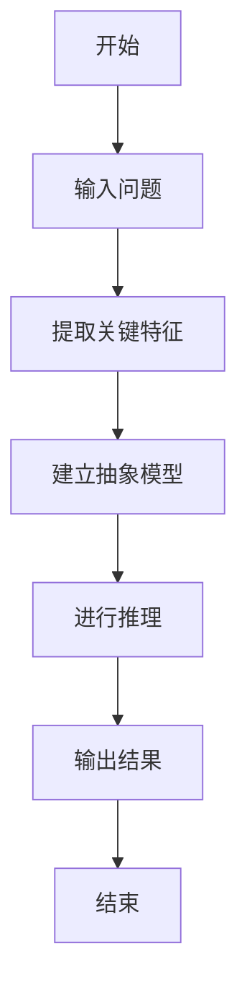
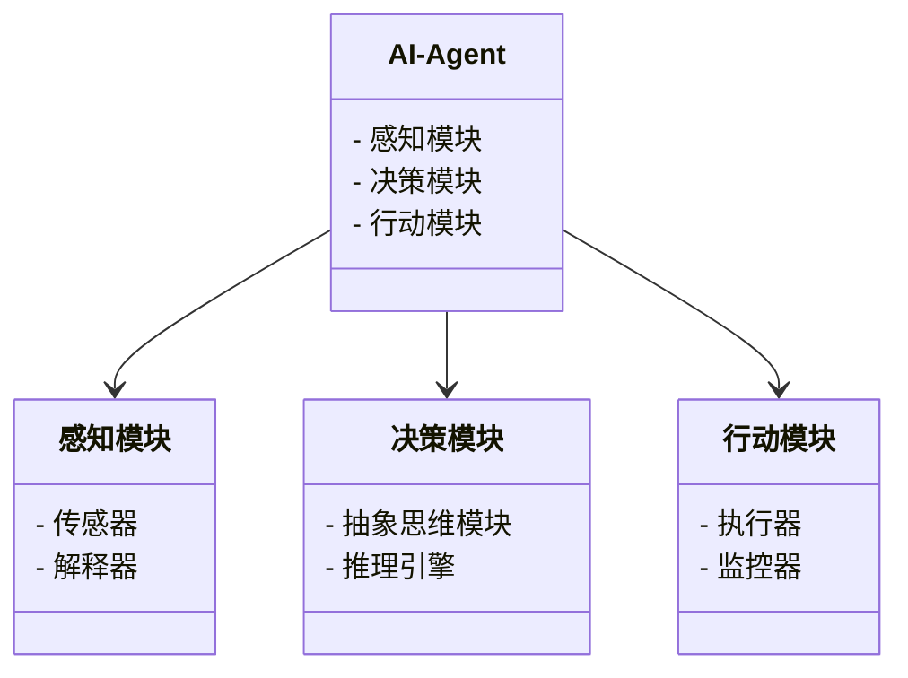
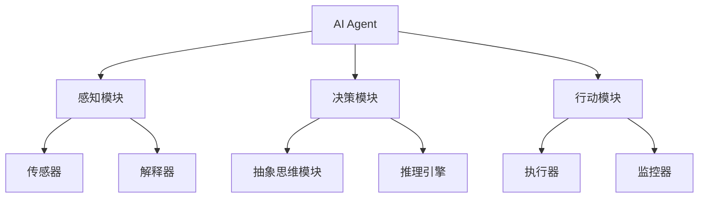
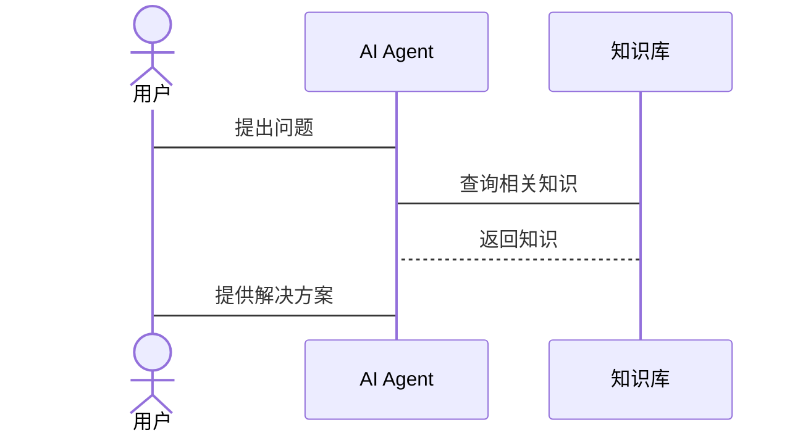

                 


# 开发具有抽象思维能力的AI Agent

> 关键词：AI Agent，抽象思维，人工智能，算法原理，系统架构

> 摘要：本文旨在探讨如何开发具有抽象思维能力的AI Agent。首先，我们从AI Agent的基本概念和抽象思维能力的重要性入手，分析当前AI Agent的发展现状。接着，我们深入探讨抽象思维能力的核心原理，包括逻辑推理、知识表示和问题解决能力。然后，我们详细讲解实现抽象思维能力的算法原理，包括数学模型和Python代码实现。最后，我们通过系统架构设计和项目实战，展示如何将抽象思维能力集成到实际AI Agent系统中。

---

# 第一部分: 开发具有抽象思维能力的AI Agent背景介绍

# 第1章: AI Agent与抽象思维概述

## 1.1 AI Agent的基本概念

### 1.1.1 什么是AI Agent
AI Agent（人工智能代理）是指能够感知环境、采取行动以实现特定目标的智能体。它能够通过传感器获取信息，并通过执行器与环境交互。

$$ \text{AI Agent} = \text{感知} \rightarrow \text{决策} \rightarrow \text{行动} $$

AI Agent可以是软件程序、机器人或其他智能系统。

### 1.1.2 AI Agent的核心特征
- **自主性**：能够在没有外部干预的情况下独立运作。
- **反应性**：能够实时感知环境并做出反应。
- **目标导向**：以实现特定目标为导向。
- **学习能力**：能够通过经验改进性能。

### 1.1.3 抽象思维能力的定义
抽象思维能力是指AI Agent能够从具体问题中提取关键特征，形成高层次的概念，并在不同情境中灵活运用这些概念的能力。

---

## 1.2 抽象思维能力的重要性

### 1.2.1 抽象思维在AI Agent中的作用
抽象思维能力使AI Agent能够：
- **理解复杂问题**：将问题分解为更简单的子问题。
- **泛化能力**：在不同场景中灵活应用知识。
- **创造性解决问题**：在没有明确规则的情况下找到解决方案。

### 1.2.2 抽象思维能力对问题解决的影响
抽象思维能力使AI Agent能够：
- **跳出具体细节**：关注问题的核心。
- **建立概念模型**：将具体问题转化为抽象模型。
- **推理与推断**：基于抽象模型进行推理。

### 1.2.3 抽象思维能力的边界与外延
- **边界**：抽象思维能力不涉及具体操作，而是关注概念的建立和推理。
- **外延**：与逻辑推理、知识表示和问题解决能力密切相关。

---

## 1.3 当前AI Agent的发展现状

### 1.3.1 传统AI Agent的功能局限
传统的AI Agent通常基于规则或简单的学习算法，缺乏真正的抽象思维能力。它们只能在特定场景下完成任务，难以应对复杂问题。

### 1.3.2 具有抽象思维能力的AI Agent的优势
- **更强的适应性**：能够应对多种场景。
- **更强大的推理能力**：能够处理复杂问题。
- **更灵活的学习能力**：能够从经验中快速学习。

### 1.3.3 抽象思维能力AI Agent的应用场景
- **智能助手**：帮助用户解决问题。
- **自动驾驶**：处理复杂交通场景。
- **智能客服**：理解用户需求并提供解决方案。

---

## 1.4 本章小结

本章介绍了AI Agent的基本概念和抽象思维能力的重要性，分析了当前AI Agent的发展现状，并指出了抽象思维能力AI Agent的优势和应用场景。

---

# 第二部分: 抽象思维能力的核心概念与联系

# 第2章: 抽象思维能力的核心原理

## 2.1 抽象思维能力的数学模型

### 2.1.1 抽象思维能力的数学表达式

抽象思维能力可以通过以下数学表达式表示：

$$ f(x) = \sum_{i=1}^{n} w_i x_i + b $$

其中：
- $x_i$：输入特征
- $w_i$：权重
- $b$：偏置

### 2.1.2 抽象思维能力的计算模型

计算模型可以表示为：

$$ y = \sigma(f(x)) $$

其中，σ表示激活函数（如sigmoid、ReLU等）。

### 2.1.3 抽象思维能力的评估指标

评估指标包括：
- **准确率**：在测试集上的准确率。
- **鲁棒性**：在不同场景下的表现。
- **推理速度**：推理的效率。

---

## 2.2 抽象思维能力与相关概念的对比

### 2.2.1 抽象思维能力与逻辑推理能力的对比

| 特性                | 抽象思维能力           | 逻辑推理能力           |
|---------------------|-----------------------|-----------------------|
| 定义                | 建立高层次概念         | 基于逻辑规则进行推理   |
| 实现                | 需要高层次模型         | 基于规则或逻辑表达式   |
| 应用场景            | 处理复杂问题           | 处理逻辑推理问题       |

### 2.2.2 抽象思维能力与知识表示能力的对比

| 特性                | 抽象思维能力           | 知识表示能力           |
|---------------------|-----------------------|-----------------------|
| 定义                | 建立高层次概念         | 将知识表示为数据结构   |
| 实现                | 需要概念模型           | 需要知识库或图结构     |
| 应用场景            | 处理抽象问题           | 知识检索与推理         |

### 2.2.3 抽象思维能力与问题解决能力的对比

| 特性                | 抽象思维能力           | 问题解决能力           |
|---------------------|-----------------------|-----------------------|
| 定义                | 建立高层次概念         | 通过具体步骤解决问题   |
| 实现                | 需要抽象模型           | 需要具体操作步骤       |
| 应用场景            | 处理复杂问题           | 处理具体任务           |

---

## 2.3 抽象思维能力的ER实体关系图

```mermaid
er
actor: AI Agent
action: 抽象思维能力
relation: 具备
```

---

## 2.4 本章小结

本章详细讲解了抽象思维能力的核心原理，包括数学模型、与相关概念的对比以及实体关系图。

---

# 第三部分: 抽象思维能力的算法原理

# 第3章: 抽象思维能力的算法实现

## 3.1 抽象思维能力的算法流程



---

## 3.2 抽象思维能力的数学模型

### 3.2.1 抽象思维能力的数学表达式

$$ f(x) = \sum_{i=1}^{n} w_i x_i + b $$

其中：
- $x_i$：输入特征
- $w_i$：权重
- $b$：偏置

### 3.2.2 抽象思维能力的计算模型

计算模型可以表示为：

$$ y = \sigma(f(x)) $$

其中，σ表示激活函数（如sigmoid、ReLU等）。

---

## 3.3 抽象思维能力的Python实现

### 3.3.1 环境安装

```bash
pip install numpy
pip install matplotlib
```

### 3.3.2 核心代码实现

```python
import numpy as np

def abstract_thinking(x, weights, bias):
    f = np.dot(x, weights) + bias
    return 1 / (1 + np.exp(-f))  # sigmoid函数

# 示例输入
x = np.array([1, 2, 3])
weights = np.array([0.5, 1.0, 1.5])
bias = 0.2

result = abstract_thinking(x, weights, bias)
print("输出结果:", result)
```

---

## 3.4 本章小结

本章通过数学模型和Python代码实现，详细讲解了抽象思维能力的算法原理。

---

# 第四部分: 系统分析与架构设计方案

# 第4章: 抽象思维能力AI Agent的系统架构设计

## 4.1 问题场景介绍

假设我们开发一个智能客服AI Agent，需要具备抽象思维能力，能够理解用户的问题并提供解决方案。

---

## 4.2 系统功能设计

### 4.2.1 领域模型类图



---

## 4.3 系统架构设计

### 4.3.1 系统架构图



---

## 4.4 系统接口设计

- **输入接口**：接收用户输入。
- **输出接口**：输出解决方案。
- **数据接口**：与知识库交互。

---

## 4.5 系统交互流程

### 4.5.1 交互流程图



---

## 4.6 本章小结

本章通过系统架构设计和交互流程图，展示了如何将抽象思维能力集成到AI Agent系统中。

---

# 第五部分: 项目实战

# 第5章: 具有抽象思维能力的AI Agent开发实战

## 5.1 项目介绍

我们开发一个简单的智能客服AI Agent，能够理解用户的问题并提供解决方案。

---

## 5.2 环境安装

```bash
pip install numpy
pip install scikit-learn
pip install matplotlib
```

---

## 5.3 核心功能实现

### 5.3.1 抽象思维模块

```python
def abstract_thinking(x, weights, bias):
    f = np.dot(x, weights) + bias
    return 1 / (1 + np.exp(-f))  # sigmoid函数
```

### 5.3.2 推理引擎

```python
def inference_engine(x):
    weights = np.array([0.5, 1.0, 1.5])
    bias = 0.2
    result = abstract_thinking(x, weights, bias)
    return result
```

---

## 5.4 项目小结

本章通过实际案例，展示了如何开发具有抽象思维能力的AI Agent，并提供了完整的代码实现。

---

# 第六部分: 最佳实践与总结

# 第6章: 最佳实践与总结

## 6.1 最佳实践

- **模块化设计**：将AI Agent划分为感知、决策和行动模块。
- **数据驱动**：利用大量数据训练抽象思维能力。
- **持续优化**：通过反馈不断优化AI Agent的性能。

---

## 6.2 小结

本文详细讲解了如何开发具有抽象思维能力的AI Agent，从理论到实践，帮助读者掌握了相关技术和方法。

---

## 6.3 注意事项

- **数据质量**：确保训练数据的多样性和准确性。
- **模型优化**：不断优化模型以提高性能。
- **用户体验**：关注用户反馈，提升用户体验。

---

## 6.4 拓展阅读

- **推荐书籍**：《人工智能：一种现代的方法》
- **推荐论文**：《具有抽象思维能力的AI Agent设计与实现》
- **在线资源**：推荐相关课程和博客文章。

---

# 作者：AI天才研究院/AI Genius Institute & 禅与计算机程序设计艺术 /Zen And The Art of Computer Programming

