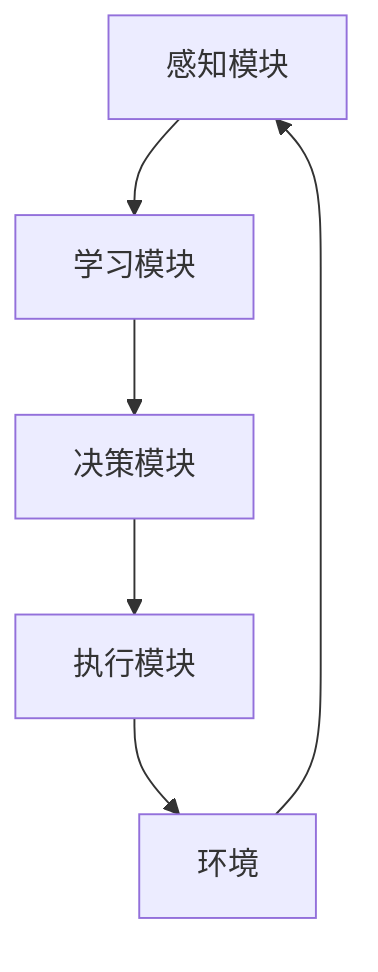
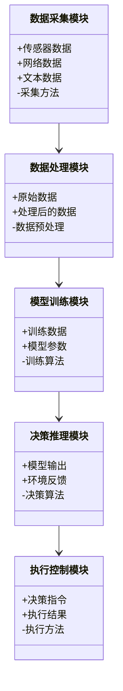
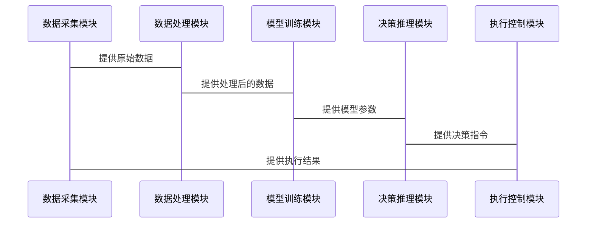

                 


# 开发具有持续学习能力的AI Agent

> 关键词：持续学习，AI Agent，机器学习，强化学习，知识表示，增量式学习，经验重放

> 摘要：本文深入探讨了开发具有持续学习能力的AI Agent的关键技术与实现方法。文章从AI Agent的基本概念出发，详细分析了持续学习的核心原理与算法实现，结合实际应用场景，提出了系统的架构设计方案，并通过具体的项目实战展示了如何实现一个具备持续学习能力的AI Agent。文章最后总结了开发过程中需要注意的关键点和最佳实践。

---

# 第一部分: 开发具有持续学习能力的AI Agent基础

# 第1章: AI Agent与持续学习概述

## 1.1 AI Agent的基本概念

### 1.1.1 AI Agent的定义与分类

AI Agent（人工智能代理）是一种能够感知环境并采取行动以实现目标的智能系统。AI Agent可以分为以下几类：
- **简单反射型Agent**：基于当前感知直接采取行动。
- **基于模型的反射型Agent**：维护环境的状态模型，并基于模型进行决策。
- **目标驱动型Agent**：根据目标选择最优行动。
- **效用驱动型Agent**：通过最大化效用函数来决策。

AI Agent的核心在于其能够通过感知和行动与环境交互，并通过学习和推理不断提升自身的智能水平。

### 1.1.2 持续学习的基本概念

持续学习（Continuous Learning）是指AI Agent能够在不断变化的环境中，通过持续接收新数据和任务，动态更新其知识和模型，以适应新的需求和挑战。与传统机器学习不同，持续学习强调模型的实时更新和适应性。

### 1.1.3 持续学习与传统机器学习的对比

| 对比维度 | 传统机器学习 | 持续学习 |
|----------|--------------|----------|
| 数据来源 | 批量数据，一次性输入 | 实时数据流，持续输入 |
| 模型更新 | 离线训练，周期性更新 | 在线训练，实时更新 |
| 适应性 | 低 | 高 |

持续学习的核心在于其能够应对动态变化的环境，实时更新模型以保持高性能。

### 1.1.4 持续学习的应用场景

- **智能助手**：如Siri、Alexa等，需要实时理解用户的意图并动态更新对话策略。
- **自动驾驶**：需要实时感知环境并动态调整驾驶策略。
- **推荐系统**：需要实时分析用户行为并动态更新推荐策略。

### 1.1.5 持续学习的核心挑战

- **数据流的实时性与多样性**：数据流是实时的、多样化的，需要快速处理和更新模型。
- **模型更新的效率与稳定性**：模型需要高效更新，同时保持性能的稳定性。
- **知识遗忘与知识迁移的问题**：模型在更新过程中可能会遗忘旧知识，或者难以将旧知识迁移到新任务中。

## 1.2 持续学习AI Agent的系统架构

### 1.2.1 系统架构的核心要素

- **感知模块**：负责从环境中获取数据和信息。
- **学习模块**：负责对数据进行处理和模型更新。
- **决策模块**：基于模型和环境反馈做出决策。
- **执行模块**：将决策转化为具体的行动。

### 1.2.2 系统架构的ER实体关系图

```mermaid
erDiagram
    customer[CUSTOMER] {
        +string id
        +string name
        +string email
    }
    order[ORDER] {
        +int id
        +date order_date
        +int amount
    }
    payment[PAYMENT] {
        +int id
        +string payment_type
        +date payment_date
    }
    CUSTOMER -> ORDER : places
    ORDER -> PAYMENT : has
```

---

# 第二部分: 持续学习AI Agent的核心概念与原理

# 第2章: 持续学习的原理与机制

## 2.1 持续学习的基本原理

### 2.1.1 知识表示与更新机制

知识表示是持续学习的基础。常用的表示方法包括：
- **符号表示**：如逻辑规则、语义网络等。
- **向量表示**：如词嵌入、知识图谱嵌入等。
- **图表示**：如知识图谱、图神经网络等。

更新机制是持续学习的核心，常用的更新方法包括：
- **增量式更新**：逐步更新模型，保持模型的实时性。
- **对抗式更新**：通过对抗训练保持模型的稳定性和多样性。
- **迁移式更新**：将旧知识迁移到新任务中。

### 2.1.2 经验重放机制

经验重放（Experience Replay）是一种常用的持续学习技术，通过存储和复用历史经验来提高模型的泛化能力。具体步骤如下：
1. **经验存储**：将每一步的感知、行动和奖励存储在经验回放器中。
2. **经验采样**：随机采样历史经验，用于模型的更新和训练。
3. **经验应用**：将采样的经验应用于模型的训练，以提高模型的泛化能力。

### 2.1.3 门控机制（如 gating mechanisms）

门控机制是一种通过门控网络控制信息流动的技术，常用于持续学习中。常用的门控机制包括：
- **输入门控**：控制新输入的信息对模型的影响。
- **遗忘门控**：控制旧知识的遗忘程度。
- **输出门控**：控制模型输出的信息。

### 2.1.4 对比学习（Contrastive Learning）

对比学习是一种通过对比正样本和负样本来学习特征表示的技术。在持续学习中，对比学习可以帮助模型区分不同任务或数据之间的差异，从而提高模型的适应性。

## 2.2 持续学习的核心算法

### 2.2.1 增量式学习算法

增量式学习（Incremental Learning）是一种在新数据流到来时逐步更新模型的技术。常用的增量式学习算法包括：
- **在线学习（Online Learning）**：逐样本更新模型。
- **渐进学习（Batch Incremental Learning）**：逐批更新模型。

### 2.2.2 对抗式学习算法

对抗式学习（Adversarial Learning）是一种通过对抗训练提高模型鲁棒性的技术。在持续学习中，对抗式学习可以帮助模型应对多样化的数据和任务。

### 2.2.3 迁移学习算法

迁移学习（Transfer Learning）是一种通过将旧任务的知识迁移到新任务的技术。在持续学习中，迁移学习可以帮助模型快速适应新任务，减少数据需求。

### 2.2.4 深度学习与持续学习的结合

深度学习（Deep Learning）是一种基于人工神经网络的技术，具有强大的特征提取能力。在持续学习中，深度学习可以帮助模型高效地处理多样化的数据和任务。

---

# 第三部分: 持续学习AI Agent的算法实现

# 第3章: 持续学习算法的数学模型与公式

## 3.1 增量式学习的数学模型

### 3.1.1 线性回归的增量更新公式

线性回归是一种常用的回归技术，其增量更新公式如下：

$$w_{t+1} = w_t + \eta (y_t - \hat{y}_t)x_t$$

其中，$w_t$ 是当前的权重向量，$\eta$ 是学习率，$y_t$ 是真实值，$\hat{y}_t$ 是预测值，$x_t$ 是输入向量。

### 3.1.2 梯度下降的优化方法

梯度下降是一种常用的优化技术，其数学公式如下：

$$\Delta w = -\eta \frac{\partial L}{\partial w}$$

其中，$L$ 是损失函数，$\frac{\partial L}{\partial w}$ 是损失函数对权重的梯度。

### 3.1.3 随机梯度下降的优化方法

随机梯度下降（Stochastic Gradient Descent, SGD）是一种常用的优化技术，其数学公式如下：

$$w_{t+1} = w_t - \eta \nabla_w L$$

其中，$\nabla_w L$ 是损失函数对权重的梯度。

---

## 3.2 对比学习的数学模型

### 3.2.1 对比损失函数

对比损失函数（Contrastive Loss）是一种常用的对比学习损失函数，其数学公式如下：

$$L = -\log \frac{\exp(s(x_i, x_j))}{\exp(s(x_i, x_j)) + \exp(s(x_i, x_k))}$$

其中，$s(x_i, x_j)$ 是正样本的相似度，$s(x_i, x_k)$ 是负样本的相似度。

### 3.2.2 余弦相似度

余弦相似度（Cosine Similarity）是一种常用的相似度计算方法，其数学公式如下：

$$\cos \theta = \frac{\mathbf{a} \cdot \mathbf{b}}{|\mathbf{a}| |\mathbf{b}|}$$

其中，$\mathbf{a}$ 和 $\mathbf{b}$ 是两个向量，$\mathbf{a} \cdot \mathbf{b}$ 是它们的点积，$|\mathbf{a}|$ 和 $|\mathbf{b}|$ 是它们的模长。

---

## 3.3 迁移学习的数学模型

### 3.3.1 迁移损失函数

迁移损失函数（Transfer Loss）是一种常用的迁移学习损失函数，其数学公式如下：

$$L_{transfer} = \alpha L_{source} + \beta L_{target}$$

其中，$L_{source}$ 是源任务的损失，$L_{target}$ 是目标任务的损失，$\alpha$ 和 $\beta$ 是权重系数。

### 3.3.2 知识蒸馏

知识蒸馏（Knowledge Distillation）是一种通过教师模型（Teacher）指导学生模型（Student）的技术，其数学公式如下：

$$L_{distill} = \alpha L_{CE} + \beta L_{KL}$$

其中，$L_{CE}$ 是交叉熵损失，$L_{KL}$ 是KL散度损失，$\alpha$ 和 $\beta$ 是权重系数。

---

## 3.4 系统架构的算法流程图



---

# 第四部分: 持续学习AI Agent的系统架构设计

# 第4章: 持续学习AI Agent的系统架构

## 4.1 系统架构的核心要素

### 4.1.1 感知模块

感知模块负责从环境中获取数据和信息。常用的感知技术包括：
- **传感器数据**：如摄像头、麦克风等。
- **文本数据**：如自然语言处理中的文本信息。
- **网络数据**：如实时网络流量数据。

### 4.1.2 学习模块

学习模块负责对数据进行处理和模型更新。常用的算法包括：
- **增量式学习**：如随机梯度下降。
- **对比学习**：如余弦相似度。
- **迁移学习**：如知识蒸馏。

### 4.1.3 决策模块

决策模块负责基于模型和环境反馈做出决策。常用的决策方法包括：
- **策略网络**：如强化学习中的策略网络。
- **价值网络**：如强化学习中的价值网络。
- **规则引擎**：如基于规则的决策引擎。

### 4.1.4 执行模块

执行模块负责将决策转化为具体的行动。常用的执行方法包括：
- **控制命令**：如自动驾驶中的方向盘转向。
- **输出指令**：如智能助手中的语音回复。
- **反馈机制**：如实时调整模型参数。

## 4.2 系统架构的实现细节

### 4.2.1 系统功能设计

系统功能设计包括以下模块：
- **数据采集模块**：负责从环境中采集数据。
- **数据处理模块**：负责对数据进行预处理和特征提取。
- **模型训练模块**：负责对模型进行增量式训练和更新。
- **决策推理模块**：负责基于模型和环境反馈做出决策。
- **执行控制模块**：负责将决策转化为具体的行动。

### 4.2.2 系统架构的领域模型

领域模型（Domain Model）是一种用于描述问题领域的模型，常用于系统设计中。以下是领域模型的类图：



### 4.2.3 系统架构的交互设计

系统架构的交互设计包括以下内容：
- **数据流**：从数据采集模块到执行控制模块的实时数据流。
- **接口设计**：模块之间的接口设计，如数据格式、调用方式等。
- **交互流程**：从数据采集到模型训练，再到决策推理和执行控制的完整流程。

### 4.2.4 系统架构的序列图

以下是系统架构的序列图：



---

# 第五部分: 持续学习AI Agent的项目实战

# 第5章: 项目实战：开发一个简单的持续学习AI Agent

## 5.1 环境安装与配置

### 5.1.1 安装Python环境

```bash
python --version
pip install --upgrade pip
```

### 5.1.2 安装必要的库

```bash
pip install numpy
pip install tensorflow
pip install keras
pip install scikit-learn
pip install matplotlib
```

## 5.2 核心代码实现

### 5.2.1 数据采集模块

```python
class 数据采集模块:
    def __init__(self):
        self.传感器数据 = []
        self.网络数据 = []
        self.文本数据 = []
    
    def 采集数据(self):
        # 示例代码，实际可以根据需求修改
        self.传感器数据.append(获取传感器数据())
        self.网络数据.append(获取网络数据())
        self.文本数据.append(获取文本数据())
```

### 5.2.2 数据处理模块

```python
class 数据处理模块:
    def __init__(self):
        self.原始数据 = []
        self.处理后的数据 = []
    
    def 处理数据(self):
        for data in self.原始数据:
            处理后的数据.append(预处理(data))
```

### 5.2.3 模型训练模块

```python
class 模型训练模块:
    def __init__(self):
        self.训练数据 = []
        self.模型参数 = []
    
    def 训练模型(self):
        for data in self.训练数据:
            更新模型参数(data)
```

### 5.2.4 决策推理模块

```python
class 决策推理模块:
    def __init__(self):
        self.模型输出 = []
        self.环境反馈 = []
    
    def 推理决策(self):
        for output in self.模型输出:
            决策指令 = 制定决策(output)
            self.环境反馈.append(接收反馈())
```

### 5.2.5 执行控制模块

```python
class 执行控制模块:
    def __init__(self):
        self.决策指令 = []
        self.执行结果 = []
    
    def 执行操作(self):
        for指令 in self.决策指令:
            执行结果.append(执行指令())
```

## 5.3 代码实现的详细解读

### 5.3.1 数据采集模块的实现

数据采集模块负责从环境中采集数据，包括传感器数据、网络数据和文本数据。以下是数据采集模块的实现代码：

```python
class 数据采集模块:
    def __init__(self):
        self.传感器数据 = []
        self.网络数据 = []
        self.文本数据 = []
    
    def 采集数据(self):
        # 示例代码，实际可以根据需求修改
        self.传感器数据.append(获取传感器数据())
        self.网络数据.append(获取网络数据())
        self.文本数据.append(获取文本数据())
```

### 5.3.2 数据处理模块的实现

数据处理模块负责对数据进行预处理和特征提取，以下是数据处理模块的实现代码：

```python
class 数据处理模块:
    def __init__(self):
        self.原始数据 = []
        self.处理后的数据 = []
    
    def 处理数据(self):
        for data in self.原始数据:
            处理后的数据.append(预处理(data))
```

### 5.3.3 模型训练模块的实现

模型训练模块负责对模型进行增量式训练和更新，以下是模型训练模块的实现代码：

```python
class 模型训练模块:
    def __init__(self):
        self.训练数据 = []
        self.模型参数 = []
    
    def 训练模型(self):
        for data in self.训练数据:
            更新模型参数(data)
```

### 5.3.4 决策推理模块的实现

决策推理模块负责基于模型和环境反馈做出决策，以下是决策推理模块的实现代码：

```python
class 决策推理模块:
    def __init__(self):
        self.模型输出 = []
        self.环境反馈 = []
    
    def 推理决策(self):
        for output in self.模型输出:
            决策指令 = 制定决策(output)
            self.环境反馈.append(接收反馈())
```

### 5.3.5 执行控制模块的实现

执行控制模块负责将决策转化为具体的行动，以下是执行控制模块的实现代码：

```python
class 执行控制模块:
    def __init__(self):
        self.决策指令 = []
        self.执行结果 = []
    
    def 执行操作(self):
        for指令 in self.决策指令:
            执行结果.append(执行指令())
```

## 5.4 项目实战的案例分析

### 5.4.1 案例分析：智能助手的对话系统

假设我们开发一个智能助手的对话系统，以下是具体的实现步骤：
1. **数据采集**：通过麦克风采集用户的语音输入。
2. **数据处理**：将语音转换为文本，并进行分词和词性标注。
3. **模型训练**：基于预处理的文本数据，训练一个增量式文本分类模型。
4. **决策推理**：基于分类结果，生成相应的回复内容。
5. **执行控制**：将回复内容通过文本到语音转换模块播放给用户。

### 5.4.2 案例分析：自动驾驶的决策系统

假设我们开发一个自动驾驶的决策系统，以下是具体的实现步骤：
1. **数据采集**：通过摄像头和雷达采集环境数据。
2. **数据处理**：将环境数据进行特征提取和融合。
3. **模型训练**：基于特征数据，训练一个增量式目标检测模型。
4. **决策推理**：基于检测结果，生成相应的驾驶指令。
5. **执行控制**：将驾驶指令发送给汽车的控制系统。

## 5.5 项目实战的小结

通过以上项目实战，我们可以看到，开发一个具有持续学习能力的AI Agent需要以下步骤：
1. **数据采集**：从环境中采集实时数据。
2. **数据处理**：对数据进行预处理和特征提取。
3. **模型训练**：基于数据更新模型参数。
4. **决策推理**：基于模型输出决策指令。
5. **执行控制**：将决策指令转化为具体行动。

---

# 第六部分: 持续学习AI Agent的最佳实践

# 第6章: 最佳实践与小结

## 6.1 开发过程中的注意事项

### 6.1.1 数据质量的重要性

数据质量是持续学习的基础，高质量的数据可以提高模型的性能和稳定性。

### 6.1.2 模型更新的效率

模型更新的效率是持续学习的关键，高效的模型更新可以保证系统的实时性和稳定性。

### 6.1.3 知识迁移的技巧

知识迁移是持续学习的核心，有效的知识迁移可以减少数据需求，提高模型的适应性。

## 6.2 持续学习的未来趋势

### 6.2.1 深度学习与持续学习的结合

深度学习是一种强大的特征提取技术，未来将持续与持续学习结合，提高模型的性能和适应性。

### 6.2.2 联邦学习与持续学习的结合

联邦学习是一种基于分布式的机器学习技术，未来将持续与持续学习结合，提高模型的隐私保护和数据利用率。

### 6.2.3 多模态学习与持续学习的结合

多模态学习是一种基于多种模态数据的技术，未来将持续与持续学习结合，提高模型的综合感知能力和适应性。

## 6.3 小结

通过本文的分析和实践，我们可以看到，开发具有持续学习能力的AI Agent是一个复杂而有趣的任务。它需要我们掌握持续学习的核心原理、算法实现、系统架构设计以及项目实战技巧。未来，随着技术的发展，持续学习将与深度学习、联邦学习和多模态学习等技术结合，推动人工智能的进步。

---

# 作者：AI天才研究院/AI Genius Institute & 禅与计算机程序设计艺术 /Zen And The Art of Computer Programming

---

**总结：** 本文从AI Agent的基本概念出发，详细分析了持续学习的核心原理与算法实现，结合实际应用场景，提出了系统的架构设计方案，并通过具体的项目实战展示了如何实现一个具备持续学习能力的AI Agent。文章最后总结了开发过程中需要注意的关键点和最佳实践，为读者提供了一个全面而深入的技术指南。

