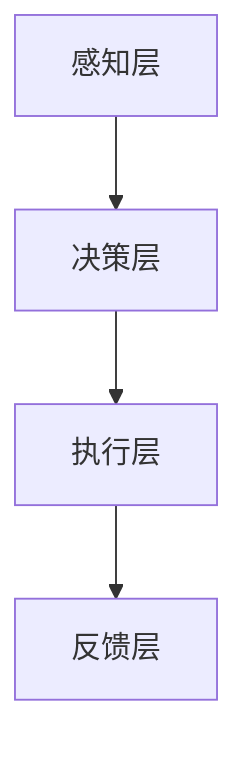

                 


```markdown
# 开发具有持续适应能力的AI Agent

> 关键词：AI Agent，持续适应，强化学习，动态环境，自适应系统

> 摘要：本文探讨了开发具有持续适应能力的AI Agent的关键技术，包括核心概念、算法原理、系统架构设计及项目实战。通过详细分析，阐述了如何使AI Agent在动态环境中实现自我更新与优化，以应对不断变化的任务需求和环境挑战。

---

## 第一部分: 持续适应能力AI Agent概述

### 第1章: 问题背景与挑战

#### 1.1 问题背景
- **传统AI Agent的局限性**：传统AI Agent通常基于静态模型，在动态环境中难以适应变化。
- **持续适应能力的重要性**：AI Agent需要在不断变化的环境中实时调整策略，以满足用户需求。
- **当前AI Agent应用中的主要挑战**：动态环境中的不确定性、任务多样性和用户反馈的实时性。

#### 1.2 问题描述
- **AI Agent在动态环境中的适应需求**：动态环境中，任务目标和环境条件可能频繁变化，AI Agent需要快速调整以应对。
- **用户期望与实际性能的差距**：用户期望AI Agent能够实时适应，但现有技术难以满足。
- **现有解决方案的不足**：传统方法在动态环境中的适应能力有限，难以处理复杂任务。

### 第2章: 持续适应能力AI Agent的核心概念

#### 2.1 核心概念与定义
- **持续适应能力**：AI Agent在动态环境中实时更新知识和策略的能力。
- **动态环境**：任务目标、环境条件或用户需求随时间变化的环境。

#### 2.2 持续适应能力的关键特征
- **自我更新与学习**：AI Agent能够主动更新知识和策略。
- **环境感知与反馈处理**：AI Agent能够感知环境变化并处理反馈。
- **多任务处理能力**：AI Agent能够同时处理多个任务。

### 第3章: 持续适应能力AI Agent的实现原理

#### 3.1 实现原理概述
- **知识表示与更新机制**：知识表示采用图结构，更新机制基于在线学习。
- **动态规划与强化学习结合**：动态规划用于状态空间探索，强化学习用于策略优化。
- **在线学习与离线训练的平衡**：在线学习实时更新，离线训练补充知识。

#### 3.2 核心算法与技术
- **强化学习算法**：Q-Learning和DQN。
- **在线学习算法**：SGD。
- **知识图谱构建与更新**：基于图结构的知识表示和实时更新。

---

## 第二部分: 持续适应能力AI Agent的算法与实现

### 第4章: 算法原理与数学模型

#### 4.1 强化学习算法
- **Q-Learning算法**：基于值迭代的策略优化算法。
- **DQN算法**：深度强化学习算法，结合经验回放和目标网络。
- **算法比较与选择**：Q-Learning适用于小规模状态空间，DQN适用于大规模状态空间。

#### 4.2 在线学习算法
- **SGD算法**：在线优化算法，适用于实时数据更新。
- **增量学习**：逐步更新模型参数，适应新数据。

#### 4.3 数学模型与公式
- **损失函数**：$$ L = \frac{1}{2}(y - \hat{y})^2 $$
- **优化器**：$$ \theta_{new} = \theta - \eta \nabla L $$

### 第5章: 系统分析与架构设计

#### 5.1 问题场景介绍
- **动态环境**：任务目标和环境条件随时间变化。
- **实时反馈**：用户实时反馈，要求AI Agent快速响应。

#### 5.2 系统功能设计
- **领域模型**：基于UML的类图，展示系统模块及其交互。
- **系统架构**：采用分层架构，包括感知层、决策层和执行层。

#### 5.3 系统架构图


### 第6章: 项目实战

#### 6.1 环境安装
- **依赖管理**：安装Python、TensorFlow、Keras等。

#### 6.2 核心代码实现
```python
import numpy as np
from tensorflow.keras import layers

# 定义网络
model = layers.Sequential([
    layers.Dense(64, activation='relu', input_shape=(input_dim,)),
    layers.Dense(output_dim)
])

# 编译模型
model.compile(optimizer='adam', loss='mean_squared_error')

# 训练模型
model.fit(X_train, y_train, epochs=100, batch_size=32)
```

#### 6.3 代码解读与分析
- **输入处理**：解析输入数据并进行预处理。
- **模型训练**：使用训练数据更新模型参数。
- **结果输出**：生成输出并返回给用户。

### 第7章: 最佳实践

#### 7.1 小结
- 持续适应能力AI Agent能够有效应对动态环境中的挑战。
- 算法选择和系统设计对性能有重要影响。

#### 7.2 注意事项
- **数据质量**：确保数据准确性和完整性。
- **模型更新频率**：平衡实时性和计算资源消耗。

#### 7.3 拓展阅读
- **相关书籍**：《强化学习》、《自适应系统设计》。
- **论文推荐**：Nature和Science期刊上的相关研究。

---

## 第三部分: 结论与展望

### 结论
- 持续适应能力AI Agent通过结合强化学习和在线学习，能够有效应对动态环境中的挑战。
- 本文提出的系统架构和实现方法为后续研究提供了参考。

### 展望
- **算法优化**：探索更高效的强化学习和在线学习算法。
- **系统扩展**：研究更大规模系统的构建与优化。
- **应用领域**：探索在更多领域的应用，如自动驾驶、智能客服等。

---

## 作者

作者：AI天才研究院 & 禅与计算机程序设计艺术

---

通过以上内容，我们详细探讨了开发具有持续适应能力的AI Agent的关键技术，从理论到实践，为读者提供了全面的指导。希望本文能够为相关领域的研究和应用提供有价值的参考。
```

