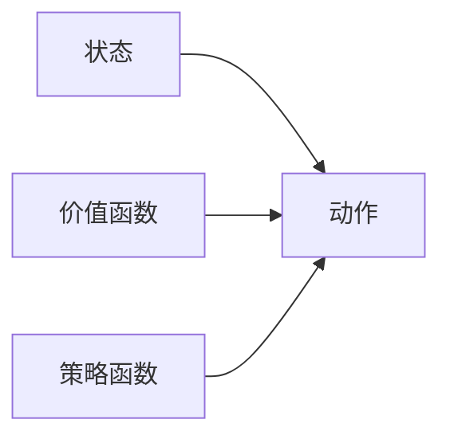
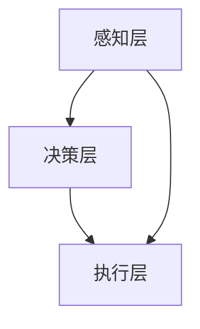
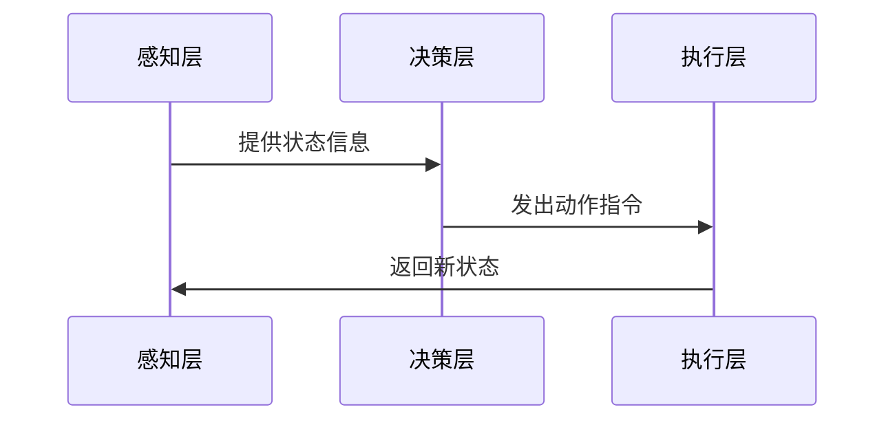

                 


# 开发具有深度强化学习能力的AI Agent

## 关键词：深度强化学习，AI Agent，强化学习算法，神经网络，强化学习框架

## 摘要：深度强化学习是一种结合了深度学习和强化学习的技术，用于开发具有智能决策能力的AI Agent。本文从背景介绍、核心概念、算法原理、系统架构设计、项目实战到总结展望，全面分析了开发具有深度强化学习能力的AI Agent的各个方面，帮助读者掌握相关知识和技术。

---

# 第1章: 深度强化学习与AI Agent的背景介绍

## 1.1 深度强化学习的核心概念
### 1.1.1 问题背景与问题描述
强化学习是一种通过智能体与环境交互来学习策略的方法。深度强化学习则结合了深度学习的特征提取能力，使其在复杂环境中表现出色。

### 1.1.2 问题解决的思路与方法
深度强化学习通过神经网络逼近策略或值函数，解决传统强化学习在高维状态空间中的困难。

### 1.1.3 深度强化学习的边界与外延
深度强化学习可以应用于游戏AI、机器人控制等领域，但其计算成本较高，需要大量数据支持。

### 1.1.4 核心概念的结构与组成要素
深度强化学习由智能体、环境、动作、状态和奖励构成。

## 1.2 AI Agent的基本原理
### 1.2.1 AI Agent的定义与分类
AI Agent是指能够感知环境并采取行动以实现目标的智能体，分为反应式和认知式两类。

### 1.2.2 强化学习与深度学习的结合
深度学习用于特征提取，强化学习用于策略优化，两者结合使AI Agent能够处理复杂任务。

### 1.2.3 深度强化学习在AI Agent中的应用
广泛应用于游戏AI、自动驾驶等领域，提升决策效率和准确性。

## 1.3 深度强化学习与传统机器学习的对比
### 1.3.1 传统机器学习的特点
基于特征工程，依赖大量人工特征提取。

### 1.3.2 深度强化学习的优势
无需人工特征提取，自动学习复杂模式。

### 1.3.3 两者的区别与联系
强化学习注重决策过程，传统机器学习注重预测。

## 1.4 深度强化学习的核心算法
### 1.4.1 Q-learning算法
通过Q表记录状态-动作对的价值，实现最优策略。

### 1.4.2 Deep Q-Network (DQN) 算法
使用神经网络近似Q函数，解决高维状态空间问题。

### 1.4.3 策略梯度方法
直接优化策略，通过梯度下降调整参数。

## 1.5 本章小结
深度强化学习结合了深度学习和强化学习的优势，通过神经网络逼近策略或值函数，广泛应用于复杂任务。

---

# 第2章: 深度强化学习的核心概念与联系

## 2.1 核心概念的原理
### 2.1.1 价值函数的定义与作用
价值函数评估状态或状态-动作对的价值，指导智能体决策。

### 2.1.2 策略优化的核心思想
通过优化策略函数，使智能体选择最优动作。

### 2.1.3 神经网络在深度强化学习中的应用
神经网络用于逼近策略或价值函数，处理复杂非线性关系。

## 2.2 核心概念的属性特征对比
### 2.2.1 表格对比：价值函数与策略函数的差异
| 特性 | 价值函数 | 策略函数 |
|------|-----------|-----------|
| 目标 | 最大化Q值 | 最大化策略 |
| 应用 | 选择动作 | 直接生成动作 |

### 2.2.2 图表展示：核心概念之间的关系


## 2.3 ER实体关系图架构
```mermaid
er
actor[智能体] -[>]- goal[目标] 
actor -[<]- environment[环境]
goal --> action[动作]
action --> state[状态]
```

## 2.4 本章小结
深度强化学习通过神经网络逼近价值或策略函数，优化智能体在复杂环境中的决策过程。

---

# 第3章: 深度强化学习算法的数学模型与公式

## 3.1 Q-learning算法的数学模型
### 3.1.1 Q-learning的基本公式
$$ Q(s,a) = Q(s,a) + \alpha [r + \gamma \max Q(s',a') - Q(s,a)] $$

### 3.1.2 Q-learning的收敛条件
Q-learning在离散、马尔可夫决策过程下收敛于最优策略。

## 3.2 Deep Q-Network (DQN) 算法的数学模型
### 3.2.1 DQN的网络结构
使用两个神经网络，目标网络和动作选择网络，分别用于目标和策略。

### 3.2.2 DQN的损失函数
$$ \mathcal{L} = \mathbb{E}[(r + \gamma Q(s',a') - Q(s,a))^2] $$

## 3.3 策略梯度方法的数学模型
### 3.3.1 策略梯度的基本公式
$$ \nabla \theta J(\theta) = \mathbb{E}[ \nabla \log \pi(a|s) Q(s,a) ] $$

## 3.4 本章小结
数学模型展示了深度强化学习算法的核心机制，为理解和实现这些算法提供了理论基础。

---

# 第4章: 深度强化学习算法的实现与应用

## 4.1 深度强化学习算法的实现
### 4.1.1 Q-learning算法实现
代码示例：
```python
import numpy as np

class QLearning:
    def __init__(self, state_size, action_size, alpha=0.1, gamma=0.99):
        self.q_table = np.zeros((state_size, action_size))
        self.alpha = alpha
        self.gamma = gamma

    def choose_action(self, state, epsilon=0.1):
        if np.random.random() < epsilon:
            return np.random.randint(0, self.q_table[state].size)
        return np.argmax(self.q_table[state])

    def update(self, state, action, reward, next_state):
        self.q_table[state, action] = self.q_table[state, action] + self.alpha * (reward + self.gamma * max(self.q_table[next_state]) - self.q_table[state, action])
```

### 4.1.2 Deep Q-Network (DQN) 实现
代码示例：
```python
import torch
import torch.nn as nn

class DQN(nn.Module):
    def __init__(self, input_dim, output_dim):
        super(DQN, self).__init__()
        self.fc1 = nn.Linear(input_dim, 64)
        self.fc2 = nn.Linear(64, output_dim)
    
    def forward(self, x):
        x = torch.relu(self.fc1(x))
        x = self.fc2(x)
        return x
```

## 4.2 深度强化学习算法的应用
### 4.2.1 游戏AI应用
深度强化学习在游戏AI中表现出色，如AlphaGo。

### 4.2.2 机器人控制
应用于无人机、自动驾驶等领域，提升自主决策能力。

## 4.3 本章小结
通过实现和应用案例，展示了深度强化学习算法的实际效果和应用潜力。

---

# 第5章: 深度强化学习系统架构设计

## 5.1 系统架构设计
### 5.1.1 系统功能设计
包括感知层、决策层和执行层。

### 5.1.2 系统架构图


## 5.2 系统交互设计
### 5.2.1 交互流程
感知层获取信息，决策层处理，执行层执行。

### 5.2.2 序列图


## 5.3 系统接口设计
### 5.3.1 接口定义
状态、动作、奖励函数的接口。

### 5.3.2 接口交互流程
感知层接收状态，决策层计算动作，执行层返回新状态和奖励。

## 5.4 本章小结
系统架构设计明确了各模块的功能和交互方式，为实际开发提供了指导。

---

# 第6章: 项目实战——开发一个简单的深度强化学习AI Agent

## 6.1 项目介绍
### 6.1.1 项目目标
开发一个能在简单环境中自主决策的AI Agent。

## 6.2 环境安装
### 6.2.1 安装Python和相关库
安装TensorFlow或PyTorch框架。

## 6.3 核心代码实现
### 6.3.1 环境类实现
```python
class Environment:
    def __init__(self):
        self.state = 0
        self.actions = [0, 1]

    def step(self, action):
        # 简单环境，状态转移和奖励函数
        self.state = (self.state + action) % 2
        return self.state, 1 if action == 1 else 0
```

### 6.3.2 AI Agent实现
```python
class AI-Agent:
    def __init__(self, env):
        self.env = env
        self.model = DQN(env.state_size, env.action_size)

    def train(self, episodes=1000):
        for episode in range(episodes):
            state = self.env.reset()
            while True:
                action = self.choose_action(state)
                next_state, reward = self.env.step(action)
                self.update(state, action, reward, next_state)
                state = next_state
```

## 6.4 案例分析
### 6.4.1 训练过程分析
展示训练过程中的奖励变化曲线。

### 6.4.2 最终结果展示
展示AI Agent在测试环境中的表现。

## 6.5 本章小结
通过实战项目，读者可以掌握深度强化学习的基本实现和应用。

---

# 第7章: 总结与展望

## 7.1 本章总结
深度强化学习结合了深度学习和强化学习的优势，广泛应用于复杂任务。

## 7.2 未来展望
未来发展方向包括多智能体协作、实时决策优化等。

## 7.3 最佳实践 tips
- 合理选择算法和框架
- 充分利用GPU资源
- 注重超参数调优

## 7.4 本章小结
深度强化学习具有广阔的应用前景，需要持续学习和实践。

---

# 附录

## 附录A: 深度强化学习相关工具与库
- TensorFlow
- PyTorch
- OpenAI Gym

## 附录B: 深度强化学习相关论文与书籍
推荐几篇经典论文和书籍。

---

作者：AI天才研究院 & 禅与计算机程序设计艺术

