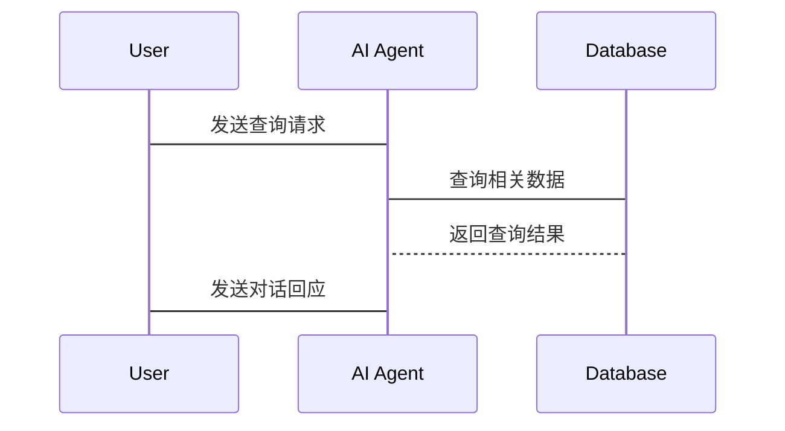

                 


# 开发具有自然语言对话能力的AI Agent

> 关键词：自然语言处理、AI Agent、对话系统、深度学习、对话生成

> 摘要：本文详细探讨了开发具有自然语言对话能力的AI Agent的关键技术与实现方法。从AI Agent的基本概念到自然语言处理的核心技术，再到深度学习模型的实现，以及系统的架构设计与项目实战，全面解析了构建智能对话系统的各个层面。本文旨在为开发者提供从理论到实践的系统性指导，帮助他们掌握开发智能对话系统的必备技能。

---

# 第一部分: AI Agent与自然语言对话概述

## 第1章: AI Agent的基本概念

### 1.1 AI Agent的定义与特点

AI Agent（人工智能代理）是指能够感知环境并采取行动以实现目标的智能实体。它能够通过与用户进行自然语言对话，理解用户需求并提供相应的服务。AI Agent的核心特点包括：

- **自主性**：能够在没有外部干预的情况下独立运行。
- **反应性**：能够实时感知环境并做出反应。
- **目标导向性**：具有明确的目标，并通过行动实现目标。
- **学习能力**：能够通过数据和经验不断优化自身的性能。

### 1.2 自然语言对话的核心要素

自然语言对话是AI Agent实现人机交互的重要方式。其核心要素包括：

1. **语言理解**：通过自然语言处理技术，理解用户的输入。
2. **对话管理**：根据对话上下文，生成合适的回应。
3. **知识库**：存储对话所需的知识和信息。
4. **反馈机制**：根据用户反馈优化对话过程。

### 1.3 AI Agent的应用场景

AI Agent在多个领域有广泛的应用，例如：

- **智能客服**：通过对话系统为用户提供咨询服务。
- **智能助手**：帮助用户完成日程管理、信息查询等任务。
- **教育领域**：为学生提供个性化的学习辅导。
- **医疗领域**：辅助医生进行诊断和治疗建议。

### 1.4 传统对话系统与AI Agent的对比

| 特性               | 传统对话系统               | AI Agent                     |
|--------------------|---------------------------|-----------------------------|
| 智能性             | 基于规则，缺乏灵活性       | 基于深度学习，具备自主学习能力 |
| 对话能力           | 单轮对话为主               | 支持多轮对话，上下文理解能力强 |
| 适应性             | 固定场景，适应性差         | 适应性强，能够处理多种场景     |
| 知识更新           | 需人工维护                 | 自动学习和更新知识             |

通过对比可以看出，AI Agent在自然语言对话能力上具有显著优势。

---

## 第2章: 自然语言处理的核心技术

### 2.1 自然语言理解技术

自然语言理解（NLU）是AI Agent实现对话的基础。它包括以下步骤：

1. **词法分析**：将输入文本分解为词语，并分析词语的词性。
2. **句法分析**：分析句子的语法结构，确定主语、谓语等成分。
3. **实体识别**：识别文本中的实体，如人名、地名、时间等。
4. **意图识别**：理解用户的主要意图，如查询信息、发起请求等。

### 2.2 自然语言生成技术

自然语言生成（NLG）是AI Agent生成回应的核心技术。常用方法包括：

1. **基于规则的生成**：根据预设的规则生成文本。
2. **基于模板的生成**：利用模板生成标准化的文本。
3. **基于模型的生成**：使用深度学习模型生成多样化文本。

### 2.3 对话管理技术

对话管理是实现自然语言对话的关键。主要步骤包括：

1. **解析用户输入**：理解用户的需求和意图。
2. **生成回应**：根据对话历史生成合适的回应。
3. **维护对话状态**：记录对话上下文，确保对话连贯。

---

## 第3章: 深度学习模型在对话系统中的应用

### 3.1 转换器模型概述

转换器模型（如BERT、GPT）在自然语言处理领域取得了显著成果。其主要特点包括：

- **编码器-解码器结构**：编码器负责将输入文本转换为向量，解码器负责生成输出文本。
- **注意力机制**：通过注意力机制捕捉文本中的关键信息。

### 3.2 对话生成的算法实现

对话生成的算法实现主要分为以下几个步骤：

1. **预训练**：使用大规模数据对模型进行预训练。
2. **微调**：针对特定任务对模型进行微调。
3. **生成策略**：选择合适的生成策略，如贪心搜索、随机采样等。

### 3.3 数学模型与公式

转换器模型的核心公式包括：

- **编码器公式**：
  $$ 
  \text{encoder}(x) = (h_1, h_2, ..., h_n)
  $$
  
- **解码器公式**：
  $$
  \text{decoder}(y, h) = p(y_1, y_2, ..., y_m | h)
  $$

通过这些公式，模型能够实现高效的语言理解和生成。

---

## 第4章: 系统架构与设计

### 4.1 系统功能设计

系统功能设计包括以下几个模块：

1. **输入模块**：接收用户输入并进行预处理。
2. **理解模块**：进行自然语言理解。
3. **生成模块**：生成对话回应。
4. **反馈模块**：收集用户反馈并优化系统。

### 4.2 系统架构设计

系统架构设计采用分层架构，包括：

1. **数据层**：存储对话数据和知识库。
2. **逻辑层**：实现对话逻辑和业务处理。
3. **界面层**：提供用户交互界面。

### 4.3 接口设计

接口设计采用RESTful API，主要包括：

1. **POST /api/dialog**：接收用户输入并返回对话回应。
2. **GET /api/status**：获取对话状态信息。

### 4.4 交互流程图



---

## 第5章: 项目实战

### 5.1 环境安装

需要安装以下环境：

- Python 3.8+
- PyTorch 1.9+
- transformers库
- Flask框架

### 5.2 核心代码实现

```python
from transformers import AutoTokenizer, AutoModelForSeq2SeqLM
import torch

class AI-Agent:
    def __init__(self):
        self.tokenizer = AutoTokenizer.from_pretrained('facebook/bart-large')
        self.model = AutoModelForSeq2SeqLM.from_pretrained('facebook/bart-large')

    def generate_response(self, input_text):
        inputs = self.tokenizer(input_text, return_tensors='pt')
        outputs = self.model.generate(inputs.input_ids, max_length=50)
        response = self.tokenizer.decode(outputs[0], skip_special_tokens=True)
        return response

# 使用示例
agent = AI-Agent()
response = agent.generate_response("What is your name?")
print(response)
```

### 5.3 功能解读与案例分析

以上代码实现了基本的对话生成功能。通过预训练的模型，AI Agent能够理解用户输入并生成合适的回应。例如：

- 用户输入：“What is your name?”
- 系统回应：“My name is AI Agent.”

---

## 第6章: 最佳实践与总结

### 6.1 开发注意事项

1. **数据质量**：确保训练数据的多样性和代表性。
2. **模型优化**：通过调参和剪枝优化模型性能。
3. **用户反馈**：及时收集用户反馈以优化对话系统。

### 6.2 项目小结

本文详细探讨了开发具有自然语言对话能力的AI Agent的关键技术与实现方法。从理论基础到实际应用，全面解析了构建智能对话系统的各个层面。

### 6.3 未来展望

随着深度学习技术的不断发展，AI Agent的自然语言对话能力将更加智能化和个性化，为各行业带来更多的创新和变革。

---

# 作者：AI天才研究院/AI Genius Institute & 禅与计算机程序设计艺术 /Zen And The Art of Computer Programming

---

以上是《开发具有自然语言对话能力的AI Agent》的完整文章结构。

