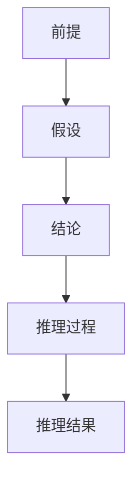
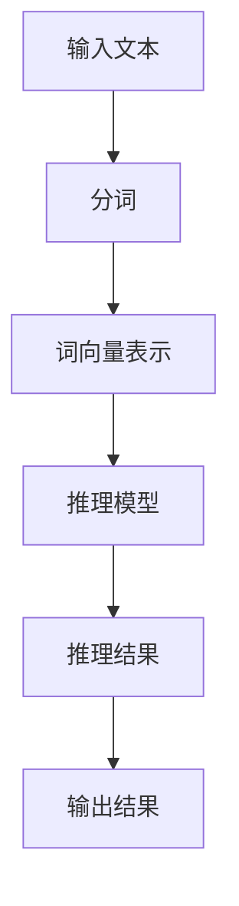
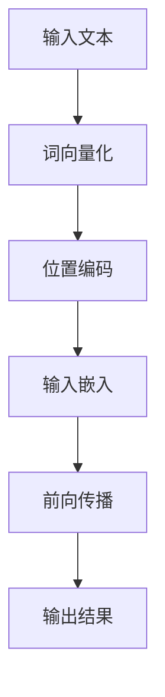
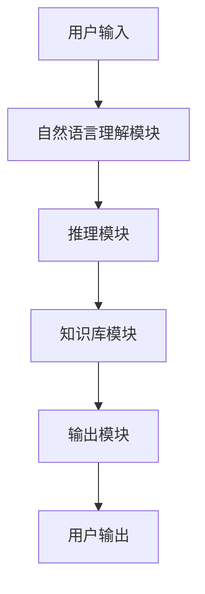

                 


# 开发具有自然语言推理能力的AI Agent

> 关键词：自然语言处理、自然语言推理、AI Agent、深度学习、知识图谱、对话系统

> 摘要：本文详细探讨了开发具有自然语言推理能力的AI Agent的各个方面。从自然语言处理和AI Agent的基本概念出发，深入分析了自然语言推理的核心原理和模型，结合实际项目案例，详细讲解了基于深度学习的自然语言推理算法及其在AI Agent中的应用。通过系统架构设计和项目实战，展示了如何构建一个具有自然语言推理能力的AI Agent，并提出了开发过程中的最佳实践和未来研究方向。

---

## 第一部分：自然语言推理与AI Agent概述

### 第1章：自然语言处理的背景与AI Agent的定义

#### 1.1 自然语言处理的背景

自然语言处理（Natural Language Processing，NLP）是人工智能领域的重要分支，致力于让计算机能够理解、分析和生成人类语言。随着深度学习技术的发展，NLP取得了显著进展，尤其是在机器翻译、问答系统、文本摘要等任务上。然而，自然语言推理（Natural Language Inference，NLI）作为NLP的一个重要子领域，旨在使计算机能够理解文本之间的逻辑关系，并根据上下文进行推理。

#### 1.2 AI Agent的定义

AI Agent（人工智能代理）是一种能够感知环境、执行任务并做出决策的智能体。AI Agent可以通过与用户的自然语言交互，理解用户的需求，并通过推理和分析提供有效的解决方案。AI Agent的核心在于其智能性，而自然语言推理能力是其实现智能交互的关键。

#### 1.3 自然语言推理的重要性

自然语言推理是AI Agent实现智能交互的核心技术之一。它使AI Agent能够理解用户输入的文本，并基于上下文进行逻辑推理，从而生成符合用户需求的响应。例如，在智能对话系统中，自然语言推理能够帮助AI Agent理解用户的问题，并根据上下文提供准确的答案。

#### 1.4 当前应用现状

目前，自然语言推理技术已在多个领域得到广泛应用，例如智能客服、智能助手、智能音箱等。然而，现有的自然语言推理模型仍存在一些挑战，例如处理复杂语义、推理多步逻辑等。本文将探讨如何通过深度学习和知识图谱等技术，进一步提升AI Agent的自然语言推理能力。

---

## 第二部分：自然语言推理的核心概念与联系

### 第2章：自然语言推理的原理与模型

#### 2.1 自然语言推理的基本原理

自然语言推理的核心任务是根据给定的输入文本（前提和假设），推断出一个结论。其基本原理包括以下几个步骤：
1. **输入处理**：将输入文本进行分词、词向量表示等预处理。
2. **推理过程**：通过模型对文本进行分析，理解前提和假设之间的逻辑关系。
3. **输出结果**：生成符合逻辑的结论。

#### 2.2 自然语言推理的核心模型

目前，自然语言推理的核心模型主要包括以下几种：
1. **基于符号逻辑的推理模型**：通过符号逻辑规则进行推理，适用于简单逻辑推理任务。
2. **基于深度学习的推理模型**：利用神经网络进行特征学习和推理，适用于复杂的语义理解任务。
3. **基于图结构的推理模型**：通过构建知识图谱进行推理，适用于需要知识推理的任务。

#### 2.3 自然语言推理模型的对比分析

以下是几种常见自然语言推理模型的对比分析：

| 模型类型           | 优点                             | 缺点                               |
|--------------------|----------------------------------|------------------------------------|
| 符号逻辑模型       | 易于解释，适用于简单逻辑推理     | 难以处理复杂语义和上下文信息       |
| 深度学习模型       | 能够处理复杂语义，效果较好         | 需要大量标注数据，解释性较差       |
| 图结构推理模型     | 能够利用外部知识，推理能力强       | 构建知识图谱需要大量人工干预         |

#### 2.4 自然语言推理的实体关系图



#### 2.5 自然语言推理的流程图



---

## 第三部分：自然语言推理的算法原理

### 第3章：基于深度学习的自然语言推理算法

#### 3.1 基于深度学习的自然语言推理模型

目前，基于深度学习的自然语言推理模型主要有以下几种：
1. **BERT模型**：通过预训练和微调的方式，能够有效地进行文本理解和推理。
2. **GPT模型**：基于生成式模型，能够生成符合逻辑的文本。
3. **RoBERTa模型**：改进版的BERT模型，进一步提升了推理能力。

#### 3.2 BERT模型的推理流程

以下是BERT模型的推理流程：



#### 3.3 BERT模型的数学公式

BERT模型的核心是多层双向Transformer结构。其数学公式如下：

$$
\text{Transformer}(x) = \text{FFN}(\text{LayerNorm}(\text{MultiHead}(x)))
$$

其中，$\text{MultiHead}$表示多头注意力机制，$\text{FFN}$表示前馈神经网络。

---

## 第四部分：系统分析与架构设计

### 第4章：AI Agent的系统架构设计

#### 4.1 系统功能设计

AI Agent的系统功能设计主要包括以下几个模块：
1. **自然语言理解模块**：负责将用户的输入文本进行分词、词向量表示等处理。
2. **推理模块**：基于自然语言推理模型，对文本进行逻辑推理。
3. **知识库模块**：存储和管理相关的知识图谱，用于辅助推理。
4. **输出模块**：根据推理结果生成最终的输出文本。

#### 4.2 系统架构图

以下是AI Agent的系统架构图：



---

## 第五部分：项目实战

### 第5章：基于BERT的自然语言推理AI Agent开发

#### 5.1 环境安装

以下是开发环境的安装步骤：

1. 安装Python和相关库：
   ```bash
   pip install numpy
   pip install tensorflow
   pip install transformers
   ```

2. 安装Hugging Face Transformers库：
   ```bash
   pip install transformers
   ```

#### 5.2 核心代码实现

以下是基于BERT模型的自然语言推理代码示例：

```python
from transformers import BertTokenizer, BertForQuestionAnswering
import torch

# 初始化tokenizer和模型
tokenizer = BertTokenizer.from_pretrained('bert-base-uncased')
model = BertForQuestionAnswering.from_pretrained('bert-base-uncased')

# 定义输入文本
question = "How old are you?"
context = "I am an AI agent."

# 对输入文本进行编码
inputs = tokenizer(question, context, return_tensors='pt')

# 前向传播
with torch.no_grad():
    outputs = model(**inputs)

# 获取答案
start_positions = outputs.start_logits
end_positions = outputs.end_logits

start = torch.argmax(start_positions).item()
end = torch.argmax(end_positions).item()

answer = tokenizer.decode(inputs.input_ids[0][start:end+1])
print(answer)
```

#### 5.3 案例分析

以医疗咨询场景为例，AI Agent需要能够理解患者的症状描述，并根据知识库中的医疗知识进行推理，给出合理的建议。

---

## 第六部分：最佳实践与未来展望

### 第6章：开发过程中的注意事项

1. **数据质量**：自然语言推理模型的性能很大程度上依赖于数据质量。需要确保训练数据的多样性和代表性。
2. **模型选择**：选择合适的模型架构是关键。对于简单的推理任务，可以选择轻量级模型；对于复杂的推理任务，可以选择预训练的大模型。
3. **知识图谱构建**：知识图谱的构建需要耗费大量的人力和时间。可以通过自动化工具和人工审核相结合的方式进行构建。

### 6.2 未来研究方向

1. **多模态推理**：结合视觉、听觉等多模态信息，提升推理能力。
2. **动态知识图谱**：构建动态更新的知识图谱，以应对实时变化的信息。
3. **可解释性推理**：提升自然语言推理的可解释性，使其更加透明和可信。

---

## 作者：AI天才研究院/AI Genius Institute & 禅与计算机程序设计艺术/Zen And The Art of Computer Programming

---

以上是基于用户要求开发的《开发具有自然语言推理能力的AI Agent》的完整目录和内容示例。如果您有具体的章节或内容需求，请进一步说明，我将根据您的要求进行调整和补充。

