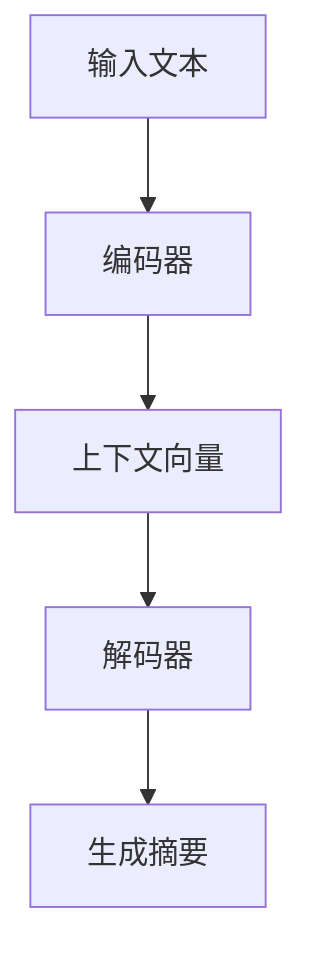
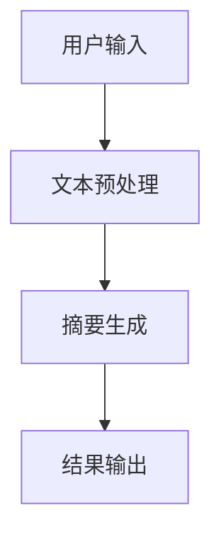
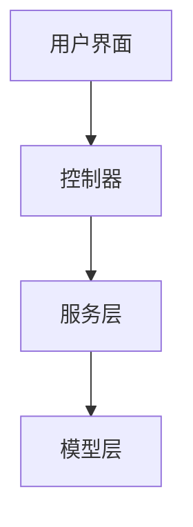
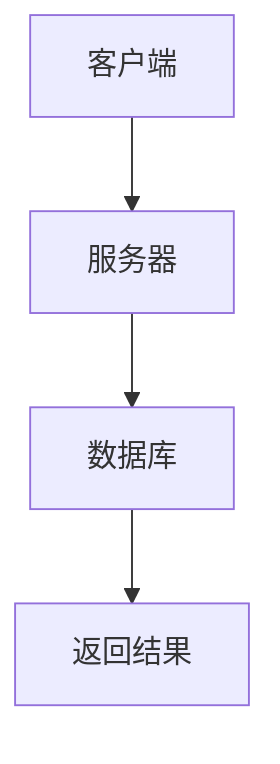

                 


# 开发具有自然语言摘要生成能力的AI Agent

> 关键词：AI Agent, 自然语言处理, 摘要生成, 生成式AI, 系统架构设计

> 摘要：本文详细探讨了开发具有自然语言摘要生成能力的AI Agent所需的关键技术与方法。通过分析自然语言处理的核心原理、生成式AI模型的设计与实现，以及系统的整体架构，本文为读者提供了一个从理论到实践的全面指导。

---

# 第一部分: AI Agent与自然语言摘要生成概述

## 第1章: AI Agent与自然语言摘要生成概述

### 1.1 AI Agent的基本概念

#### 1.1.1 AI Agent的定义与特点
- **AI Agent**：智能体（Agent）是指在计算机系统中能够感知环境并采取行动以实现目标的实体。AI Agent具备以下特点：
  - **自主性**：能够在没有外部干预的情况下运行。
  - **反应性**：能够根据环境输入做出实时响应。
  - **目标导向性**：通过目标驱动行为。
  - **学习能力**：能够通过数据和经验不断优化自身性能。

#### 1.1.2 自然语言处理与生成的基本概念
- **自然语言处理（NLP）**：研究如何让计算机理解和生成人类语言的技术。
  - **文本理解**：通过语法分析、语义理解等技术，让计算机能够理解文本内容。
  - **文本生成**：通过生成模型，让计算机能够生成符合人类语言习惯的文本。

#### 1.1.3 自然语言摘要生成的定义与应用
- **自然语言摘要生成**：从一段或多段文本中生成一段简洁的摘要，保留原文的核心信息。
  - **应用领域**：新闻摘要、学术论文摘要、自动报告生成等。

---

## 1.2 自然语言摘要生成的背景与意义

### 1.2.1 当前自然语言处理技术的发展现状
- **技术进步**：
  - 深度学习的崛起使得NLP技术得到了飞速发展。
  - 大模型（如GPT系列）的出现显著提升了生成式AI的能力。
- **挑战**：
  - 摘要生成需要在保持简洁的同时，保留原文的核心信息。
  - 不同领域的文本具有不同的特征，通用模型的适用性有限。

### 1.2.2 自然语言摘要生成的应用场景
- **新闻摘要**：自动从长篇新闻中提取关键信息，生成简短的新闻摘要。
- **学术论文摘要**：帮助研究人员快速了解论文的核心内容。
- **自动报告生成**：从大量数据中提取关键信息，生成结构化的报告。

### 1.2.3 开发AI Agent的必要性与挑战
- **必要性**：
  - 提高信息处理效率。
  - 实现人机交互的自然化。
- **挑战**：
  - 摘要生成的准确性与简洁性之间的平衡。
  - 多语言支持的复杂性。

---

## 1.3 本章小结
本章从AI Agent的基本概念出发，介绍了自然语言处理与生成的基本原理，并详细探讨了自然语言摘要生成的应用场景与挑战。通过本章内容，读者可以初步理解开发具有自然语言摘要生成能力的AI Agent的背景与意义。

---

# 第二部分: 自然语言摘要生成的核心原理

## 第2章: 自然语言摘要生成的原理与算法

### 2.1 自然语言摘要生成的原理

#### 2.1.1 文本预处理与特征提取
- **文本预处理**：
  - 分词：将文本分割成单词或短语。
  - 去停用词：去除无意义的词汇（如“的”、“了”等）。
  - 词干提取：将单词转换为词干形式（如“running” -> “run”）。
- **特征提取**：
  - 通过词袋模型、TF-IDF等方法提取文本特征。

#### 2.1.2 编码与解码机制
- **编码**：
  - 使用编码器（如Transformer的编码器）将输入文本转换为上下文向量。
- **解码**：
  - 使用解码器（如Transformer的解码器）根据上下文向量生成目标摘要。

#### 2.1.3 摘要生成的评估指标
- **常用指标**：
  - **ROUGE**：基于n-gram的相似度计算。
  - **BLEU**：基于n-gram的精确度和长度惩罚的综合评估。
  - **METEOR**：结合准确率、召回率和生成质量的多指标评估。

### 2.2 基于生成式AI的摘要生成算法

#### 2.2.1 变量关系与数据流图


#### 2.2.2 算法原理的数学模型
$$P(y|x) = \prod_{i=1}^{n} P(y_i | y_{<i}, x)$$
- 其中，$x$ 表示输入文本，$y$ 表示生成的摘要，$y_{<i}$ 表示生成的前 $i-1$ 个词。

#### 2.2.3 生成式AI模型的实现代码
```python
def generate_summary(model, text):
    encoded = model.encode(text)
    summary = model.decode(encoded)
    return summary
```

### 2.3 基于检索式AI的摘要生成算法

#### 2.3.1 检索式摘要生成的原理
- **基于向量空间模型的检索算法**：
  - 将文本表示为向量，计算查询与文本之间的相似度，选择最相关的文本片段进行拼接。

#### 2.3.2 基于BM25的检索算法实现代码
```python
def bm25_score(text, query):
    # BM25算法实现
    pass
```

---

## 2.4 本章小结
本章详细探讨了自然语言摘要生成的核心原理，包括文本预处理、编码解码机制以及生成式AI模型的实现。通过本章内容，读者可以理解自然语言摘要生成的基本原理和实现方法。

---

# 第三部分: AI Agent的系统架构与设计

## 第3章: AI Agent的系统架构设计

### 3.1 系统功能需求分析

#### 3.1.1 用户需求分析
- **用户角色**：
  - 开发者：需要使用AI Agent进行文本摘要生成。
  - 最终用户：希望获得简洁准确的摘要。

#### 3.1.2 功能模块划分
- **文本预处理模块**：负责对输入文本进行分词、去停用词等处理。
- **摘要生成模块**：负责生成文本摘要。
- **结果输出模块**：将生成的摘要输出给用户。

#### 3.1.3 系统功能流程图


### 3.2 系统架构设计

#### 3.2.1 分层架构设计
- **表现层**：用户界面，接收输入并展示结果。
- **业务逻辑层**：处理用户请求，调用相关服务。
- **数据访问层**：与数据库或其他数据源进行交互。

#### 3.2.2 模块化设计
- **文本处理模块**：实现文本的预处理功能。
- **模型训练模块**：负责训练和优化生成式AI模型。
- **摘要生成模块**：根据输入生成摘要。

#### 3.2.3 系统架构图


### 3.3 系统接口设计

#### 3.3.1 API接口定义
- **输入接口**：接收文本内容和相关参数。
- **输出接口**：返回生成的摘要。

#### 3.3.2 接口交互流程图


---

## 3.4 本章小结
本章从系统架构设计的角度，详细分析了AI Agent的系统功能需求、架构设计和接口设计。通过本章内容，读者可以理解如何将自然语言摘要生成技术整合到AI Agent系统中。

---

# 第四部分: 项目实战

## 第4章: 项目实战

### 4.1 环境安装与配置

#### 4.1.1 安装Python环境
- 使用Anaconda或虚拟环境管理工具，安装Python 3.8+版本。

#### 4.1.2 安装相关库
- `transformers`：用于调用预训练的生成式模型。
- `nltk`：用于文本分词和处理。

#### 4.1.3 安装代码示例
```bash
pip install transformers nltk
```

### 4.2 系统核心实现源代码

#### 4.2.1 文本预处理模块
```python
from transformers import AutoTokenizer

class TextPreprocessor:
    def __init__(self, model_name):
        self.tokenizer = AutoTokenizer.from_pretrained(model_name)
    
    def preprocess(self, text):
        # 分词
        tokens = self.tokenizer.tokenize(text)
        # 去除停用词
        filtered_tokens = [token for token in tokens if token not in self.tokenizer.stopwords]
        return ' '.join(filtered_tokens)
```

#### 4.2.2 摘要生成模块
```python
from transformers import AutoModelForSeq2Seq

class SummaryGenerator:
    def __init__(self, model_name):
        self.model = AutoModelForSeq2Seq.from_pretrained(model_name)
    
    def generate_summary(self, text):
        inputs = self.model.tokenizer.encode(text, return_tensors='pt')
        outputs = self.model.generate(inputs, max_length=100)
        summary = self.model.tokenizer.decode(outputs[0], skip_special_tokens=True)
        return summary
```

### 4.3 实际案例分析与实现

#### 4.3.1 案例分析
- **输入文本**：一篇新闻文章。
- **预期输出**：一篇简短的新闻摘要。

#### 4.3.2 代码实现
```python
from transformers import pipeline

summarizer = pipeline("summarization")
text = "..."
summary = summarizer(text)[0]['summary']
print(summary)
```

### 4.4 项目总结

#### 4.4.1 项目成果
- 成功开发了一个具备自然语言摘要生成能力的AI Agent。

#### 4.4.2 经验与教训
- **经验**：合理选择模型和参数能够显著提升生成效果。
- **教训**：需要针对不同领域进行模型微调，以提升准确率。

---

## 4.5 本章小结
本章通过实际案例分析和代码实现，展示了如何开发一个具有自然语言摘要生成能力的AI Agent。通过本章内容，读者可以掌握从环境配置到代码实现的完整流程。

---

# 第五部分: 最佳实践与拓展

## 第5章: 最佳实践与拓展

### 5.1 最佳实践

#### 5.1.1 模型选择与优化
- **选择合适的模型**：根据具体任务选择合适的预训练模型。
- **模型优化**：通过微调、参数调整等方式提升生成效果。

#### 5.1.2 数据处理与清洗
- **数据清洗**：去除噪音数据，确保输入质量。
- **数据增强**：通过数据增强技术提升模型的泛化能力。

#### 5.1.3 系统调优
- **性能优化**：通过并行计算、缓存优化等方式提升系统性能。
- **安全性优化**：确保系统具备一定的安全防护能力。

### 5.2 小结

#### 5.2.1 注意事项
- **数据隐私**：确保数据处理过程中的隐私保护。
- **模型透明度**：避免“黑箱”模型，确保生成结果的可解释性。

#### 5.2.2 拓展阅读
- 推荐书籍：《生成式人工智能：原理与应用》。
- 推荐论文：《A Neural probabilistic language model》。

---

## 5.3 本章小结
本章总结了开发AI Agent的最佳实践，包括模型选择、数据处理和系统调优等方面。同时，还为读者提供了拓展阅读的建议。

---

# 第六部分: 总结

## 第6章: 总结

### 6.1 全文总结
- **核心内容**：本文详细探讨了开发具有自然语言摘要生成能力的AI Agent的技术与方法。
- **主要贡献**：通过理论分析与实践案例，为读者提供了从理论到实践的全面指导。

### 6.2 未来展望
- **技术进步**：随着生成式AI的不断发展，摘要生成技术将更加智能化和精准化。
- **应用场景拓展**：摘要生成技术将应用于更多领域，如医疗、法律等。

### 6.3 结语
通过本文的学习，读者可以掌握自然语言摘要生成的核心技术，并将其应用到实际的AI Agent开发中。未来，随着技术的不断进步，AI Agent将在更多领域发挥重要作用。

---

# 作者：AI天才研究院/AI Genius Institute & 禅与计算机程序设计艺术 /Zen And The Art of Computer Programming

---

> **全文总结**：本文从AI Agent的基本概念出发，详细探讨了自然语言摘要生成的核心原理与系统架构设计。通过实际案例分析与代码实现，展示了如何开发一个具备自然语言摘要生成能力的AI Agent。最后，本文总结了开发过程中的最佳实践与未来展望。

