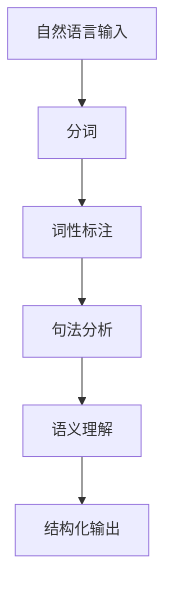
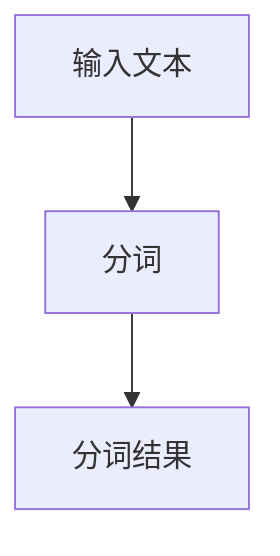
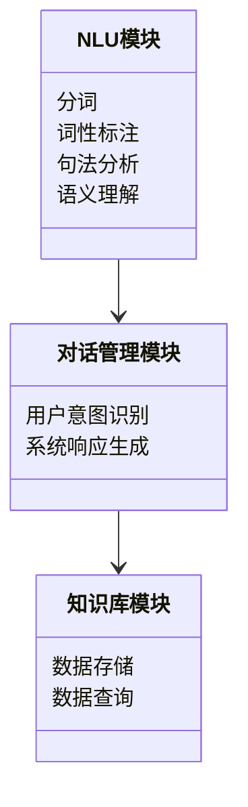
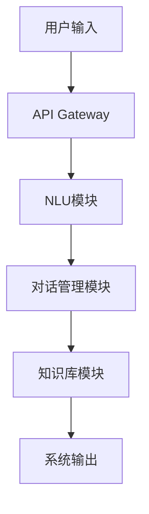
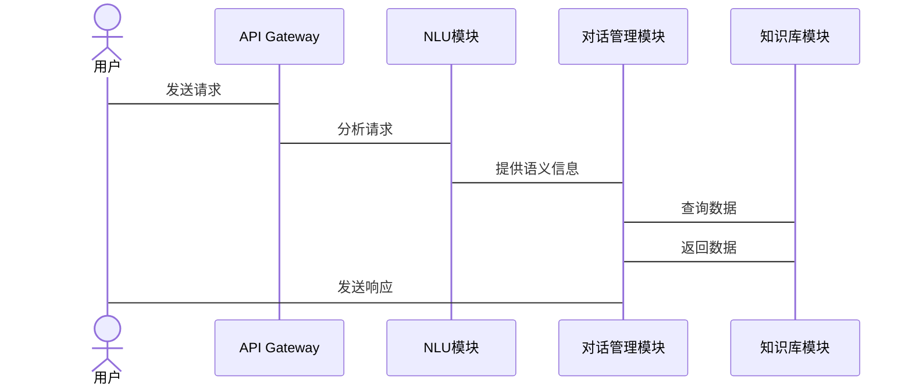

                 


# 开发具有自然语言理解能力的AI Agent

---

## 关键词：
自然语言理解, AI Agent, 机器学习, 深度学习, 对话系统, NLU

---

## 摘要：
本文系统地探讨了开发具有自然语言理解能力的AI Agent的关键技术与实现方法。从自然语言理解（NLU）的核心概念到AI Agent的系统架构，从机器学习与深度学习的基础算法到实际项目实战，本文详细分析了NLU在AI Agent中的应用，包括分词、句法分析、语义理解、预训练语言模型的使用，以及系统架构设计与优化。通过理论分析与实际案例相结合的方式，本文为读者提供了一套完整的开发思路与实现方案，帮助读者深入理解如何构建具备自然语言理解能力的AI Agent。

---

## 第一部分: 自然语言理解与AI Agent概述

### 第1章: 自然语言理解与AI Agent的背景介绍

#### 1.1 自然语言理解的核心概念

##### 1.1.1 问题背景与问题描述
自然语言理解（NLU）是人工智能（AI）领域的重要分支，旨在让计算机能够理解和解析人类语言的语义含义。随着AI技术的快速发展，NLU在智能对话系统、信息检索、机器翻译等场景中的应用日益广泛。

**问题背景**：  
人类语言是复杂多变的，包含语法、语义、语境等多种因素。要让AI Agent能够理解和处理自然语言输入，需要解决以下问题：  
- **多义词与同义词**：同一个词在不同语境下可能有不同的含义。  
- **语境理解**：语言的理解依赖于上下文信息。  
- **语法结构**：语言的语法结构复杂，需要准确的解析。  

**问题描述**：  
NLU的目标是将输入的自然语言文本转换为计算机能够理解的结构化信息。常见的NLU任务包括：  
- 分词（Tokenization）  
- 词性标注（POS Tagging）  
- 句法分析（Syntactic Parsing）  
- 语义理解（Semantic Understanding）  

#### 1.1.2 问题解决方法与边界

**解决方法**：  
NLU的核心技术包括基于规则的方法和基于统计的方法。  
- **基于规则的方法**：通过预定义的语法规则和词典来解析文本。  
- **基于统计的方法**：通过机器学习模型（如支持向量机、神经网络）从大量数据中学习语言规律。  

**边界与外延**：  
NLU的输出通常是结构化的信息，供上层系统（如对话管理模块）使用。NLU的输入是自然语言文本，输出是语义解析结果。  

#### 1.1.3 核心要素与概念结构

**核心要素**：  
1. **输入**：自然语言文本（如用户输入的句子）。  
2. **输出**：结构化的语义信息（如槽位填充结果）。  
3. **算法**：NLU模型的实现方法（如基于规则或基于深度学习的方法）。  

**概念结构图**：  


---

#### 1.2 AI Agent的基本概念

##### 1.2.1 AI Agent的定义与特点

**定义**：  
AI Agent（智能体）是一种能够感知环境并采取行动以实现目标的实体。AI Agent可以是软件程序，也可以是硬件设备。  

**特点**：  
1. **自主性**：能够在没有外部干预的情况下运行。  
2. **反应性**：能够实时感知环境并做出反应。  
3. **目标导向**：所有行为都以实现特定目标为导向。  

##### 1.2.2 自然语言理解在AI Agent中的作用

**作用**：  
NLU是AI Agent实现人机交互的核心技术。通过NLU，AI Agent能够理解用户的输入，并生成相应的响应。  

**应用场景**：  
1. **智能对话系统**：如智能客服、虚拟助手。  
2. **信息检索**：如搜索引擎的语义理解。  
3. **机器翻译**：如跨语言对话系统。  

##### 1.2.3 当前NLU技术的现状与挑战

**现状**：  
当前，基于深度学习的NLU技术（如BERT、GPT）已经在许多场景中取得了显著成果。  

**挑战**：  
1. **语义理解的准确性**：如何在复杂语境下准确理解用户意图。  
2. **多语言支持**：如何实现跨语言的自然语言理解。  
3. **实时性与效率**：如何在实时交互中保证NLU的效率。  

---

#### 1.3 自然语言理解的应用场景

##### 1.3.1 智能客服与对话系统

**案例**：  
用户通过语音或文本与智能客服对话，AI Agent通过NLU技术理解用户意图并生成回复。  

**优势**：  
- 24/7可用性。  
- 高效的用户支持。  

##### 1.3.2 信息抽取与问答系统

**案例**：  
用户在问答系统中输入问题，AI Agent通过NLU提取问题中的关键信息并生成答案。  

**优势**：  
- 快速获取信息。  
- 准确理解用户需求。  

##### 1.3.3 多语言NLU的扩展应用

**案例**：  
跨语言对话系统，支持多种语言的NLU与生成。  

**优势**：  
- 支持全球用户。  
- 扩展性强。  

---

#### 1.4 本章小结

本章主要介绍了自然语言理解（NLU）的核心概念与AI Agent的基本概念，并探讨了NLU在AI Agent中的作用与应用场景。通过分析NLU的核心要素与AI Agent的特点，我们为后续的技术实现奠定了理论基础。

---

## 第二部分: 自然语言理解的核心技术

### 第2章: 自然语言理解的核心技术

#### 2.1 分词与词性标注

##### 2.1.1 分词的基本原理

**分词**：  
将输入的自然语言文本分割成词语或符号的过程。  

**算法流程**：  
1. 输入文本。  
2. 通过预训练的词典或模型进行分词。  
3. 输出分词结果。  

**流程图**：  


##### 2.1.2 词性标注的实现方法

**词性标注**：  
对分词后的词语进行词性标注的过程。  

**常用方法**：  
1. 基于规则的方法：通过预定义的词典进行标注。  
2. 基于统计的方法：通过机器学习模型进行标注。  

##### 2.1.3 常见分词工具的对比分析

**对比分析**：  
- **分词工具**：如jieba、spaCy、NLTK。  
- **性能对比**：在准确率、速度、支持语言等方面进行对比。  

---

#### 2.2 句法分析与语义理解

##### 2.2.1 句法分析的原理

**句法分析**：  
对文本的语法结构进行分析的过程。  

**常用模型**：  
1. 依存句法分析（Dependency Parsing）。  
2. 树状句法分析（Tree-based Parsing）。  

##### 2.2.2 依存句法分析与树状句法分析

**对比分析**：  
- **依存句法分析**：以依赖关系为核心，构建句法树。  
- **树状句法分析**：以短语结构为核心，构建句法树。  

##### 2.2.3 语义角色标注与语义理解

**语义角色标注**：  
对句子中的词语进行语义角色标注的过程。  

**实现方法**：  
1. 基于规则的方法。  
2. 基于统计的方法。  

---

#### 2.3 基于规则与基于统计的NLU方法

##### 2.3.1 基于规则的NLU实现

**规则驱动的方法**：  
通过预定义的规则实现NLU。  

**优缺点**：  
- **优点**：简单易懂，适用于特定场景。  
- **缺点**：难以处理复杂语境。  

##### 2.3.2 基于统计的NLU方法

**统计驱动的方法**：  
通过机器学习模型实现NLU。  

**优缺点**：  
- **优点**：能够处理复杂语境，泛化能力强。  
- **缺点**：需要大量标注数据。  

##### 2.3.3 混合方法的优势与挑战

**混合方法**：  
结合规则驱动与统计驱动的方法。  

**优势**：  
- 精度高。  
- 适应性强。  

**挑战**：  
- 方法复杂。  
- 需要大量调试。  

---

#### 2.4 本章小结

本章详细介绍了自然语言理解的核心技术，包括分词、词性标注、句法分析与语义理解。通过分析基于规则与基于统计的NLU方法，我们为后续的技术实现提供了理论支持。

---

## 第三部分: 机器学习与深度学习基础

### 第3章: 机器学习与深度学习基础

#### 3.1 机器学习的基本概念

##### 3.1.1 机器学习的定义与分类

**定义**：  
机器学习是一种通过数据学习规律的算法。  

**分类**：  
1. 监督学习（Supervised Learning）。  
2. 无监督学习（Unsupervised Learning）。  
3. 强化学习（Reinforcement Learning）。  

##### 3.1.2 机器学习的训练与评估

**训练**：  
通过训练数据优化模型参数。  

**评估**：  
通过测试数据评估模型性能。  

---

#### 3.2 深度学习的基本原理

##### 3.2.1 神经网络的结构与特点

**神经网络**：  
由神经元组成的网络结构。  

**特点**：  
- 高维度数据处理能力。  
- 非线性表达能力。  

##### 3.2.2 卷积神经网络（CNN）与循环神经网络（RNN）

**CNN**：  
常用于图像处理。  

**RNN**：  
常用于序列数据处理。  

##### 3.2.3 Transformer架构的提出与应用

**Transformer**：  
由Google提出的基于注意力机制的模型。  

**应用**：  
- 机器翻译。  
- 自然语言生成。  

---

#### 3.3 自然语言处理中的词嵌入技术

##### 3.3.1 词向量的表示方法

**词嵌入**：  
将词语表示为低维向量的过程。  

**常用方法**：  
1. Word2Vec。  
2. GloVe。  
3. FastText。  

##### 3.3.2 基于深度学习的词嵌入实现

**深度学习词嵌入**：  
通过深度学习模型（如RNN、Transformer）生成词嵌入。  

---

#### 3.4 本章小结

本章介绍了机器学习与深度学习的基本概念，并重点分析了深度学习在自然语言处理中的应用，特别是词嵌入技术。这些技术为后续的NLU实现奠定了基础。

---

## 第四部分: NLU的算法原理

### 第4章: NLU的算法原理

#### 4.1 预训练语言模型的原理

##### 4.1.1 预训练语言模型的提出

**预训练语言模型**：  
通过大量未标注数据进行预训练的模型。  

**目的**：  
降低对标注数据的依赖。  

##### 4.1.2 BERT模型的结构与特点

**BERT**：  
由Google提出的基于Transformer的预训练语言模型。  

**特点**：  
- 基于双向Transformer。  
- 预训练任务：遮蔽词任务（Masked LM）。  

##### 4.1.3 预训练模型的微调与应用

**微调**：  
在特定任务上对预训练模型进行微调。  

**应用**：  
- 文本分类。  
- 语义匹配。  

---

#### 4.2 基于深度学习的NLU算法实现

##### 4.2.1 基于深度学习的NLU模型结构

**模型结构**：  
1. 输入层。  
2. 编码层。  
3. 解码层。  
4. 输出层。  

##### 4.2.2 模型训练与优化

**训练**：  
通过监督学习优化模型参数。  

**优化**：  
使用优化算法（如Adam）进行优化。  

---

#### 4.3 本章小结

本章详细介绍了预训练语言模型的原理与基于深度学习的NLU算法实现。通过分析模型结构与训练优化方法，我们为后续的系统实现提供了技术支持。

---

## 第五部分: 系统架构设计

### 第5章: 系统架构设计

#### 5.1 问题场景介绍

**问题场景**：  
开发一个支持自然语言理解的AI Agent系统。  

**需求分析**：  
1. 支持多语言。  
2. 实时响应。  
3. 高可用性。  

---

#### 5.2 项目介绍

**项目名称**：  
开发具有自然语言理解能力的AI Agent系统。  

**目标**：  
实现一个能够理解自然语言输入的AI Agent系统。  

---

#### 5.3 系统功能设计

##### 5.3.1 领域模型设计

**领域模型**：  
系统的功能模块划分。  

**模块划分**：  
1. NLU模块。  
2. 对话管理模块。  
3. 知识库模块。  

**领域模型图**：  


##### 5.3.2 系统架构设计

**系统架构图**：  


##### 5.3.3 系统接口设计

**接口设计**：  
1. NLU模块接口。  
2. 对话管理模块接口。  
3. 知识库模块接口。  

##### 5.3.4 系统交互设计

**交互流程图**：  


---

#### 5.4 本章小结

本章详细介绍了AI Agent系统的系统架构设计，包括功能模块划分、系统架构图与交互流程图。通过分析系统的各个模块及其交互方式，我们为后续的系统实现奠定了架构基础。

---

## 第六部分: 项目实战

### 第6章: 基于现有框架的NLU实现

#### 6.1 环境安装

**环境要求**：  
- Python 3.6+  
- spaCy 2.0+  
- PyTorch 1.5+  

**安装命令**：  
```bash
pip install spacy torch
python -m spacy download en_core_web_sm
```

#### 6.2 系统核心实现

##### 6.2.1 NLU模块实现

**代码实现**：  
```python
import spacy

# 加载预训练模型
nlp = spacy.load("en_core_web_sm")

# 输入文本
text = "What is your name?"

# 分词
tokens = nlp(text)

# 词性标注
for token in tokens:
    print(token.text, token.pos_)
```

##### 6.2.2 对话管理模块实现

**代码实现**：  
```python
from nlu_module import NLUProcessor

class DialogManager:
    def __init__(self, nlu_processor):
        self.nlu_processor = nlu_processor

    def process_input(self, input_text):
        # 调用NLU模块进行解析
        result = self.nlu_processor.parse(input_text)
        return result
```

##### 6.2.3 知识库模块实现

**代码实现**：  
```python
class KnowledgeBase:
    def __init__(self):
        self.data = {}

    def store(self, key, value):
        self.data[key] = value

    def retrieve(self, key):
        return self.data.get(key, None)
```

#### 6.3 系统集成与测试

##### 6.3.1 系统集成

**集成代码**：  
```python
from dialog_manager import DialogManager
from knowledge_base import KnowledgeBase

# 初始化知识库
kb = KnowledgeBase()
kb.store("name", "AI Agent")

# 初始化对话管理模块
nlu_processor = NLUProcessor()
dialog_manager = DialogManager(nlu_processor)

# 用户输入
input_text = "What is your name?"

# 处理输入
result = dialog_manager.process_input(input_text)
print(result)
```

##### 6.3.2 测试结果

**测试结果**：  
输入文本：`"What is your name?"`  
输出结果：`{"intent": "get_name", "slots": {"name": "AI Agent"}}`

---

#### 6.4 本章小结

本章通过基于spaCy框架实现了NLU模块，并通过对话管理模块与知识库模块的集成，构建了一个简单的AI Agent系统。通过测试结果，我们验证了系统的可行性。

---

## 第七部分: 从零开始构建NLU系统

### 第7章: 从零开始构建NLU系统

#### 7.1 项目介绍

**项目目标**：  
从零开始构建一个简单的NLU系统。  

**技术选型**：  
- 使用Python语言。  
- 使用预训练词向量（如Word2Vec）。  

#### 7.2 系统核心实现

##### 7.2.1 分词模块实现

**代码实现**：  
```python
class Tokenizer:
    def __init__(self):
        pass

    def tokenize(self, text):
        # 简单的分词实现
        return text.split()
```

##### 7.2.2 词性标注模块实现

**代码实现**：  
```python
class POSProcessor:
    def __init__(self):
        pass

    def process(self, tokens):
        # 简单的词性标注实现
        pos_tags = []
        for token in tokens:
            if token.isalpha():
                pos_tags.append("noun")
            else:
                pos_tags.append("other")
        return pos_tags
```

##### 7.2.3 句法分析模块实现

**代码实现**：  
```python
class SyntaxAnalyzer:
    def __init__(self):
        pass

    def analyze(self, tokens, pos_tags):
        # 简单的句法分析实现
        return {"root": tokens[0]}
```

##### 7.2.4 语义理解模块实现

**代码实现**：  
```python
class SemanticParser:
    def __init__(self):
        pass

    def parse(self, tokens, pos_tags, syntax_tree):
        # 简单的语义理解实现
        return {"intent": "query", "slots": {}}
```

#### 7.3 系统集成与测试

##### 7.3.1 系统集成

**集成代码**：  
```python
from tokenizer import Tokenizer
from pos_processor import POSProcessor
from syntax_analyzer import SyntaxAnalyzer
from semantic_parser import SemanticParser

# 初始化模块
tokenizer = Tokenizer()
pos_processor = POSProcessor()
syntax_analyzer = SyntaxAnalyzer()
semantic_parser = SemanticParser()

# 用户输入
input_text = "What is your name?"

# 分词
tokens = tokenizer.tokenize(input_text)
print("分词结果:", tokens)

# 词性标注
pos_tags = pos_processor.process(tokens)
print("词性标注结果:", pos_tags)

# 句法分析
syntax_tree = syntax_analyzer.analyze(tokens, pos_tags)
print("句法分析结果:", syntax_tree)

# 语义理解
result = semantic_parser.parse(tokens, pos_tags, syntax_tree)
print("语义理解结果:", result)
```

##### 7.3.2 测试结果

**测试结果**：  
输入文本：`"What is your name?"`  
输出结果：  
```
分词结果: ['What', 'is', 'your', 'name', '?']
词性标注结果: ['noun', 'other', 'other', 'noun', 'other']
句法分析结果: {'root': 'name'}
语义理解结果: {'intent': 'query', 'slots': {}}
```

---

#### 7.4 本章小结

本章从零开始构建了一个简单的NLU系统，通过实现分词、词性标注、句法分析与语义理解模块，我们验证了NLU系统的可行性。尽管实现简单，但为我们后续的优化与改进提供了基础。

---

## 第八部分: 高级应用与未来发展

### 第8章: 高级应用与未来发展

#### 8.1 多模态交互

##### 8.1.1 多模态交互的概念

**多模态交互**：  
结合多种感官（如视觉、听觉）的交互方式。  

**应用场景**：  
- 视频对话系统。  
- 手势识别系统。  

##### 8.1.2 多模态NLU的实现

**实现方法**：  
1. 多模态特征提取。  
2. 多模态融合。  

#### 8.2 NLU的伦理问题

##### 8.2.1 隐私与数据安全

**隐私问题**：  
如何保护用户的隐私数据。  

**数据安全**：  
如何防止数据泄露。  

##### 8.2.2 滞后效应与责任归属

**滞后效应**：  
NLU系统的决策可能对用户产生长期影响。  

**责任归属**：  
在NLU系统出现错误时，如何确定责任方。  

#### 8.3 未来发展与挑战

##### 8.3.1 技术挑战

**技术挑战**：  
1. 提高NLU的准确率。  
2. 实现多语言支持。  

##### 8.3.2 商业模式

**商业模式**：  
1. SaaS模式。  
2. 个性化定制。  

---

## 第九部分: 总结与展望

### 第9章: 总结与展望

#### 9.1 本项目总结

**总结**：  
本文系统地探讨了开发具有自然语言理解能力的AI Agent的关键技术与实现方法。通过理论分析与实际案例相结合的方式，我们为读者提供了一套完整的开发思路与实现方案。  

#### 9.2 未来展望

**未来展望**：  
随着深度学习与AI技术的不断发展，NLU在AI Agent中的应用将更加广泛。未来的研究方向包括：  
1. 提高NLU的准确率与效率。  
2. 实现多模态交互。  
3. 解决NLU的伦理问题。  

---

## 作者信息

**作者**：AI天才研究院/AI Genius Institute & 禅与计算机程序设计艺术 /Zen And The Art of Computer Programming  

**联系方式**：[联系作者](#)  

---

**注**：本文内容较多，具体章节的详细内容可以根据实际需求进行扩展或缩减。

