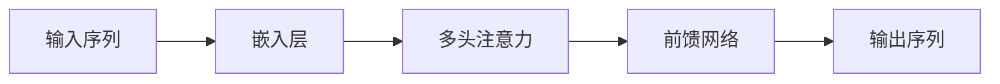
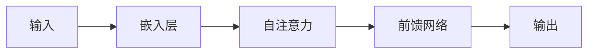
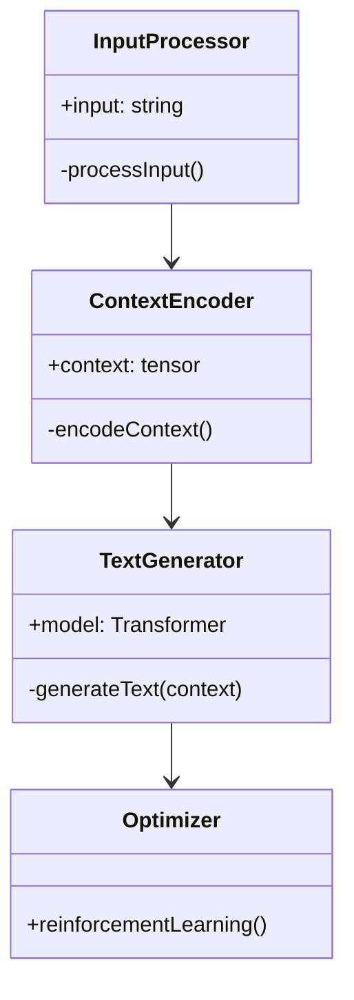
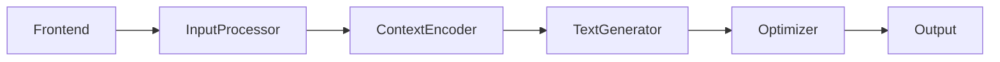
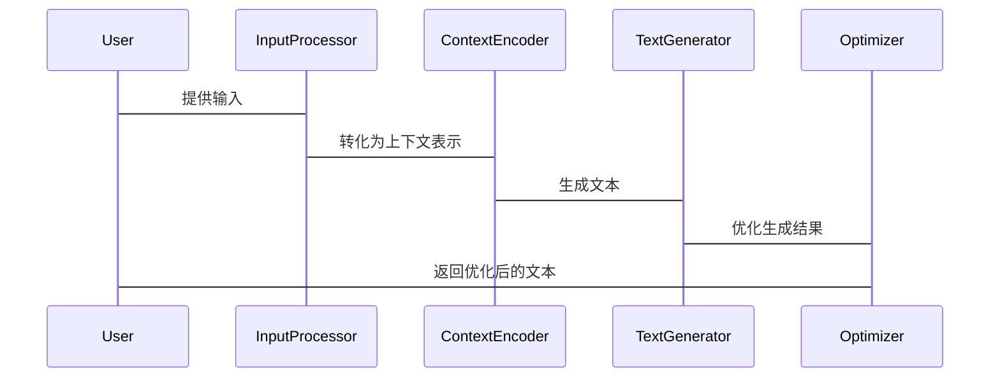

                 


# 《开发具有自然语言生成能力的AI Agent》

## 关键词：
- 自然语言生成
- AI Agent
- 生成式AI
- Transformer模型
- 强化学习

## 摘要：
本文详细探讨了开发具有自然语言生成能力的AI Agent的全过程，从理论基础到实际应用，涵盖了生成式AI、自然语言处理（NLP）和强化学习的核心原理，以及系统架构设计和项目实战。文章通过丰富的图表和代码示例，深入分析了AI Agent的实现细节，为读者提供了从理解到实践的全面指导。

---

## 第一部分：背景介绍

### 第1章：自然语言生成与AI Agent概述

#### 1.1 问题背景
自然语言生成（Natural Language Generation, NLG）是人工智能（AI）领域的重要分支，旨在使计算机能够生成符合人类语言习惯的文本。随着AI技术的快速发展，AI Agent（智能代理）的应用场景日益广泛，尤其是在客服、教育、医疗等领域，AI Agent需要具备与人类进行自然语言交互的能力。然而，现有的AI Agent在自然语言生成方面仍面临诸多挑战，例如生成内容的相关性、准确性和流畅性不足，难以满足复杂场景的需求。

#### 1.2 问题描述
AI Agent的核心任务是通过感知环境、理解和生成自然语言来完成特定目标。然而，当前大多数AI Agent的自然语言生成能力依赖于简单的关键词匹配或模板生成，难以应对复杂多变的对话场景。例如，在医疗领域，AI Agent需要能够准确理解患者的症状描述，并生成专业的医疗建议。现有的技术往往难以实现这一点，因为自然语言生成需要结合上下文、领域知识和用户意图，而这些因素在当前的实现中并未得到充分考虑。

#### 1.3 问题解决思路
为了解决上述问题，我们需要从以下几个方面入手：
1. **生成式AI的引入**：利用生成式AI（如Transformer模型）来提高自然语言生成的灵活性和准确性。
2. **多模态交互的设计**：结合语音、文本和视觉等多种交互方式，提升用户体验。
3. **连续学习与自适应优化**：通过强化学习等技术，使AI Agent能够不断优化其生成能力。

#### 1.4 边界与外延
在开发具有自然语言生成能力的AI Agent时，需要明确其边界条件和应用范围。例如：
- **边界条件**：AI Agent的生成能力仅限于特定领域（如医疗、教育），且需要依赖预训练的模型和数据。
- **外延**：随着技术的进步，AI Agent的自然语言生成能力可以扩展到更多领域，例如金融、法律等。

#### 1.5 核心要素与概念结构
开发AI Agent的自然语言生成能力需要关注以下几个核心要素：
1. **生成式AI模型**：如Transformer、GPT等。
2. **自然语言处理技术**：如分词、实体识别、句法分析等。
3. **领域知识库**：特定领域的知识和数据。
4. **用户意图理解**：通过上下文理解用户的需求。
5. **生成结果优化**：通过强化学习优化生成内容的质量。

---

## 第二部分：核心概念与联系

### 第2章：生成式AI与NLP原理

#### 2.1 生成式AI的原理
生成式AI的核心在于通过模型生成新的内容。目前，主流的生成式AI模型基于Transformer架构，包括编码器和解码器两个部分。编码器负责将输入序列转化为上下文表示，解码器则根据这些表示生成输出序列。

**图2-1：Transformer模型结构**


#### 2.2 自然语言处理的核心概念
NLP的核心任务包括文本生成、机器翻译、问答系统等。在AI Agent中，自然语言生成通常涉及以下步骤：
1. **输入处理**：将用户的输入转化为模型可处理的形式。
2. **上下文表示**：通过编码器生成上下文表示。
3. **生成输出**：解码器根据上下文生成输出文本。

#### 2.3 强化学习在生成式AI中的应用
强化学习（Reinforcement Learning, RL）是一种通过奖励机制优化模型生成能力的技术。在AI Agent中，强化学习通常用于优化生成内容的质量，例如通过奖励函数评估生成文本的相关性和流畅性。

**图2-2：强化学习流程**


**表2-1：生成式AI与传统NLP技术的对比**
| 技术 | 生成式AI | 传统NLP |
|------|----------|----------|
| 核心任务 | 生成新的文本 | 分析和理解文本 |
| 模型结构 | 基于Transformer | 基于RNN/LSTM |
| 应用场景 | 对话系统、内容生成 | 机器翻译、问答系统 |

---

## 第三部分：算法原理与实现

### 第3章：生成式AI的算法原理

#### 3.1 变压器模型的结构
Transformer模型由编码器和解码器组成，编码器负责生成上下文表示，解码器负责生成输出序列。

**图3-1：Transformer模型结构**


#### 3.2 解码过程
解码器通过自注意力机制生成输出序列。每一步生成一个词，并将其作为下一步的输入。

**图3-2：解码过程**


#### 3.3 概率生成模型
生成式AI模型通常基于概率生成模型，通过最大化生成概率来优化模型。

**公式3-1：生成概率公式**
$$P(y|x) = \prod_{i=1}^{n} P(y_i|y_{<i},x)$$

**公式3-2：交叉熵损失函数**
$$\text{Loss} = -\sum_{i=1}^{n} \log P(y_i|y_{<i},x)$$

---

## 第四部分：系统分析与架构设计方案

### 第4章：AI Agent系统架构设计

#### 4.1 问题场景介绍
AI Agent需要在特定场景下与用户交互，例如医疗咨询、客户服务等。在这些场景中，AI Agent需要通过自然语言生成与用户进行有效沟通。

#### 4.2 系统功能设计
AI Agent的功能模块包括：
1. **输入处理模块**：将用户的输入转化为模型可处理的形式。
2. **上下文表示模块**：通过编码器生成上下文表示。
3. **生成模块**：基于上下文生成输出文本。
4. **优化模块**：通过强化学习优化生成结果。

**图4-1：系统功能设计类图**


#### 4.3 系统架构设计
AI Agent的系统架构包括前端和后端两部分。前端负责用户交互，后端负责处理和生成文本。

**图4-2：系统架构图**


#### 4.4 系统接口设计
系统接口包括：
1. **用户输入接口**：接收用户的输入文本。
2. **生成接口**：返回生成的文本。
3. **优化接口**：优化生成结果。

**图4-3：系统交互序列图**


---

## 第五部分：项目实战

### 第5章：AI Agent项目实现

#### 5.1 环境安装
需要安装以下库：
```bash
pip install transformers torch numpy
```

#### 5.2 核心代码实现
**输入处理模块**
```python
class InputProcessor:
    def __init__(self, tokenizer):
        self.tokenizer = tokenizer
    def processInput(self, input_str):
        return self.tokenizer.encode(input_str, add_special_tokens=True)
```

**上下文编码模块**
```python
class ContextEncoder:
    def __init__(self, model):
        self.model = model
    def encodeContext(self, input_ids):
        return self.model.encoder(input_ids)
```

**文本生成模块**
```python
class TextGenerator:
    def __init__(self, model):
        self.model = model
    def generateText(self, context):
        return self.model.decoder(context)
```

**优化模块**
```python
class Optimizer:
    def __init__(self, model):
        self.model = model
    def optimize(self, input_ids, labels):
        loss = self.model.compute_loss(input_ids, labels)
        self.model.backward(loss)
        self.model.step()
        return loss.item()
```

#### 5.3 案例分析
假设我们开发一个医疗咨询AI Agent，用户输入“我最近总是感觉头晕”，系统将生成相应的建议。

**输入处理**：
```python
input_str = "我最近总是感觉头晕"
input_ids = InputProcessor.tokenizer.encode(input_str, add_special_tokens=True)
```

**上下文编码**：
```python
context = ContextEncoder.encodeContext(input_ids)
```

**文本生成**：
```python
output_ids = TextGenerator.generateText(context)
output_str = tokenizer.decode(output_ids, skip_special_tokens=True)
```

**优化**：
```python
optimizer = Optimizer(model)
loss = optimizer.optimize(input_ids, output_ids)
```

---

## 第六部分：最佳实践

### 第6章：开发与部署中的注意事项

#### 6.1 最佳实践
- **模型选择**：选择适合特定场景的生成式AI模型。
- **数据质量**：确保训练数据的多样性和代表性。
- **用户反馈**：通过用户反馈不断优化生成结果。

#### 6.2 小结
开发具有自然语言生成能力的AI Agent是一个复杂但 rewarding 的过程。通过合理选择算法、优化系统架构和不断实践，我们可以开发出更加智能化和用户友好的AI Agent。

#### 6.3 注意事项
- **数据隐私**：确保用户数据的安全和隐私。
- **模型性能**：优化模型的生成速度和准确率。
- **用户体验**：关注用户的交互体验，提供流畅的对话流程。

#### 6.4 拓展阅读
- 《Transformers: State-of-the-Art in Natural Language Processing》
- 《Reinforcement Learning for Text Generation》
- 《Deep Learning for NLP》

---

## 作者
作者：AI天才研究院/AI Genius Institute  
联系：[禅与计算机程序设计艺术](https://zen-of-programming.com)

