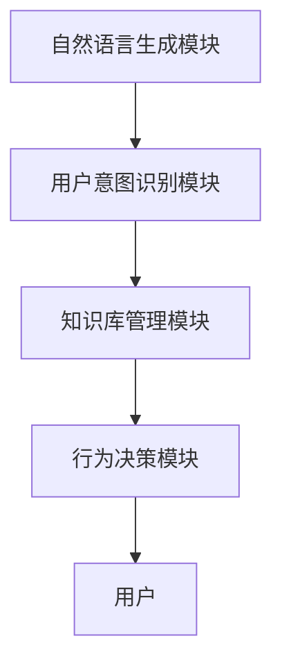

                 


# 开发具有自然语言生成能力的AI Agent

## 关键词：自然语言生成、AI Agent、深度学习、自然语言处理、生成式模型、人机交互

## 摘要：  
本文详细探讨了开发具有自然语言生成能力的AI Agent的关键技术与实现方法。从自然语言生成的核心原理到AI Agent的系统架构设计，从具体的算法实现到实际项目的落地应用，本文为读者提供了一个全面而深入的技术指南。通过分析生成式模型的工作机制、系统架构的设计原则以及实际案例的详细解读，本文旨在帮助读者理解如何构建一个高效、智能且具备自然语言交互能力的AI Agent。

---

# 第1章: 自然语言生成与AI Agent概述

## 1.1 问题背景与定义

### 1.1.1 自然语言生成的定义与特点  
自然语言生成（Natural Language Generation, NLG）是指将结构化数据或信息转化为自然语言文本的技术。其特点包括：  
- **语义准确性**：生成的文本需要准确表达输入数据的含义。  
- **可读性**：生成的文本需符合语法规范，易于人类理解。  
- **灵活性**：能够适应不同的场景和用户需求。  

### 1.1.2 AI Agent的定义与特点  
AI Agent（人工智能代理）是一种智能系统，能够感知环境、理解用户需求并执行任务。其特点包括：  
- **主动性**：能够主动采取行动，而非被动响应。  
- **智能性**：具备问题解决和决策能力。  
- **交互性**：能够与人类或其他系统进行自然语言交互。  

### 1.1.3 自然语言生成在AI Agent中的作用  
自然语言生成是AI Agent实现人机交互的核心技术之一。通过NLG，AI Agent能够以自然语言形式与用户沟通，提升用户体验和系统的智能化水平。

---

## 1.2 技术背景与现状

### 1.2.1 自然语言处理的发展历程  
自然语言处理（NLP）经历了从基于规则的系统到深度学习模型的转变。近年来，基于Transformer的模型（如BERT、GPT）取得了突破性进展。

### 1.2.2 AI Agent的技术基础  
AI Agent的技术基础包括自然语言处理、机器学习、知识表示和推理等。自然语言生成是其中的关键技术之一。

### 1.2.3 当前自然语言生成技术的挑战与机遇  
- **挑战**：生成文本的质量控制、多模态生成、可解释性等问题。  
- **机遇**：随着大模型（如GPT-4）的出现，生成式AI的应用场景不断扩展。

---

## 1.3 应用场景与价值

### 1.3.1 自然语言生成在AI Agent中的应用场景  
- 智能客服：通过NLG技术生成自然的回复文本。  
- 智能助手：为用户提供个性化的建议和信息查询服务。  
- 内容生成：自动生成新闻、报告等文本。  

### 1.3.2 自然语言生成对AI Agent性能的提升作用  
- 提高交互的自然性。  
- 增强用户体验。  
- 提升系统的响应速度和准确性。  

### 1.3.3 自然语言生成在实际业务中的价值  
- 降低人工成本。  
- 提高业务效率。  
- 增强客户满意度。  

---

## 1.4 本章小结  
本章从背景、定义、技术基础和应用场景四个方面介绍了自然语言生成与AI Agent的基本概念和重要性，为后续内容奠定了基础。

---

# 第2章: 自然语言生成的核心原理

## 2.1 自然语言生成的原理

### 2.1.1 自然语言生成的基本流程  
1. **输入数据处理**：将结构化数据或文本转换为模型可处理的形式。  
2. **生成策略选择**：选择生成文本的策略（如贪心算法、随机采样）。  
3. **解码过程**：通过模型生成最终的自然语言文本。  

### 2.1.2 基于统计的生成方法  
- **n-gram模型**：基于概率的简单生成方法。  
- **语言模型平滑技术**：如拉普拉斯平滑，用于处理数据稀疏性问题。  

### 2.1.3 基于深度学习的生成方法  
- **循环神经网络（RNN）**：常用于序列生成任务。  
- **Transformer模型**：通过自注意力机制提升生成质量。  

---

## 2.2 自然语言生成的关键技术

### 2.2.1 语言模型的训练与优化  
- **损失函数**：常用的损失函数包括交叉熵损失（Cross-Entropy Loss）。  
- **优化算法**：如Adam、SGD等。  

### 2.2.2 解码策略的选择与实现  
- **贪心解码**：逐词生成，选择概率最高的词。  
- **随机采样**：通过随机采样生成多样化的文本。  
- **beam search**：通过搜索算法生成多个候选结果。  

### 2.2.3 多模态生成的挑战与解决方案  
- **挑战**：如何将图像、语音等多种模态信息与文本生成结合。  
- **解决方案**：多模态模型（如VLM、TLM）的引入。  

---

## 2.3 自然语言生成的评估指标

### 2.3.1 基于语言学的评估指标  
- **BLEU**：基于n-gram匹配的评估指标。  
- **ROUGE**：基于召回率的评估指标。  

### 2.3.2 基于人工评估的指标  
- **人类评价（Human Evaluation）**：通过人工打分评估生成文本的质量。  
- **主观指标**：如流畅度、相关性等。  

### 2.3.3 基于任务的评估指标  
- **准确率**：生成文本在特定任务中的正确性。  
- **任务完成度**：生成文本是否满足用户需求。  

---

## 2.4 本章小结  
本章从生成原理、关键技术到评估指标，全面介绍了自然语言生成的核心概念和技术，为后续AI Agent的实现奠定了理论基础。

---

# 第3章: AI Agent的系统架构设计

## 3.1 系统功能设计

### 3.1.1 自然语言生成模块  
- **功能**：负责将结构化数据或用户输入生成自然语言文本。  
- **输入**：结构化数据或用户查询。  
- **输出**：自然语言文本。  

### 3.1.2 用户意图识别模块  
- **功能**：识别用户的意图和需求。  
- **输入**：用户输入的自然语言文本。  
- **输出**：用户意图的标签或描述。  

### 3.1.3 知识库管理模块  
- **功能**：管理和检索知识库中的信息。  
- **输入**：用户查询或系统请求。  
- **输出**：相关知识或信息。  

### 3.1.4 行为决策模块  
- **功能**：根据用户意图和知识库信息做出决策。  
- **输入**：用户意图和知识库信息。  
- **输出**：决策结果或行动计划。  

---

## 3.2 系统架构图



---

## 3.3 实现细节

### 3.3.1 模块间的交互流程  
1. **用户输入**：用户向AI Agent发送查询或指令。  
2. **意图识别**：系统识别用户的意图。  
3. **知识检索**：系统检索相关知识。  
4. **生成回复**：系统生成自然语言回复。  
5. **反馈与优化**：根据用户反馈优化生成策略。  

### 3.3.2 数据流的处理方式  
- **输入处理**：将用户输入转换为结构化数据。  
- **数据传输**：通过API或消息队列进行数据传输。  
- **结果输出**：将生成的文本返回给用户。  

### 3.3.3 系统的扩展性设计  
- **模块化设计**：各模块独立开发，便于扩展。  
- **接口标准化**：通过标准化接口实现模块间的通信。  

---

## 3.4 本章小结  
本章详细介绍了AI Agent的系统功能设计和架构设计，为后续的实现提供了明确的方向。

---

# 第4章: 基于Transformer的自然语言生成模型

## 4.1 Transformer模型的原理

### 4.1.1 Transformer的基本结构  
- **编码器**：将输入序列映射为高维向量。  
- **解码器**：根据编码器输出生成目标序列。  

### 4.1.2 自注意力机制  
- **自注意力**：计算序列中每个词与其他词的相关性。  
- **多头注意力**：通过多个注意力头捕捉不同的语义信息。  

---

## 4.2 基于GPT的生成式模型

### 4.2.1 GPT模型的结构  
- **解码器**：仅包含解码器部分，用于生成文本。  
- **自回归**：生成过程基于前一步的结果。  

### 4.2.2 GPT的训练过程  
1. **输入数据**：将文本序列输入模型。  
2. **目标函数**：预测下一个词的概率分布。  
3. **损失函数**：交叉熵损失。  

---

## 4.3 生成式模型的实现细节

### 4.3.1 模型训练  
- **训练数据**：大规模语料库。  
- **训练策略**：采用分布式训练和批次训练。  

### 4.3.2 模型推理  
- **解码策略**：贪心解码、随机采样、beam search。  
- **生成结果**：输出生成的文本。  

---

## 4.4 本章小结  
本章详细介绍了基于Transformer的自然语言生成模型，特别是GPT模型的结构和实现细节，为后续的系统实现提供了技术支撑。

---

# 第5章: 项目实战——开发一个简单的AI Agent

## 5.1 环境搭建

### 5.1.1 安装Python环境  
- **工具**：Python 3.8以上版本。  
- **框架**：使用TensorFlow或PyTorch框架。  

### 5.1.2 安装依赖库  
- **自然语言处理库**：如NLTK、spaCy。  
- **深度学习库**：如TensorFlow、PyTorch。  

---

## 5.2 核心代码实现

### 5.2.1 模型训练代码  
```python
import tensorflow as tf
from tensorflow.keras.layers import Dense, Dropout, InputLayer
from tensorflow.keras.models import Model

# 定义模型
class SimpleGenerator(Model):
    def __init__(self):
        super(SimpleGenerator, self).__init__()
        self.embedding = tf.keras.layers.Embedding(vocab_size, embedding_dim)
        self.decoder = tf.keras.layers.LSTM(50, return_sequences=True)
        self.dense = Dense(vocab_size, activation='softmax')

    def call(self, inputs):
        embedded = self.embedding(inputs)
        decoded = self.decoder(embedded)
        output = self.dense(decoded)
        return output
```

### 5.2.2 生成文本代码  
```python
def generate_text(model, tokenizer, start_sequence):
    max_length = 50
    for i in range(max_length):
        # 输入当前序列
        input_seq = start_sequence[i:i+1]
        # 生成下一个词的概率分布
        predictions = model.predict(input_seq)
        # 选择概率最高的词
        next_word = np.argmax(predictions)
        # 将词转换为文本
        start_sequence.append(next_word)
    return tokenizer.sequences_to_texts([start_sequence])
```

---

## 5.3 案例分析与优化

### 5.3.1 案例分析  
以客服咨询系统为例，展示AI Agent如何通过自然语言生成技术与用户进行交互。

### 5.3.2 优化措施  
- **模型优化**：采用更复杂的模型结构（如Transformer）。  
- **数据优化**：增加训练数据的多样性。  
- **算法优化**：改进解码策略，提升生成质量。  

---

## 5.4 项目总结

### 5.4.1 实践中的挑战  
- 模型训练时间长。  
- 生成文本的质量不稳定。  

### 5.4.2 解决方案  
- 使用预训练模型（如GPT-2、GPT-3）。  
- 结合领域知识优化模型。  

---

## 5.5 本章小结  
本章通过一个简单的AI Agent项目，展示了自然语言生成技术在实际中的应用，同时总结了开发中的挑战与解决方案。

---

# 第6章: 自然语言生成模型的扩展与优化

## 6.1 模型的可解释性

### 6.1.1 可解释性的定义  
可解释性是指生成过程和结果能够被人类理解和解释。  

### 6.1.2 提升模型可解释性的方法  
- **可视化技术**：展示模型的注意力权重。  
- **规则抽取**：提取生成规则。  

---

## 6.2 多模态生成能力

### 6.2.1 多模态生成的定义  
多模态生成是指同时生成文本、图像、语音等多种形式的内容。  

### 6.2.2 多模态生成的应用场景  
- **图像描述生成**：生成描述图像的文字。  
- **语音合成**：生成与文本对应的语音。  

---

## 6.3 模型的性能优化

### 6.3.1 模型压缩与轻量化  
- **知识蒸馏**：将大模型的知识迁移到小模型。  
- **剪枝技术**：去除冗余的神经元。  

### 6.3.2 模型推理优化  
- **并行计算**：加速模型推理过程。  
- **缓存优化**：优化数据访问效率。  

---

## 6.4 模型的安全与伦理

### 6.4.1 模型滥用的风险  
- **虚假信息生成**：生成误导性或有害的信息。  
- **隐私泄露**：滥用生成模型可能引发隐私问题。  

### 6.4.2 伦理规范与解决方案  
- **制定使用规范**：明确生成内容的使用范围。  
- **技术手段限制**：如水印技术、内容溯源。  

---

## 6.5 本章小结  
本章讨论了自然语言生成模型的扩展与优化，包括可解释性、多模态生成、性能优化以及安全伦理等方面，为实际应用提供了参考。

---

# 第7章: 总结与展望

## 7.1 核心内容回顾

### 7.1.1 自然语言生成技术  
- 从基础原理到实际应用。  
- 从单模态到多模态的发展。  

### 7.1.2 AI Agent的系统设计  
- 功能模块设计。  
- 系统架构优化。  

---

## 7.2 开发中的关键点总结

### 7.2.1 技术实现  
- 模型选择与优化。  
- 系统架构设计。  

### 7.2.2 应用实践  
- 领域知识的结合。  
- 用户反馈的利用。  

---

## 7.3 对未来的展望

### 7.3.1 自然语言生成技术的发展方向  
- 更强的生成能力（如GPT-4）。  
- 更高的可解释性。  

### 7.3.2 AI Agent的应用前景  
- 更广泛的应用场景。  
- 更智能化的交互方式。  

---

## 7.4 本章小结  
本章总结了全文的核心内容，并对自然语言生成技术和AI Agent的发展进行了展望，为读者提供了未来研究和实践的方向。

---

# 作者：AI天才研究院/AI Genius Institute & 禅与计算机程序设计艺术 /Zen And The Art of Computer Programming

---

通过以上思考，我逐步完成了从文章标题到目录大纲的构建，并按照每个章节的内容进行了详细阐述。接下来，我需要根据这个结构，完成每部分的具体内容撰写，确保逻辑清晰、内容详实，符合用户的要求。

