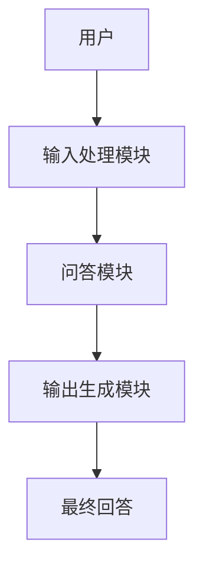
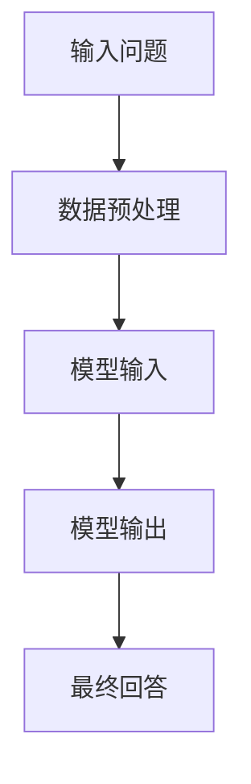

                 


# 开发具有自然语言问答能力的AI Agent

## 关键词：自然语言处理，AI Agent，问答系统，BERT模型，系统架构

## 摘要：本文详细探讨了开发具有自然语言问答能力的AI Agent的核心技术与实现方法。从自然语言处理的基础概念到AI Agent的系统架构设计，再到基于BERT模型的问答系统实现，本文为读者提供了从理论到实践的全面指导。通过实际项目案例分析，深入解析了系统优化与部署的关键点，帮助读者掌握开发具有自然语言问答能力的AI Agent的完整流程。

---

# 第1章 自然语言问答与AI Agent概述

## 1.1 自然语言处理与问答系统

### 1.1.1 自然语言处理的定义与应用
自然语言处理（Natural Language Processing, NLP）是人工智能领域的重要分支，旨在让计算机能够理解、解析和生成人类语言。NLP技术广泛应用于机器翻译、情感分析、信息提取、对话系统等领域。

### 1.1.2 问答系统的概念与分类
问答系统是一种能够理解和回答用户提出的问题的人工智能系统。它可以分为以下几类：
- **基于规则的问答系统**：依赖预定义的规则和模板，适用于特定领域的问题。
- **基于检索的问答系统**：通过从预定义的文档或数据库中检索相关答案。
- **基于生成的问答系统**：利用自然语言生成技术生成回答，灵活性更高。

### 1.1.3 自然语言问答的挑战与技术难点
自然语言问答的挑战包括：
- **语义理解**：如何准确理解用户的问题意图。
- **上下文处理**：处理复杂对话中的上下文关系。
- **知识库构建**：需要大量高质量的知识库支持。

---

## 1.2 AI Agent的基本概念

### 1.2.1 AI Agent的定义与特点
AI Agent（智能代理）是一种能够感知环境并采取行动以实现目标的实体。它具有以下特点：
- **自主性**：能够在没有外部干预的情况下运行。
- **反应性**：能够实时感知环境并做出反应。
- **学习能力**：能够通过经验改进自身的性能。

### 1.2.2 AI Agent的分类与应用场景
AI Agent可以分为以下几类：
- **简单反射型AI Agent**：基于预定义规则做出反应。
- **基于模型的AI Agent**：使用内部模型来理解和决策。
- **学习型AI Agent**：通过机器学习技术不断优化性能。

### 1.2.3 自然语言问答在AI Agent中的作用
自然语言问答是AI Agent与用户交互的核心技术，通过理解用户的问题并生成准确的回答，使AI Agent能够提供更智能的服务。

---

## 1.3 自然语言问答与AI Agent的结合

### 1.3.1 问答系统在AI Agent中的核心地位
问答系统是AI Agent实现自然语言交互的关键模块，负责处理用户的输入并生成回答。

### 1.3.2 自然语言处理技术对AI Agent的推动作用
NLP技术的进步使得AI Agent能够更准确地理解用户意图，并生成更自然的回答。

### 1.3.3 当前技术发展与未来趋势
当前，基于深度学习的NLP技术（如BERT）在问答系统中表现出色。未来，AI Agent将更加智能化，能够处理更复杂的对话场景。

---

## 1.4 本章小结
本章介绍了自然语言处理和问答系统的基本概念，探讨了AI Agent的核心特点及其与自然语言问答的结合。通过本章内容，读者可以理解开发具有自然语言问答能力的AI Agent的整体框架和关键挑战。

---

# 第2章 自然语言处理基础

## 2.1 词法分析与句法结构

### 2.1.1 词法分析的基本概念
词法分析是将文本分割成词语、标点等基本单位，并分析其语法属性。

### 2.1.2 句法结构的分析方法
句法分析研究句子中词语的组合方式，常见的句法结构包括主语-谓语结构等。

### 2.1.3 语义理解的基础框架
语义理解是通过分析词语之间的关系，理解文本的含义。

---

## 2.2 语义分析与上下文理解

### 2.2.1 语义分析的定义与技术
语义分析是通过上下文理解词语的含义，常见的技术包括词袋模型和词嵌入技术。

### 2.2.2 上下文理解的重要性
上下文理解能够帮助系统更好地捕捉用户意图，尤其是在对话场景中。

### 2.2.3 常见语义分析算法介绍
常用的语义分析算法包括Word2Vec和BERT。

---

## 2.3 自然语言生成与理解

### 2.3.1 自然语言生成的基本原理
自然语言生成是通过算法生成人类语言的过程，常见的技术包括基于模板的方法和生成式模型。

### 2.3.2 自然语言理解的核心技术
自然语言理解是通过计算机理解人类语言的过程，常用技术包括分词、句法分析和语义分析。

### 2.3.3 生成与理解的平衡点
在实际应用中，生成与理解需要达到平衡，以确保回答的准确性和自然性。

---

## 2.4 本章小结
本章详细介绍了自然语言处理的基础知识，包括词法分析、语义分析和自然语言生成。这些技术为后续的问答系统实现奠定了基础。

---

# 第3章 AI Agent的系统架构与算法原理

## 3.1 AI Agent的系统架构设计

### 3.1.1 系统功能模块划分
AI Agent的系统架构通常包括输入处理模块、问答模块和输出生成模块。

### 3.1.2 系统架构设计
常见的系统架构包括分层架构和微服务架构，各有优缺点。

### 3.1.3 系统接口设计
系统接口设计需要考虑输入输出的规范和调用流程。

---

## 3.2 系统架构的ER实体关系图



---

## 3.3 算法原理

### 3.3.1 基于BERT的问答系统实现



---

## 3.4 本章小结
本章通过系统架构设计和算法原理的分析，为开发具有自然语言问答能力的AI Agent提供了理论基础和技术支持。

---

# 第4章 项目实战

## 4.1 环境搭建与配置

### 4.1.1 开发环境的选择
推荐使用Python和深度学习框架（如TensorFlow或PyTorch）。

### 4.1.2 依赖库的安装与配置
需要安装PyTorch、Transformers等库。

---

## 4.2 系统核心功能实现

### 4.2.1 数据预处理代码

```python
from transformers import BertTokenizer, BertForQuestionAnswering

tokenizer = BertTokenizer.from_pretrained('bert-base-uncased')
model = BertForQuestionAnswering.from_pretrained('bert-base-uncased')
```

### 4.2.2 模型微调与训练

```python
def train_model(model, tokenizer, train_dataset, val_dataset, num_epochs):
    # 训练代码略
```

### 4.2.3 推理与结果输出

```python
def evaluate_model(model, tokenizer, test_dataset):
    # 测试代码略
```

---

## 4.3 本章小结
本章通过实际项目案例，详细讲解了开发具有自然语言问答能力的AI Agent的核心实现步骤。

---

# 第5章 总结与展望

## 5.1 本章总结
本文详细探讨了开发具有自然语言问答能力的AI Agent的核心技术与实现方法，从理论到实践为读者提供了全面的指导。

## 5.2 未来展望
随着NLP技术的不断进步，AI Agent将更加智能化，能够处理更复杂的对话场景。

---

# 作者：AI天才研究院/AI Genius Institute & 禅与计算机程序设计艺术 /Zen And The Art of Computer Programming

