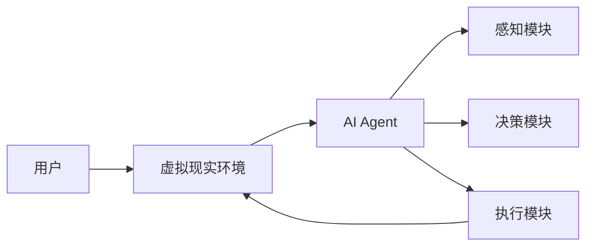

                 


# 开发具有虚拟现实交互能力的AI Agent

## 关键词：AI Agent, 虚拟现实交互, 多模态数据, 强化学习, 实时反馈, 系统架构设计

## 摘要：本文将详细介绍如何开发具有虚拟现实交互能力的AI Agent。首先，我们将从AI Agent和虚拟现实交互的基本概念入手，探讨它们的结合方式及其在实际应用中的潜力。接着，我们将深入分析AI Agent与虚拟现实交互的核心算法，包括多模态数据处理、实时交互和自主学习等关键算法。然后，我们将从系统架构设计的角度，详细讲解AI Agent与虚拟现实交互系统的功能模块、架构设计以及接口设计。最后，我们将通过一个实际项目案例，展示如何将理论应用于实践，并总结开发过程中的一些经验和最佳实践。

---

# 第1章：AI Agent与虚拟现实交互概述

## 1.1 AI Agent的基本概念

### 1.1.1 AI Agent的定义与特点
AI Agent（人工智能代理）是一种智能体，能够在特定环境中感知状态、做出决策并执行动作，以实现预定目标。AI Agent的特点包括自主性、反应性、目标导向性和社会性。

- **自主性**：AI Agent能够在没有外部干预的情况下独立运行。
- **反应性**：AI Agent能够实时感知环境变化并做出相应的反应。
- **目标导向性**：AI Agent的所有行为都围绕着实现特定目标展开。
- **社会性**：AI Agent能够与其他AI Agent或人类进行交互和协作。

### 1.1.2 虚拟现实交互的基本概念
虚拟现实（Virtual Reality，VR）是一种能够提供沉浸式体验的技术，通过计算机生成的三维环境，让用户与虚拟世界进行交互。虚拟现实交互的核心在于让用户能够通过自然的方式与虚拟环境中的对象进行互动。

### 1.1.3 AI Agent与虚拟现实交互的结合
AI Agent与虚拟现实交互的结合，意味着AI Agent能够通过虚拟现实环境与用户进行交互。这种结合使得AI Agent不仅能够理解用户的意图，还能通过虚拟环境中的物体、场景或角色与用户进行更自然的互动。

---

## 1.2 开发AI Agent的背景与意义

### 1.2.1 当前AI Agent的发展现状
AI Agent技术近年来取得了显著进展，尤其是在自然语言处理、计算机视觉和强化学习等领域。AI Agent已经在智能家居、自动驾驶、智能助手等领域得到了广泛应用。

### 1.2.2 虚拟现实技术的快速发展
虚拟现实技术的进步为用户提供了更沉浸式的体验，使得虚拟现实应用在游戏、教育、医疗和工业设计等领域得到了广泛应用。

### 1.2.3 AI Agent在虚拟现实中的应用前景
将AI Agent与虚拟现实技术结合，可以为用户提供更加智能化和个性化的虚拟现实体验。例如，在虚拟现实教育中，AI Agent可以作为虚拟教师，为用户提供个性化的学习指导；在虚拟现实游戏中，AI Agent可以作为智能NPC，提供更加丰富的游戏体验。

---

## 1.3 本书的核心目标与内容框架

### 1.3.1 本书的核心目标
本书的核心目标是帮助读者理解如何开发具有虚拟现实交互能力的AI Agent，涵盖从理论到实践的各个方面，包括AI Agent的核心原理、虚拟现实交互的技术细节、算法实现以及系统架构设计。

### 1.3.2 本书的主要内容框架
1. **AI Agent与虚拟现实交互的核心概念**
2. **AI Agent与虚拟现实交互的核心算法**
3. **AI Agent与虚拟现实交互的系统架构设计**
4. **AI Agent与虚拟现实交互的项目实战**
5. **AI Agent与虚拟现实交互的最佳实践**

### 1.3.3 本书的适用读者群体
本书适用于对AI Agent和虚拟现实交互技术感兴趣的读者，包括计算机科学领域的学生、研究人员、软件开发人员以及对虚拟现实技术感兴趣的爱好者。

---

# 第2章：AI Agent与虚拟现实交互的核心概念

## 2.1 AI Agent的核心原理

### 2.1.1 AI Agent的感知、决策与执行机制
AI Agent的核心机制包括感知、决策和执行三个阶段：
1. **感知**：AI Agent通过传感器或数据输入接口获取环境信息。
2. **决策**：AI Agent基于感知信息和内部知识库，通过算法计算出最优动作。
3. **执行**：AI Agent将决策结果转化为实际动作，例如发送指令或执行操作。

### 2.1.2 基于多模态数据的交互方式
AI Agent可以通过多种模态的数据（如文本、语音、图像、视频等）与用户进行交互。多模态数据的融合可以提高AI Agent的理解能力和交互体验。

### 2.1.3 AI Agent的自主学习与进化能力
AI Agent可以通过强化学习、监督学习和无监督学习等方法实现自主学习和进化。通过不断的学习，AI Agent可以提高其在复杂环境中的适应能力和决策能力。

---

## 2.2 虚拟现实交互的核心原理

### 2.2.1 虚拟现实中的交互方式
虚拟现实交互方式包括：
- **手部追踪**：通过追踪用户的手部动作实现虚拟物体的操作。
- **眼球追踪**：通过追踪用户眼球的运动实现虚拟物体的交互。
- **语音交互**：通过语音识别技术实现用户与虚拟环境的交互。

### 2.2.2 虚拟现实中的实时反馈机制
实时反馈机制是虚拟现实交互的核心，用户在虚拟环境中进行操作时，系统会立即反馈操作结果，使得用户能够获得沉浸式的体验。

### 2.2.3 虚拟现实中的用户行为分析
通过分析用户的交互行为，可以进一步优化虚拟现实交互的设计，提高用户体验。

---

## 2.3 AI Agent与虚拟现实交互的结合

### 2.3.1 AI Agent在虚拟现实中的角色定位
AI Agent在虚拟现实中的角色可以是：
- **虚拟助手**：为用户提供信息查询、任务执行等服务。
- **虚拟角色**：作为虚拟世界中的角色，与用户进行互动。
- **虚拟教练**：为用户提供学习指导和训练支持。

### 2.3.2 虚拟现实交互对AI Agent能力的提升
虚拟现实交互为AI Agent提供了更加丰富和直观的交互方式，使得AI Agent能够更好地理解用户的需求，并提供更个性化的服务。

### 2.3.3 AI Agent与虚拟现实交互的协同优化
通过AI Agent与虚拟现实交互的协同优化，可以进一步提升用户体验和系统性能。例如，AI Agent可以通过分析用户的交互行为，优化虚拟环境中的物体布局和交互逻辑。

---

# 第3章：AI Agent与虚拟现实交互的核心算法

## 3.1 多模态数据处理算法

### 3.1.1 多模态数据融合的原理
多模态数据融合的原理是将来自不同模态的数据（如文本、语音、图像等）进行融合，以提高数据的理解能力。

### 3.1.2 基于深度学习的多模态数据处理
基于深度学习的多模态数据处理方法包括：
- **多模态编码器-解码器模型**：将多模态数据编码为共同的表示，然后解码为目标输出。
- **注意力机制**：通过注意力机制，模型可以关注输入数据中的重要部分。

### 3.1.3 多模态数据处理的典型算法实现
以下是一个基于多模态数据处理的算法实现示例：

```python
import torch
import torch.nn as nn

class MultiModalEncoder(nn.Module):
    def __init__(self, input_size, hidden_size):
        super(MultiModalEncoder, self).__init__()
        self.encoder = nn.LSTM(input_size, hidden_size, batch_first=True)
    
    def forward(self, input):
        output, _ = self.encoder(input)
        return output

class MultiModalDecoder(nn.Module):
    def __init__(self, hidden_size, output_size):
        super(MultiModalDecoder, self).__init__()
        self.decoder = nn.LSTM(hidden_size, output_size, batch_first=True)
    
    def forward(self, input):
        output, _ = self.decoder(input)
        return output
```

---

## 3.2 虚拟现实中的实时交互算法

### 3.2.1 实时交互的核心算法
实时交互的核心算法包括：
- **姿态估计**：通过计算机视觉技术估计用户的姿态。
- **手势识别**：通过机器学习算法识别用户的手势。

### 3.2.2 基于强化学习的交互优化
基于强化学习的交互优化方法包括：
- **奖励机制**：通过奖励机制，引导AI Agent做出最优动作。
- **策略优化**：通过策略优化算法，提高AI Agent的决策能力。

### 3.2.3 实时交互算法的实现与优化
以下是一个基于强化学习的实时交互算法实现示例：

```python
import torch
import torch.nn as nn

class DQN(nn.Module):
    def __init__(self, input_size, output_size):
        super(DQN, self).__init__()
        self.fc1 = nn.Linear(input_size, 64)
        self.fc2 = nn.Linear(64, output_size)
    
    def forward(self, x):
        x = torch.relu(self.fc1(x))
        x = self.fc2(x)
        return x
```

---

## 3.3 AI Agent的自主学习与进化算法

### 3.3.1 基于强化学习的自主学习
基于强化学习的自主学习方法包括：
- **Q-learning算法**：通过Q-learning算法，AI Agent可以在未知环境中学习最优策略。
- **Deep Q-Networks (DQN)**：通过深度神经网络实现Q-learning算法，提高学习效率。

### 3.3.2 进化算法在AI Agent中的应用
进化算法在AI Agent中的应用包括：
- **遗传算法**：通过遗传算法优化AI Agent的参数。
- **进化策略**：通过进化策略算法，提高AI Agent的适应能力。

### 3.3.3 自主学习与进化的协同优化
通过自主学习与进化的协同优化，可以进一步提高AI Agent的学习效率和适应能力。例如，通过遗传算法优化DQN算法的参数，可以提高AI Agent在复杂环境中的表现。

---

# 第4章：AI Agent与虚拟现实交互的系统架构设计

## 4.1 系统功能设计

### 4.1.1 系统功能模块划分
AI Agent与虚拟现实交互系统的功能模块包括：
- **感知模块**：负责获取环境信息。
- **决策模块**：负责做出决策。
- **执行模块**：负责执行决策。
- **交互模块**：负责与用户进行交互。

### 4.1.2 各功能模块的实现
以下是一个简单的功能模块实现示例：

```python
class Agent:
    def __init__(self):
        self.perception = PerceptionModule()
        self.decision = DecisionModule()
        self.execution = ExecutionModule()
    
    def process(self, input):
        state = self.perception.process(input)
        action = self.decision.process(state)
        output = self.execution.process(action)
        return output
```

---

## 4.2 系统架构设计

### 4.2.1 系统架构图
以下是一个AI Agent与虚拟现实交互系统的架构图：



### 4.2.2 系统接口设计
系统接口设计包括：
- **输入接口**：负责接收用户的输入。
- **输出接口**：负责输出系统的响应。
- **交互接口**：负责与虚拟现实环境进行交互。

### 4.2.3 系统交互设计
系统交互设计包括：
- **用户输入**：用户通过虚拟现实设备输入操作。
- **系统响应**：系统根据用户的输入做出响应。
- **实时反馈**：系统通过虚拟现实环境实时反馈用户的操作结果。

---

## 4.3 系统接口设计

### 4.3.1 系统接口的设计原则
系统接口的设计原则包括：
- **简洁性**：接口设计应尽可能简洁，便于集成和维护。
- **可扩展性**：接口设计应具有良好的可扩展性，便于未来的功能扩展。
- **可靠性**：接口设计应具有高度的可靠性，确保系统的稳定运行。

### 4.3.2 系统接口的具体实现
以下是一个系统接口的具体实现示例：

```python
class AgentInterface:
    def __init__(self):
        self.agent = Agent()
    
    def process_input(self, input):
        return self.agent.process(input)
    
    def process_output(self, output):
        return output
```

---

## 4.4 系统交互设计

### 4.4.1 系统交互流程
系统交互流程包括：
1. 用户通过虚拟现实设备输入操作。
2. 系统接收用户的输入并进行处理。
3. 系统根据处理结果生成输出。
4. 系统通过虚拟现实环境实时反馈用户的操作结果。

### 4.4.2 系统交互的优化
系统交互的优化包括：
- **减少延迟**：通过优化系统处理流程，减少用户的等待时间。
- **提高反馈精度**：通过提高系统的反馈精度，增强用户的操作体验。
- **增强沉浸感**：通过优化虚拟现实环境的视觉和听觉效果，增强用户的沉浸感。

---

# 第5章：AI Agent与虚拟现实交互的项目实战

## 5.1 项目环境配置

### 5.1.1 开发工具的选择
开发工具的选择包括：
- **编程语言**：Python
- **深度学习框架**：TensorFlow或PyTorch
- **虚拟现实开发平台**：Unity或Unreal Engine

### 5.1.2 硬件设备的要求
硬件设备的要求包括：
- **CPU**：支持多线程的处理器。
- **GPU**：支持CUDA加速的显卡。
- **虚拟现实设备**：如Oculus Rift或HTC Vive。

---

## 5.2 核心代码实现

### 5.2.1 AI Agent的核心实现
以下是一个AI Agent的核心实现示例：

```python
class AI

