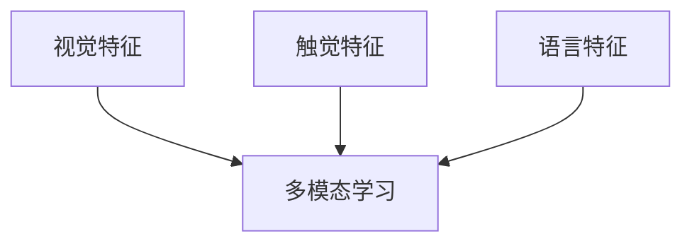
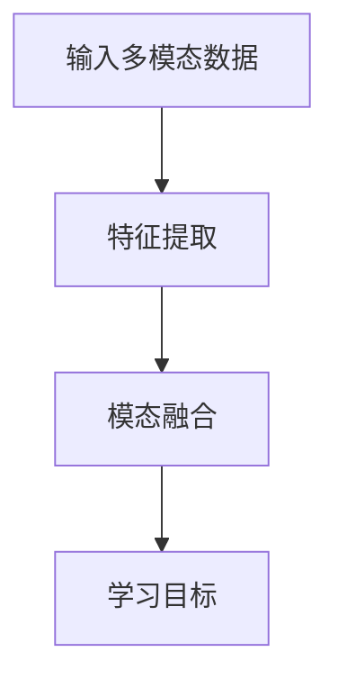
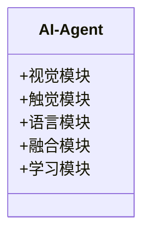
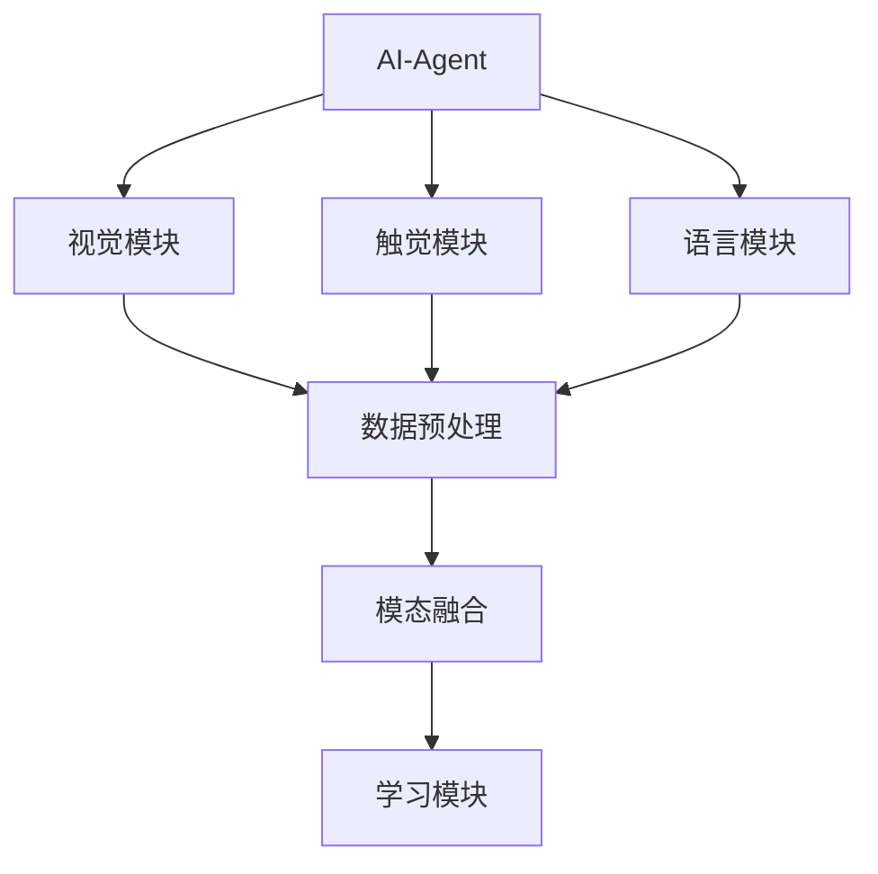
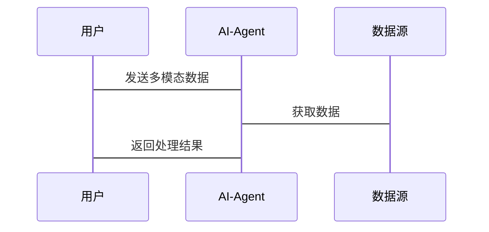

                 


# 开发具有视觉-触觉-语言多模态学习能力的AI Agent

> 关键词：多模态学习，AI Agent，视觉，触觉，语言，深度学习，神经网络

> 摘要：本文系统地探讨了开发具有视觉、触觉和语言多模态学习能力的AI Agent的关键技术与方法。从问题背景、核心概念、算法原理到系统架构、项目实战，全面分析了多模态学习的实现路径与应用前景。通过详细的数学模型、代码实现和案例分析，深入剖析了多模态学习在AI Agent中的应用价值与技术挑战。

---

# 第一部分: 开发具有视觉-触觉-语言多模态学习能力的AI Agent背景介绍

## 第1章: 问题背景与核心概念

### 1.1 多模态学习的背景与意义

#### 1.1.1 从单模态到多模态的演进
现代人工智能技术的进步，使得AI Agent不再局限于单一的输入方式（如仅依赖视觉或仅依赖语言），而是需要整合多种模态的数据以提高学习能力和交互能力。从单模态到多模态的演进，不仅是技术发展的必然趋势，也是解决实际问题的重要手段。

#### 1.1.2 多模态学习的核心价值
多模态学习能够通过整合多种感官数据，提升AI Agent的理解能力、推理能力和决策能力。例如，视觉信息可以帮助AI Agent识别物体的形状和颜色，触觉信息可以提供物体的质地和温度，而语言信息则可以用于与人类进行自然交互。

#### 1.1.3 AI Agent在多模态学习中的角色
AI Agent作为多模态学习的主体，需要能够处理和理解来自不同模态的数据，并通过这些数据进行学习和推理，从而实现更智能的决策和行动。

### 1.2 多模态学习的定义与特点

#### 1.2.1 多模态学习的定义
多模态学习是指通过整合来自多种感官（如视觉、触觉、听觉、语言等）的数据，进行学习和推理的过程。与单模态学习相比，多模态学习能够更好地模拟人类的学习方式，从而提高AI系统的智能水平。

#### 1.2.2 多模态学习的核心特点
1. **数据的多样性**：整合了来自不同模态的数据。
2. **模态间的互补性**：不同模态的数据可以相互补充，提高学习效果。
3. **学习的复杂性**：需要处理不同类型的数据，算法设计更具挑战性。

#### 1.2.3 多模态学习与单模态学习的区别
| 特性 | 单模态学习 | 多模态学习 |
|------|------------|------------|
| 数据来源 | 单一模态 | 多种模态 |
| 数据类型 | 同一类型 | 多种类型 |
| 学习目标 | 简单任务 | 复杂任务 |
| 算法设计 | 简单 | 复杂 |

### 1.3 多模态学习的边界与外延

#### 1.3.1 多模态学习的边界
多模态学习的边界主要在于模态的数量和类型。通常，我们讨论的多模态学习至少涉及两种不同的模态数据。

#### 1.3.2 多模态学习的外延
多模态学习的外延包括如何处理不同类型的数据、如何实现模态间的融合，以及如何在不同场景下应用多模态学习技术。

#### 1.3.3 多模态学习与其他技术的关系
多模态学习与分布式学习、自监督学习等技术密切相关，同时也依赖于自然语言处理（NLP）、计算机视觉（CV）等领域的技术支持。

### 1.4 多模态学习的核心要素组成

#### 1.4.1 数据来源的多样性
多模态学习的核心在于整合来自不同模态的数据，如视觉数据（图像、视频）、触觉数据（力反馈、温度）、语言数据（文本、语音）等。

#### 1.4.2 模态融合的方式
模态融合的方式包括：
1. **早期融合**：在特征提取阶段进行融合。
2. **晚期融合**：在高层语义表示阶段进行融合。
3. **混合融合**：结合早期和晚期融合的方式。

#### 1.4.3 学习目标的统一性
多模态学习的目标通常是统一的，例如，通过多模态数据进行物体识别、场景理解或人机交互。

---

## 第2章: 多模态学习的核心概念与联系

### 2.1 多模态学习的核心概念原理

#### 2.1.1 视觉、触觉、语言的模态特征

| 模态 | 特征 | 数据类型 | 示例 |
|------|------|----------|------|
| 视觉 | 图像、颜色、形状 | 图像、视频 | 图像分类、目标检测 |
| 触觉 | 力反馈、温度、质地 | 力反馈数据 | 物体识别、表面检测 |
| 语言 | 文本、语音 | 文本、语音 | 机器翻译、语音识别 |

#### 2.1.2 模态间的关系与依赖
模态间的关系可以通过以下几种方式表现：
1. **互补性**：不同模态的数据可以提供不同的信息，共同完成任务。
2. **冗余性**：某些信息在不同模态中可能存在冗余，但可以通过多模态数据提高鲁棒性。
3. **关联性**：某些任务需要依赖多个模态的数据，例如，视觉和语言模态可以用于图像描述生成。

#### 2.1.3 多模态学习的数学模型
多模态学习的数学模型通常需要将不同模态的数据映射到一个共同的表示空间。例如，视觉特征和语言特征可以通过一个共享的潜在空间进行融合。

### 2.2 模态特征对比分析

#### 2.2.1 视觉特征的表征方式
视觉特征的表征方式包括：
1. **图像特征**：通过卷积神经网络（CNN）提取。
2. **视频特征**：通过3D CNN或Transformer提取。

#### 2.2.2 触觉特征的表征方式
触觉特征的表征方式包括：
1. **力反馈特征**：通过力传感器采集。
2. **表面特征**：通过触觉传感器采集物体的质地和温度。

#### 2.2.3 语言特征的表征方式
语言特征的表征方式包括：
1. **文本特征**：通过词嵌入（如Word2Vec、BERT）提取。
2. **语音特征**：通过MFCC或其他语音特征提取方法提取。

### 2.3 模态间关系的ER实体关系图



---

## 第3章: 多模态学习的算法原理

### 3.1 多模态融合的算法原理

#### 3.1.1 多模态数据的表示方法
多模态数据的表示方法包括：
1. **向量表示**：将不同模态的数据映射为向量。
2. **图表示**：将多模态数据表示为图结构。

#### 3.1.2 多模态数据的融合方式
多模态数据的融合方式包括：
1. **加性融合**：直接将不同模态的特征向量相加。
2. **乘性融合**：将不同模态的特征向量相乘。
3. **注意力融合**：通过自注意力机制进行融合。

#### 3.1.3 多模态数据的联合学习
多模态数据的联合学习通常采用端到端的深度学习框架，例如，通过多模态Transformer进行联合编码。

### 3.2 多模态Transformer模型

#### 3.2.1 Transformer模型的基本原理
Transformer模型由编码器和解码器组成，通过自注意力机制和前馈网络进行特征提取。

#### 3.2.2 多模态Transformer的扩展
多模态Transformer的扩展方式包括：
1. **多模态编码器**：将不同模态的数据分别编码，然后进行融合。
2. **跨模态注意力**：在解码器中引入跨模态的注意力机制。

#### 3.2.3 多模态Transformer的应用场景
多模态Transformer广泛应用于图像描述生成、视觉问答、多模态对话生成等任务。

### 3.3 多模态学习的算法流程图



---

## 第4章: 多模态学习的数学模型与公式

### 4.1 多模态融合的数学模型

#### 4.1.1 模态融合的基本公式
假设我们有两个模态的特征表示 \( x_1 \) 和 \( x_2 \)，我们可以将它们进行融合：

$$ f(x_1, x_2) = W x_1 + U x_2 + b $$

其中，\( W \) 和 \( U \) 是参数矩阵，\( b \) 是偏置项。

#### 4.1.2 多模态Transformer的融合公式
多模态Transformer的融合公式可以表示为：

$$ \text{Attention}(Q, K, V) = \text{softmax}(\frac{QK^T}{\sqrt{d_k}})V $$

其中，\( Q \) 是查询向量，\( K \) 是键向量，\( V \) 是值向量，\( d_k \) 是维度。

### 4.2 多模态学习的损失函数

#### 4.2.1 分类任务的损失函数
对于分类任务，损失函数可以表示为交叉熵损失：

$$ \mathcal{L} = -\sum_{i=1}^n y_i \log p(y_i) $$

其中，\( y_i \) 是真实标签，\( p(y_i) \) 是预测概率。

#### 4.2.2 生成任务的损失函数
对于生成任务，损失函数可以表示为：

$$ \mathcal{L} = \mathbb{E}_{(x,y)}[\text{CE}(x,y)] + \lambda \text{KL}(p,q) $$

其中，\( \text{CE}(x,y) \) 是交叉熵损失，\( \text{KL}(p,q) \) 是KL散度，\( \lambda \) 是调节系数。

---

## 第5章: 多模态学习的系统分析与架构设计

### 5.1 问题场景介绍

#### 5.1.1 开发目标
本章将重点介绍如何设计一个多模态学习的AI Agent系统，使其能够同时处理视觉、触觉和语言数据，并通过这些数据进行学习和推理。

#### 5.1.2 项目介绍
我们假设一个AI Agent需要通过视觉、触觉和语言数据来识别物体，并与人类进行交互。

### 5.2 系统功能设计

#### 5.2.1 领域模型设计
我们可以通过Mermaid图来描述系统的类图。



#### 5.2.2 系统架构设计
我们可以通过Mermaid图来描述系统的架构。



#### 5.2.3 系统接口设计
系统的接口设计需要考虑不同模态数据的输入和输出格式。

#### 5.2.4 系统交互设计
我们可以通过Mermaid图来描述系统的交互流程。



---

## 第6章: 多模态学习的项目实战

### 6.1 环境搭建

#### 6.1.1 开发环境要求
需要安装Python、深度学习框架（如TensorFlow、PyTorch）以及相关的库。

#### 6.1.2 环境搭建步骤
1. 安装Python。
2. 安装深度学习框架。
3. 安装其他依赖库。

### 6.2 系统核心实现

#### 6.2.1 核心代码实现
以下是一个多模态融合的示例代码：

```python
import torch
import torch.nn as nn

class MultiModalFusion(nn.Module):
    def __init__(self, input_dim1, input_dim2, output_dim):
        super().__init__()
        self.fc1 = nn.Linear(input_dim1, output_dim)
        self.fc2 = nn.Linear(input_dim2, output_dim)
        self.relu = nn.ReLU()

    def forward(self, x1, x2):
        x1 = self.fc1(x1)
        x2 = self.fc2(x2)
        x = x1 + x2
        x = self.relu(x)
        return x

model = MultiModalFusion(input_dim1=100, input_dim2=100, output_dim=200)
```

#### 6.2.2 代码应用解读与分析
上述代码定义了一个多模态融合的模块，将两个模态的特征向量进行融合，并通过ReLU激活函数进行非线性变换。

### 6.3 案例分析与详细讲解

#### 6.3.1 案例分析
我们可以通过一个简单的图像分类任务来演示多模态融合的效果。

#### 6.3.2 详细讲解
结合具体案例，详细分析多模态融合的优势和应用场景。

### 6.4 项目小结

#### 6.4.1 项目经验
通过项目实战，我们总结了多模态融合的一些经验，例如如何选择合适的融合方式，如何优化模型的性能等。

#### 6.4.2 项目教训
我们也总结了一些教训，例如模态间数据的不平衡可能会影响模型的性能。

---

## 第7章: 总结与展望

### 7.1 总结

#### 7.1.1 核心内容回顾
本章总结了全文的核心内容，包括多模态学习的背景、核心概念、算法原理、系统架构以及项目实战。

#### 7.1.2 主要结论
多模态学习是实现AI Agent智能化的重要手段，通过整合多种模态的数据，可以显著提高AI系统的理解和推理能力。

### 7.2 展望

#### 7.2.1 技术发展趋势
多模态学习技术未来将朝着更高效、更智能的方向发展。

#### 7.2.2 应用场景扩展
多模态学习技术将在更多领域得到应用，例如智能机器人、自动驾驶、智能医疗等。

### 7.3 最佳实践Tips

#### 7.3.1 注意事项
在实际应用中，需要注意模态数据的平衡性、模型的可解释性以及系统的实时性。

#### 7.3.2 拓展阅读
建议读者进一步阅读相关领域的最新论文和书籍，以深入了解多模态学习的技术细节。

---

# 作者：AI天才研究院/AI Genius Institute & 禅与计算机程序设计艺术 /Zen And The Art of Computer Programming

---

### 注意事项
1. 本文内容仅供参考，实际应用中需根据具体场景调整。
2. 代码示例为简化版，实际应用中需考虑更多的细节和优化。
3. 多模态学习技术仍在快速发展中，建议持续关注相关领域的最新研究。

---

通过以上详细的目录结构，您可以逐步展开每个章节的内容，撰写一篇完整的、逻辑清晰的、技术深度到位的专业技术博客文章。

