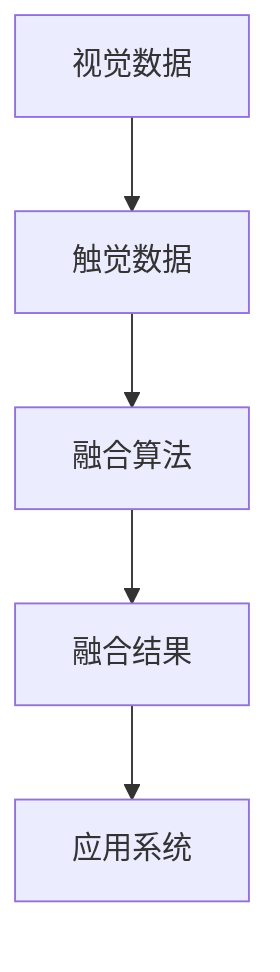
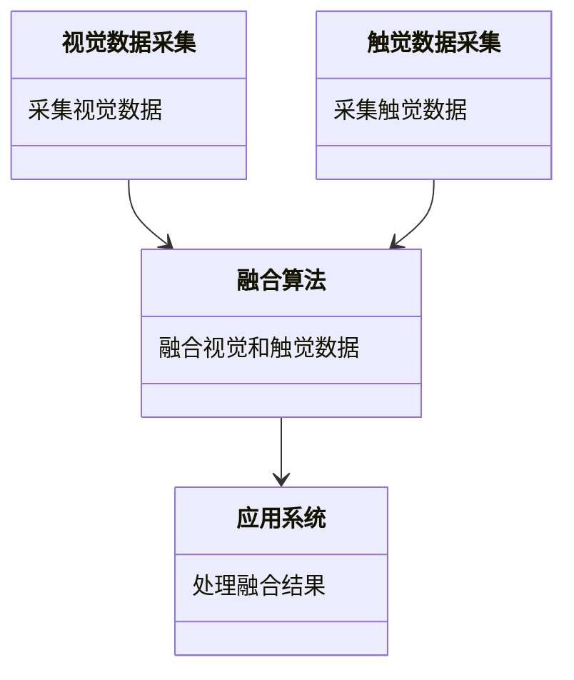
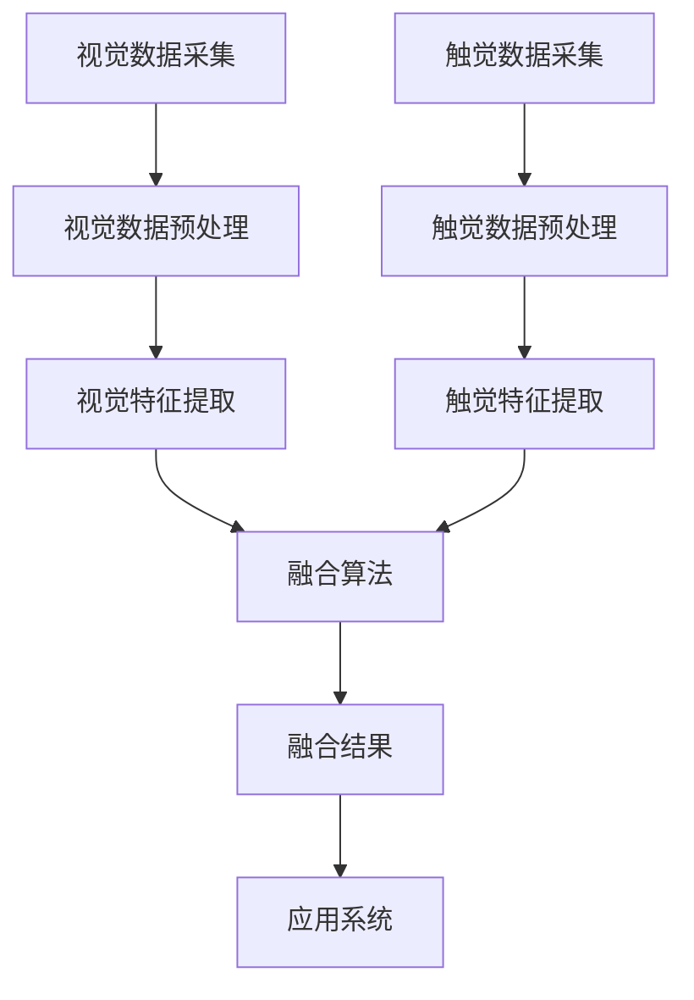
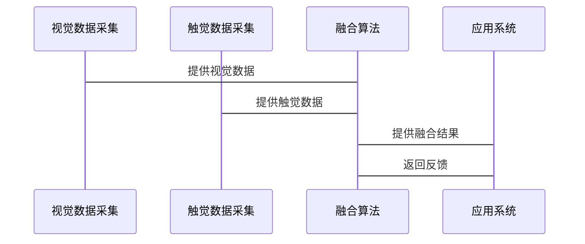

                 


# 开发具有视觉-触觉融合能力的AI Agent

**关键词**：AI Agent, 视觉-触觉融合, 多模态感知, 深度学习, 机器人技术

**摘要**：本文探讨了开发具有视觉-触觉融合能力的AI Agent的关键技术，从背景介绍、核心概念到算法原理、系统架构，再到项目实战和最佳实践，全面解析了如何实现视觉与触觉数据的高效融合，提升AI Agent的感知能力和应用场景的多样性。

---

## 第1章: 背景介绍

### 1.1 问题背景

#### 1.1.1 多模态感知技术的兴起
随着人工智能技术的快速发展，单一模态的数据处理已无法满足复杂场景的需求。多模态感知技术，如视觉、听觉、触觉的结合，成为研究热点。视觉和触觉的结合尤其重要，因为它们提供了物体的形状、材质和物理特性的信息，有助于AI Agent更好地理解环境。

#### 1.1.2 视觉与触觉融合的必要性
AI Agent在现实场景中需要处理复杂的任务，如机器人抓取、医疗手术辅助等。仅依赖视觉信息可能无法获取足够的细节，而触觉信息的加入可以弥补这一不足，提供更全面的感知能力。

#### 1.1.3 当前技术的局限性与挑战
现有技术在视觉和触觉数据的同步处理、实时性和准确性方面存在挑战。如何高效融合两种数据，提取有用的特征，是当前研究的重点。

### 1.2 问题描述

#### 1.2.1 视觉-触觉融合的核心问题
如何将来自不同传感器的数据进行有效融合，提取有用的特征，提升AI Agent的感知能力。

#### 1.2.2 数据融合的难点
视觉和触觉数据具有不同的时空特性，如何对齐和融合这些数据是一个挑战。

#### 1.2.3 应用场景的多样性
视觉-触觉融合技术可以应用于机器人、增强现实、医疗等多个领域，每个领域都有其特定的需求和挑战。

### 1.3 问题解决

#### 1.3.1 多模态数据的整合方法
通过传感器同步、数据预处理和特征提取，将视觉和触觉数据整合到统一的框架中。

#### 1.3.2 融合算法的设计思路
设计基于深度学习的融合模型，利用注意力机制等技术，实现多模态数据的有效融合。

#### 1.3.3 应用场景的实现路径
根据不同应用场景的需求，设计相应的系统架构和算法，确保高效性和准确性。

### 1.4 边界与外延

#### 1.4.1 视觉-触觉融合的边界条件
明确视觉和触觉数据的采集范围和处理方式，确保数据的有效性和一致性。

#### 1.4.2 相关技术的外延扩展
将视觉-触觉融合技术与其他技术，如自然语言处理、运动控制等结合，扩展其应用范围。

#### 1.4.3 与其他技术的协同关系
探讨视觉-触觉融合技术与其他技术的协同关系，如与机器人运动控制、计算机视觉的结合。

### 1.5 核心要素组成

#### 1.5.1 多模态数据的采集与处理
通过多种传感器采集视觉和触觉数据，进行预处理和特征提取，为融合提供基础。

#### 1.5.2 融合算法的设计与实现
设计高效的融合算法，实现多模态数据的有效融合，提升感知能力。

#### 1.5.3 应用场景的实现与优化
根据不同应用场景的需求，设计相应的系统架构和优化策略，确保系统的高效性和准确性。

---

## 第2章: 核心概念与联系

### 2.1 多模态感知技术

#### 2.1.1 多模态数据的定义与特点
多模态数据是指来自不同感知渠道的数据，如视觉、触觉、听觉等。每种模态数据都有其独特的特征和优势。

#### 2.1.2 视觉与触觉数据的特征对比
视觉数据具有高维性和空间性，触觉数据具有实时性和动态性。两者的结合可以互补其不足。

#### 2.1.3 多模态数据融合的原理
通过数据预处理、特征提取和模型融合，将不同模态的数据进行有效结合，提升感知能力。

### 2.2 视觉与触觉数据的融合方法

#### 2.2.1 基于特征融合的方法
将视觉和触觉数据的特征进行融合，通过线性组合或非线性变换提取共同特征。

#### 2.2.2 基于模型融合的方法
构建多个独立的模型分别处理不同模态的数据，然后通过融合层进行综合决策。

#### 2.2.3 基于注意力机制的融合方法
利用注意力机制，动态调整不同模态数据的关注程度，实现自适应融合。

#### 2.2.4 各种融合方法的对比
| 融合方法 | 优缺点 | 适用场景 |
|----------|--------|----------|
| 基于特征融合 | 实现简单，但可能丢失部分信息 | 小型系统 |
| 基于模型融合 | 鲁棒性高，但计算复杂 | 大型系统 |
| 基于注意力机制 | 自适应性强，但需要大量训练数据 | 复杂场景 |

### 2.3 核心概念的ER实体关系图



---

## 第3章: 算法原理讲解

### 3.1 多模态融合算法

#### 3.1.1 基于深度学习的融合方法
利用深度神经网络，将视觉和触觉数据进行多层特征提取和融合。

#### 3.1.2 基于注意力机制的融合模型
通过自注意力机制，动态调整不同模态数据的关注程度，实现自适应融合。

#### 3.1.3 模型训练与优化
使用反向传播和优化器，对模型进行训练和优化，提升融合效果。

#### 3.1.4 模型融合的数学模型
融合模型可以表示为：
$$
f(x) = \sigma(W_v v + W_t t + b)
$$
其中，\(v\) 是视觉特征，\(t\) 是触觉特征，\(W_v\) 和 \(W_t\) 是权重矩阵，\(b\) 是偏置项，\(\sigma\) 是激活函数。

### 3.2 触觉数据处理算法

#### 3.2.1 基于力反馈的触觉数据处理
通过力传感器采集触觉数据，进行预处理和特征提取。

#### 3.2.2 基于神经网络的触觉数据建模
利用神经网络对触觉数据进行建模，提取有用的特征。

#### 3.2.3 触觉数据的融合与优化
将触觉数据与视觉数据进行融合，优化融合效果。

---

## 第4章: 系统分析与架构设计

### 4.1 系统功能设计

#### 4.1.1 领域模型


#### 4.1.2 系统架构设计


#### 4.1.3 接口与交互设计


---

## 第5章: 项目实战

### 5.1 环境安装

#### 5.1.1 安装Python环境
使用Anaconda或virtualenv创建虚拟环境，安装所需的Python版本。

#### 5.1.2 安装依赖库
安装深度学习框架（如TensorFlow、PyTorch）和传感器数据处理库（如OpenCV、NumPy）。

### 5.2 系统核心实现

#### 5.2.1 融合算法实现
```python
import numpy as np
import tensorflow as tf

def fusion_model(v_input, t_input):
    # 视觉特征提取
    v_features = tf.keras.layers.Conv2D(32, (3,3), activation='relu')(v_input)
    v_features = tf.keras.layers.MaxPooling2D((2,2))(v_features)
    
    # 触觉特征提取
    t_features = tf.keras.layers.Conv2D(32, (3,3), activation='relu')(t_input)
    t_features = tf.keras.layers.MaxPooling2D((2,2))(t_features)
    
    # 特征融合
    fused_features = tf.keras.layers.concatenate([v_features, t_features])
    fused_output = tf.keras.layers.Dense(1, activation='sigmoid')(fused_features)
    
    return fused_output
```

#### 5.2.2 触觉数据处理实现
```python
import numpy as np

def process_tactile_data(data):
    # 数据预处理
    processed_data = data.reshape(-1, 100, 100, 1)
    return processed_data
```

#### 5.2.3 视觉数据处理实现
```python
import cv2

def process_visual_data(image):
    # 图像预处理
    resized_image = cv2.resize(image, (224, 224))
    preprocessed_image = resized_image / 255.0
    return preprocessed_image
```

### 5.3 实际案例分析

#### 5.3.1 案例描述
设计一个AI Agent，用于工业机器人抓取。视觉数据用于识别物体位置，触觉数据用于调整抓取力度。

#### 5.3.2 实现步骤
1. 采集视觉和触觉数据。
2. 预处理和特征提取。
3. 使用融合算法进行数据融合。
4. 应用系统进行抓取控制。

#### 5.3.3 案例分析
通过实验验证融合算法的有效性，分析不同融合方法对抓取成功率的影响。

### 5.4 项目小结

#### 5.4.1 项目总结
通过项目实战，验证了视觉-触觉融合算法的有效性，提升了AI Agent的感知能力。

#### 5.4.2 经验与教训
在项目实施过程中，需要注意数据同步、模型训练和系统优化等问题。

---

## 第6章: 最佳实践

### 6.1 小结

#### 6.1.1 核心内容回顾
视觉-触觉融合技术的关键在于数据的采集、处理和融合算法的设计。

#### 6.1.2 重要概念总结
多模态感知、数据融合、注意力机制等概念是实现视觉-触觉融合的核心。

### 6.2 注意事项

#### 6.2.1 开发中的注意事项
1. 确保数据的同步和一致性。
2. 选择合适的融合方法，根据具体场景调整参数。
3. 优化模型的训练和推理效率。

#### 6.2.2 常见问题及解决方案
1. 数据同步问题：通过时间戳对齐数据。
2. 模型训练问题：使用合适的优化器和学习率。

### 6.3 拓展阅读

#### 6.3.1 推荐书籍
1. 《深度学习》——Ian Goodfellow
2. 《计算机视觉：算法与应用》——Richard Szeliski

#### 6.3.2 推荐论文
1. “Multimodal Deep Learning for Vision and Touch Data Fusion” —— CVPR 2022
2. “Attention-Based Fusion of Visual and Tactile Information” —— IROS 2021

---

## 作者

**作者：AI天才研究院 & 禅与计算机程序设计艺术**

---

通过以上详细的内容，我们全面解析了开发具有视觉-触觉融合能力的AI Agent的关键技术，从理论到实践，帮助读者掌握这一前沿领域的核心内容。

