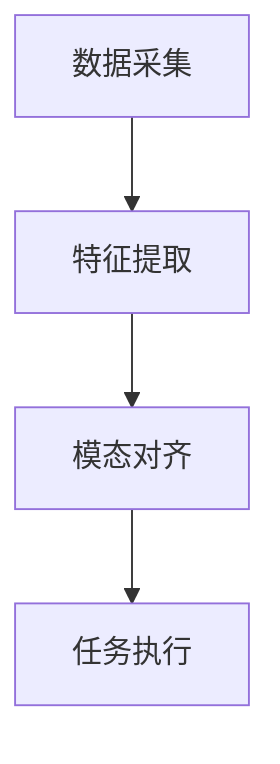

                 


# 开发具有视觉-触觉跨模态学习能力的AI Agent

## 关键词：AI Agent，跨模态学习，视觉模态，触觉模态，多模态融合，机器人，智能系统

## 摘要：本文详细探讨了开发具有视觉-触觉跨模态学习能力的AI Agent的关键技术与实现方法。从跨模态学习的基本概念出发，分析了视觉和触觉模态的原理与技术，介绍了跨模态学习的核心理论与算法，详细讲解了系统架构与实现方案，并通过实际项目案例展示了如何将这些理论应用于实践。文章最后总结了当前研究的不足，并展望了未来的发展方向。

---

# 第一部分: 开发具有视觉-触觉跨模态学习能力的AI Agent概述

## 第1章: AI Agent与跨模态学习概述

### 1.1 AI Agent的基本概念

#### 1.1.1 AI Agent的定义与特点
AI Agent（人工智能代理）是指能够感知环境、自主决策并执行任务的智能实体。它具有以下特点：
- **自主性**：能够在没有外部干预的情况下自主运行。
- **反应性**：能够实时感知环境并做出反应。
- **目标导向**：具备明确的目标，并采取行动以实现这些目标。
- **学习能力**：能够通过经验改进自身的性能。

#### 1.1.2 跨模态学习的基本概念
跨模态学习是指在多个感知模态（如视觉、听觉、触觉等）之间进行信息处理和学习的过程。通过跨模态学习，AI Agent能够综合利用不同模态的信息，提升其理解和决策能力。

#### 1.1.3 视覺-觸覺跨模态学习的背景与重要性
随着人工智能技术的发展，单一模态的学习已难以满足复杂场景的需求。通过结合视觉和触觉信息，AI Agent能够更好地理解环境，做出更准确的决策。例如，在机器人操作中，视觉信息提供了物体的外观，而触觉信息提供了物体的质地和形状，两者结合能够显著提升操作的准确性和灵活性。

### 1.2 跨模态学习的核心问题

#### 1.2.1 跨模态数据的异构性问题
不同模态的数据具有不同的特征和形式。例如，视觉数据通常是高维的图像数据，而触觉数据则是低维的力反馈信号。这种异构性增加了跨模态学习的难度。

#### 1.2.2 跨模态学习的目标与挑战
跨模态学习的目标是通过不同模态的数据相互关联，提升模型的泛化能力和适应性。然而，跨模态学习面临以下挑战：
- **数据对齐问题**：不同模态的数据需要在语义上对齐。
- **信息冗余问题**：某些模态的信息可能在另一模态中已经包含。
- **模型融合问题**：如何有效地融合不同模态的信息是跨模态学习的核心问题。

#### 1.2.3 視覺-觸覺跨模态学习的特殊性
視覺和触觉模态在物理世界中通常是互补的。例如，视觉信息提供了物体的外观，而触觉信息提供了物体的物理特性。这种互补性使得視覺-觸覺跨模态学习在机器人操作和人机交互等领域具有重要的应用价值。

### 1.3 視覺-触覺跨模态学习的应用场景

#### 1.3.1 机器人与自动化
在机器人操作中，視覺和触觉信息的结合能够显著提升操作的精度和安全性。例如，工业机器人可以通过视觉识别物体的位置，并通过触觉反馈调整抓取力度。

#### 1.3.2 虛拟现实与增强现实
在VR/AR应用中，視覺和触觉信息的结合能够提供更真实的用户体验。例如，用户可以通过触觉反馈感受到虚拟物体的质地和形状。

#### 1.3.3 智能交互与人机协作
在人机协作场景中，AI Agent需要通过视觉和触觉信息与人类进行有效互动。例如，在医疗手术中，机器人可以通过视觉和触觉信息辅助医生进行精确的操作。

### 1.4 本章小结
本章介绍了AI Agent的基本概念和跨模态学习的核心问题，分析了視覺-觸覺跨模态学习的重要性和应用场景。通过本章的学习，读者可以理解跨模态学习在AI Agent开发中的关键作用。

---

# 第二部分: 視覺與觸覺模态的原理与技术

## 第2章: 視覺模态的原理与技术

### 2.1 視覺感知的基本原理

#### 2.1.1 视觉数据的采集与处理
视觉数据通常以图像或视频的形式存在。图像处理技术包括图像分割、目标检测、图像识别等，用于从图像中提取有用的信息。

#### 2.1.2 视覺特征的提取方法
常用的视觉特征提取方法包括：
- **手工设计特征**：如SIFT、HOG等。
- **深度学习特征**：如CNN（卷积神经网络）提取的特征图。

#### 2.1.3 常见视觉模型的介绍
常用的视觉模型包括：
- **CNN（卷积神经网络）**：广泛应用于图像分类、目标检测等任务。
- **Transformer**：近年来在视觉任务中表现出色，如ViT（视觉变换器）。

### 2.2 觸覺模态的原理与技术

#### 2.2.1 触觉数据的采集与处理
触觉数据通常通过力传感器或 tactile sensors 采集，包括压力、力矩等信息。触觉数据的处理涉及信号滤波、特征提取等技术。

#### 2.2.2 触覺特征的提取方法
常用的触觉特征提取方法包括：
- **基于物理模型的特征**：如表面粗糙度、弹性模量等。
- **基于信号处理的特征**：如频域特征、时域特征等。

#### 2.2.3 常见触觉模型的介绍
常用的触觉模型包括：
- **基于物理模拟的模型**：如有限元模型（FEM）。
- **基于机器学习的模型**：如神经网络模型，用于触觉数据的分类和回归任务。

### 2.3 視覺与触觉模态的对比分析

#### 2.3.1 数据类型与特征对比
- **视觉数据**：高维、空间相关性强。
- **触觉数据**：低维、时间相关性强。

#### 2.3.2 感知能力的对比
- **视觉感知**：能够感知物体的外观、颜色、形状等。
- **触觉感知**：能够感知物体的质地、温度、压力等。

#### 2.3.3 应用场景的对比
- **视觉应用**：图像分类、目标检测、场景理解等。
- **触觉应用**：机器人抓取、力反馈、物体识别等。

### 2.4 本章小结
本章详细介绍了視覺和触觉模态的基本原理和技术，分析了它们的特征和应用场景。通过本章的学习，读者可以理解不同模态数据的处理方法及其特点。

---

## 第3章: 跨模态学习的核心理论

### 3.1 跨模态学习的基本理论

#### 3.1.1 跨模态数据的表示方法
跨模态数据的表示方法包括：
- **模态独立表示**：将不同模态的数据分别表示为独立的向量。
- **联合表示**：将不同模态的数据联合表示为一个统一的向量。

#### 3.1.2 跨模态学习的数学模型
跨模态学习的数学模型通常包括编码器和解码器两部分。编码器将输入的模态数据映射到一个共享的 latent space，解码器则从 latent space 中重建不同的模态数据。

#### 3.1.3 跨模态学习的评价指标
常用的评价指标包括：
- **跨模态检索准确率**：衡量不同模态数据之间的关联性。
- **模态对齐度**：衡量不同模态数据在 latent space 中的对齐程度。

### 3.2 視覺-觸覺跨模态学习的理论框架

#### 3.2.1 視覺与触觉数据的联合表示
在視覺-觸覺跨模态学习中，通常将视觉特征和触觉特征联合表示为一个统一的向量。例如，可以使用多模态编码器将视觉和触觉特征分别映射到 latent space，并通过对比学习或其他方法优化对齐。

#### 3.2.2 跨模态关联建模方法
跨模态关联建模方法包括：
- **对比学习**：通过最大化同一物体在不同模态的特征相似性，实现模态对齐。
- **联合学习**：将不同模态的特征联合起来，共同优化模型性能。

#### 3.2.3 跨模态学习的优化策略
优化策略包括：
- **多任务学习**：同时优化多个模态的任务，如视觉分类和触觉回归。
- **自监督学习**：通过自监督的方式学习跨模态关联。

### 3.3 跨模态学习的算法原理

#### 3.3.1 对比学习算法
对比学习是一种常用的跨模态学习方法，通过最大化同一物体在不同模态的特征相似性，实现模态对齐。其数学形式如下：
$$ L = -\log \frac{e^{sim(x,y)}}{e^{sim(x,y)} + e^{sim(x,y')}} $$
其中，$sim(x,y)$ 表示同一物体在不同模态的相似性，$sim(x,y')$ 表示不同物体的相似性。

#### 3.3.2 联结学习算法
联结学习通过将不同模态的特征连接起来，优化模型的性能。例如，可以通过一个联合损失函数同时优化视觉和触觉任务。

#### 3.3.3 联合优化算法
联合优化算法通过同时优化多个模态的任务，实现跨模态的联合优化。例如，可以使用多任务损失函数：
$$ L = \alpha L_v + (1-\alpha) L_t $$
其中，$L_v$ 和 $L_t$ 分别表示视觉和触觉任务的损失，$\alpha$ 是平衡参数。

### 3.4 本章小结
本章详细介绍了跨模态学习的核心理论和算法原理，重点分析了視覺-觸覺跨模态学习的理论框架和优化策略。通过本章的学习，读者可以理解跨模态学习的基本原理和实现方法。

---

## 第4章: 視覺-觸覺跨模态学习系统的架构设计

### 4.1 系统总体架构

#### 4.1.1 系统功能模块划分
- **数据采集模块**：负责采集视觉和触觉数据。
- **特征提取模块**：分别提取视觉和触觉特征。
- **模态对齐模块**：将不同模态的特征对齐到一个统一的 latent space。
- **任务执行模块**：根据对齐后的特征，执行具体任务，如物体识别、动作规划等。

#### 4.1.2 系统架构图


### 4.2 系统实现细节

#### 4.2.1 数据采集与预处理
- 视觉数据通常通过摄像头采集，预处理包括图像增强、噪声去除等。
- 触觉数据通常通过力传感器采集，预处理包括信号滤波、特征提取等。

#### 4.2.2 模态对齐方法
- **对比学习**：通过最大化同一物体在不同模态的特征相似性，实现模态对齐。
- **自监督学习**：通过自监督的方式学习跨模态关联。

#### 4.2.3 系统优化策略
- **模型轻量化**：通过模型压缩、知识蒸馏等技术，降低系统的计算成本。
- **实时性优化**：通过并行计算、异步处理等技术，提升系统的实时性。

### 4.3 本章小结
本章详细介绍了視覺-觸覺跨模态学习系统的总体架构和实现细节，重点分析了系统的功能模块和优化策略。通过本章的学习，读者可以理解如何将跨模态学习的理论应用于实际系统设计中。

---

## 第5章: 視覺-觸覺跨模态学习的项目实战

### 5.1 项目背景与目标
本项目旨在开发一个具有视觉-触觉跨模态学习能力的AI Agent，能够在实际场景中完成复杂任务，如物体识别、动作规划等。

### 5.2 项目实现

#### 5.2.1 环境搭建
- **硬件环境**：需要摄像头、力传感器等设备。
- **软件环境**：需要安装深度学习框架（如TensorFlow、PyTorch）和相关库。

#### 5.2.2 代码实现
以下是一个简单的跨模态学习代码示例：
```python
import tensorflow as tf
from tensorflow.keras import layers

# 定义视觉编码器
def visual_encoder(input_shape):
    model = tf.keras.Sequential()
    model.add(layers.Conv2D(32, (3,3), activation='relu', input_shape=input_shape))
    model.add(layers.MaxPooling2D((2,2)))
    model.add(layers.Conv2D(64, (3,3), activation='relu'))
    model.add(layers.MaxPooling2D((2,2)))
    model.add(layers.Flatten())
    model.add(layers.Dense(128, activation='relu'))
    return model

# 定义触觉编码器
def tactile_encoder(input_shape):
    model = tf.keras.Sequential()
    model.add(layers.Dense(64, activation='relu', input_shape=input_shape))
    model.add(layers.Dense(64, activation='relu'))
    return model

# 定义跨模态对齐网络
def cross_modal_network(visual_input, tactile_input):
    visual_features = visual_encoder(visual_input)
    tactile_features = tactile_encoder(tactile_input)
    concatenated = layers.Concatenate()([visual_features, tactile_features])
    dense = layers.Dense(128, activation='relu')(concatenated)
    output = layers.Dense(1, activation='sigmoid')(dense)
    return output

# 定义模型
visual_input = layers.Input(shape=(64,64,3))
tactile_input = layers.Input(shape=(16,))
output = cross_modal_network(visual_input, tactile_input)
model = tf.keras.Model(inputs=[visual_input, tactile_input], outputs=output)

# 编译模型
model.compile(optimizer='adam', loss='binary_crossentropy', metrics=['accuracy'])
```

#### 5.2.3 案例分析
以物体识别为例，系统可以通过视觉和触觉信息共同识别物体。例如，当视觉模块识别出物体的形状，触觉模块通过触感进一步确认物体的材质。

### 5.3 本章小结
本章通过实际项目案例展示了如何将跨模态学习的理论应用于实际系统设计中。通过本章的学习，读者可以掌握项目实战中的关键技术和实现细节。

---

## 第6章: 总结与展望

### 6.1 总结
本文详细探讨了开发具有视觉-触觉跨模态学习能力的AI Agent的关键技术与实现方法。从跨模态学习的基本概念出发，分析了视觉和触觉模态的原理与技术，介绍了跨模态学习的核心理论与算法，详细讲解了系统架构与实现方案，并通过实际项目案例展示了如何将这些理论应用于实践。

### 6.2 未来展望
尽管跨模态学习取得了显著进展，但仍面临许多挑战。未来的研究方向包括：
- **更高效的模态对齐方法**：如何在低资源条件下实现高效的模态对齐。
- **更强大的多模态模型**：如何设计更强大的多模态模型，提升模型的泛化能力和适应性。
- **更广泛的应用场景**：如何将跨模态学习技术应用于更多领域，如医疗、教育、娱乐等。

### 6.3 最佳实践 tips
- 在实际项目中，建议从简单的单模态任务开始，逐步引入跨模态学习。
- 注意数据的平衡性，避免某一模态的数据过于占优。
- 选择合适的模型和算法，根据实际需求进行优化和调整。

### 6.4 本章小结
通过本章的学习，读者可以理解本文的核心内容，并对未来的研究方向和应用前景有更深入的认识。

---

## 作者：AI天才研究院/AI Genius Institute & 禅与计算机程序设计艺术 /Zen And The Art of Computer Programming

---

通过以上内容，您可以看到一篇完整的技术博客文章的结构和详细内容。如果需要进一步扩展或修改，请随时告知！

