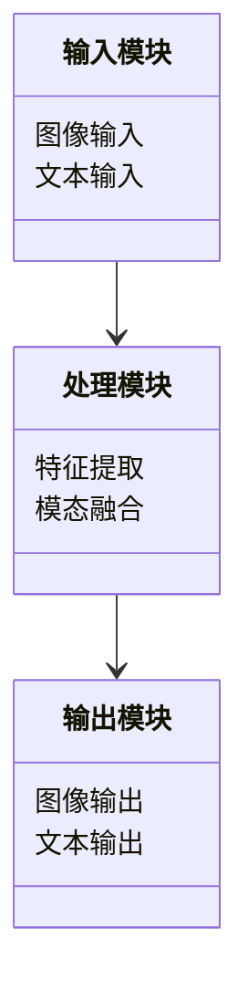
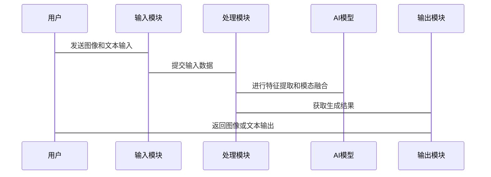

                 


```markdown
# 开发具有视觉-语言多模态理解能力的AI Agent

> 关键词：AI Agent, 多模态理解, 视觉-语言, 人机交互, 智能系统

> 摘要：  
本文旨在探讨如何开发具有视觉-语言多模态理解能力的AI Agent。通过分析多模态数据的处理技术、模型算法、系统架构以及实际应用案例，本文深入剖析了实现这一目标的关键技术和挑战。从基础概念到实际应用，本文为读者提供了一个全面的视角，帮助其理解并掌握相关技术。

---

# 第一部分：多模态AI Agent的背景与概述

## 第1章：多模态AI Agent的背景与概述

### 1.1 多模态AI Agent的定义与核心概念

#### 1.1.1 多模态AI Agent的定义
一个多模态AI Agent是一个能够同时理解和处理多种模态数据（如视觉、语言、听觉等）的智能体。本文主要关注视觉和语言模态的结合。

#### 1.1.2 视觉与语言模态的结合
- 视觉模态：图像、视频等。
- 语言模态：文本、语音等。
- 结合目标：通过视觉和语言的协同理解，实现更智能的交互和任务处理。

#### 1.1.3 多模态理解能力的实现目标
- 提供更自然的人机交互方式。
- 提高AI Agent的感知和理解能力。
- 实现跨模态的信息关联与推理。

### 1.2 多模态AI Agent的发展背景

#### 1.2.1 当前AI技术的演进趋势
- 从单一模态到多模态的转变。
- 大模型技术的普及与应用。

#### 1.2.2 多模态交互的需求驱动
- 用户期望更自然的交互方式。
- 复杂场景下的任务需求。

#### 1.2.3 多模态AI Agent的应用场景
- 智能助手（如客服机器人）。
- 智慧城市中的多模态监控系统。
- 教育领域的智能化学习辅助工具。

### 1.3 多模态AI Agent的核心优势

#### 1.3.1 多模态数据的互补性
- 通过结合视觉和语言信息，弥补单一模态的不足。

#### 1.3.2 提高模型的泛化能力
- 多模态数据的引入增强了模型的鲁棒性和适应性。

#### 1.3.3 增强人机交互的自然性
- 多模态交互更符合人类的沟通习惯。

### 1.4 本章小结
本章介绍了多模态AI Agent的基本概念、发展背景及其核心优势，为后续的技术分析奠定了基础。

---

# 第二部分：多模态AI Agent的技术基础

## 第2章：视觉与语言模态的处理技术

### 2.1 视觉模态处理技术

#### 2.1.1 图像特征提取
- 基于CNN的图像特征提取。
- 常见模型：ResNet、VGG、EfficientNet。

#### 2.1.2 视觉模型的发展
- 从单任务到多任务模型。
- 大模型（如ViT、Vision Transformer）的崛起。

#### 2.1.3 常见视觉模型的优缺点
| 模型 | 优点 | 缺点 |
|------|------|------|
| ResNet | 高效性 | 对复杂场景的适应性有限 |
| Vision Transformer | 强大的全局感知 | 计算成本高 |

### 2.2 语言模态处理技术

#### 2.2.1 文本特征提取
- 基于BERT的文本表示。
- 其他模型：GPT、ALBERT。

#### 2.2.2 语言模型的发展
- 从词袋模型到Transformer架构。
- 大语言模型（如GPT-3、PaLM）的突破。

#### 2.2.3 常见语言模型的优缺点
| 模型 | 优点 | 缺点 |
|------|------|------|
| BERT | 高精度 | 需要大量计算资源 |
| GPT | 流畅的生成能力 | 理解能力有限 |

### 2.3 多模态数据的融合方法

#### 2.3.1 晚期融合与早期融合
- 晚期融合：在高层特征阶段进行融合。
- 早期融合：在低层特征阶段进行融合。

#### 2.3.2 对比学习与注意力机制
- 对比学习：通过对比不同模态的数据，增强模态间的关联性。
- 注意力机制：动态分配不同模态的信息权重。

#### 2.3.3 跨模态对齐技术
- 对齐目标：实现视觉和语言模态之间的语义对齐。
- 对齐方法：对比学习、交叉注意力等。

### 2.4 本章小结
本章详细介绍了视觉和语言模态的处理技术，以及多模态数据的融合方法，为后续的算法实现提供了理论基础。

---

# 第三部分：多模态AI Agent的核心算法

## 第3章：多模态模型的算法原理

### 3.1 多模态模型的基本原理

#### 3.1.1 多模态数据的表示方法
- 视觉模态：图像特征向量。
- 语言模态：文本特征向量。
- 对齐方式：通过对比学习实现特征对齐。

#### 3.1.2 多模态特征的对齐方式
- 统一特征空间：将不同模态的特征映射到相同的向量空间。
- 跨模态对比学习：通过对比不同模态的数据，增强特征的对齐。

#### 3.1.3 多模态推理的机制
- 跨模态注意力机制：动态分配不同模态的信息权重。
- 端到端的多模态推理网络。

### 3.2 基于Transformer的多模态模型

#### 3.2.1 Transformer的多模态扩展
- 多模态输入：同时处理视觉和语言模态的数据。
- 多模态注意力：设计适用于多模态数据的注意力机制。

#### 3.2.2 多模态注意力机制
- 多模态交叉注意力：模型在处理一种模态数据时，可以参考另一种模态的信息。
- 门控机制：动态调节不同模态信息的贡献。

#### 3.2.3 多模态编码器-解码器架构
- 编码器：将多模态输入编码为语义表示。
- 解码器：根据编码结果生成目标输出。

### 3.3 常见多模态模型的实现

#### 3.3.1 CLIP模型
- CLIP的基本架构。
- 对比学习的实现方式。
- 在图像-文本匹配任务中的应用。

#### 3.3.2 ViLBERT模型
- ViLBERT的架构设计。
- 融合视觉和语言特征的方法。
- 在多模态问答任务中的应用。

#### 3.3.3 其他多模态模型的对比
| 模型 | 核心特点 | 适用场景 |
|------|---------|----------|
| CLIP | 强大的图像-文本对齐能力 | 图像检索、图像描述生成 |
| ViLBERT | 融合视觉和语言特征的能力 | 多模态问答、文本摘要 |

### 3.4 本章小结
本章重点分析了多模态模型的算法原理，通过对比不同模型的实现方式，帮助读者更好地理解多模态AI Agent的核心技术。

---

# 第四部分：多模态AI Agent的系统设计

## 第4章：多模态AI Agent的系统架构

### 4.1 问题场景介绍
- 一个典型的多模态AI Agent系统可能需要处理以下任务：
  - 接收用户的图像和文本输入。
  - 理解输入的语义。
  - 生成相应的图像或文本输出。

### 4.2 系统功能设计

#### 4.2.1 系统模块划分
- 输入模块：接收用户的多模态输入。
- 处理模块：对输入进行特征提取和模态融合。
- 输出模块：生成目标输出（图像或文本）。

#### 4.2.2 领域模型设计（Mermaid类图）


### 4.3 系统架构设计（Mermaid架构图）


### 4.4 系统接口设计
- 输入接口：支持图像和文本的上传。
- 输出接口：返回图像或文本结果。

### 4.5 系统交互设计（Mermaid序列图）


### 4.6 本章小结
本章通过系统设计的角度，详细分析了多模态AI Agent的架构和交互流程，为实际开发提供了指导。

---

# 第五部分：多模态AI Agent的项目实战

## 第5章：多模态问答系统的开发实战

### 5.1 环境配置
- 安装必要的库：
  - PyTorch、Transformers、Mermaid等。

### 5.2 系统核心实现

#### 5.2.1 环境配置
```bash
pip install torch transformers mermaid
```

#### 5.2.2 核心代码实现（图像-文本问答系统）
```python
import torch
from transformers import BertTokenizer, BertModel
from torchvision import models

# 加载预训练模型
bert_tokenizer = BertTokenizer.from_pretrained('bert-base-uncased')
bert_model = BertModel.from_pretrained('bert-base-uncased')
visual_model = models.resnet50(pretrained=True)

# 定义多模态问答网络
class MultiModalQAModel(torch.nn.Module):
    def __init__(self):
        super().__init__()
        self.bert = bert_model.encoder
        self.visual = visual_model

    def forward(self, input_ids, image_features):
        text_embeddings = self.bert(input_ids)
        visual_embeddings = self.visual(image_features)
        # 融合特征
        combined_embeddings = torch.cat([text_embeddings, visual_embeddings], dim=-1)
        return combined_embeddings

# 示例用法
input_sentence = "What is this picture showing?"
input_image = ...  # 加载图像
input_ids = bert_tokenizer(input_sentence, return_tensors='pt')['input_ids']
image_features = visual_model(input_image)

output = MultiModalQAModel().forward(input_ids, image_features)
```

### 5.3 功能解读与分析

#### 5.3.1 功能解读
- 系统接收用户的图像和文本输入。
- 对输入进行特征提取和模态融合。
- 生成相关的图像或文本输出。

#### 5.3.2 案例分析
- 用户输入：图像是一只猫，文本是“告诉我这只猫的品种”。
- 系统输出：预测猫的品种并提供相关信息。

### 5.4 本章小结
本章通过一个具体的项目案例，详细讲解了多模态AI Agent的开发过程，帮助读者更好地理解理论知识。

---

# 第六部分：总结与展望

## 第6章：总结与展望

### 6.1 本章总结
- 多模态AI Agent的核心技术：视觉-语言模态的融合与协同。
- 实现的关键点：特征对齐、跨模态注意力机制、对比学习。

### 6.2 未来展望
- 更高效的大模型训练方法。
- 多模态数据的实时处理能力。
- 更自然的多模态交互方式。

### 6.3 最佳实践Tips
- 数据质量：确保多模态数据的多样性和平衡性。
- 模型选择：根据具体任务选择合适的多模态模型。
- 系统优化：注重系统的实时性和稳定性。

### 6.4 本章小结
本章总结了全文内容，并展望了未来的发展方向，同时提供了一些实用的开发建议。

---

# 作者：AI天才研究院/AI Genius Institute & 禅与计算机程序设计艺术 /Zen And The Art of Computer Programming

---

本文通过系统化的分析和详细的案例讲解，帮助读者全面理解并掌握开发具有视觉-语言多模态理解能力的AI Agent所需的关键技术。从理论到实践，从算法到系统设计，本文为读者提供了一个完整的开发指南。
```

