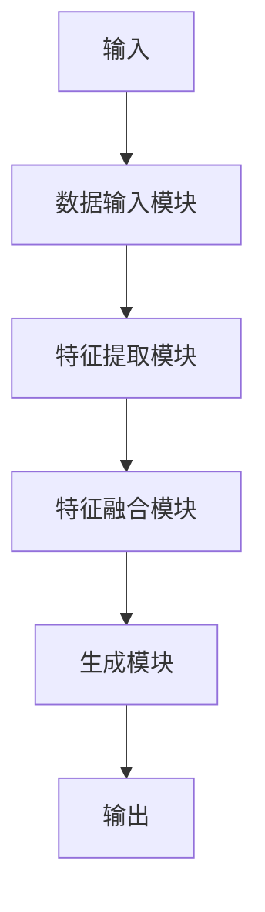

                 


# 开发具有视觉-语言多模态生成能力的AI Agent

> 关键词：视觉-语言多模态生成，AI Agent，Transformer，多模态数据处理，自监督学习

> 摘要：本文将详细探讨如何开发具有视觉-语言多模态生成能力的AI Agent。首先，我们将介绍多模态生成技术的基本概念及其在AI Agent中的应用背景。接着，我们将深入分析视觉-语言多模态生成的核心原理，包括模型结构、训练方法和数据处理流程。随后，我们将通过实际项目案例，展示如何构建一个基于Transformer的视觉-语言生成模型，并详细讲解其系统架构和实现细节。最后，我们将总结开发过程中的一些关键点和未来研究方向。

---

## 第一部分: 视觉-语言多模态生成AI Agent概述

### 第1章: 视觉-语言多模态生成AI Agent的背景与概念

#### 1.1 问题背景与挑战

在当前AI技术的发展中，单一模态的处理已经相对成熟，但实际应用场景中，复杂的任务往往需要多模态数据的协同处理。例如，在医疗影像分析中，医生需要结合图像和文本信息进行诊断；在电子商务中，用户可能需要通过图像和文本描述来搜索商品。然而，现有的AI模型大多只能处理单一模态的数据，无法充分利用多模态信息来提升生成能力。

此外，多模态生成技术在实际应用中还面临以下挑战：

- **数据异构性**：不同模态的数据形式和特征空间差异较大，如何有效地对齐和融合这些数据是一个难题。
- **计算复杂性**：多模态生成模型通常需要处理大规模数据，计算资源需求较高。
- **模型泛化能力**：如何在不同领域和场景中泛化应用多模态生成模型，仍是一个开放性问题。

#### 1.2 视觉-语言多模态生成AI Agent的定义

**视觉-语言多模态生成AI Agent**是一种能够同时处理视觉和语言信息，并能够生成多种模态输出（如图像、文本描述等）的智能体。它结合了计算机视觉和自然语言处理技术，通过多模态数据的协同处理，实现更强大的生成能力。

#### 1.3 技术特点与优势

- **多模态数据处理能力**：能够同时理解和生成视觉和语言信息，提升生成内容的丰富性和准确性。
- **自然语言理解与生成能力**：具备强大的文本处理能力，能够进行对话交互、文本生成等任务。
- **视觉感知与生成能力**：能够理解和生成图像、视频等视觉内容，实现视觉信息的交互。

#### 1.4 应用场景与边界

**应用场景**：
- **图像描述生成**：给定一张图像，生成相应的文本描述。
- **图像生成**：根据文本描述生成对应的图像。
- **视频生成**：根据文本描述生成视频内容。
- **跨模态检索**：根据图像检索相关文本，或根据文本检索相关图像。

**技术边界**：
- **数据依赖性**：生成能力依赖于高质量的多模态训练数据。
- **生成质量**：当前模型的生成结果可能仍存在一定的局限性，如生成图像的清晰度、文本的相关性等。
- **计算资源需求**：多模态生成模型通常需要高性能计算资源支持。

---

## 第二部分: 视觉-语言多模态生成模型的核心原理

### 第2章: 多模态数据处理原理

#### 2.1 视觉数据的处理流程

**视觉数据处理**：
1. **图像特征提取**：使用卷积神经网络（CNN）提取图像的低层和高层特征。
2. **特征表示**：将图像特征映射到一个统一的特征空间，以便与其他模态数据进行融合。

**关键算法**：
- **ResNet**：用于提取图像的深层特征。
- **VGGNet**：用于图像特征提取的基准模型。

#### 2.2 语言数据的处理流程

**语言数据处理**：
1. **文本预处理**：包括分词、停用词处理、词向量化等。
2. **语言模型训练**：使用Transformer架构训练语言模型，生成文本描述。

**关键算法**：
- **BERT**：用于文本的深度语义理解。
- **GPT**：用于文本生成任务。

#### 2.3 多模态数据的融合方法

**融合方法**：
1. **early fusion**：在特征提取阶段进行模态间的信息融合。
2. **late fusion**：在特征表示阶段进行模态间的信息融合。

**融合策略**：
- **对齐**：通过对比学习，对齐不同模态的特征空间。
- **注意力机制**：利用注意力机制，动态调整不同模态的权重。

### 第3章: AI Agent的生成机制

#### 3.1 基于Transformer的生成模型

**Transformer架构**：
- **编码器**：用于将输入数据（如图像特征或文本序列）映射到一个共同的特征空间。
- **解码器**：用于根据输入生成目标输出（如文本描述或图像）。

**关键公式**：
- **自注意力机制**：
  $$
  \text{Attention}(Q, K, V) = \text{softmax}\left(\frac{QK^T}{\sqrt{d_k}}\right)V
  $$
- **前馈网络**：
  $$
  F(x) = \text{ReLU}(W_1x + b_1) + W_2x + b_2
  $$

#### 3.2 多模态特征的提取与融合

**特征提取**：
- **视觉特征**：通过CNN提取图像的视觉特征。
- **语言特征**：通过Transformer提取文本的语义特征。

**特征融合**：
- **对齐与对比学习**：
  $$
  \text{loss} = \text{CE}(\text{sim}(x, y))
  $$
  其中，$\text{sim}(x, y)$表示模态$x$和模态$y$之间的相似性。

#### 3.3 基于视觉-语言联合学习的生成策略

**联合学习**：
- **对比学习**：通过对比不同模态的特征，增强模态间的关联性。
- **联合优化**：在生成过程中，同时优化视觉和语言模态的生成目标。

**联合生成**：
- **图像生成**：根据文本描述生成图像。
- **文本生成**：根据图像内容生成文本描述。

---

## 第三部分: 视觉-语言多模态生成模型的核心算法

### 第4章: 多模态数据处理算法

#### 4.1 Transformer模型在多模态生成中的应用

**模型结构**：
- **编码器**：将图像特征和文本特征映射到共同的特征空间。
- **解码器**：根据输入生成目标输出。

**代码示例**：
```python
def transformer_encoder(x, mask=None):
    # x shape: (batch_size, input_seq_len, d_model)
    # mask shape: (batch_size, 1, 1, input_seq_len)
    x = multi_head_attention(x, mask)
    x = feed_forward_network(x)
    return x

def transformer_decoder(y, encoder_output, mask=None):
    # y shape: (batch_size, output_seq_len, d_model)
    y = multi_head_attention(y, encoder_output, mask)
    y = feed_forward_network(y)
    return y
```

#### 4.2 多模态特征的提取与融合

**融合策略**：
- **对齐**：通过对比学习对齐不同模态的特征空间。
- **注意力机制**：利用注意力机制动态调整模态权重。

**代码示例**：
```python
def modality_attention(v_features, l_features):
    # v_features shape: (batch_size, d_v)
    # l_features shape: (batch_size, d_l)
    # d_v = d_l = d
    W = torch.nn.Parameter(torch.randn(d, d))
    attention_scores = torch.matmul(v_features, W) * l_features
    attention_weights = torch.softmax(attention_scores, dim=-1)
    fused_features = torch.sum(v_features * attention_weights, dim=-1)
    return fused_features
```

#### 4.3 对比学习与生成策略

**对比学习**：
- **正样本对**：同一模态的数据对。
- **负样本对**：不同模态的数据对。

**生成策略**：
- **联合优化**：在生成过程中，同时优化视觉和语言模态的生成目标。

**代码示例**：
```python
def contrastive_loss(v_features, l_features, label):
    # v_features shape: (batch_size, d)
    # l_features shape: (batch_size, d)
    # label shape: (batch_size,)
    similarity = torch.cosine_similarity(v_features, l_features)
    loss = torch.nn.CrossEntropyLoss()(similarity.unsqueeze(1), label.unsqueeze(1))
    return loss
```

---

## 第四部分: 视觉-语言多模态生成系统的架构设计

### 第5章: 系统架构设计

#### 5.1 问题场景介绍

**场景描述**：
- **输入**：用户提供的图像或文本描述。
- **输出**：生成的图像或文本描述。

**系统功能**：
- **数据输入模块**：接收用户的输入数据。
- **特征提取模块**：提取视觉和语言特征。
- **融合模块**：对齐和融合多模态特征。
- **生成模块**：根据融合后的特征生成目标输出。

#### 5.2 系统功能设计

**功能模块**：
1. **数据输入模块**：接收图像或文本输入。
2. **特征提取模块**：提取图像和文本特征。
3. **特征融合模块**：对齐和融合多模态特征。
4. **生成模块**：生成目标输出（如图像或文本描述）。

**系统架构图**：


---

## 第五部分: 视觉-语言多模态生成系统的实现

### 第6章: 项目实战

#### 6.1 环境安装

**主要依赖**：
- **Python**：3.8+
- **TensorFlow**或**PyTorch**：>=1.5
- **Keras**：与TensorFlow兼容
- **OpenCV**：用于图像处理
- **numpy**：数据处理

**安装命令**：
```bash
pip install tensorflow keras numpy opencv-python
```

#### 6.2 系统核心实现源代码

**模型实现代码**：
```python
import tensorflow as tf
from tensorflow import keras
from tensorflow.keras import layers

class Vision-Language_Generator:
    def __init__(self, image_dim, text_dim):
        self.image_dim = image_dim
        self.text_dim = text_dim
        self.encoder = self.build_encoder()
        self.decoder = self.build_decoder()

    def build_encoder(self):
        inputs = layers.Input(shape=(self.image_dim,))
        x = layers.Dense(256, activation='relu')(inputs)
        x = layers.Dense(128, activation='relu')(x)
        return keras.Model(inputs=inputs, outputs=x)

    def build_decoder(self):
        inputs = layers.Input(shape=(self.text_dim,))
        x = layers.Dense(128, activation='relu')(inputs)
        x = layers.Dense(64, activation='relu')(x)
        return keras.Model(inputs=inputs, outputs=x)

    def call(self, inputs):
        image_features = self.encoder(inputs[0])
        text_features = self.decoder(inputs[1])
        # 融合特征
        fused_features = tf.reduce_sum(image_features * text_features, axis=-1)
        return fused_features
```

#### 6.3 代码应用解读与分析

**代码解读**：
- **模型构建**：通过构建编码器和解码器，分别提取图像和文本特征。
- **特征融合**：通过简单的点积操作融合特征，生成最终的融合特征。

**模型训练**：
```python
model = Vision-Language_Generator(image_dim=256, text_dim=512)
model.compile(optimizer='adam', loss='binary_crossentropy')
model.fit([image_data, text_data], labels, epochs=10, batch_size=32)
```

---

## 第六部分: 视觉-语言多模态生成系统的优化与扩展

### 第7章: 最佳实践与总结

#### 7.1 小结

本文详细介绍了如何开发具有视觉-语言多模态生成能力的AI Agent，从技术背景到核心算法，再到系统架构和项目实战，为读者提供了全面的指导。

#### 7.2 注意事项

- **数据质量**：多模态生成模型对训练数据的质量要求较高，需注意数据的多样性和平衡性。
- **计算资源**：多模态生成模型通常需要大量的计算资源，需合理配置硬件资源。
- **模型调优**：生成模型的调优是一个复杂的过程，需结合实验结果不断调整模型参数。

#### 7.3 拓展阅读

- **多模态生成模型的优化**：探索更高效的模型架构和训练方法。
- **视觉-语言生成的应用探索**：研究更多实际应用场景，推动技术落地。

---

## 作者：AI天才研究院/AI Genius Institute & 禅与计算机程序设计艺术 /Zen And The Art of Computer Programming

---

本文通过系统地介绍视觉-语言多模态生成AI Agent的核心概念、算法原理和系统架构，为读者提供了一套完整的开发指南。希望本文能够为相关领域的研究者和开发者提供有价值的参考，推动多模态生成技术的发展与应用。

