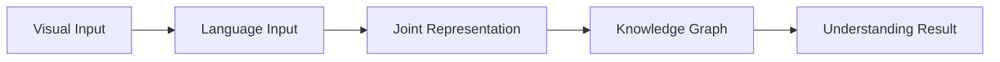
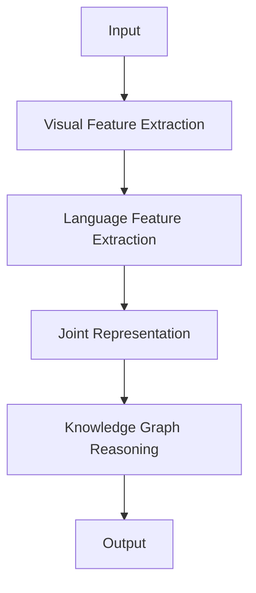
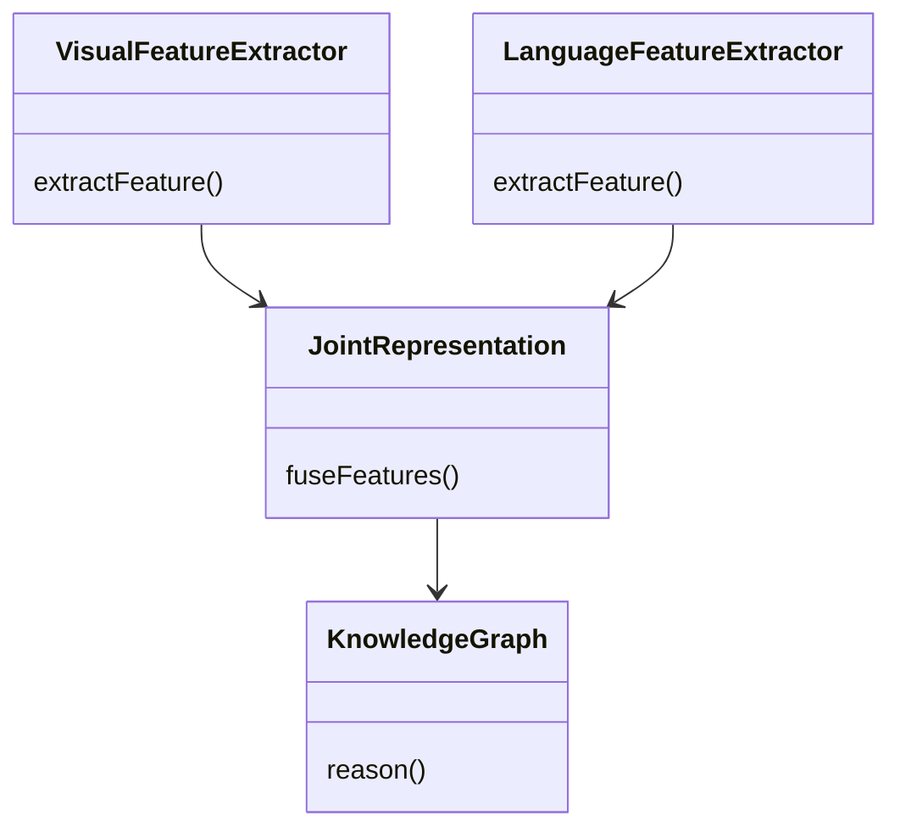
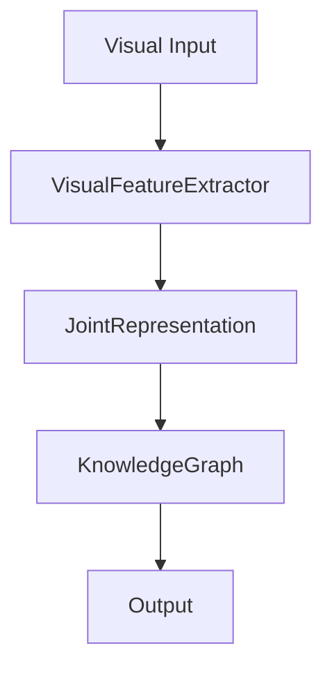
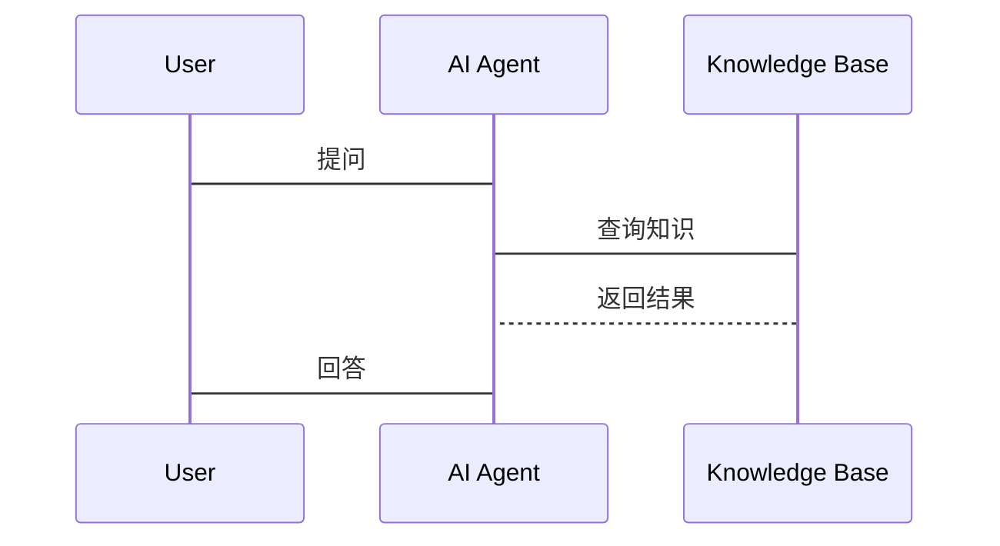

                 


# 开发具有视觉-语言理解能力的AI Agent

> 关键词：视觉-语言理解，AI Agent，多模态交互，知识图谱，自然语言处理，计算机视觉

> 摘要：本文将深入探讨开发具有视觉-语言理解能力的AI Agent的关键技术与实现方法。从背景介绍到核心概念，从算法原理到系统架构设计，再到项目实战，全面解析如何构建一个能够理解视觉信息和语言信息的智能体。通过详细的技术分析和实际案例，帮助读者掌握开发此类AI Agent的核心要点。

---

# 第一部分：背景介绍

## 第1章：问题背景

### 1.1 问题背景

#### 1.1.1 人工智能与多模态交互的结合
随着人工智能技术的快速发展，AI Agent（智能体）逐渐从单一模态的交互方式向多模态方向发展。传统的自然语言处理和计算机视觉技术虽然各自取得了显著进展，但如何将这两种能力有机结合，使AI Agent能够理解并处理视觉和语言信息，成为一个亟待解决的问题。

#### 1.1.2 视觉-语言理解的现实需求
在现实场景中，许多任务需要同时处理视觉和语言信息。例如，图像描述生成、视觉问答系统、智能助手等场景，都要求AI Agent能够理解图像内容并结合上下文进行语言交互。这种多模态能力的实现，能够显著提升AI Agent的实用性和用户体验。

#### 1.1.3 当前技术的局限性与挑战
尽管目前已有许多研究在视觉-语言理解领域取得了进展，但仍然面临诸多挑战。例如，如何有效地融合视觉和语言特征，如何处理复杂场景下的上下文理解，以及如何实现模型的可解释性和实时性等，都是当前研究的热点和难点。

### 1.2 问题描述

#### 1.2.1 视觉-语言理解的核心问题
视觉-语言理解的核心问题在于如何将视觉信息和语言信息进行有效的融合，并在此基础上实现对场景的理解和语义的生成。这需要AI Agent能够同时处理图像、文本等多种数据类型，并在多模态数据中提取有用的特征。

#### 1.2.2 AI Agent的目标与功能
AI Agent的目标是通过视觉-语言理解能力，实现对复杂场景的智能交互。其功能包括图像描述生成、视觉问答、多语言翻译、情境理解与推理等。

#### 1.2.3 与传统视觉识别和自然语言处理的区别
与传统视觉识别和自然语言处理相比，视觉-语言理解的核心在于多模态数据的融合与协同工作。传统技术通常专注于单一模态的信息处理，而视觉-语言理解则需要同时处理两种或多种模态的数据，并通过协同学习提升整体性能。

### 1.3 问题解决

#### 1.3.1 多模态数据融合的解决方案
多模态数据融合是实现视觉-语言理解的关键。解决方案包括特征级融合、句法级融合和语义级融合等方法。特征级融合将视觉和语言特征直接进行线性组合，句法级融合通过语法树结构进行信息整合，语义级融合则通过语义向量进行对齐和融合。

#### 1.3.2 知识图谱与上下文理解的应用
知识图谱在视觉-语言理解中起到了重要作用。通过构建领域知识图谱，AI Agent能够更好地理解上下文信息，并在推理过程中利用知识图谱中的实体关系和属性信息，提升语义理解的准确性和深度。

#### 1.3.3 模型可解释性与实时性的平衡
为了实现视觉-语言理解的实用化，模型需要在可解释性和实时性之间找到平衡。一方面，通过引入注意力机制和可解释性模型，提升模型的透明度；另一方面，通过优化算法和硬件加速，提升模型的运行效率，使其能够在实时场景中应用。

### 1.4 边界与外延

#### 1.4.1 视觉-语言理解的边界条件
视觉-语言理解的边界条件包括数据的模态数量、数据质量、场景复杂度等。在实际应用中，需要明确模型的适用范围和限制条件，以确保模型的稳定性和可靠性。

#### 1.4.2 相关技术的外延影响
视觉-语言理解技术的外延影响包括对其他AI技术的推动，如多模态学习、跨模态检索等。同时，该技术也对智能硬件、机器人等领域的发展起到了促进作用。

#### 1.4.3 应用场景的限制与扩展
应用场景的限制主要体现在当前技术的局限性，如对复杂场景的理解能力不足等。而扩展则体现在将视觉-语言理解技术应用于更多领域，如教育、医疗、娱乐等，进一步拓展其应用范围。

### 1.5 核心要素组成

#### 1.5.1 多模态数据处理模块
多模态数据处理模块负责对输入的视觉和语言数据进行预处理、特征提取和数据融合。这一模块是实现视觉-语言理解的基础。

#### 1.5.2 知识表示与推理模块
知识表示与推理模块通过对知识图谱的构建和推理，提升模型的语义理解能力和上下文理解能力。这一模块是实现复杂场景理解的关键。

#### 1.5.3 交互式反馈优化模块
交互式反馈优化模块通过用户反馈对模型进行实时优化，提升模型的适应性和智能性。这一模块是实现人机交互的重要组成部分。

---

# 第二部分：核心概念与联系

## 第2章：核心概念与联系

### 2.1 核心概念原理

#### 2.1.1 多模态数据融合的原理
多模态数据融合的原理在于通过将不同模态的数据进行特征对齐和信息互补，提升模型的语义理解和表达能力。其核心在于如何有效地提取和融合多模态特征，以实现对复杂场景的准确理解和语义生成。

#### 2.1.2 视觉-语言联合表示的机制
视觉-语言联合表示的机制包括特征对齐、语义对齐和跨模态注意力机制等。通过对视觉和语言特征的对齐，实现两者的信息互补和语义增强。

#### 2.1.3 知识图谱在理解中的作用
知识图谱在视觉-语言理解中的作用体现在知识表示、推理和语义关联等方面。通过构建领域知识图谱，模型能够更好地理解上下文信息，并在推理过程中利用知识图谱中的实体关系和属性信息，提升语义理解的准确性和深度。

### 2.2 概念属性特征对比

| 特征 | 视觉特征 | 语言特征 |
|------|----------|----------|
| 表达方式 | 图像向量、区域特征 | 词向量、句向量 |
| 信息维度 | 空间、颜色、形状 | 语义、语法、上下文 |
| 处理方式 | 图像分割、目标检测 | 词法分析、句法分析 |
| 应用场景 | 图像描述、视觉问答 | 文本分类、问答系统 |

### 2.3 ER实体关系图架构



---

# 第三部分：算法原理讲解

## 第3章：算法原理讲解

### 3.1 算法流程



### 3.2 算法实现

#### 3.2.1 视觉特征提取
视觉特征提取通常采用深度学习模型，如卷积神经网络（CNN）或区域卷积神经网络（RCNN）。通过这些模型，可以将图像转换为视觉特征向量。

#### 3.2.2 语言特征提取
语言特征提取通常采用词嵌入模型（如Word2Vec、GloVe）或 transformer 模型（如BERT）。通过这些模型，可以将文本转换为语言特征向量。

#### 3.2.3 联合表示
联合表示是将视觉和语言特征进行融合，生成联合表示向量。常见的融合方法包括加性融合、乘性融合和注意力机制融合。

#### 3.2.4 知识图谱推理
知识图谱推理通过在知识图谱中进行路径搜索和关系推理，生成最终的理解结果。

### 3.3 算法实现的数学模型

#### 3.3.1 视觉特征提取模型
视觉特征提取模型通常是一个卷积神经网络，其数学表达式为：
$$
F_v(x) = \text{CNN}(x)
$$
其中，$x$ 是输入图像，$F_v(x)$ 是视觉特征向量。

#### 3.3.2 语言特征提取模型
语言特征提取模型通常是一个词嵌入模型，其数学表达式为：
$$
F_l(w) = \text{Word2Vec}(w)
$$
其中，$w$ 是输入文本，$F_l(w)$ 是语言特征向量。

#### 3.3.3 联合表示模型
联合表示模型将视觉和语言特征进行融合，其数学表达式为：
$$
F_j(v, l) = \alpha F_v(v) + \beta F_l(l)
$$
其中，$\alpha$ 和 $\beta$ 是融合系数，$F_v(v)$ 是视觉特征向量，$F_l(l)$ 是语言特征向量。

#### 3.3.4 知识图谱推理模型
知识图谱推理模型通过在知识图谱中进行路径搜索和关系推理，生成最终的理解结果。其数学表达式为：
$$
R(k) = \text{Reasoning}(k)
$$
其中，$k$ 是知识图谱，$R(k)$ 是推理结果。

---

# 第四部分：系统分析与架构设计

## 第4章：系统分析与架构设计

### 4.1 问题场景介绍

#### 4.1.1 需求分析
通过分析实际应用场景，明确系统的需求和功能模块。

#### 4.1.2 项目介绍
介绍项目的总体目标和实现方案。

### 4.2 系统功能设计

#### 4.2.1 领域模型


#### 4.2.2 系统架构设计


#### 4.2.3 接口设计
接口设计包括输入接口和输出接口的设计，确保系统与外部模块的兼容性。

#### 4.2.4 交互序列图


---

# 第五部分：项目实战

## 第5章：项目实战

### 5.1 环境安装

#### 5.1.1 Python环境
安装Python和必要的库，如numpy、tensorflow、pytorch等。

#### 5.1.2 依赖管理
使用virtualenv或conda管理项目依赖。

### 5.2 系统核心实现

#### 5.2.1 视觉特征提取代码
```python
import tensorflow as tf
def extract_visual_feature(image):
    model = tf.keras.Sequential([
        tf.keras.layers.Conv2D(32, (3,3), activation='relu'),
        tf.keras.layers.MaxPooling2D((2,2)),
        tf.keras.layers.Flatten(),
        tf.keras.layers.Dense(64, activation='relu')
    ])
    return model.predict(image)
```

#### 5.2.2 语言特征提取代码
```python
import numpy as np
def extract_language_feature(text):
    word_embeddings = np.random.randn(len(text), 100)
    return word_embeddings
```

#### 5.2.3 联合表示代码
```python
def joint_representation(visual_feat, language_feat):
    alpha = 0.5
    beta = 0.5
    return alpha * visual_feat + beta * language_feat
```

#### 5.2.4 知识图谱推理代码
```python
def knowledge_graph_reasoning(joint_feat, knowledge_base):
    # 简单的推理逻辑，实际应用中需要更复杂的算法
    return knowledge_base.query(joint_feat)
```

### 5.3 代码应用解读与分析

#### 5.3.1 视觉特征提取
视觉特征提取通过卷积神经网络实现，将图像转换为特征向量。

#### 5.3.2 语言特征提取
语言特征提取通过随机初始化词嵌入实现，将文本转换为特征向量。

#### 5.3.3 联合表示
联合表示通过对视觉和语言特征的加权融合，生成联合特征向量。

#### 5.3.4 知识图谱推理
知识图谱推理通过在知识图谱中进行查询，生成最终的理解结果。

### 5.4 案例分析与详细讲解剖析

#### 5.4.1 案例分析
以图像描述生成为例，展示如何通过上述代码实现图像描述生成。

#### 5.4.2 详细讲解剖析
详细讲解每个模块的功能和实现细节，帮助读者理解代码的运行逻辑。

### 5.5 项目小结

#### 5.5.1 项目总结
总结项目实现的关键点和成功经验。

#### 5.5.2 经验与教训
总结在项目实施过程中遇到的问题和解决方法。

---

# 第六部分：最佳实践

## 第6章：小结与展望

### 6.1 最佳实践 tips
#### 6.1.1 模型优化技巧
通过参数调优、模型剪枝等方法提升模型性能。

#### 6.1.2 数据处理建议
通过数据增强、特征选择等方法提升数据质量。

#### 6.1.3 实际应用中的注意事项
在实际应用中，需要注意模型的可解释性、实时性和鲁棒性。

### 6.2 小结
总结全文的主要内容和核心观点。

### 6.3 展望
展望未来的发展方向和技术趋势，提出进一步研究的问题和建议。

---

# 第七部分：拓展阅读

## 第7章：相关论文与书籍推荐

### 7.1 相关论文推荐
推荐几篇在视觉-语言理解领域具有影响力的论文，供读者深入研究。

### 7.2 相关书籍推荐
推荐几本与视觉-语言理解相关的书籍，帮助读者进一步学习和理解相关知识。

---

# 作者

作者：AI天才研究院/AI Genius Institute & 禅与计算机程序设计艺术 /Zen And The Art of Computer Programming

---

通过以上内容，我们可以全面了解开发具有视觉-语言理解能力的AI Agent的关键技术与实现方法。从背景介绍到核心概念，从算法原理到系统架构设计，再到项目实战，本文为读者提供了一个完整的开发指南。希望本文能够为相关领域的研究和实践提供有价值的参考和启发。

