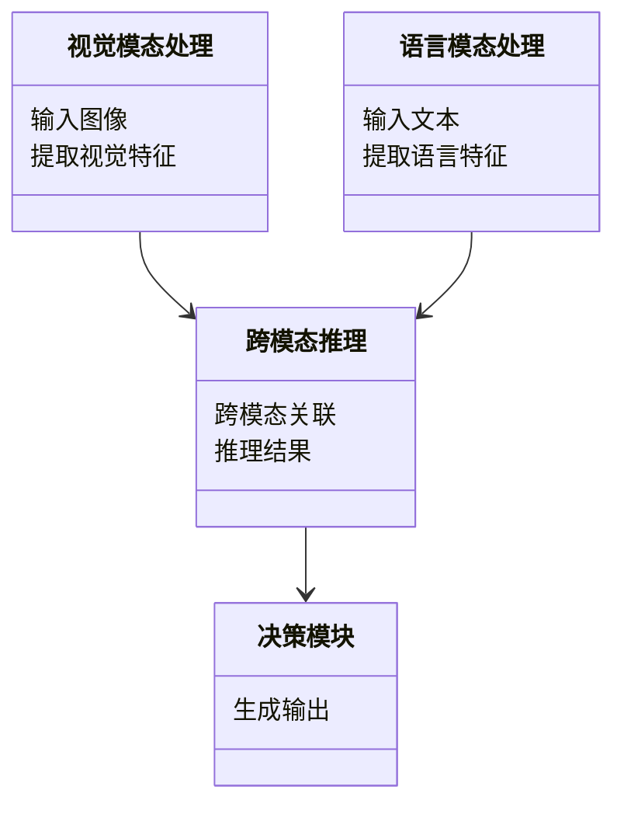
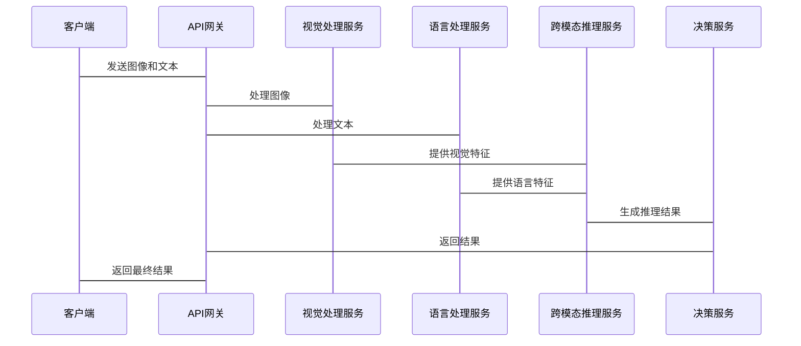

                 


# 开发具有视觉-语言跨模态推理能力的AI Agent

> 关键词：AI Agent，视觉-语言跨模态推理，多模态模型，跨模态关联，深度学习

> 摘要：  
本文详细探讨了开发具有视觉-语言跨模态推理能力的AI Agent的全过程。从问题背景到核心概念，从算法原理到系统架构设计，再到项目实战和最佳实践，文章全面分析了跨模态推理在AI Agent中的实现细节。通过丰富的理论阐述和实际案例分析，本文为读者提供了从理论到实践的完整指南，帮助开发人员和研究者更好地理解和实现具有跨模态推理能力的AI Agent。

---

# 第二部分: 核心概念与算法原理

## 第3章: 跨模态推理的数学模型与公式

### 3.3 跨模态推理的数学模型

#### 3.3.1 编码器-解码器结构
跨模态推理通常采用编码器-解码器结构，将不同模态的输入转换为共享的表示空间，然后进行推理和生成。  
- 编码器：将视觉和语言输入分别编码为向量表示。  
- 解码器：根据编码后的表示生成目标模态的输出。  

#### 3.3.2 注意力机制
注意力机制是跨模态推理中的关键组件，用于捕捉不同模态之间的关联关系。  
- 自注意力机制：在单模态内部进行关联，如语言中的词与词之间的关系。  
- 交叉注意力机制：在不同模态之间建立关联，如视觉特征与语言描述的对齐。  

#### 3.3.3 跨模态融合模型
跨模态融合模型将视觉和语言信息融合，生成最终的推理结果。常用的融合方式包括：  
1. **加法融合**：将视觉和语言的表示向量相加。  
2. **乘法融合**：将视觉和语言的表示向量相乘。  
3. **注意力加权融合**：根据模态的重要性动态调整权重。  

### 3.4 关键公式与推导

#### 3.4.1 注意力机制公式
交叉注意力机制的公式如下：  
$$\text{Attention}(Q, K, V) = \text{softmax}\left(\frac{QK^T}{\sqrt{d_k}}\right)V$$  
其中，$Q$ 是查询向量，$K$ 是键向量，$V$ 是值向量，$d_k$ 是键的维度。

#### 3.4.2 编码器-解码器公式
编码器-解码器结构的公式如下：  
$$\text{Decoder}(x) = \text{Self-Attention}(x) + \text{Cross-Attention}(x, y)$$  
其中，$x$ 是输入的视觉特征，$y$ 是输入的语言描述。

#### 3.4.3 跨模态损失函数
损失函数用于衡量模型的预测结果与真实结果之间的差异。常用的损失函数包括：  
1. **交叉熵损失**：用于分类任务。  
2. **均方误差**：用于回归任务。  
3. **对比损失**：用于跨模态对齐任务。  

#### 3.4.4 交叉熵损失函数
交叉熵损失函数的公式如下：  
$$L = -\sum_{i=1}^{n} y_i \log(p_i)$$  
其中，$y_i$ 是真实标签，$p_i$ 是模型的预测概率。

---

## 第4章: 跨模态推理的系统分析与架构设计

### 4.1 系统分析

#### 4.1.1 问题场景
- **输入**：图像和文本输入。  
- **输出**：基于图像和文本的推理结果。  
- **目标**：通过跨模态推理生成有意义的输出。  

#### 4.1.2 系统功能需求
1. **感知模块**：处理视觉和语言输入，提取特征。  
2. **推理模块**：进行跨模态关联和推理。  
3. **决策模块**：生成最终的输出结果。  

### 4.2 系统架构设计

#### 4.2.1 领域模型
领域模型展示了系统的核心模块及其交互关系。  



#### 4.2.2 系统架构
系统架构展示了模块的分层结构和交互关系。  


#### 4.2.3 接口设计
系统接口设计展示了模块之间的交互接口。  



---

## 第5章: 项目实战与实现细节

### 5.1 项目实战

#### 5.1.1 环境配置
- **Python**：3.8+  
- **深度学习框架**：TensorFlow/PyTorch  
- **依赖库**：numpy, matplotlib, PIL, scikit-learn  

#### 5.1.2 系统核心实现

##### 视觉模态处理代码
```python
import tensorflow as tf
from tensorflow.keras import layers

def visual_processor(image_input):
    # 假设image_input是形状为(224, 224, 3)的张量
    model = tf.keras.Sequential([
        layers.Conv2D(32, (3,3), activation='relu'),
        layers.MaxPooling2D((2,2)),
        layers.Conv2D(64, (3,3), activation='relu'),
        layers.MaxPooling2D((2,2)),
        layers.Flatten(),
        layers.Dense(128, activation='relu'),
        layers.Dense(64, activation='relu')
    ])
    return model(image_input)
```

##### 语言模态处理代码
```python
def language_processor(text_input):
    # 假设text_input是形状为(max_length, )的张量
    model = tf.keras.Sequential([
        layers.Embedding(10000, 128),
        layers.LSTM(64, return_sequences=False),
        layers.Dense(32, activation='relu')
    ])
    return model(text_input)
```

##### 跨模态推理代码
```python
def cross_modal_reasoning(visual_features, language_features):
    # 跨模态关联
    attention = tf.keras.layers.Attention()([visual_features, language_features])
    # 融合特征
    merged_features = tf.keras.layers.Add()([visual_features, attention])
    # 推理结果
    output = tf.keras.layers.Dense(1, activation='sigmoid')(merged_features)
    return output
```

#### 5.1.3 代码解读与分析
- **视觉模态处理**：通过卷积神经网络提取图像的特征。  
- **语言模态处理**：通过嵌入层和LSTM提取文本的特征。  
- **跨模态推理**：通过注意力机制关联视觉和语言特征，生成最终的推理结果。  

---

## 第6章: 最佳实践与总结

### 6.1 小结
- 跨模态推理是实现AI Agent的重要能力。  
- 本文通过理论分析和实际案例，详细讲解了跨模态推理的实现过程。  

### 6.2 注意事项
- **数据质量**：确保输入数据的多样性和质量。  
- **模型选择**：根据具体任务选择合适的模型架构。  
- **训练优化**：合理设置超参数，优化模型性能。  

### 6.3 拓展阅读
- 《Attention Is All You Need》：理解注意力机制的基础。  
- 《Vision-Language Pre-Training for Image Captioning》：学习跨模态预训练方法。  
- 《Graph Neural Networks for Visual-Language Reasoning》：探索图神经网络在跨模态推理中的应用。

---

作者：AI天才研究院/AI Genius Institute & 禅与计算机程序设计艺术 /Zen And The Art of Computer Programming

