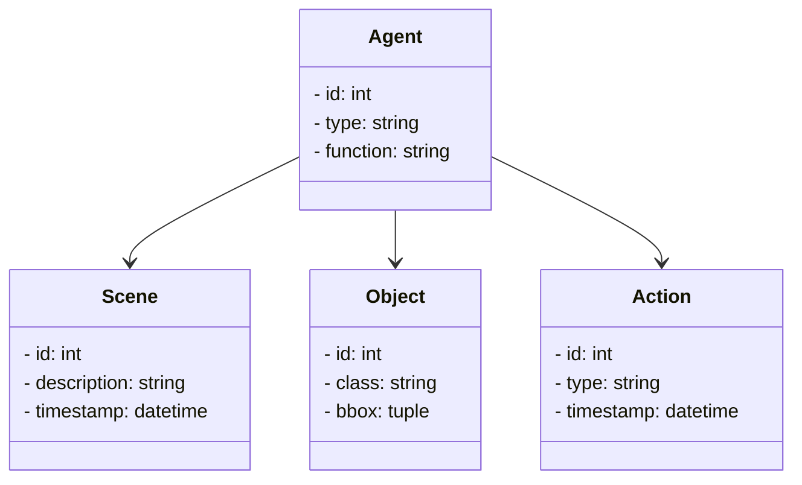
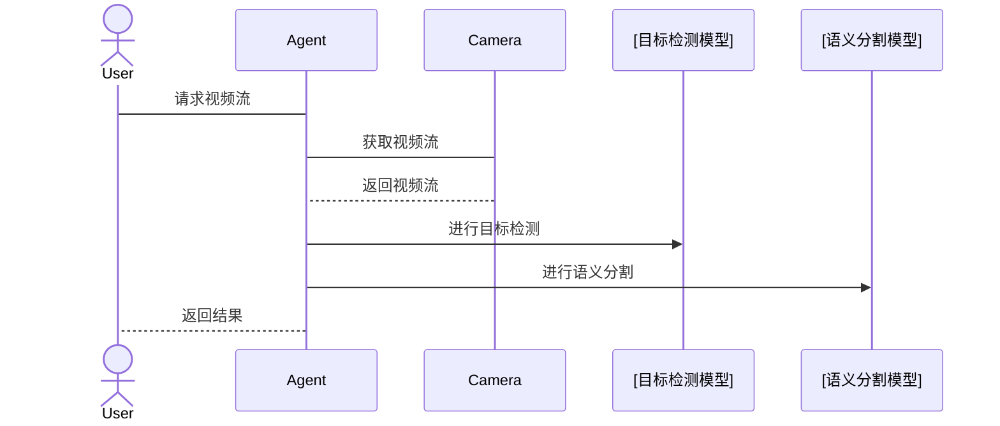

                 


# 开发具有视觉场景理解能力的AI Agent

## 关键词：视觉场景理解，AI Agent，目标检测，语义分割，深度估计

## 摘要：  
本文详细探讨了开发具有视觉场景理解能力的AI Agent所需的关键技术和方法。从核心概念到算法原理，从系统架构到项目实战，全面解析如何构建能够理解视觉场景的智能体。文章结合理论与实践，帮助读者掌握视觉场景理解的开发流程和关键挑战。

---

# 第一部分: 背景介绍与核心概念

## 第1章: 视觉场景理解AI Agent的背景与问题描述

### 1.1 问题背景

#### 1.1.1 当前AI Agent的发展现状  
AI Agent（智能体）是人工智能领域的重要研究方向，广泛应用于自动驾驶、机器人、智能安防等领域。随着计算机视觉技术的快速发展，AI Agent需要具备更强的视觉场景理解能力，以更好地与环境交互。

#### 1.1.2 视觉场景理解的核心问题  
视觉场景理解是指AI Agent能够识别和理解场景中的物体、关系和语义信息。核心问题包括目标检测、语义分割、深度估计等。

#### 1.1.3 问题的挑战与解决思路  
挑战：场景复杂性、遮挡、光照变化等。解决思路：结合深度学习和计算机视觉技术，构建高效的模型。

### 1.2 问题描述

#### 1.2.1 视觉场景理解的定义  
AI Agent通过视觉传感器（摄像头）获取场景信息，识别物体、理解场景结构和语义。

#### 1.2.2 AI Agent在视觉场景理解中的角色  
AI Agent作为决策者，依赖视觉信息做出判断和行动。

#### 1.2.3 问题的边界与外延  
专注于视觉信息处理，与其他传感器（如激光雷达）数据融合可提升性能。

## 第2章: 视觉场景理解AI Agent的核心概念与联系

### 2.1 核心概念原理

#### 2.1.1 视觉感知模块  
负责物体检测、语义分割等任务。

#### 2.1.2 场景理解模块  
分析场景中的物体关系、语义信息。

#### 2.1.3 决策与交互模块  
基于理解结果做出决策并执行。

### 2.2 核心概念对比分析

#### 2.2.1 不同AI Agent的对比  
基于规则 vs. 基于学习：深度学习模型表现更优。

#### 2.2.2 视觉场景理解与其他任务的对比  
目标检测 vs. 语义分割：语义分割提供更细粒度信息。

### 2.3 ER实体关系图

```mermaid
er
actor(Agent, [ID, Type, Function])
actor(Scene, [ID, Description, Timestamp])
actor(Object, [ID, Class, BBox])
actor(Action, [ID, Type, Timestamp])
```

---

# 第二部分: 算法原理与数学模型

## 第3章: 视觉感知算法原理

### 3.1 目标检测算法

#### 3.1.1 基于深度学习的目标检测原理

- **Faster R-CNN**：通过RPN生成候选框，使用RoI Pooling提取特征。
- **YOLOv5**：采用backbone提取特征，通过NMS优化候选框。

#### 3.1.2 Faster R-CNN模型结构

```mermaid
graph LR
A[Input Image] -> B[Feature Map]
B -> C[RPN]
C -> D[RoI Pooling]
D -> E[Classifier]
E -> F[Box Regressor]
```

#### 3.1.3 YOLO算法的优化与实现

- **损失函数**：  
  $$
  \text{损失函数} = \lambda_1 \text{分类损失} + \lambda_2 \text{定位损失} + \lambda_3 \text{IOU损失}
  $$

### 3.2 语义分割算法

#### 3.2.1 U-Net网络结构

```mermaid
graph LR
A[Input] -> B[Conv1]
B -> C[Downsampling Path]
C -> D[Upconv Path]
D -> E[Output]
```

#### 3.2.2 Mask R-CNN的原理与应用

- **Mask R-CNN**：在Faster R-CNN基础上添加了语义分割分支。

#### 3.2.3 模型的数学表达

- **损失函数**：  
  $$
  \text{损失函数} = \text{分类损失} + \text{分割损失} + \text{边界框回归损失}
  $$

### 3.3 深度估计算法

#### 3.3.1 单目深度估计

- **模型**：使用编码器-解码器结构，如Monocular Depth Estimation Network。

---

# 第三部分: 系统分析与架构设计方案

## 第4章: AI Agent的系统架构设计

### 4.1 问题场景介绍

#### 4.1.1 智能安防监控系统  
AI Agent需要实时监控视频流，识别异常行为。

### 4.2 项目介绍

#### 4.2.1 项目目标  
构建一个基于视觉场景理解的AI Agent，用于智能安防。

### 4.3 系统功能设计

#### 4.3.1 领域模型（Mermaid类图）



### 4.4 系统架构设计（Mermaid架构图）

```mermaid
archi
client --> Agent: 请求
Agent --> Camera: 获取视频流
Agent --> [目标检测模型]
Agent --> [语义分割模型]
Agent --> Database: 存储结果
Agent --> Monitor: 显示结果
```

### 4.5 系统接口设计

#### 4.5.1 接口定义

- **目标检测接口**：接收视频流，返回检测结果。
- **语义分割接口**：接收图像，返回分割结果。

### 4.6 系统交互（Mermaid序列图）



---

# 第四部分: 项目实战

## 第5章: 项目实战与案例分析

### 5.1 环境安装

#### 5.1.1 安装Python环境  
使用Anaconda，安装PyTorch、OpenCV、mmdetection等库。

### 5.2 系统核心实现

#### 5.2.1 目标检测实现

```python
import torch
from mmdetection.detectors import build_detector

detector = build_detector(...)
result = detector(img, ...)
```

#### 5.2.2 语义分割实现

```python
import segmentation_models_pytorch as smp

model = smp.UNet(classes=2)
model.eval()
output = model(img)
```

### 5.3 案例分析与代码解读

#### 5.3.1 智能安防监控案例

- **代码功能**：实时监控视频流，检测异常行为。
- **实现细节**：结合目标检测和语义分割，识别并跟踪特定物体。

### 5.4 项目总结

- **项目成果**：成功构建了一个基于视觉场景理解的AI Agent，应用于智能安防。
- **经验总结**：数据质量对模型性能影响重大，模型调优至关重要。

---

# 第五部分: 总结与展望

## 第6章: 总结与展望

### 6.1 总结

- **核心内容回顾**：视觉场景理解的关键技术，算法实现，系统架构设计，项目实战。
- **关键点**：数据预处理、模型调优、系统集成。

### 6.2 展望

- **未来发展方向**：多模态融合、实时性优化、模型压缩。
- **技术挑战**：复杂场景下的泛化能力，实时性与准确性的平衡。

### 6.3 最佳实践Tips

- **数据处理**：多数据增强，提升模型鲁棒性。
- **模型优化**：使用轻量化模型，减少计算开销。
- **系统集成**：模块化设计，便于维护和扩展。

---

# 作者

作者：AI天才研究院/AI Genius Institute & 禅与计算机程序设计艺术 /Zen And The Art of Computer Programming

