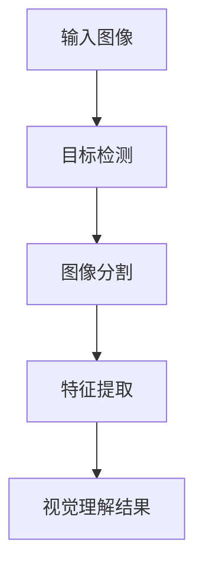
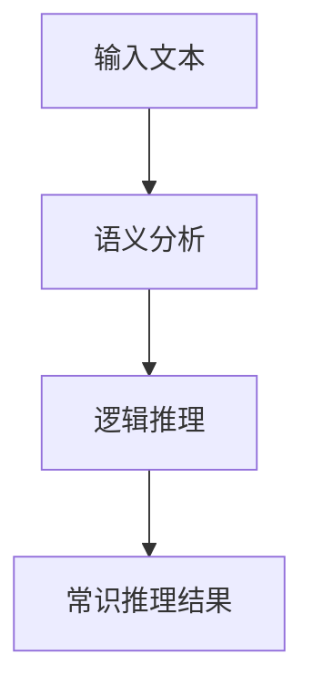
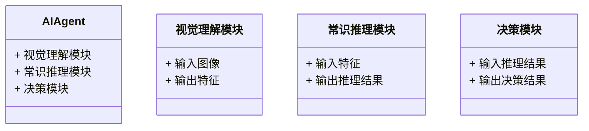
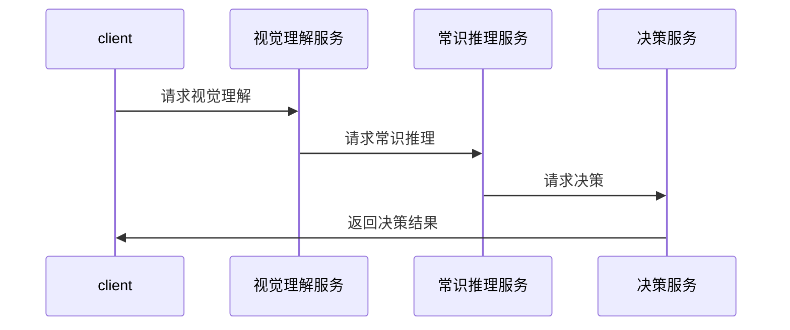

                 


# 开发具有视觉常识推理能力的AI Agent

> 关键词：AI Agent、视觉常识推理、深度学习、知识图谱、多模态数据、场景理解

> 摘要：本文系统地探讨了开发具有视觉常识推理能力的AI Agent的关键技术与实现方法。文章从背景介绍入手，详细分析了视觉常识推理的核心概念与联系，深入讲解了相关算法原理，结合实际案例展示了系统架构设计与项目实战，并展望了未来的发展方向。文章结构清晰，内容详实，适合对AI Agent和视觉常识推理感兴趣的读者阅读。

---

## 第一部分: 开发具有视觉常识推理能力的AI Agent背景介绍

### 第1章: 视觉常识推理的背景与问题背景

#### 1.1 问题背景

##### 1.1.1 从传统AI到视觉常识推理的演进

传统AI主要依赖规则和逻辑推理，但在处理复杂的视觉理解和常识推理任务时显得力不从心。近年来，随着深度学习和计算机视觉技术的快速发展，AI Agent逐渐具备了处理视觉信息的能力，但如何将视觉信息与常识推理相结合，仍然是一个开放性问题。

##### 1.1.2 当前AI Agent的局限性

当前的AI Agent在视觉理解方面仍存在以下问题：
- **语义理解不足**：难以理解图像中物体的上下文关系和场景的潜在含义。
- **常识推理能力有限**：无法将视觉信息与常识知识库有效结合，难以进行跨模态推理。
- **实时性与鲁棒性不足**：在复杂场景下，视觉理解和常识推理的效率和准确性有待提升。

##### 1.1.3 视觉常识推理的必要性

视觉常识推理是AI Agent实现真正智能的关键，它能够帮助AI Agent理解场景中的物体、事件和关系，从而做出更合理的决策。

#### 1.2 问题描述

##### 1.2.1 AI Agent在视觉理解中的挑战

- **多模态数据的融合**：如何将图像数据与常识知识库有效结合。
- **动态场景的处理**：在动态环境中，视觉理解和常识推理需要实时更新。
- **推理的准确性**：如何保证视觉理解和常识推理的准确性，尤其是在复杂场景下。

##### 1.2.2 常识推理在AI Agent中的作用

常识推理能够帮助AI Agent理解场景中的潜在含义，例如：
- 理解“杯子放在桌子上”意味着杯子不会掉下来。
- 推断“下雨了”意味着人们会打伞。

##### 1.2.3 视觉与常识推理结合的难点

- **数据表示**：如何将视觉信息和常识知识库统一表示。
- **推理机制**：如何设计高效的推理算法，将视觉信息与常识知识结合。
- **计算效率**：如何在保证准确性的前提下，提高推理效率。

#### 1.3 问题解决

##### 1.3.1 视觉常识推理的核心目标

- 实现对场景的语义理解。
- 建立视觉信息与常识知识的桥梁。
- 提供高效的推理机制，支持实时决策。

##### 1.3.2 当前解决方案的优缺点对比

| 解决方案 | 优点 | 缺点 |
|----------|------|------|
| 基于知识图谱的推理 | 结构化知识表示清晰 | 知识获取和更新困难 |
| 基于深度学习的推理 | 数据驱动，效果好 | 缺乏可解释性 |
| 混合式推理 | 结合两者优点 | 实现复杂 |

##### 1.3.3 未来发展的方向与可能性

- **多模态学习**：结合视觉、文本等多种模态信息。
- **可解释性推理**：提高推理的透明度。
- **实时性优化**：提升推理速度，适用于实时场景。

#### 1.4 边界与外延

##### 1.4.1 视觉常识推理的边界

- 专注于场景理解，不涉及高级情感分析。
- 仅限于常识推理，不涉及复杂逻辑推理。

##### 1.4.2 相关领域的区别与联系

| 领域 | 区别 | 联系 |
|------|------|------|
| 计算机视觉 | 数据来源不同 | 可以提供视觉输入 |
| 知识图谱 | 表示方式不同 | 可以提供常识知识 |

##### 1.4.3 技术发展的潜在影响

- **智能机器人**：提升机器人对环境的理解能力。
- **增强现实**：提供更智能的AR体验。
- **自动驾驶**：提高车辆对复杂场景的判断能力。

---

## 第二部分: 视觉常识推理的核心概念与联系

### 第2章: 视觉常识推理的核心概念与联系

#### 2.1 核心概念原理

##### 2.1.1 视觉理解的基本原理

视觉理解是通过计算机视觉技术对图像进行分析，提取其中的语义信息。其基本步骤包括：
1. **图像采集**：获取输入图像。
2. **目标检测**：识别图像中的物体。
3. **图像分割**：将图像分割成不同的区域。
4. **特征提取**：提取物体的特征信息。
5. **语义理解**：理解物体之间的关系。

##### 2.1.2 常识推理的机制

常识推理是基于常识知识库进行的推理过程。其基本步骤包括：
1. **知识表示**：将常识知识表示为结构化的形式。
2. **推理规则**：定义推理规则。
3. **推理过程**：根据输入的信息和推理规则，进行推理。
4. **结果验证**：验证推理结果的准确性。

##### 2.1.3 视觉与常识推理的结合方式

视觉与常识推理的结合可以通过以下几种方式：
1. **基于知识图谱的视觉推理**：将视觉信息映射到知识图谱中。
2. **端到端视觉推理**：直接从图像中提取信息并进行推理。
3. **混合式推理**：结合视觉信息和常识知识进行推理。

#### 2.2 概念属性特征对比表

| 概念 | 属性 | 特征 |
|------|------|------|
| 视觉理解 | 数据来源 | 图像/视频 |
|        | 处理方式 | 目标检测、图像分割 |
| 常识推理 | 数据来源 | 知识库、常识库 |
|        | 处理方式 | 逻辑推理、语义分析 |

#### 2.3 ER实体关系图

```mermaid
er
actor: AI Agent
goal: 视觉常识推理
relation: 实现
```

---

## 第三部分: 视觉常识推理算法原理

### 第3章: 视觉理解算法原理

#### 3.1 视觉理解算法概述

##### 3.1.1 基础概念

视觉理解算法包括目标检测、图像分割、图像分类等技术。

##### 3.1.2 算法分类

- **基于传统CV的算法**：如SIFT、Harris角点检测。
- **基于深度学习的算法**：如YOLO、Faster R-CNN。

#### 3.2 视觉理解算法流程



#### 3.3 常见视觉理解算法

##### 3.3.1 YOLO目标检测算法

YOLO是一种单阶段目标检测算法，其核心思想是将目标检测问题转化为回归问题。

代码示例：
```python
import torch
model = torch.hub.load('ultralytics/yolov5', 'yolov5s')
result = model.predict(source, save=False)
```

##### 3.3.2 Mask R-CNN图像分割算法

Mask R-CNN在R-CNN的基础上增加了用于实例分割的分支。

代码示例：
```python
from maskrcnn import MaskRCNN
model = MaskRCNN()
result = model.predict(source)
```

---

### 第4章: 常识推理算法原理

#### 4.1 常识推理算法概述

##### 4.1.1 基础概念

常识推理算法包括知识表示、推理规则、推理引擎等。

##### 4.1.2 算法分类

- **基于符号逻辑的推理**：如基于一阶逻辑的推理。
- **基于概率的推理**：如贝叶斯推理。
- **基于神经符号的推理**：结合神经网络和符号逻辑。

#### 4.2 常识推理算法流程



#### 4.3 常见常识推理算法

##### 4.3.1 知识图谱推理算法

知识图谱推理算法通过在知识图谱中查找路径来进行推理。

代码示例：
```python
from kg推理器 import 推理器
推理器 = 推理器()
result = 推理器推理(source)
```

##### 4.3.2 基于规则的推理算法

基于规则的推理算法通过预定义的规则来进行推理。

代码示例：
```python
def 推理规则(source):
    if source[0] and source[1]:
        return True
    else:
        return False
```

---

## 第四部分: 系统分析与架构设计

### 第5章: 系统分析与架构设计

#### 5.1 问题场景介绍

AI Agent需要在复杂场景中进行视觉理解和常识推理，例如智能安防、智能客服等。

#### 5.2 系统功能设计

##### 5.2.1 领域模型设计



#### 5.3 系统架构设计


#### 5.4 系统接口设计

| 接口名称 | 输入 | 输出 |
|----------|------|------|
| 视觉理解接口 | 图像 | 特征 |
| 常识推理接口 | 特征 | 推理结果 |

#### 5.5 系统交互设计



---

## 第五部分: 项目实战

### 第6章: 项目实战

#### 6.1 环境安装

- 安装Python和必要的深度学习框架（如TensorFlow、PyTorch）。
- 安装计算机视觉库（如OpenCV、Matplotlib）。
- 安装知识图谱推理库（如NetworkX）。

#### 6.2 系统核心实现

##### 6.2.1 视觉理解模块实现

```python
import cv2

def 视觉理解(image):
    # 使用OpenCV进行目标检测
    cascade = cv2.CascadeClassifier('haarcascade_frontalface_default.xml')
    faces = cascade.detectMultiScale(image)
    return faces
```

##### 6.2.2 常识推理模块实现

```python
from kg推理器 import 推理器

def 常识推理(faces):
   推理器 = 推理器()
    return 推理器推理(faces)
```

##### 6.2.3 决策模块实现

```python
def 决策(推理结果):
    if 推理结果:
        return "允许进入"
    else:
        return "禁止进入"
```

#### 6.3 代码应用解读与分析

- **视觉理解模块**：通过OpenCV进行目标检测，提取图像中的关键特征。
- **常识推理模块**：基于知识图谱推理库进行推理，结合视觉特征和常识知识进行推理。
- **决策模块**：根据推理结果做出决策。

#### 6.4 实际案例分析

假设输入一张图像，图像中有一张桌子和一个杯子。AI Agent需要推理出“杯子放在桌子上”的含义，即杯子不会掉下来。

---

## 第六部分: 总结与展望

### 第7章: 总结与展望

#### 7.1 项目小结

本文系统地探讨了开发具有视觉常识推理能力的AI Agent的关键技术与实现方法。通过背景介绍、算法原理、系统设计和项目实战，展示了视觉常识推理的实现过程。

#### 7.2 未来展望

未来的研究方向包括：
- **多模态学习**：结合视觉、文本等多种模态信息。
- **可解释性推理**：提高推理的透明度。
- **实时性优化**：提升推理速度，适用于实时场景。

---

## 作者信息

作者：AI天才研究院（AI Genius Institute） & 禅与计算机程序设计艺术（Zen And The Art of Computer Programming）

---

这篇文章系统地介绍了开发具有视觉常识推理能力的AI Agent的关键技术与实现方法，从背景介绍到项目实战，内容详实，逻辑清晰，适合对AI Agent和视觉常识推理感兴趣的读者阅读。

