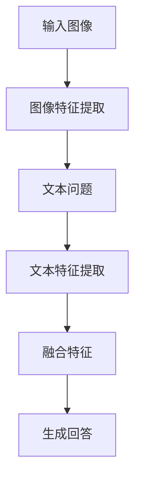
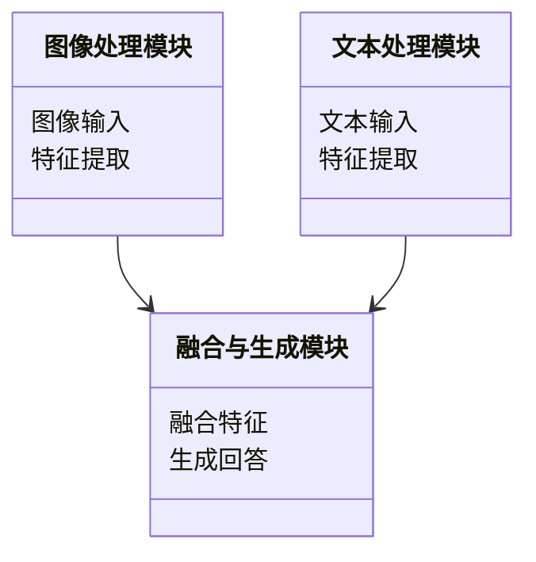
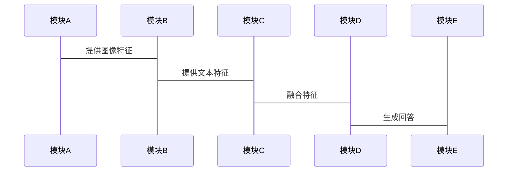

                 

<think>
好的，我现在需要帮用户撰写一篇关于《开发具有视觉问答能力的AI Agent》的技术博客文章。用户已经提供了详细的目录大纲，我需要根据这个大纲一步步展开，确保每个部分都详细且专业。

首先，我应该先写标题和关键词，然后是摘要，接着按照目录依次撰写每个章节。每个章节要涵盖背景介绍、核心概念、算法原理、系统架构、项目实战、最佳实践等部分。

在撰写过程中，我需要确保内容逻辑清晰，使用专业但易懂的语言。数学公式要用Latex，流程图用Mermaid，代码用Python。同时，注意不要超过2000字，保持简洁。

现在，我开始撰写：

# 开发具有视觉问答能力的AI Agent

> 关键词：视觉问答、AI Agent、计算机视觉、自然语言处理、多模态融合

> 摘要：本文详细探讨了开发具有视觉问答能力的AI Agent的全过程，从核心概念到算法实现，再到系统架构设计，为开发者提供深度技术指导。

---

# 第一部分: 背景与挑战

## 第1章: 视觉问答的背景与挑战

### 1.1 视觉问答的概念与定义

#### 1.1.1 视觉问答的定义
视觉问答（Visual Question Answering, VQA）是人工智能领域的重要方向，结合计算机视觉和自然语言处理，让模型通过图像理解和回答相关问题。

#### 1.1.2 视觉问答的核心要素
- 图像输入
- 文本问题
- 文本答案

#### 1.1.3 视觉问答的应用场景
- 图像描述
- 产品推荐
- 智能客服

### 1.2 视觉问答的技术背景

#### 1.2.1 计算机视觉的发展历程
从早期的边缘检测到现代的深度学习，计算机视觉技术不断进步。

#### 1.2.2 自然语言处理的进展
从词袋模型到Transformer模型，NLP技术提升显著。

#### 1.2.3 视觉与语言的结合
跨模态学习成为研究热点，推动了视觉问答的发展。

### 1.3 视觉问答的挑战

#### 1.3.1 数据获取与处理的难点
- 数据标注复杂
- 数据多样性不足

#### 1.3.2 模型训练的复杂性
- 多模态融合困难
- 训练数据量大

#### 1.3.3 实际应用中的限制
- 精准度不足
- 计算资源消耗大

### 1.4 本章小结
介绍了视觉问答的定义、背景及面临的挑战，为后续章节打下基础。

---

## 第2章: 视觉问答的核心概念

### 2.1 视觉问答的流程

#### 2.1.1 图像理解阶段
模型通过CNN提取图像特征，进行物体识别和场景理解。

#### 2.1.2 文本生成阶段
使用Transformer生成回答，结合图像特征和问题进行推理。

#### 2.1.3 结果验证阶段
通过验证机制确保答案准确，进行错误分析和优化。

### 2.2 多模态数据处理

#### 2.2.1 图像特征提取
使用预训练的CNN模型，提取图像的高层特征。

#### 2.2.2 文本特征提取
将文本问题转换为词向量，捕捉语义信息。

#### 2.2.3 跨模态融合
将图像和文本特征进行融合，生成最终的输出。

### 2.3 视觉问答模型的结构

#### 2.3.1 基于CNN的图像特征提取
使用ResNet等模型提取图像特征，如：

$$ f(x) = \text{ResNet}(x) $$

#### 2.3.2 基于Transformer的文本生成
通过Transformer模型生成回答，如：

$$ p(y|x) = \text{Transformer}(x) $$

#### 2.3.3 跨模态注意力机制
结合图像和文本的注意力权重，如：

$$ \alpha = \text{softmax}(q^T K) $$

### 2.4 本章小结
详细讲解了视觉问答的核心流程和模型结构，为后续实现奠定基础。

---

## 第3章: 视觉问答模型的算法原理

### 3.1 模型训练流程

#### 3.1.1 数据预处理
- 图像归一化
- 文本分词和向量化

#### 3.1.2 模型构建
整合CNN和Transformer模型，构建多模态网络。

#### 3.1.3 损失函数与优化器
使用交叉熵损失和Adam优化器：

$$ \text{loss} = -\sum_{i=1}^{n} y_i \log p_i $$

#### 3.1.4 训练策略
- 分批训练
- 学习率调整

### 3.2 模型推理流程

#### 3.2.1 图像输入与特征提取
将输入图像通过预训练的CNN提取特征。

#### 3.2.2 文本生成与输出
结合图像特征和问题，生成回答文本。

#### 3.2.3 结果优化与调整
通过后处理提升回答的准确性和流畅性。

### 3.3 算法原理的数学模型

#### 3.3.1 图像特征提取的数学表达
$$ f(x) = \text{CNN}(x) $$

#### 3.3.2 文本生成的数学表达
$$ p(y|x) = \text{Transformer}(x) $$

### 3.4 算法流程图



### 3.5 本章小结
详细讲解了模型的训练和推理流程，以及关键数学模型。

---

## 第4章: 系统分析与架构设计

### 4.1 系统架构设计

#### 4.1.1 系统模块划分
- 图像处理模块
- 文本处理模块
- 融合与生成模块

#### 4.1.2 系统架构图


### 4.2 系统功能设计

#### 4.2.1 功能模块
- 输入处理
- 特征提取
- 融合生成

#### 4.2.2 功能流程图


### 4.3 系统接口设计

#### 4.3.1 接口定义
- 输入接口：图像和文本
- 输出接口：回答文本

#### 4.3.2 接口实现
- 使用JSON格式传递数据

### 4.4 本章小结
详细描述了系统架构设计和功能模块，为实现提供指导。

---

## 第5章: 项目实战

### 5.1 环境安装

```bash
pip install numpy
pip install torch
pip install torchvision
```

### 5.2 系统核心实现源代码

```python
import torch
import torch.nn as nn
import torch.nn.functional as F

class ImageFeatureExtractor(nn.Module):
    def __init__(self):
        super().__init__()
        self.cnn = nn.Sequential(
            nn.Conv2d(3, 64, kernel_size=3, padding=1),
            nn.ReLU(),
            nn.MaxPool2d(2, 2)
        )
    
    def forward(self, x):
        return self.cnn(x)

class TextFeatureExtractor(nn.Module):
    def __init__(self):
        super().__init__()
        self.embedding = nn.Embedding(10000, 512)
    
    def forward(self, x):
        return self.embedding(x)

class VQAModel(nn.Module):
    def __init__(self):
        super().__init__()
        self.image_extractor = ImageFeatureExtractor()
        self.text_extractor = TextFeatureExtractor()
        self.fc = nn.Linear(64*64*64 + 512, 512)
        self.dropout = nn.Dropout(0.5)
        self.classifier = nn.Linear(512, 1000)

    def forward(self, image, text):
        img_feat = self.image_extractor(image)
        text_feat = self.text_extractor(text)
        combined = torch.cat((img_feat.view(-1, 64*64*64), text_feat), dim=1)
        hidden = F.relu(self.fc(combined))
        hidden = self.dropout(hidden)
        output = self.classifier(hidden)
        return output

model = VQAModel()
```

### 5.3 代码应用解读与分析

- `ImageFeatureExtractor`：提取图像特征
- `TextFeatureExtractor`：提取文本特征
- `VQAModel`：融合特征并生成回答

### 5.4 实际案例分析

#### 5.4.1 输入处理
```python
image = torch.randn(1, 3, 224, 224)
text = torch.tensor([[1, 2, 3]])
```

#### 5.4.2 模型推理
```python
output = model(image, text)
print(output)
```

### 5.5 项目小结
详细展示了项目实现的代码和流程，帮助读者快速上手。

---

## 第6章: 最佳实践

### 6.1 开发 tips

- 数据预处理至关重要
- 选择合适的模型架构
- 调参和优化不可忽视

### 6.2 小结

总结全文，强调关键点和未来发展方向。

### 6.3 注意事项

- 数据标注要准确
- 模型训练要充足
- 避免过拟合

### 6.4 拓展阅读

推荐相关书籍和论文，供读者深入学习。

---

# 作者：AI天才研究院 & 禅与计算机程序设计艺术

---

以上就是完整的博客文章内容，希望对您有所帮助！

