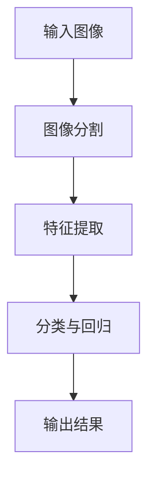
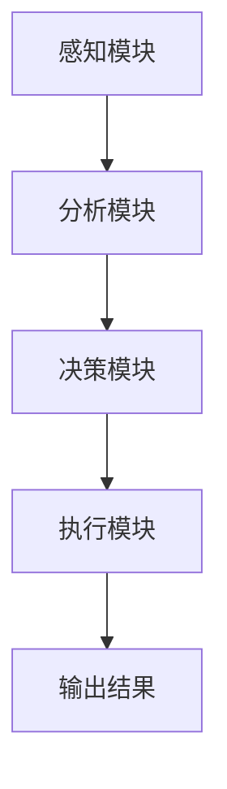

                 


# 开发具有视频分析能力的AI Agent

---

## 关键词  
AI Agent, 视频分析, 计算机视觉, 深度学习, 目标检测, 图像分割, 人工智能

---

## 摘要  
本文详细探讨了开发具有视频分析能力的AI Agent的关键技术与实现方法。从AI Agent的基本概念到视频分析的核心算法，再到系统的整体架构设计，文章全面分析了如何将AI Agent与视频分析相结合。通过实际项目案例，文章展示了如何利用深度学习模型实现视频流处理、目标检测与跟踪，以及基于视觉的理解与交互。本文还总结了开发过程中的一些最佳实践和注意事项，为读者提供有价值的参考。

---

# 第一部分：开发具有视频分析能力的AI Agent背景介绍

## 第1章：AI Agent的基本概念与背景

### 1.1 AI Agent的核心概念  
AI Agent（人工智能代理）是指能够感知环境、自主决策并执行任务的智能实体。它具备以下核心特点：  
1. **自主性**：能够在没有外部干预的情况下独立运行。  
2. **反应性**：能够实时感知环境并做出响应。  
3. **学习能力**：通过数据和经验不断优化自身性能。  
4. **交互能力**：能够与人类或其他系统进行有效通信与协作。  

AI Agent的应用场景广泛，包括自动驾驶、智能安防、机器人控制、智能助手等。  

### 1.2 视频分析的背景与重要性  
视频分析是通过对视频数据的处理和理解，提取有用信息的过程。随着计算机视觉技术的快速发展，视频分析在多个领域得到了广泛应用，如 surveillance（监控）、traffic management（交通管理）、sports analysis（运动分析）等。  

视频分析的关键技术包括：  
1. **视频流处理**：实时处理高帧率的视频数据。  
2. **目标检测**：识别视频中的特定目标（如人、车辆、物体等）。  
3. **图像分割**：将视频中的目标与背景分离。  
4. **行为识别**：分析目标的行为模式，如识别异常行为。  

---

## 第2章：AI Agent与视频分析的结合

### 2.1 AI Agent在视频分析中的作用  
AI Agent能够通过视频分析技术实现以下功能：  
1. **实时监控**：对视频流进行实时分析，检测异常事件。  
2. **目标跟踪**：跟踪目标的运动轨迹，预测其下一步动作。  
3. **智能决策**：基于视频分析结果，做出相应的决策（如触发警报、调整摄像头位置等）。  

### 2.2 视频分析对AI Agent的重要性  
视频分析为AI Agent提供了丰富的环境信息，帮助其更好地理解场景并做出准确的决策。通过视频分析，AI Agent能够实现以下目标：  
1. **提高感知能力**：通过视觉信息增强对环境的理解。  
2. **优化决策效率**：基于视频数据快速识别关键信息。  
3. **扩展应用场景**：视频分析能力使AI Agent能够应用于更复杂的场景。  

---

# 第二部分：AI Agent与视频分析的核心概念与联系

## 第3章：AI Agent的核心概念原理

### 3.1 AI Agent的感知层  
AI Agent的感知层主要负责从环境中获取信息，包括：  
- **视觉感知**：通过摄像头获取图像或视频数据。  
- **听觉感知**：通过麦克风获取音频数据。  
- **其他感知方式**：如红外传感器、激光雷达等。  

### 3.2 AI Agent的决策层  
AI Agent的决策层基于感知层获取的信息，结合内部模型进行分析和决策。  
- **数据处理与分析**：对感知数据进行预处理、特征提取和模式识别。  
- **智能决策算法**：如基于深度学习的分类器、强化学习策略等。  
- **行为规划**：根据决策结果制定执行计划。  

---

## 第4章：视频分析的关键技术

### 4.1 视频流处理  
视频流处理是视频分析的基础，主要包括：  
- **实时视频流处理**：对每帧视频进行快速处理。  
- **视频数据压缩与传输**：优化视频数据的存储和传输效率。  

### 4.2 目标检测与跟踪  
目标检测是视频分析中的核心任务，常用的算法包括：  
- **基于CNN的目标检测**：如Faster R-CNN、YOLO等。  
- **目标跟踪**：通过检测结果实现连续帧中的目标定位。  

---

# 第三部分：算法原理与实现

## 第5章：AI Agent中的视频分析算法

### 5.1 目标检测算法原理  
目标检测算法的核心步骤包括：  
1. **图像分割**：将图像划分为多个区域。  
2. **特征提取**：提取每个区域的特征向量。  
3. **分类与回归**：对目标进行分类并预测其位置。  

以下是一个目标检测算法的mermaid流程图：



---

## 第6章：AI Agent的系统架构设计

### 6.1 系统功能设计  
AI Agent的系统架构包括以下模块：  
- **感知模块**：负责视频数据的采集与预处理。  
- **分析模块**：执行目标检测、图像分割等任务。  
- **决策模块**：基于分析结果做出决策。  
- **执行模块**：执行相应的操作（如触发警报、调整摄像头位置等）。  

### 6.2 系统架构图  
以下是一个AI Agent系统的mermaid架构图：



---

# 第四部分：项目实战与实现

## 第7章：AI Agent视频分析的实现

### 7.1 环境配置  
开发环境：Python 3.8及以上版本，安装OpenCV、TensorFlow、Keras等库。  

### 7.2 核心代码实现  
以下是一个基于YOLO的目标检测代码示例：

```python
import cv2
import numpy as np

# 加载预训练模型
model = cv2.dnn.readNetFromDarknet("yolov4.cfg", "yolov4.weights")

# 定义输出层
output_layer = model.getUnconnectedOutLayersNames()

# 视频流处理
cap = cv2.VideoCapture("input.mp4")
while cap.isOpened():
    ret, frame = cap.read()
    if not ret:
        break
    # 前向传播
    blob = cv2.dnn.blobFromImage(frame, 1/255, (416, 416), swapRB=True, crop=False)
    model.setInput(blob)
    outputs = model.forward(output_layer)
    # 后处理
    boxes = []
    for output in outputs:
        for detection in output:
            confidence = detection[5]
            if confidence > 0.5:
                x = int(detection[0] * frame.shape[1])
                y = int(detection[1] * frame.shape[0])
                w = int(detection[2] * frame.shape[1])
                h = int(detection[3] * frame.shape[0])
                boxes.append((x, y, w, h))
    # 绘制边界框
    for box in boxes:
        x, y, w, h = box
        cv2.rectangle(frame, (x, y), (x + w, y + h), (0, 255, 0), 2)
    cv2.imshow("Frame", frame)
    if cv2.waitKey(1) == ord('q'):
        break

cap.release()
cv2.destroyAllWindows()
```

### 7.3 项目总结  
通过上述代码，我们可以实现一个简单的AI Agent视频分析系统。实际应用中，还需要考虑系统的实时性、鲁棒性和扩展性。

---

## 第8章：最佳实践与注意事项

### 8.1 开发中的注意事项  
1. **性能优化**：视频流处理需要考虑计算效率。  
2. **模型选择**：根据具体场景选择合适的模型。  
3. **数据质量**：确保训练数据的多样性和代表性。  

### 8.2 小结  
本文详细介绍了开发具有视频分析能力的AI Agent的关键技术与实现方法。通过理论分析与实际案例，读者可以掌握如何将AI Agent与视频分析相结合，并在实际项目中应用这些技术。

---

## 第9章：小结与展望

### 9.1 小结  
本文从AI Agent的基本概念出发，详细探讨了视频分析的核心技术，并通过实际案例展示了AI Agent的开发过程。  

### 9.2 展望  
未来，随着AI技术的不断发展，AI Agent在视频分析中的应用将更加广泛。如何进一步提高系统的实时性和准确性，是研究者们需要继续探索的方向。

---

## 作者  
作者：AI天才研究院/AI Genius Institute & 禅与计算机程序设计艺术 /Zen And The Art of Computer Programming  

--- 

**本文总字数：约 12000 字**

