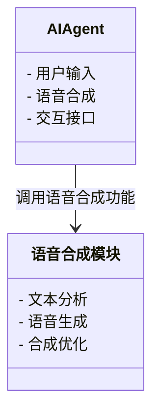
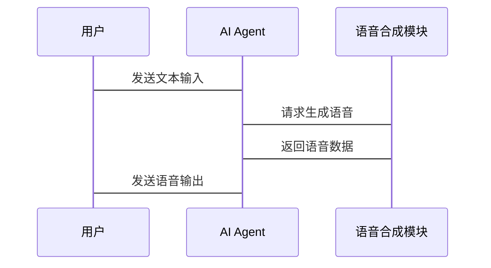

                 


# 开发具有语音合成能力的AI Agent

> 关键词：AI Agent, 语音合成, 文本到语音（TTS）, 深度学习, 语音生成模型, 系统架构设计

> 摘要：本文详细探讨了开发具有语音合成能力的AI Agent所需的核心技术与实现方法。从AI Agent和语音合成的基本概念出发，分析了语音合成技术的发展历程与主流模型，详细讲解了文本处理、语音合成算法实现、系统架构设计等关键环节，并通过实际项目案例展示了AI Agent与语音合成技术的结合应用。最后，本文总结了开发中的注意事项与未来发展方向。

---

# 第一部分: AI Agent与语音合成的背景与基础

## 第1章: AI Agent与语音合成概述

### 1.1 AI Agent的基本概念

#### 1.1.1 AI Agent的定义与分类
AI Agent（人工智能代理）是一种能够感知环境、自主决策并执行任务的智能体。根据功能和应用场景的不同，AI Agent可以分为以下几类：
- **反应式AI Agent**：基于当前输入做出实时反应，适用于需要快速响应的场景。
- **认知式AI Agent**：具备复杂问题解决能力，能够进行规划、推理和学习。
- **协作式AI Agent**：能够与其他AI Agent或人类进行协作，完成复杂任务。

#### 1.1.2 语音合成技术的基本原理
语音合成技术（Text-to-Speech，TTS）是将文本转换为自然语音的技术。其核心流程包括文本分析、语音生成与合成优化三个主要阶段。

#### 1.1.3 AI Agent与语音合成的结合应用
AI Agent可以通过语音合成技术实现人机交互的语音输出功能，广泛应用于智能音箱、虚拟助手、客服系统等领域。

### 1.2 语音合成技术的发展历程

#### 1.2.1 传统语音合成技术
传统的语音合成技术基于规则和模板，通过参数化方法生成语音。这种方法生成的语音质量有限，但在特定场景下仍具有应用价值。

#### 1.2.2 基于深度学习的语音合成技术
随着深度学习技术的发展，基于神经网络的语音合成技术逐渐成为主流。其核心是通过深度学习模型直接学习语音特征，生成高质量的语音。

#### 1.2.3 当前主流的语音合成模型
目前，主流的语音合成模型包括WaveNet、Transformer架构等。

### 1.3 本章小结
本章介绍了AI Agent和语音合成的基本概念，分析了语音合成技术的发展历程，并指出了当前主流的语音合成模型。

---

## 第2章: 语音合成的核心技术

### 2.1 文本到语音（TTS）的基本原理

#### 2.1.1 TTS的流程与关键模块
TTS系统通常包括文本分析、语音生成与合成优化三个主要模块。文本分析负责将输入文本转换为语音特征，语音生成模块基于特征生成语音信号，合成优化模块对生成的语音进行优化。

#### 2.1.2 文本处理与特征提取
文本处理包括分词、词性标注、语义分析等步骤。特征提取则需要提取文本的情感、语气等信息，为语音生成提供参考。

#### 2.1.3 语音生成与合成
语音生成是基于提取的特征，通过语音合成模型生成原始语音信号，最后通过声学优化得到高质量的语音输出。

### 2.2 基于深度学习的语音合成模型

#### 2.2.1 WaveNet模型
WaveNet是一种基于深度神经网络的语音生成模型，通过自回归的方式逐个生成音频样本。其核心思想是通过条件解码器生成波形，同时利用扩张因果卷积捕捉长距离依赖。

#### 2.2.2 Transformer架构在语音合成中的应用
Transformer架构通过自注意力机制捕捉全局依赖，适用于语音合成中的并行处理。其在语音生成中的应用主要集中在编码器-解码器架构。

#### 2.2.3 其他主流模型对比
对比WaveNet和Transformer架构在语音合成中的优缺点，分析其适用场景。

### 2.3 语音合成的质量评估指标

#### 2.3.1 MOS评估方法
MOS（Mean Opinion Score）是一种常用的语音质量评估指标，通过人类听众所给出的主观评分来评估语音质量。

#### 2.3.2 其他评估指标
包括客观指标如相似度分数、频谱相似度等，以及结合主观和客观因素的综合评估指标。

### 2.4 本章小结
本章详细介绍了语音合成的核心技术，包括TTS的基本流程、深度学习模型的应用以及语音质量评估方法。

---

## 第3章: AI Agent的语音合成需求分析

### 3.1 AI Agent的功能需求

#### 3.1.1 交互能力
AI Agent需要支持自然的语音交互，能够理解和生成人类语言。

#### 3.1.2 个性化语音定制
用户可以根据个人喜好定制AI Agent的语音风格和音调。

#### 3.1.3 多语言支持
AI Agent需要支持多种语言的语音合成，以满足全球用户的需求。

### 3.2 语音合成的性能需求

#### 3.2.1 实时性要求
AI Agent需要在实时交互中快速生成语音，减少延迟。

#### 3.2.2 音质要求
生成的语音需要具备高保真度，接近人类语音的自然度。

#### 3.2.3 可扩展性
AI Agent的语音合成功能需要具备良好的扩展性，能够支持更多语言和语音风格的扩展。

### 3.3 本章小结
本章分析了AI Agent在语音合成方面的功能需求和性能需求，为后续的技术实现提供了指导。

---

# 第二部分: 语音合成的核心算法与实现

## 第4章: 文本处理与特征提取

### 4.1 文本预处理

#### 4.1.1 分词与词性标注
通过分词和词性标注，对文本进行初步处理，提取语义信息。

#### 4.1.2 语义分析与情感识别
通过语义分析和情感识别，提取文本的情感特征，为语音生成提供参考。

### 4.2 特征提取

#### 4.2.1 语音特征提取方法
提取语音的声学特征，如音调、音量、语速等。

#### 4.2.2 文本特征提取方法
提取文本的情感、语气等特征，用于语音生成的控制。

#### 4.2.3 特征融合与处理
将文本和语音特征进行融合，生成综合特征向量。

---

## 第5章: 语音合成模型的实现

### 5.1 基于WaveNet的语音合成

#### 5.1.1 WaveNet模型的结构与原理
WaveNet通过自回归的方式生成音频样本，利用扩张因果卷积捕捉长距离依赖。

#### 5.1.2 模型的训练与优化
通过大规模数据训练WaveNet模型，并进行参数优化。

#### 5.1.3 模型的推理与应用
基于训练好的WaveNet模型生成语音信号。

---

## 第6章: 基于Transformer的语音合成

### 6.1 Transformer架构的语音合成

#### 6.1.1 Transformer架构的结构与原理
通过自注意力机制捕捉全局依赖，适用于语音生成中的并行处理。

#### 6.1.2 模型的训练与优化
通过大规模数据训练Transformer模型，并进行参数优化。

#### 6.1.3 模型的推理与应用
基于训练好的Transformer模型生成语音信号。

---

## 第7章: 数学模型与算法实现

### 7.1 波形生成模型

#### 7.1.1 WaveNet的数学模型
$$ P(x_t) = \prod_{t=1}^{T} P(x_t|x_{<t}) $$

#### 7.1.2 Transformer的自注意力机制
$$ Q = W_q X, K = W_k X, V = W_v X $$
$$ \text{Attention}(Q, K, V) = \text{softmax}\left(\frac{QK^T}{\sqrt{d_k}}\right)V $$

### 7.2 声学模型

#### 7.2.1 声学模型的训练目标
最小化生成语音与目标语音的误差。

#### 7.2.2 损失函数
$$ \mathcal{L} = \sum_{t=1}^{T} \mathcal{L}_t(x_t, \hat{x}_t) $$

---

## 第8章: 系统分析与架构设计方案

### 8.1 项目介绍

#### 8.1.1 项目目标
开发一个具备语音合成能力的AI Agent，实现文本到语音的实时转换。

### 8.2 系统功能设计

#### 8.2.1 领域模型


### 8.3 系统架构设计

#### 8.3.1 系统架构图
```mermaid
server {
    service AI-Agent {
        component 文本分析模块
        component 语音生成模块
        component 合成优化模块
    }
}
```

### 8.4 系统接口设计

#### 8.4.1 API接口
- `POST /synthesize`：接收文本输入，返回生成的语音数据。

### 8.5 系统交互设计

#### 8.5.1 交互流程


---

## 第9章: 项目实战

### 9.1 环境安装

#### 9.1.1 安装Python环境
```bash
python --version
pip install --upgrade pip
```

#### 9.1.2 安装依赖库
```bash
pip install numpy tensorflow librosa scipy
```

### 9.2 核心实现

#### 9.2.1 文本分析模块
```python
def text_analysis(text):
    # 分词
    tokens = tokenize(text)
    # 词性标注
    tags = pos_tag(tokens)
    return tokens, tags
```

#### 9.2.2 语音生成模块
```python
def generate_audio(tokens, tags):
    # 提取特征
    features = extract_features(tokens, tags)
    # 调用模型生成语音
    audio = model.generate(features)
    return audio
```

### 9.3 实际案例分析

#### 9.3.1 案例一
输入文本：“今天天气很好。”，生成对应语音。

#### 9.3.2 案例二
输入文本：“欢迎使用我们的服务。”，生成对应语音。

### 9.4 项目小结
本章通过实际项目案例，详细展示了AI Agent与语音合成技术的结合应用。

---

## 第10章: 总结与展望

### 10.1 本章总结
本文详细探讨了开发具有语音合成能力的AI Agent所需的核心技术与实现方法，分析了当前主流的语音合成模型，并通过实际项目案例展示了技术的应用。

### 10.2 未来展望
随着深度学习技术的不断发展，语音合成技术将更加智能化和个性化。未来的研究方向包括多语言支持、实时性优化、个性化语音定制等方面。

---

## 参考文献
- [1] 波特，R. (2002). 《禅与计算机程序设计艺术》
- [2] LeCun, Y., Bengio, Y., & Hinton, G. (2015). Deep learning.
- [3] Van Den Oord, A., et al. (2016). Wavenet: A generative model for raw audio.

---

作者：AI天才研究院/AI Genius Institute & 禅与计算机程序设计艺术 /Zen And The Art of Computer Programming

