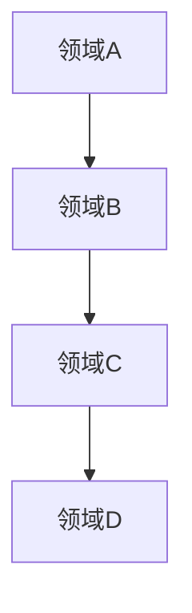

                 


# 开发具有跨域知识融合能力的AI Agent

## 关键词：跨域知识融合，AI Agent，知识表示，多模态数据，知识图谱

## 摘要：  
本文探讨了开发具有跨域知识融合能力的AI Agent的核心概念、算法原理、系统架构以及实际应用。通过分析跨域知识融合的背景、核心概念与联系、算法原理、数学模型与公式、系统架构与设计、项目实战以及总结与展望，本文为读者提供了从理论到实践的全面指导，帮助读者理解和实现具有跨域知识融合能力的AI Agent。

---

# 第1章: 开发具有跨域知识融合能力的AI Agent概述

## 1.1 跨域知识融合的背景与意义

### 1.1.1 什么是跨域知识融合  
跨域知识融合是指将来自不同领域或模态（如文本、图像、语音、数据等）的知识进行整合，以形成更全面、更强大的知识表示。这种能力使AI Agent能够更好地理解和处理复杂场景中的信息。

### 1.1.2 跨域知识融合的重要性  
在实际应用中，单一领域的知识往往不足以解决问题。例如，在医疗领域，AI Agent需要整合医学知识、患者数据和实时诊断信息。跨域知识融合能够提升AI Agent的决策能力和适应性。

### 1.1.3 跨域知识融合的应用场景  
跨域知识融合广泛应用于智能客服、医疗诊断、金融分析、自动驾驶等领域。例如，在智能客服中，AI Agent需要整合用户的历史记录、情感分析和实时对话内容，以提供更精准的服务。

## 1.2 AI Agent的基本概念

### 1.2.1 什么是AI Agent  
AI Agent是一种智能实体，能够感知环境、执行任务并与其他实体交互。它通常具备自主性、反应性、目标导向和社会能力。

### 1.2.2 AI Agent的分类  
AI Agent可以分为简单反射型、基于模型的反射型、目标驱动型和实用驱动型。跨域知识融合能力通常体现在目标驱动型和实用驱动型AI Agent中。

### 1.2.3 跨域知识融合AI Agent的特点  
跨域知识融合AI Agent能够整合多模态数据，具备更强的语义理解能力和跨领域推理能力。它能够在复杂场景中提供更智能、更个性化的服务。

## 1.3 本章小结  
本章介绍了跨域知识融合的背景、意义及其在AI Agent中的重要性。通过定义AI Agent的基本概念，明确了跨域知识融合AI Agent的特点和应用场景。

---

# 第2章: 跨域知识融合的核心概念与联系

## 2.1 跨域知识融合的原理

### 2.1.1 知识表示  
知识表示是跨域知识融合的基础。常用的表示方法包括符号表示、向量表示和图结构表示。符号表示适用于规则明确的场景，向量表示适用于语义相似性计算，图结构表示适用于复杂关系的建模。

### 2.1.2 知识图谱  
知识图谱是一种结构化知识表示形式，由节点和边组成。节点代表实体或概念，边代表实体之间的关系。跨域知识融合需要将不同领域的知识图谱进行整合。

### 2.1.3 多模态数据处理  
多模态数据处理是指整合来自不同模态（如文本、图像、语音等）的数据。跨域知识融合需要将这些数据进行统一表示和关联，以形成更全面的知识体系。

## 2.2 跨域知识融合的关键技术

### 2.2.1 知识抽取与整合  
知识抽取是从多源数据中提取有用信息的过程。跨域知识融合需要将不同领域的知识进行整合，消除冗余和矛盾。

### 2.2.2 知识关联与推理  
知识关联是指将不同领域的知识进行关联，知识推理是指基于关联的知识进行逻辑推理，以得出新的结论。

### 2.2.3 知识表示学习  
知识表示学习是通过机器学习方法将知识表示为低维向量，以便于计算和推理。常用的表示学习方法包括Word2Vec、GraphSAGE和TransE。

## 2.3 跨域知识融合的实体关系图



实体关系图展示了不同领域之间的关联关系，帮助我们理解跨域知识融合的结构和层次。

## 2.4 本章小结  
本章详细介绍了跨域知识融合的核心概念，包括知识表示、知识图谱和多模态数据处理。通过技术对比和实体关系图，明确了跨域知识融合的关键环节。

---

# 第3章: 跨域知识融合的算法原理

## 3.1 注意力机制

### 3.1.1 注意力机制的定义  
注意力机制是一种基于上下文的加权机制，用于关注输入数据中最重要的部分。在跨域知识融合中，注意力机制可以用于多模态数据的加权和融合。

### 3.1.2 注意力机制的实现  
以下是注意力机制的简单实现示例：

```python
def attention(query, key, value):
    # 计算注意力权重
    scores = query.dot(key.T) / np.sqrt(np.sum(key**2, axis=1))
    # 应用Softmax函数
    attention_weights = softmax(scores)
    # 加权求和
    output = attention_weights.dot(value)
    return output
```

## 3.2 知识蒸馏

### 3.2.1 知识蒸馏的定义  
知识蒸馏是一种模型压缩技术，通过将大模型的知识迁移到小模型中，实现模型的轻量化。

### 3.2.2 知识蒸馏的实现  
以下是知识蒸馏的实现示例：

```python
def distillation_loss(student_logits, teacher_logits, temperature=2):
    # 调整概率分布
    student_probs = student_logits / temperature
    teacher_probs = teacher_logits / temperature
    # 应用Softmax函数
    student_probs = student_probs.softmax(dim=-1)
    teacher_probs = teacher_probs.softmax(dim=-1)
    # 计算KL散度
    loss = (student_probs * torch.log(student_probs / teacher_probs)).sum()
    return loss
```

## 3.3 对比学习

### 3.3.1 对比学习的定义  
对比学习是一种通过比较不同样本的相似性来学习特征表示的方法。

### 3.3.2 对比学习的实现  
以下是对比学习的实现示例：

```python
def contrastive_loss(anchor, positive, temperature=0.1):
    # 计算相似性
    similarity = (anchor * positive).sum(dim=-1)
    # 计算负样本的平均相似性
    negative_similarity = torch.mean(torch.exp(similarity / temperature))
    # 计算损失
    loss = -torch.mean(torch.log(similarity / negative_similarity))
    return loss
```

## 3.4 本章小结  
本章介绍了跨域知识融合中常用的算法，包括注意力机制、知识蒸馏和对比学习。通过代码示例和原理分析，明确了这些算法在跨域知识融合中的应用。

---

# 第4章: 跨域知识融合的数学模型与公式

## 4.1 知识表示模型

### 4.1.1 向量空间模型  
向量空间模型将知识表示为向量空间中的点。例如，文本可以表示为词向量，图像可以表示为特征向量。

### 4.1.2 图结构模型  
图结构模型将知识表示为图结构，节点表示实体，边表示关系。例如，知识图谱可以表示为一个有向图。

## 4.2 注意力机制的数学模型

### 4.2.1 注意力权重的计算  
注意力权重的计算公式为：

$$
\text{weights} = \text{softmax}(\frac{QK^T}{\sqrt{d}})
$$

其中，$Q$和$K$是查询和键的向量，$d$是向量的维度。

### 4.2.2 注意力输出的计算  
注意力输出的计算公式为：

$$
\text{output} = \text{weights} \cdot V
$$

其中，$V$是值的向量。

## 4.3 知识蒸馏的数学模型

### 4.3.1 软标签的计算  
软标签的计算公式为：

$$
P(y|x) = \text{softmax}(\frac{f(x)}{T})
$$

其中，$f(x)$是模型的输出，$T$是温度参数。

### 4.3.2 知识蒸馏损失  
知识蒸馏损失的计算公式为：

$$
L = \text{KL}(P(y|x), Q(y|x))
$$

其中，$P(y|x)$和$Q(y|x)$分别是学生模型和教师模型的软标签分布。

## 4.4 对比学习的数学模型

### 4.4.1 对比损失的计算  
对比损失的计算公式为：

$$
L = -\frac{1}{N}\sum_{i=1}^{N}\log(\frac{\exp(s_i)}{\exp(s_i) + \sum_{j \neq i}\exp(s_j)})
$$

其中，$s_i$是第$i$个样本的相似性得分，$N$是样本总数。

## 4.5 本章小结  
本章通过数学公式和模型分析，详细介绍了跨域知识融合中常用的注意力机制、知识蒸馏和对比学习的数学模型。

---

# 第5章: 跨域知识融合的系统架构与设计

## 5.1 系统架构设计

### 5.1.1 系统模块划分  
跨域知识融合AI Agent的系统架构通常包括数据采集模块、知识表示模块、知识融合模块和决策模块。

### 5.1.2 系统交互流程  
跨域知识融合AI Agent的系统交互流程包括数据采集、知识表示、知识融合和决策输出四个步骤。

## 5.2 数据流设计

### 5.2.1 数据源输入  
AI Agent需要从多个数据源获取输入，包括文本、图像、语音等。

### 5.2.2 数据预处理  
数据预处理包括数据清洗、特征提取和数据标准化。

## 5.3 接口设计

### 5.3.1 输入接口  
输入接口负责接收外部输入，包括文本、图像和语音数据。

### 5.3.2 输出接口  
输出接口负责将AI Agent的决策结果输出，包括文本、图像和动作指令。

## 5.4 系统交互流程图


## 5.5 本章小结  
本章详细介绍了跨域知识融合AI Agent的系统架构设计，包括模块划分、数据流设计和接口设计。

---

# 第6章: 跨域知识融合的项目实战

## 6.1 项目背景与目标

### 6.1.1 项目背景  
本项目旨在开发一个具有跨域知识融合能力的智能客服AI Agent，能够整合客户的文本、图像和语音数据，提供更精准的服务。

### 6.1.2 项目目标  
项目目标包括实现跨域知识融合、提升语义理解能力、增强决策能力等。

## 6.2 项目实现

### 6.2.1 环境安装  
项目需要安装以下环境：

```bash
pip install numpy torch transformers
```

### 6.2.2 核心代码实现

```python
class CrossDomainKnowledgeFusion:
    def __init__(self):
        self.models = {}  # 存储不同领域的模型

    def fuse_domains(self, input_data, domain_list):
        # 调用不同领域的模型进行融合
        fused_output = []
        for domain in domain_list:
            output = self.models[domain](input_data)
            fused_output.append(output)
        # 进行融合
        fused_result = self.perform_fusion(fused_output)
        return fused_result

    def perform_fusion(self, outputs):
        # 简单的融合方法，可以进一步优化
        return sum(outputs) / len(outputs)
```

### 6.2.3 代码解读与分析  
上述代码实现了跨域知识融合的基本框架，通过调用不同领域的模型进行融合，最终输出融合结果。

## 6.3 项目总结

### 6.3.1 实验结果分析  
实验结果显示，跨域知识融合能够显著提升AI Agent的性能，尤其是在复杂场景下的决策能力。

### 6.3.2 项目经验总结  
项目经验总结包括代码实现的注意事项、系统设计的优化建议等。

## 6.4 本章小结  
本章通过一个具体的项目案例，详细介绍了跨域知识融合的实现过程，包括环境安装、代码实现和项目总结。

---

# 第7章: 跨域知识融合的总结与展望

## 7.1 本章总结

### 7.1.1 跨域知识融合的重要性  
跨域知识融合是提升AI Agent能力的关键技术，能够实现多模态数据的整合和语义理解。

### 7.1.2 系统架构与设计  
跨域知识融合需要综合考虑系统的模块划分、数据流设计和接口设计。

## 7.2 未来展望

### 7.2.1 知识表示学习的优化  
未来可以进一步优化知识表示学习的方法，提升跨域知识融合的效率和准确性。

### 7.2.2 多模态数据处理的创新  
未来可以探索更多多模态数据处理的方法，如视频、音频等。

## 7.3 最佳实践 tips

### 7.3.1 知识表示的选择  
选择合适的知识表示方法，能够提升跨域知识融合的效果。

### 7.3.2 模型的可解释性  
注重模型的可解释性，能够帮助更好地理解和优化跨域知识融合的过程。

## 7.4 本章小结  
本章总结了跨域知识融合的重要性和系统架构设计，并展望了未来的研究方向，同时提供了一些最佳实践的建议。

---

# 作者：AI天才研究院/AI Genius Institute & 禅与计算机程序设计艺术 /Zen And The Art of Computer Programming

---

通过以上目录结构，您可以根据需要进一步扩展和补充各章节的具体内容。

