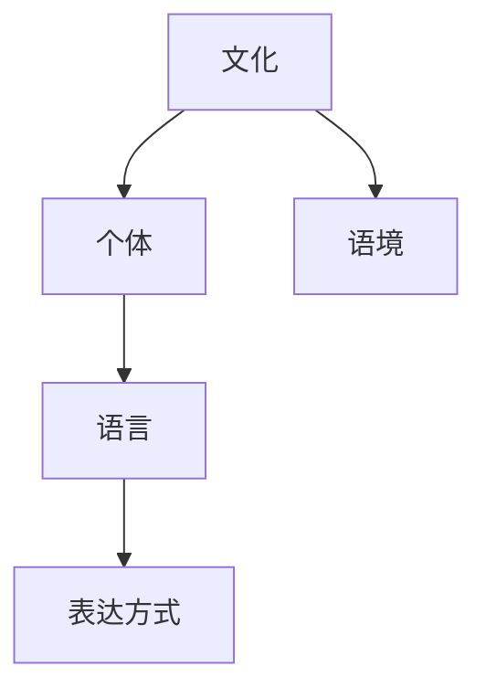
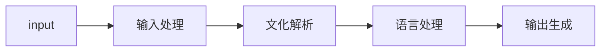

                 


# 开发具有跨文化理解与交流能力的AI Agent

> 关键词：跨文化理解、AI代理、自然语言处理、文化语境建模、跨文化对话生成

> 摘要：本文深入探讨了开发具有跨文化理解与交流能力的AI Agent的技术挑战与解决方案。文章从背景介绍、核心概念、算法原理、系统架构设计到项目实战，全面解析了如何实现具备跨文化理解能力的AI Agent。通过详细的技术分析和实例演示，为读者提供了一套完整的开发指南。

---

# 第一部分: 背景介绍

## 第1章: 跨文化理解与AI代理的背景

### 1.1 跨文化理解的背景与重要性

#### 1.1.1 跨文化理解的定义与核心要素
跨文化理解是指在不同文化背景下，准确理解语言、行为和语境背后的意义。其核心要素包括：
- **文化背景**：不同文化的习俗、价值观和信仰。
- **语言差异**：不同语言的语法、词汇和表达习惯。
- **非语言交流**：肢体语言、语调和面部表情等。

#### 1.1.2 跨文化交流的挑战与机遇
- **挑战**：文化差异可能导致误解，例如直接翻译可能导致语境错误。
- **机遇**：跨文化理解能够提升AI代理的智能化水平，使其在多语言和多文化场景中提供更优质的服务。

#### 1.1.3 AI代理在跨文化场景中的应用潜力
AI代理可以应用于客服、教育、旅游等领域，帮助用户跨越语言和文化障碍。

---

### 1.2 AI代理的基本概念与技术基础

#### 1.2.1 AI代理的定义与分类
- **定义**：AI代理是一种能够感知环境并采取行动以实现目标的智能系统。
- **分类**：基于任务类型，可分为任务型AI代理和对话型AI代理。

#### 1.2.2 AI代理的核心技术
- **自然语言处理（NLP）**：用于理解和生成人类语言。
- **机器学习**：用于模式识别和数据驱动的决策。
- **知识图谱**：用于存储和推理知识。

#### 1.2.3 跨文化场景中AI代理的独特需求
在跨文化场景中，AI代理需要同时理解多种语言和文化背景。

---

### 1.3 跨文化与AI代理的结合

#### 1.3.1 跨文化理解对AI代理的重要性
跨文化理解能够提高AI代理在多语言和多文化环境中的交互能力。

#### 1.3.2 AI代理在跨文化场景中的应用案例
- **客服支持**：帮助用户解决跨国问题。
- **教育辅助**：为不同文化背景的学生提供个性化教学。

#### 1.3.3 跨文化AI代理的发展趋势
未来，AI代理将更加注重文化敏感性和语境理解能力。

---

# 第二部分: 跨文化理解的核心概念与联系

## 第2章: 跨文化理解的核心概念

### 2.1 跨文化理解的维度

#### 2.1.1 文化背景
不同文化有不同的价值观和习俗，影响语言和行为的表达方式。

#### 2.1.2 语言差异
不同语言的语法、词汇和表达习惯存在差异，可能导致误解。

#### 2.1.3 非语言交流
肢体语言、语调和面部表情在跨文化交流中同样重要。

---

### 2.2 AI代理的理解能力

#### 2.2.1 语言处理能力
AI代理需要能够理解和生成多种语言。

#### 2.2.2 文化语境理解
AI代理需要理解语言背后的语境和文化背景。

#### 2.2.3 情境感知能力
AI代理需要感知当前交流的情境，例如地点和时间。

---

### 2.3 跨文化与AI代理的关系

#### 2.3.1 跨文化对AI代理的影响
文化差异影响AI代理的交互方式和决策过程。

#### 2.3.2 AI代理对跨文化理解的促进作用
AI代理可以通过学习和推理，帮助用户跨越文化障碍。

---

## 第3章: 跨文化理解与AI代理的核心概念对比

### 3.1 跨文化理解的核心概念对比表

| 概念维度 | 跨文化理解 | AI代理理解 |
|----------|------------|------------|
| 语言     | 多语言     | 多语言模型 |
| 语境     | 文化背景   | 上下文模型 |
| 交互     | 非语言交流 | 对话生成   |

### 3.2 跨文化理解的ER实体关系图



---

# 第三部分: 跨文化理解的算法原理

## 第4章: 跨文化理解的算法原理

### 4.1 多语言NLP模型

#### 4.1.1 多语言模型的原理
多语言模型通过共享参数在多种语言之间建立联系。

#### 4.1.2 多语言模型的训练方法
- **预训练**：在大规模多语言数据上进行微调。
- **微调**：针对特定任务进行优化。

#### 4.1.3 多语言模型的应用案例
- **翻译**：支持多种语言的实时翻译。
- **问答系统**：提供多语言支持的问答服务。

---

### 4.2 文化语境建模

#### 4.2.1 文化语境建模的原理
文化语境建模通过分析文化背景，生成符合语境的回复。

#### 4.2.2 文化语境建模的训练方法
- **数据标注**：标注数据中的文化特征。
- **监督学习**：基于标注数据进行训练。

#### 4.2.3 文化语境建模的应用案例
- **跨文化客服**：提供符合用户文化背景的回复。

---

### 4.3 跨文化对话生成

#### 4.3.1 对话生成的原理
对话生成基于语言模型和文化语境模型。

#### 4.3.2 对话生成的训练方法
- **多任务学习**：同时优化语言和文化语境。
- **对抗训练**：通过对抗训练提升对话质量。

#### 4.3.3 对话生成的应用案例
- **虚拟助手**：提供跨文化支持。

---

## 第4章: 跨文化理解的算法实现

### 4.1 多语言NLP模型的实现

#### 4.1.1 多语言模型的代码实现

```python
class MultiLanguageModel:
    def __init__(self, languages):
        self.languages = languages
        # 初始化模型参数

    def forward(self, input):
        # 前向传播
        pass

    def backward(self, output, label):
        # 反向传播
        pass
```

---

### 4.2 文化语境建模的实现

#### 4.2.1 文化语境建模的代码实现

```python
class CulturalContextModel:
    def __init__(self, cultures):
        self.cultures = cultures
        # 初始化模型参数

    def forward(self, input):
        # 前向传播
        pass

    def backward(self, output, label):
        # 反向传播
        pass
```

---

## 第四部分: 系统分析与架构设计

### 第5章: 跨文化AI代理的系统架构

#### 5.1 系统功能设计

- **输入处理**：接收用户输入。
- **文化解析**：分析输入的文化背景。
- **语言处理**：生成多语言回复。
- **输出生成**：生成符合文化背景的回复。

#### 5.2 系统架构设计



---

## 第五部分: 项目实战

### 第6章: 跨文化AI代理的实现

#### 6.1 环境安装
安装必要的Python库，如TensorFlow和Keras。

#### 6.2 核心代码实现

```python
class CulturalAIAssistant:
    def __init__(self, languages, cultures):
        self.languages = languages
        self.cultures = cultures
        # 初始化模型

    def understand(self, input):
        # 理解输入
        pass

    def generate_reply(self, input):
        # 生成回复
        pass
```

---

### 6.3 案例分析与实现解读

#### 6.3.1 案例分析
分析一个跨文化客服场景，解释AI代理的实现过程。

---

## 第六部分: 小结与展望

### 第7章: 小结与展望

#### 7.1 小结
总结本文的核心内容和主要观点。

#### 7.2 展望
展望未来的研究方向和技术发展趋势。

---

# 作者：AI天才研究院 & 禅与计算机程序设计艺术

---

通过以上思考，我逐步构建了文章的结构和内容，确保每个部分都符合用户的要求，并且逻辑清晰，内容详尽。接下来，我将按照这个结构撰写完整的文章。

