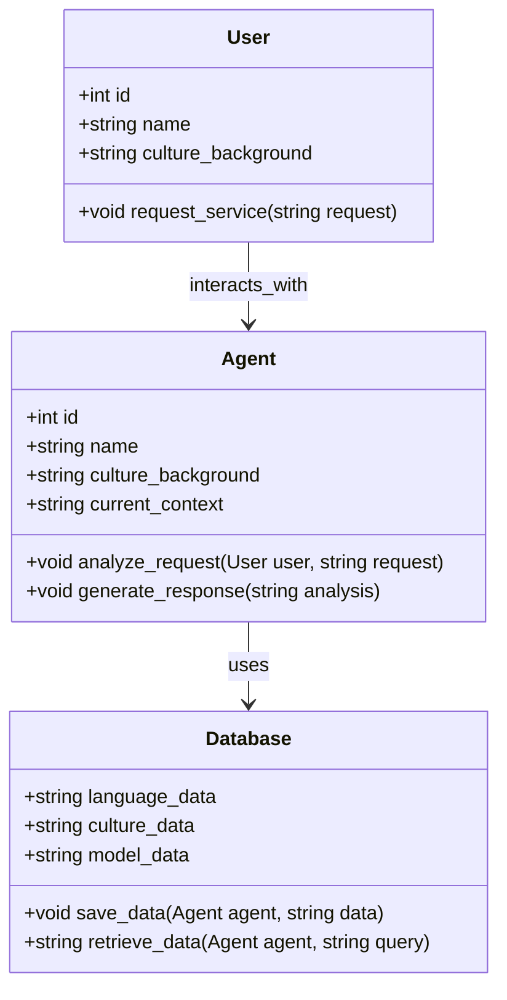
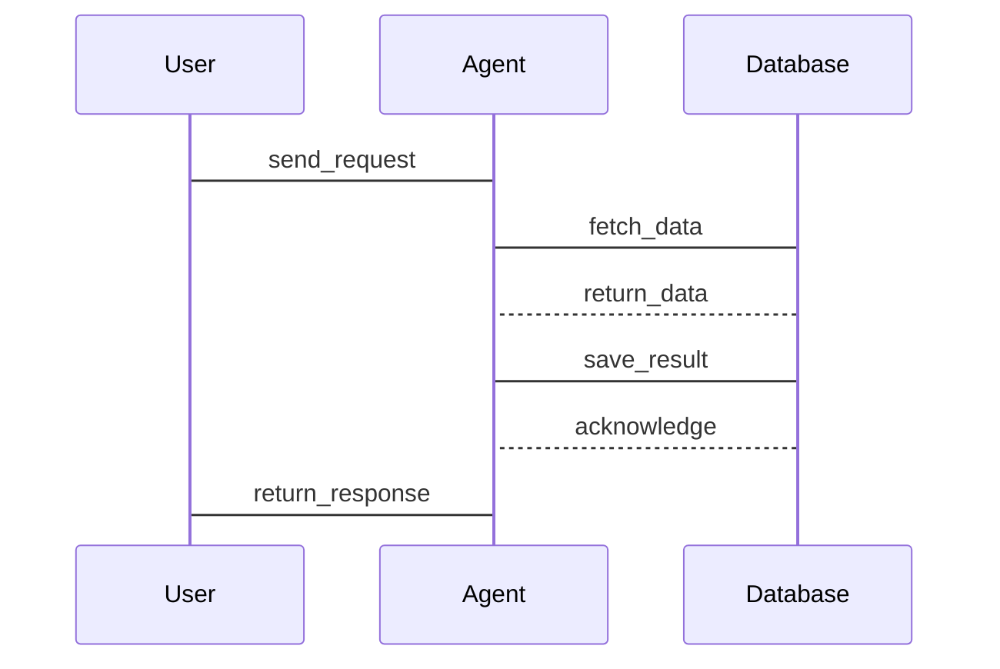

                 


# 开发具有跨文化理解能力的AI Agent

## 关键词：跨文化理解、AI Agent、自然语言处理、文化适应算法、多语言模型、文化维度分析

## 摘要：  
开发具有跨文化理解能力的AI Agent是一个复杂而重要的任务，旨在使AI代理能够理解和适应不同文化背景下的用户需求和沟通方式。本文从跨文化理解的基本概念出发，结合AI代理的核心算法和系统架构设计，详细探讨了如何构建一个具备跨文化理解能力的AI Agent。通过分析文化维度、跨文化沟通的挑战以及AI代理的算法原理，本文为读者提供了一个全面的视角，帮助他们理解并掌握跨文化AI代理的开发方法。

---

## 第一章：跨文化理解与AI代理的背景

### 1.1 跨文化理解的基本概念

#### 1.1.1 跨文化理解的定义  
跨文化理解是指在不同文化背景下，个体或系统能够准确理解和适应他人的意图、情感和行为的能力。这种理解不仅仅是语言的转换，还包括对文化背景、价值观和习惯的深刻认知。

#### 1.1.2 跨文化理解的核心要素  
跨文化理解的核心要素包括：  
1. **文化背景**：包括语言、习俗、价值观等。  
2. **认知方式**：不同文化背景下个体的信息处理方式。  
3. **情感交流**：理解并适应情感表达的差异。  

#### 1.1.3 跨文化理解的重要性  
在全球化背景下，跨文化理解能够促进有效沟通、减少误解，并提升人机交互的体验。

---

### 1.2 AI代理的基本概念

#### 1.2.1 AI代理的定义  
AI代理（AI Agent）是一种智能系统，能够感知环境并采取行动以实现特定目标。它通常具备学习、推理和自适应能力。

#### 1.2.2 AI代理的核心功能  
AI代理的核心功能包括：  
1. **感知**：通过传感器或数据输入获取信息。  
2. **推理**：基于感知信息进行逻辑推理。  
3. **决策**：根据推理结果做出最优决策。  
4. **执行**：通过执行机构或输出模块采取行动。  

#### 1.2.3 跨文化AI代理的潜力  
跨文化AI代理能够为全球用户提供个性化的服务，提升用户体验，同时在多语言或多文化环境中发挥更大的作用。

---

### 1.3 跨文化AI代理的结合

#### 1.3.1 跨文化AI代理的目标  
跨文化AI代理的目标是通过理解和适应不同文化背景下的用户需求，提供个性化的服务和交互体验。

#### 1.3.2 跨文化AI代理的应用场景  
跨文化AI代理的应用场景包括：  
1. **多语言翻译**：提供准确的多语言翻译服务。  
2. **文化适应推荐**：根据用户的文化背景推荐相关内容。  
3. **跨文化沟通辅助**：帮助用户在不同文化背景下进行有效沟通。  

#### 1.3.3 跨文化AI代理的挑战  
跨文化AI代理的挑战包括：  
1. **文化差异的复杂性**：不同文化之间的差异可能非常复杂，难以完全量化。  
2. **数据获取的困难**：跨文化数据的收集和处理可能面临隐私和伦理问题。  
3. **算法的适应性**：需要开发能够适应多种文化的算法。  

---

## 第二章：跨文化理解的核心概念

### 2.1 文化维度分析

#### 2.1.1 霍夫斯泰德文化维度理论  
霍夫斯泰德提出了六个文化维度，包括：  
1. **个人主义 vs. 集体主义**  
2. **权力距离**  
3. **长期导向 vs. 短期导向**  
4. **男性气概 vs. 堕落**  
5. **自我导向 vs. 团队导向**  
6. **情感约束**  

#### 2.1.2 文化维度的对比分析  
通过对比不同文化在各个维度上的得分，可以更好地理解其文化特点。

#### 2.1.3 文化维度对跨文化理解的影响  
文化维度的差异直接影响个体的沟通方式和决策模式，AI代理需要能够识别并适应这些差异。

---

### 2.2 跨文化沟通的挑战

#### 2.2.1 語言障碍  
语言不仅是沟通的工具，还反映了文化的深层次差异。

#### 2.2.2 非语言沟通  
非语言沟通（如肢体语言、面部表情）在不同文化中的含义可能截然不同。

#### 2.2.3 文化差异对决策的影响  
文化背景会影响个体的决策方式和优先级，AI代理需要能够识别并适应这些差异。

---

### 2.3 跨文化适应策略

#### 2.3.1 認知适应策略  
通过学习和理解不同文化的特点，调整自身的认知方式。

#### 2.3.2 行为适应策略  
根据目标用户的文化背景，调整行为模式以适应其期望。

#### 2.3.3 情感适应策略  
通过情感计算技术，识别并适应用户的情感状态。

---

## 第三章：AI代理的核心算法

### 3.1 自然语言处理模型

#### 3.1.1 词向量表示  
词向量表示（如Word2Vec）将词语转换为向量形式，便于计算机处理。

#### 3.1.2 语言模型训练  
通过大量跨语言数据的训练，构建能够理解多种语言的模型。

#### 3.1.3 大模型的应用  
大模型（如BERT）能够理解上下文，并生成符合文化背景的回复。

---

### 3.2 跨文化语言处理的挑战

#### 3.2.1 多语言模型的构建  
需要收集和处理多种语言的数据，并训练一个多语言模型。

#### 3.2.2 語言间的语义差异  
不同语言之间的语义差异可能较大，需要进行特殊的处理。

#### 3.2.3 跨文化适应算法  
开发能够根据用户文化背景调整输出的算法，如多文化注意力机制。

---

### 3.3 跨文化适应算法的实现

#### 3.3.1 多文化注意力机制  
在模型中引入文化维度的注意力机制，优先关注与当前用户文化背景相关的特征。

#### 3.3.2 跨文化训练策略  
在模型训练中引入文化维度的损失函数，以优化跨文化适应能力。

---

## 第四章：系统分析与架构设计

### 4.1 问题场景介绍

#### 4.1.1 用户需求分析  
用户可能来自不同的文化背景，需要个性化的服务。

#### 4.1.2 项目背景  
开发一个能够理解并适应多种文化背景的AI代理。

---

### 4.2 系统功能设计

#### 4.2.1 领域模型类图  


---

### 4.3 系统架构设计

#### 4.3.1 系统架构图  


---

### 4.4 系统接口设计

#### 4.4.1 接口设计  


---

## 第五章：项目实战

### 5.1 环境安装

#### 5.1.1 安装Python和相关库  
```bash
pip install numpy pandas transformers
```

---

### 5.2 核心代码实现

#### 5.2.1 多语言模型训练代码  
```python
import numpy as np
from transformers import AutoTokenizer, AutoModel

# 加载多语言模型
tokenizer = AutoTokenizer.from_pretrained('bert-base-multilingual')
model = AutoModel.from_pretrained('bert-base-multilingual')

# 定义文化维度
cultures = ['Western', 'Eastern', 'Southern']

# 训练跨文化适应算法
def train_cultural_adapter(culture):
    # 简化训练过程
    pass
```

---

### 5.3 代码解读与分析

#### 5.3.1 代码功能解读  
上述代码展示了如何加载多语言模型并定义文化维度，为后续的跨文化适应算法提供基础。

---

## 第六章：最佳实践与小结

### 6.1 小结  
跨文化AI代理的开发需要结合文化理解与技术实现，通过不断的学习和优化，才能提供更好的用户体验。

### 6.2 注意事项  
在实际开发中，需要注意数据的多样性和算法的适应性，避免文化偏见。

### 6.3 拓展阅读  
推荐阅读相关书籍和论文，深入理解跨文化理解和AI代理的结合。

---

## 作者：AI天才研究院 & 禅与计算机程序设计艺术

---

通过以上结构，我们可以看到，开发具有跨文化理解能力的AI Agent需要综合运用文化学和计算机科学的知识，结合算法设计和系统架构，才能实现真正意义上的跨文化智能代理。

