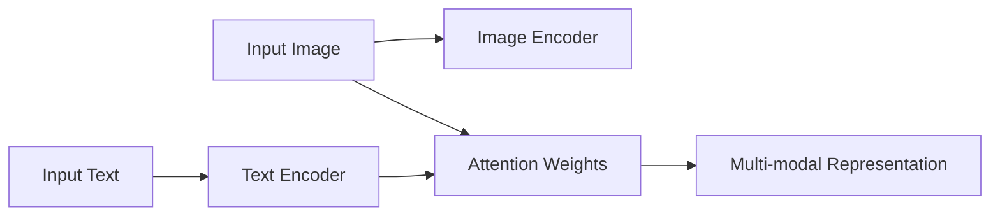
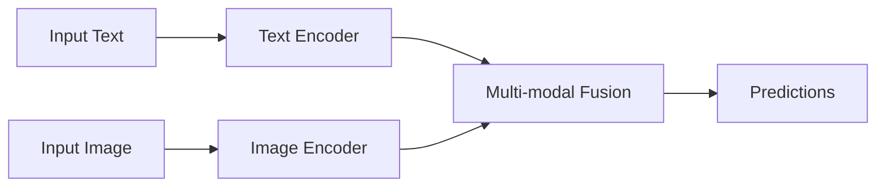
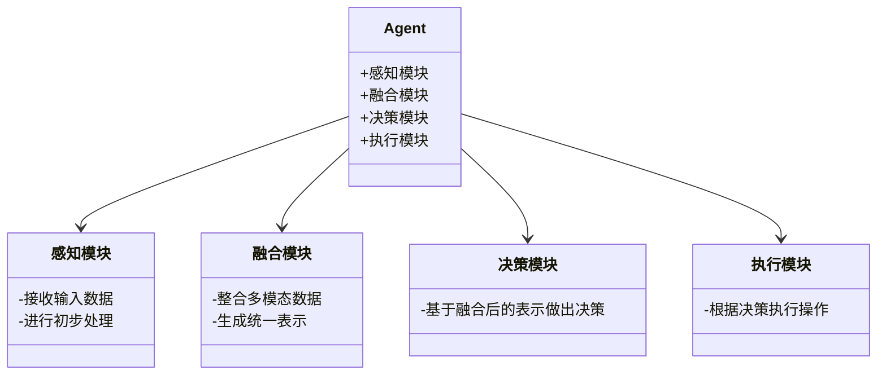
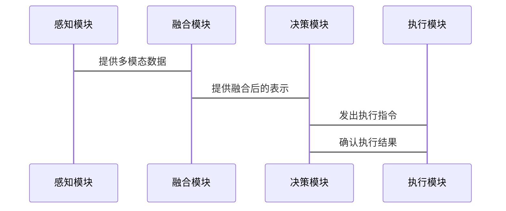

                 


# 开发具有跨模态学习能力的AI Agent

> 关键词：跨模态学习，AI Agent，多模态数据融合，注意力机制，系统架构设计

> 摘要：本文详细探讨了开发具有跨模态学习能力的AI Agent的核心概念、算法原理、系统架构设计以及实际项目实现。通过分析跨模态学习的基本原理和应用场景，结合具体的算法实现和系统设计，为读者提供一个全面的指导，帮助他们理解并掌握跨模态学习在AI Agent中的应用。

---

## 第一部分：跨模态学习与AI Agent基础

### 第1章：跨模态学习与AI Agent概述

#### 1.1 跨模态学习的基本概念

跨模态学习是指AI系统能够理解并整合多种类型的数据（如文本、图像、语音、视频等），从而实现更强大的感知和推理能力。与传统单一模态的学习方式不同，跨模态学习能够通过多模态数据的协同工作，提升模型的泛化能力和应用场景的多样性。

- **定义**：跨模态学习是指在同一任务中，结合来自不同模态的数据（如文本和图像）进行学习和推理的过程。
- **特点**：跨模态学习能够通过多模态数据的互补性，提升模型的准确性和鲁棒性。
- **与传统AI的区别**：传统AI通常基于单一模态数据进行学习，而跨模态学习能够结合多种模态数据，从而更接近人类的多感官学习方式。

#### 1.2 AI Agent的基本概念

AI Agent是一种能够感知环境、自主决策并执行任务的智能实体。AI Agent可以通过传感器或接口与外部环境交互，并根据任务需求采取相应的行动。

- **定义**：AI Agent是一种智能实体，能够感知环境、执行任务并做出决策。
- **核心功能**：感知、推理、决策、执行。
- **跨模态学习在AI Agent中的作用**：通过跨模态学习，AI Agent能够整合多种模态的数据，从而更全面地感知环境并做出更准确的决策。

#### 1.3 跨模态学习的背景与应用前景

- **背景**：随着传感器技术的发展和多模态数据的普及，跨模态学习在AI Agent中的应用需求日益增长。
- **应用领域**：智能助手、智能安防、自动驾驶、机器人控制等。
- **挑战与机遇**：跨模态学习在提升AI Agent能力的同时，也面临数据对齐、模型复杂性和计算资源的挑战。

---

### 第2章：跨模态学习的核心概念与原理

#### 2.1 跨模态数据的表示与融合

- **数据表示方法**：将不同模态的数据转换为统一的表示形式（如向量、概率分布等）。
- **数据融合策略**：通过加权融合、注意力机制等方式，将多模态数据整合为一个统一的表示。
- **数学模型**：通过矩阵运算或深度学习模型实现多模态数据的融合。

| 数据表示方法 | 优点 | 缺点 |
|----------------|------|------|
| 向量表示 | 简单易懂 | 信息损失 |
| 概率分布 | 能够表达不确定性 | 计算复杂 |
| 异构图表示 | 适合复杂关系 | 实现复杂 |

#### 2.2 跨模态学习的注意力机制

- **注意力机制的基本原理**：通过计算输入数据中不同部分的重要性，集中关注关键信息。
- **跨模态注意力机制的应用**：在多模态数据中，注意力机制可以用于跨模态的信息检索和数据对齐。
- **优缺点**：能够提升模型的表达能力，但可能导致计算资源消耗较大。



---

#### 2.3 跨模态学习的损失函数与优化

- **损失函数**：衡量模型输出与真实值之间的差异，常用的有交叉熵损失、均方误差等。
- **优化方法**：通过梯度下降等优化算法，最小化损失函数。
- **训练策略**：包括预训练、微调等。

---

## 第3章：跨模态学习的算法原理

### 3.1 多模态模型的基本结构

- **输入输出结构**：模型接受多种模态的输入，并输出统一的表示或决策。
- **编码器与解码器**：编码器将输入数据转换为潜在表示，解码器根据潜在表示生成输出。
- **训练流程**：包括数据预处理、模型训练、模型评估等步骤。



### 3.2 跨模态注意力模型

- **结构**：模型通过注意力机制对多模态数据进行加权融合。
- **训练方法**：通过反向传播算法训练模型参数。
- **优缺点**：能够提升模型的表达能力，但可能导致计算资源消耗较大。

---

### 3.3 跨模态对比学习

- **对比学习的基本原理**：通过最大化相似样本之间的相似性，最小化不相似样本之间的相似性。
- **跨模态对比学习的应用**：在多模态数据中，对比学习可以用于跨模态的数据对齐和信息检索。
- **数学模型**：通过对比损失函数实现跨模态数据的对齐。

$$ L = -\log(\text{sim}(x_i, y_j) + \lambda) $$

---

## 第4章：跨模态学习的系统架构与设计

### 4.1 跨模态AI Agent的系统架构

- **模块划分**：包括感知模块、融合模块、决策模块和执行模块。
- **数据流设计**：数据从多个模态输入，经过融合后生成统一的表示，最终输出决策。
- **接口设计**：定义模块之间的接口，确保数据的顺利传输和模块的协同工作。



---

### 4.2 系统交互设计

- **场景介绍**：AI Agent通过多个传感器接收环境数据，经过融合模块生成统一表示，决策模块根据表示做出决策，并通过执行模块执行操作。
- **交互流程**：数据输入 -> 数据融合 -> 决策 -> 执行。



---

## 第5章：项目实战

### 5.1 环境配置

- **安装依赖**：安装所需的深度学习框架（如TensorFlow、PyTorch）和其他工具。
- **配置开发环境**：设置Python版本、虚拟环境等。

### 5.2 核心代码实现

- **多模态数据加载**：读取文本和图像数据。
- **模型定义**：定义多模态融合模型。
- **模型训练**：训练模型并在验证集上进行评估。

```python
import torch
import torch.nn as nn

class MultiModalAgent(nn.Module):
    def __init__(self, text_dim, image_dim):
        super(MultiModalAgent, self).__init__()
        self.text_encoder = nn.Linear(text_dim, 128)
        self.image_encoder = nn.Linear(image_dim, 128)
        self.attention = nn.MultiheadAttention(128, 2)
        self.decoder = nn.Linear(128, 1)

    def forward(self, text_input, image_input):
        text_feat = self.text_encoder(text_input)
        image_feat = self.image_encoder(image_input)
        fused_feat = self.attention(text_feat, image_feat)
        output = self.decoder(fused_feat)
        return output

model = MultiModalAgent(text_dim=512, image_dim=4096)
criterion = nn.BCEWithLogitsLoss()
optimizer = torch.optim.Adam(model.parameters(), lr=1e-4)
```

---

### 5.3 案例分析与详细解读

- **案例分析**：通过具体案例分析模型的输入、输出和中间过程。
- **代码解读**：详细解读代码的功能和实现细节。
- **实际应用**：展示模型在实际场景中的应用效果。

---

## 第6章：最佳实践与小结

### 6.1 最佳实践

- **数据预处理**：对多模态数据进行标准化、归一化等处理。
- **模型优化**：通过调整超参数、使用早停等方法优化模型性能。
- **计算资源管理**：合理分配计算资源，避免资源浪费。

### 6.2 小结

跨模态学习在AI Agent中的应用前景广阔，能够显著提升AI Agent的感知和决策能力。通过本文的讲解，读者可以深入了解跨模态学习的核心概念、算法原理和系统架构设计，并通过实际项目实现跨模态学习的AI Agent。

---

## 作者：AI天才研究院/AI Genius Institute & 禅与计算机程序设计艺术/Zen And The Art of Computer Programming

