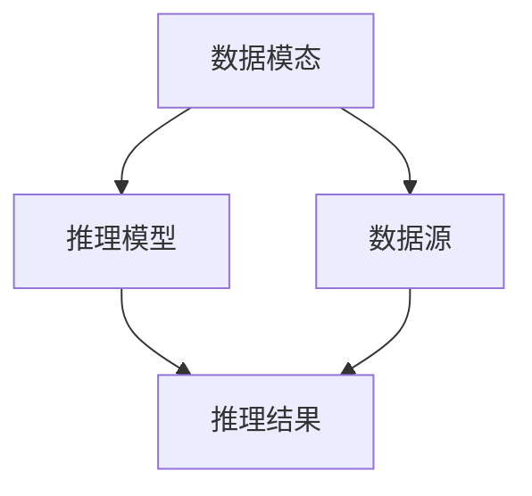

                 

# 《开发具有跨模态推理能力的AI Agent》

## 关键词：跨模态推理，AI Agent，多模态数据，深度学习，人工智能

## 摘要：  
本文深入探讨了开发具有跨模态推理能力的AI Agent的理论基础、算法实现和实际应用。文章首先介绍了跨模态推理的基本概念及其在AI Agent中的重要性，然后详细讲解了跨模态推理的核心概念与算法原理，包括多模态数据处理和注意力机制。接着，文章分析了系统架构设计，展示了如何将跨模态推理能力整合到AI Agent中。最后，通过实际项目案例，读者将学习如何实现跨模态推理的AI Agent，并通过代码和图表深入理解其工作原理。本文旨在为AI开发者和研究人员提供一个全面的指导，帮助他们掌握跨模态推理技术，提升AI Agent的智能水平。

---

# 第1章: 跨模态推理与AI Agent概述

## 1.1 跨模态推理的基本概念

### 1.1.1 什么是跨模态推理  
跨模态推理是指在多个数据模态（如文本、图像、语音、视频等）之间进行信息整合和逻辑推理的过程。例如，当一个AI Agent需要根据图像和文本信息进行决策时，它需要理解这两种模态之间的关联，并结合上下文进行推理。

### 1.1.2 跨模态推理的核心特点  
- **多模态性**：跨模态推理涉及多种数据类型，能够整合不同模态的信息。
- **跨域性**：推理过程跨越不同的数据域，如从图像到文本。
- **动态性**：推理结果可能根据实时数据变化而变化。

### 1.1.3 跨模态推理的背景与应用  
随着AI技术的发展，跨模态推理在多个领域得到了广泛应用，如计算机视觉、自然语言处理、机器人控制等。例如，在智能助手开发中，跨模态推理可以实现图像和文本的联合分析，提升任务执行能力。

## 1.2 AI Agent的基本概念

### 1.2.1 什么是AI Agent  
AI Agent是指具备自主决策、问题解决和与环境交互能力的智能实体。它可以是一个软件程序或物理设备，能够感知环境并采取行动以实现目标。

### 1.2.2 AI Agent的核心功能  
- **感知环境**：通过传感器或接口获取环境信息。
- **推理与决策**：基于获取的信息进行逻辑推理并做出决策。
- **执行行动**：根据决策结果采取相应行动。

### 1.2.3 跨模态推理在AI Agent中的作用  
跨模态推理能力使得AI Agent能够更全面地理解环境信息，提升其决策和执行能力。例如，在智能安防系统中，AI Agent可以结合视频流和传感器数据进行推理，实现更精准的监控。

## 1.3 跨模态推理与AI Agent的结合

### 1.3.1 跨模态推理在AI Agent中的应用场景  
- **智能助手**：结合语音和文本进行信息检索和处理。
- **机器人控制**：整合视觉、听觉和触觉信息进行决策。
- **智能监控**：融合视频和传感器数据进行异常检测。

### 1.3.2 跨模态推理对AI Agent能力的提升  
跨模态推理使得AI Agent能够处理更复杂的信息，提升其在多场景下的适应能力和智能水平。

### 1.3.3 跨模态推理与传统AI推理的区别  
传统AI推理通常基于单一模态数据，而跨模态推理能够整合多种数据源，提升推理的准确性和全面性。

## 1.4 本章小结  
本章介绍了跨模态推理和AI Agent的基本概念，探讨了跨模态推理在AI Agent中的作用及其应用场景。下一章将深入分析跨模态推理的核心概念和其实现原理。

---

# 第2章: 跨模态推理的核心概念与联系

## 2.1 跨模态推理的核心概念

### 2.1.1 多模态数据的定义与特点  
多模态数据是指由多种数据类型组成的复杂数据集，例如文本、图像、语音等。这些数据类型通常具有不同的特征和表示方式。

### 2.1.2 跨模态推理的数学模型  
跨模态推理的数学模型通常涉及多模态数据的表示和联合推理。例如，使用多模态编码器将不同模态的数据映射到一个共同的 latent 空间，然后通过注意力机制进行联合推理。

### 2.1.3 跨模态推理的实现原理  
跨模态推理的实现通常包括数据预处理、特征提取、联合表示和逻辑推理等步骤。通过将不同模态的数据映射到统一空间，推理模型可以进行跨模态的关联分析。

## 2.2 跨模态推理的核心要素

### 2.2.1 数据模态的多样性  
数据模态的多样性是跨模态推理的基础，不同模态的数据提供了互补信息，能够提升推理的准确性和全面性。

### 2.2.2 推理模型的复杂性  
推理模型需要能够处理多种数据类型，并建立它们之间的关联。复杂的推理模型通常具有更强的表达能力和更灵活的推理方式。

### 2.2.3 跨模态交互的动态性  
跨模态交互是动态的过程，推理模型需要能够实时处理不同模态数据的变化，并做出相应的调整。

## 2.3 跨模态推理与AI Agent的关系

### 2.3.1 跨模态推理对AI Agent能力的提升  
跨模态推理使得AI Agent能够更全面地感知环境，提升其问题解决和决策能力。

### 2.3.2 跨模态推理与AI Agent架构的结合  
跨模态推理能力需要与AI Agent的感知、决策和执行模块紧密结合，形成一个有机的整体。

### 2.3.3 跨模态推理在AI Agent中的具体应用  
在智能助手、机器人控制等领域，跨模态推理帮助AI Agent实现更复杂的任务，例如结合图像和文本进行多任务处理。

## 2.4 跨模态推理的核心概念对比表

| 对比维度 | 单模态推理 | 跨模态推理 |
|----------|------------|------------|
| 数据源   | 单一数据模态 | 多个数据模态 |
| 推理能力 | 基于单一信息 | 跨模态关联分析 |
| 应用场景 | 简单任务处理 | 复杂任务处理 |

## 2.5 跨模态推理的ER实体关系图

---

# 总结  
通过以上章节的介绍，我们已经初步了解了跨模态推理的基本概念、核心要素以及其在AI Agent中的应用。接下来，我们将深入探讨跨模态推理的算法原理，并通过具体案例分析其在AI Agent中的实现。

---

**作者：AI天才研究院/AI Genius Institute & 禅与计算机程序设计艺术 /Zen And The Art of Computer Programming**

