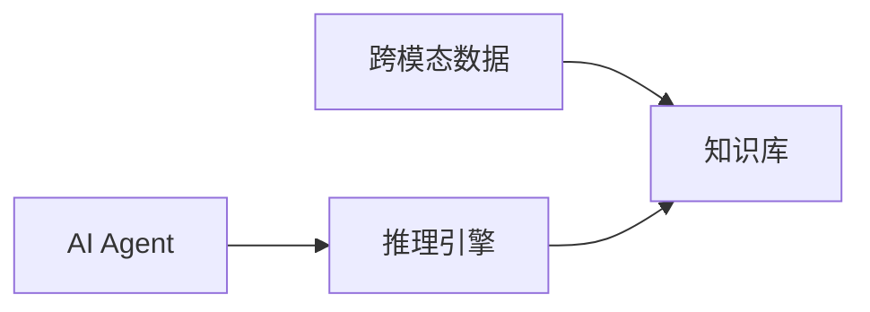
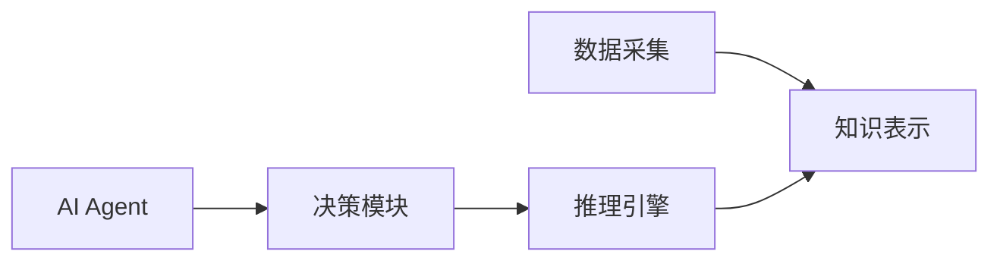

                 

# 开发具有跨模态知识推理能力的AI Agent

> 关键词：跨模态知识推理，AI Agent，多模态数据，知识图谱，推理算法，系统架构

> 摘要：  
本文详细探讨了开发具有跨模态知识推理能力的AI Agent的各个方面。从核心概念的背景介绍到算法原理的深入分析，从系统架构的设计到项目实战的详细讲解，本文为读者提供了全面的技术指导。通过具体的案例分析和代码实现，帮助读者理解如何构建一个能够处理多模态数据、进行复杂推理的智能体。文章还探讨了当前技术的局限性和未来的研究方向，为开发者提供了宝贵的参考。

---

## 第一部分：背景介绍

### 第1章：跨模态知识推理与AI Agent概述

#### 1.1 问题背景

在当今的AI领域，数据的多样性和复杂性使得单一模态的数据处理已不足以满足实际需求。跨模态知识推理的出现，正是为了整合文本、图像、语音等多种数据源，以提高AI系统的理解和决策能力。AI Agent作为一种能够自主感知环境、执行任务的智能体，其核心能力依赖于强大的知识推理能力。

#### 1.2 问题描述

跨模态知识推理的核心问题在于如何有效地整合和处理不同模态的数据，同时在推理过程中保持逻辑一致性和准确性。AI Agent需要能够理解、推理和行动，这要求系统具备多模态数据处理能力、高效的推理算法以及灵活的决策机制。

#### 1.3 问题解决

通过跨模态知识推理，AI Agent能够更全面地理解任务需求，做出更准确的决策。例如，在医疗领域，AI Agent可以通过整合患者的文本病历、图像检查结果和语音反馈，提供更精准的诊断建议。

#### 1.4 边界与外延

跨模态知识推理的边界在于如何处理不同模态数据之间的关联性，以及如何在有限的计算资源下实现高效的推理。AI Agent的应用范围主要集中在需要自主决策的任务中，如智能客服、自动驾驶等。

---

## 第二部分：核心概念与联系

### 第2章：跨模态知识推理原理

#### 2.1 核心概念

跨模态知识推理涉及多个关键概念，包括多模态数据处理、知识表示和推理算法。通过整合不同模态的数据，系统能够提取更多的信息，提高推理的准确性。

#### 2.2 实体关系图

---

## 第三部分：算法原理

### 第4章：跨模态知识表示与推理算法

#### 4.1 多模态编码

多模态编码是跨模态知识推理的基础。通过将不同模态的数据转换为统一的向量表示，系统能够更好地进行数据融合和推理。

#### 4.2 注意力机制

注意力机制在跨模态推理中起到了关键作用。通过计算不同模态数据之间的相关性，系统能够更关注重要的信息，提高推理的准确性。

#### 4.3 知识图谱表示

知识图谱提供了一种结构化的知识表示方式，使得跨模态推理更加高效和准确。通过将知识图谱与多模态数据结合，系统能够更好地理解复杂的关系。

---

## 第四部分：系统分析与架构设计

### 第5章：系统架构设计

#### 5.1 功能模块

跨模态知识推理AI Agent的系统架构通常包括数据采集模块、知识表示模块、推理引擎和决策模块。

#### 5.2 架构图

---

## 第五部分：项目实战

### 第6章：项目实战：开发跨模态AI Agent

#### 6.1 环境配置

项目实战部分将详细讲解如何配置开发环境，包括安装必要的库和工具。

#### 6.2 核心代码实现

通过具体的代码示例，展示跨模态知识推理AI Agent的核心实现过程。

#### 6.3 案例分析

以实际案例为例，分析跨模态知识推理AI Agent的应用场景和效果。

---

## 第六部分：高级主题与最佳实践

### 第7章：高级主题

#### 7.1 多模态大模型

探讨当前研究中的多模态大模型，如视觉-语言模型，及其在跨模态推理中的应用。

#### 7.2 人机协作

分析人机协作在跨模态知识推理中的重要性，以及如何设计高效的协作机制。

---

## 作者信息

作者：AI天才研究院/AI Genius Institute & 禅与计算机程序设计艺术 /Zen And The Art of Computer Programming

---

通过以上结构，文章详细阐述了开发具有跨模态知识推理能力的AI Agent的各个方面，从理论到实践，为读者提供了全面的技术指导。

