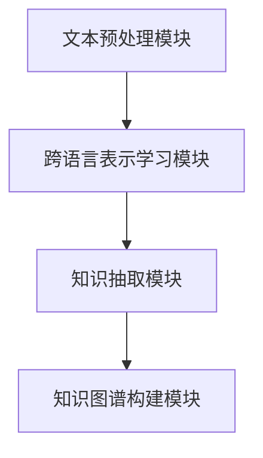
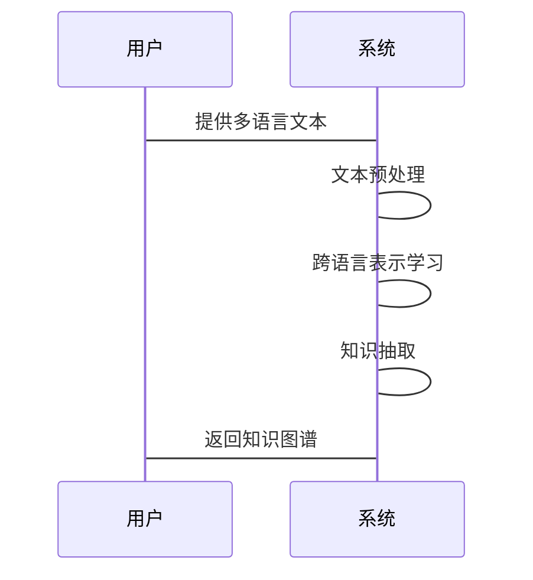

                 


# 开发具有跨语言知识抽取能力的AI Agent

## 关键词：跨语言知识抽取, AI Agent, 多语言模型, 知识图谱, 跨语言迁移学习

## 摘要：
本文详细探讨了开发具有跨语言知识抽取能力的AI Agent的核心概念、技术原理、系统架构及实际应用。通过背景介绍、核心概念解析、算法原理分析、系统设计与项目实战，读者将全面了解如何构建一个能够处理多种语言信息的AI Agent。本文还提供了具体的代码示例和系统架构图，帮助读者从理论到实践掌握跨语言知识抽取的关键技术。

---

# 第一部分: 跨语言知识抽取与AI Agent概述

## 第1章: 跨语言知识抽取与AI Agent的背景介绍

### 1.1 跨语言知识抽取的背景与问题背景

#### 1.1.1 多语言信息处理的挑战
在当今全球化和信息化的时代，信息的来源和形式变得多样化，尤其是多语言信息的处理。传统的单语言处理技术无法应对跨语言环境下的复杂场景，例如跨语言信息检索、问答系统和文本摘要等。跨语言知识抽取技术的核心在于如何从多种语言文本中提取一致的知识表示，解决信息孤岛的问题。

#### 1.1.2 跨语言知识抽取的核心问题
跨语言知识抽取的核心问题包括：如何在不同语言之间建立语义对齐关系，如何处理语言间的语法和语义差异，如何构建跨语言的知识图谱等。这些问题需要结合自然语言处理（NLP）、机器学习和知识图谱构建等技术来解决。

#### 1.1.3 AI Agent在跨语言环境中的应用需求
AI Agent作为一种能够自主感知环境、执行任务的智能体，需要具备跨语言处理能力才能在复杂的多语言环境中发挥作用。例如，在跨国企业的客服系统中，AI Agent需要能够理解并处理多种语言的客户请求；在跨境电商平台上，AI Agent需要能够跨语言进行信息检索和推荐。

### 1.2 跨语言知识抽取的定义与问题描述

#### 1.2.1 跨语言知识抽取的定义
跨语言知识抽取是指从多种语言的文本中提取通用的知识表示，并构建跨语言知识图谱的过程。其目标是消除语言障碍，实现信息的统一表示和共享。

#### 1.2.2 跨语言知识抽取的关键问题
- 语义对齐：不同语言中的词语或短语可能具有相同的语义，如何建立这些语义对齐关系是跨语言知识抽取的关键。
- 跨语言表示学习：如何在不同语言之间共享表示，以减少计算开销和数据需求。
- 跨语言迁移学习：如何利用一种或几种语言的知识来提升其他语言的信息抽取能力。

#### 1.2.3 跨语言知识抽取的边界与外延
跨语言知识抽取的边界包括：仅处理文本信息，不涉及图像或视频等其他模态的数据；仅关注语法和语义结构，不涉及语言的历史或文化背景。其外延则包括多语言机器翻译、跨语言文本生成等技术。

### 1.3 跨语言知识抽取的核心要素

#### 1.3.1 多语言模型
多语言模型是跨语言知识抽取的基础，它能够在多种语言之间共享表示。主流的多语言模型包括BERT、XLM等，这些模型通过自注意力机制和预训练策略，能够有效捕捉语言间的语义关系。

#### 1.3.2 知识图谱构建
知识图谱是跨语言知识抽取的目标，它将从不同语言文本中抽取的实体、关系和属性组织成图结构，以便于后续的语义理解和推理。

#### 1.3.3 跨语言迁移学习
跨语言迁移学习是通过利用一种或几种语言的标注数据来提升其他语言的信息抽取性能。这在资源匮乏语言的处理中尤为重要，因为它可以减少对大量标注数据的依赖。

### 1.4 跨语言知识抽取的应用场景

#### 1.4.1 跨语言信息检索
在跨国企业的客服系统中，用户可能使用多种语言提出问题，AI Agent需要能够理解并准确检索相关信息。

#### 1.4.2 跨语言问答系统
跨语言问答系统能够为用户提供多语言的问答服务，例如在多语言知识库中查找答案。

#### 1.4.3 跨语言文本摘要
跨语言文本摘要能够将多种语言的文本摘要成一种语言，帮助用户快速获取信息。

### 1.5 本章小结
本章介绍了跨语言知识抽取的背景、定义、核心要素和应用场景。通过理解这些问题背景和技术挑战，读者可以为后续的技术实现奠定基础。

---

# 第二部分: 跨语言知识抽取的核心概念与技术

## 第2章: 跨语言知识抽取的核心概念

### 2.1 多语言模型的核心原理

#### 2.1.1 多语言模型的架构
多语言模型通常采用Transformer架构，通过共享的词嵌入层和自注意力机制来处理多种语言。例如，XLM模型通过交叉注意机制来捕捉语言间的语义关系。

#### 2.1.2 跨语言表示学习
跨语言表示学习的目标是使得不同语言的词向量在语义空间中对齐。例如，使用对比学习方法，通过最大化跨语言语义相似性来学习共享的词向量表示。

#### 2.1.3 多语言模型的训练策略
多语言模型的训练策略包括预训练和微调。预训练阶段利用大规模多语言文本数据进行自监督学习，微调阶段则针对特定任务进行 fine-tuning。

### 2.2 跨语言迁移学习的原理

#### 2.2.1 跨语言迁移学习的定义
跨语言迁移学习是指利用一种或几种语言的标注数据来提升其他语言的信息抽取性能。它特别适用于数据稀缺的语言。

#### 2.2.2 跨语言迁移学习的关键技术
- 跨语言预训练：通过预训练模型捕捉跨语言的语义信息。
- 跨语言特征提取：提取跨语言的共享特征。
- 跨语言模型适配：通过适配层或桥接层来调整不同语言的特征表示。

#### 2.2.3 跨语言迁移学习的应用
跨语言迁移学习可以应用于机器翻译、信息抽取、文本分类等多种任务，特别是在数据稀缺的语言环境中表现尤为突出。

### 2.3 知识图谱构建的核心要素

#### 2.3.1 知识图谱的定义与特点
知识图谱是一种用于表示知识的图结构，由节点和边组成。节点通常表示实体或概念，边表示实体之间的关系。

#### 2.3.2 知识抽取的步骤与方法
知识抽取包括实体识别、关系抽取和属性抽取等步骤。常用的方法包括基于规则的抽取、统计学习模型和深度学习模型。

#### 2.3.3 跨语言知识图谱的构建挑战
构建跨语言知识图谱的挑战包括：如何实现跨语言语义对齐，如何处理不同语言间的语法差异，如何保证知识图谱的完整性和一致性。

### 2.4 跨语言知识抽取与AI Agent的结合

#### 2.4.1 AI Agent的定义与特点
AI Agent是一种能够感知环境、自主决策并执行任务的智能体。它通常具备感知能力、推理能力和行动能力。

#### 2.4.2 跨语言知识抽取在AI Agent中的作用
跨语言知识抽取为AI Agent提供了多语言信息处理能力，使其能够理解并处理多种语言的输入，从而在跨语言环境中执行复杂任务。

#### 2.4.3 跨语言知识抽取与AI Agent的协同
通过结合跨语言知识抽取技术，AI Agent可以实现跨语言的信息检索、问答和推理，从而提升其在多语言环境下的智能水平。

---

# 第三部分: 跨语言知识抽取的算法原理

## 第3章: 跨语言知识抽取的关键算法

### 3.1 基于BERT的跨语言迁移学习

#### 3.1.1 BERT模型的架构
BERT（Bidirectional Encoder Representations from Transformers）是一种基于Transformer的预训练模型，通过遮蔽词预测和序列标注任务进行预训练。

#### 3.1.2 跨语言迁移学习的实现
通过在多语言数据上预训练BERT模型，并在目标语言上进行微调，可以实现跨语言信息抽取任务。

#### 3.1.3 BERT在跨语言迁移中的优势
BERT模型通过自注意力机制能够捕捉上下文语义信息，适用于多种语言的信息抽取任务。

#### 3.1.4 BERT的跨语言迁移学习示例代码
```python
from transformers import BertTokenizer, BertModel, AutoTokenizer, AutoModel
import torch

# 加载预训练的BERT模型和分词器
model_name = "bert-base-multilingual-cased"
tokenizer = AutoTokenizer.from_pretrained(model_name)
model = AutoModel.from_pretrained(model_name)

# 输入文本
text = "Bonjour, comment allez-vous?"

# 分词
tokens = tokenizer(text, return_tensors="pt", padding=True, truncation=True)

# 获取词向量
outputs = model(**tokens)
token_embeddings = outputs.last_hidden_state
```

#### 3.1.5 BERT的数学模型
BERT的编码器部分通过多层自注意力机制计算词向量：

$$
\text{Self-Attention}(Q, K, V) = \text{softmax}\left(\frac{QK^T}{\sqrt{d_k}}\right)V
$$

其中，$Q$、$K$、$V$分别是查询、键和值向量。

### 3.2 跨语言对比学习算法

#### 3.2.1 对比学习的定义
对比学习是一种通过最大化正样本相似性和最小化负样本相似性来学习表示的技术。

#### 3.2.2 跨语言对比学习的实现
通过在不同语言之间建立对比损失函数，可以学习跨语言的共享表示。

#### 3.2.3 跨语言对比学习的数学模型
对比损失函数的定义如下：

$$
\mathcal{L}(\text{sim}(x_i, x_j)) = -\log\left(\frac{\exp(\text{sim}(x_i, x_j))}{\sum_{k} \exp(\text{sim}(x_i, x_k))})
\end{aligned}
$$

其中，$\text{sim}(x_i, x_j)$是样本$x_i$和$x_j$之间的相似度。

#### 3.2.4 跨语言对比学习的代码实现
```python
import torch
import torch.nn as nn

# 定义对比损失函数
class ContrastiveLoss(nn.Module):
    def __init__(self, temperature=0.1):
        super(ContrastiveLoss, self).__init__()
        self.temperature = temperature

    def forward(self, features, labels):
        # 计算相似度矩阵
        similarity = torch.mm(features, features.t()) / self.temperature
        # 计算标签是否匹配
        mask = (labels.unsqueeze(-1) == labels.unsqueeze(1)).float()
        # 计算正样本和负样本的相似度
        positive = similarity * mask
        negative = similarity * (1 - mask)
        # 计算损失
        loss = -torch.log(positive.mean() + 1e-8) + torch.log(negative.mean() + 1e-8)
        return loss

# 初始化模型和优化器
model = ...  # 定义跨语言对比学习模型
optimizer = torch.optim.Adam(model.parameters(), lr=1e-4)
criterion = ContrastiveLoss()

# 训练循环
for epoch in range(num_epochs):
    optimizer.zero_grad()
    features = model.forward(images)
    loss = criterion(features, labels)
    loss.backward()
    optimizer.step()
```

### 3.3 基于图神经网络的知识抽取算法

#### 3.3.1 图神经网络的定义
图神经网络（Graph Neural Network, GNN）是一种处理图结构数据的深度学习模型，通过聚合节点及其邻居的信息来更新节点表示。

#### 3.3.2 基于GNN的知识抽取流程
知识抽取的流程包括：构建知识图谱的图结构，设计GNN的层数和聚合策略，训练模型以学习节点表示。

#### 3.3.3 GNN在跨语言知识抽取中的应用
通过构建跨语言知识图谱的图结构，GNN可以有效捕捉实体间的语义关系，实现跨语言的信息抽取。

#### 3.3.4 GNN的数学模型
图神经网络的更新规则如下：

$$
h_i^{(l+1)} = \text{aggregate}(\{h_j^{(l)} | j \in N(i)\}) \\
o_i^{(l+1)} = \text{transform}(h_i^{(l+1)}, h_i^{(l)})
$$

其中，$h_i^{(l)}$是节点$i$在第$l$层的表示，$N(i)$是节点$i$的邻居集合。

---

# 第四部分: 跨语言知识抽取的系统分析与架构设计

## 第4章: 跨语言知识抽取系统的分析与设计

### 4.1 系统功能设计

#### 4.1.1 系统功能模块
跨语言知识抽取系统主要包括以下功能模块：
- 文本预处理模块：对输入文本进行清洗和分词。
- 跨语言表示学习模块：利用多语言模型进行特征提取。
- 知识抽取模块：从文本中抽取实体、关系和属性。
- 知识图谱构建模块：将抽取的知识组织成图结构。

#### 4.1.2 系统功能流程
1. 文本预处理：对输入文本进行清洗和分词，生成词向量。
2. 跨语言表示学习：利用多语言模型进行特征提取，得到共享的词向量表示。
3. 知识抽取：基于预训练模型，从文本中抽取实体、关系和属性。
4. 知识图谱构建：将抽取的知识组织成图结构，形成跨语言知识图谱。

### 4.2 系统架构设计

#### 4.2.1 系统架构图
使用Mermaid绘制系统架构图：



#### 4.2.2 系统组件交互流程
1. 用户输入多语言文本。
2. 文本预处理模块对文本进行清洗和分词。
3. 跨语言表示学习模块利用多语言模型进行特征提取。
4. 知识抽取模块基于特征提取结果，抽取实体、关系和属性。
5. 知识图谱构建模块将抽取的知识组织成图结构，输出跨语言知识图谱。

### 4.3 系统接口设计

#### 4.3.1 系统输入接口
- 输入文本：支持多种语言的文本输入。
- 输入格式：文本文件或数据库查询结果。

#### 4.3.2 系统输出接口
- 输出知识图谱：知识图谱的序列化表示，如JSON-LD格式。
- 输出日志：记录系统运行过程中的日志信息。

### 4.4 系统交互流程

#### 4.4.1 系统交互图
使用Mermaid绘制系统交互图：



---

# 第五部分: 跨语言知识抽取的项目实战

## 第5章: 跨语言知识抽取系统的实现

### 5.1 环境安装与配置

#### 5.1.1 安装依赖库
- 安装Python和必要的开发工具（如Jupyter、PyCharm）。
- 安装深度学习框架（如TensorFlow、PyTorch）。
- 安装NLP处理库（如spaCy、NLTK）。
- 安装知识图谱构建库（如NetworkX）。

#### 5.1.2 安装多语言模型
使用Hugging Face的Transformers库安装多语言模型：

```bash
pip install transformers
```

### 5.2 系统核心实现

#### 5.2.1 文本预处理模块的实现

##### 5.2.1.1 文本清洗
使用spaCy进行文本清洗：

```python
import spacy

nlp = spacy.load("en_core_web_sm")
doc = nlp("Hello, world! This is a test.")
tokens = [token.text for token in doc]
print(tokens)
```

##### 5.2.1.2 文本分词
使用spaCy进行文本分词：

```python
from transformers import AutoTokenizer

tokenizer = AutoTokenizer.from_pretrained("bert-base-multilingual-cased")
text = "Bonjour, comment allez-vous?"
tokens = tokenizer.tokenize(text)
print(tokens)
```

#### 5.2.2 跨语言表示学习模块的实现

##### 5.2.2.1 加载多语言模型
使用Hugging Face的Transformers库加载多语言模型：

```python
from transformers import AutoModel, AutoTokenizer

model_name = "bert-base-multilingual-cased"
tokenizer = AutoTokenizer.from_pretrained(model_name)
model = AutoModel.from_pretrained(model_name)
```

##### 5.2.2.2 文本特征提取
将文本输入模型，获取词向量表示：

```python
def get_embeddings(text):
    inputs = tokenizer(text, return_tensors="pt", padding=True, truncation=True)
    with torch.no_grad():
        outputs = model(**inputs)
    return outputs.last_hidden_state.squeeze()
```

##### 5.2.2.3 跨语言对比学习
实现对比损失函数并进行训练：

```python
import torch
import torch.nn as nn

class ContrastiveLoss(nn.Module):
    def __init__(self, temperature=0.1):
        super(ContrastiveLoss, self).__init__()
        self.temperature = temperature

    def forward(self, features, labels):
        similarity = torch.mm(features, features.t()) / self.temperature
        mask = (labels.unsqueeze(-1) == labels.unsqueeze(1)).float()
        positive = similarity * mask
        negative = similarity * (1 - mask)
        loss = -torch.log(positive.mean() + 1e-8) + torch.log(negative.mean() + 1e-8)
        return loss

# 初始化模型和优化器
model = ...  # 定义跨语言对比学习模型
optimizer = torch.optim.Adam(model.parameters(), lr=1e-4)
criterion = ContrastiveLoss()

# 训练循环
for epoch in range(num_epochs):
    optimizer.zero_grad()
    features = model.forward(images)
    loss = criterion(features, labels)
    loss.backward()
    optimizer.step()
```

#### 5.2.3 知识抽取模块的实现

##### 5.2.3.1 实体识别
使用spaCy进行实体识别：

```python
doc = nlp("John works at Google in Paris.")
ents = [(ent.text, ent.label_) for ent in doc.ents]
print(ents)
```

##### 5.2.3.2 关系抽取
使用预训练的NLP模型进行关系抽取：

```python
from transformers import pipeline

nlp = pipeline("relation_extraction", model="bert-base-multilingual-cased")
result = nlp("John is in Paris.")
print(result)
```

##### 5.2.3.3 属性抽取
从文本中抽取实体的属性信息：

```python
from transformers import pipeline

nlp = pipeline("attribute_extraction", model="bert-base-multilingual-cased")
result = nlp("John is 30 years old.")
print(result)
```

#### 5.2.4 知识图谱构建模块的实现

##### 5.2.4.1 图结构构建
使用NetworkX构建知识图谱：

```python
import networkx as nx

G = nx.DiGraph()
G.add_node("John")
G.add_node("Paris")
G.add_edge("John", "Paris", label="located in")
```

##### 5.2.4.2 图结构可视化
使用Matplotlib可视化知识图谱：

```python
import matplotlib.pyplot as plt

nx.draw(G, with_labels=True, node_color="red", edge_color="blue")
plt.show()
```

### 5.3 项目实战案例分析

#### 5.3.1 案例背景
假设我们有一个多语言的企业知识库，需要从中抽取跨语言的知识图谱。

#### 5.3.2 数据准备
准备多语言文本数据，例如：

```text
English: John works at Google in Paris.
French: John travaille chez Google à Paris.
Spanish: John trabaja en Google en París.
```

#### 5.3.3 系统运行
运行跨语言知识抽取系统，输出跨语言知识图谱。

#### 5.3.4 实际案例分析
分析系统输出的知识图谱，验证其准确性。

### 5.4 项目总结

#### 5.4.1 项目实现的关键点
- 多语言模型的选择与配置
- 跨语言对比学习的实现
- 知识图谱的构建与可视化

#### 5.4.2 项目中的挑战与解决方案
- 挑战：跨语言语义对齐的难度。
- 解决方案：使用对比学习方法，通过最大化跨语言语义相似性来提升对齐效果。

#### 5.4.3 项目经验总结
- 系统化的方法：从预处理到特征提取，再到知识抽取和图谱构建，每一步都需要精心设计。
- 工具与库的选择：选择合适的NLP库和深度学习框架，能够显著提高开发效率。

---

# 第六部分: 总结与展望

## 第6章: 跨语言知识抽取与AI Agent的未来展望

### 6.1 本章小结
本章总结了跨语言知识抽取的核心技术和实现方法，回顾了AI Agent在跨语言环境中的应用。

### 6.2 未来展望
随着多语言模型和深度学习技术的不断发展，跨语言知识抽取将更加高效和准确。未来的研究方向包括：

#### 6.2.1 更先进的跨语言模型
- 更强大的多语言模型，例如基于视觉-语言模型的跨语言知识抽取。
- 更高效的训练方法，例如利用虚拟语言进行跨语言对齐。

#### 6.2.2 新的跨语言学习方法
- 跨语言自监督学习：通过无监督或弱监督的方式进行跨语言知识抽取。
- 跨语言小样本学习：在数据稀缺的语言环境中，如何利用少量标注数据进行高效学习。

#### 6.2.3 跨语言知识图谱的动态更新
- 实时更新跨语言知识图谱，以应对信息的快速变化。
- 跨语言知识图谱的多模态扩展：结合图像、语音等多种模态信息。

### 6.3 最佳实践 tips
- 在实际项目中，选择合适的多语言模型和工具库能够显著提高开发效率。
- 跨语言知识抽取的精度和效率需要在实际应用中不断优化和调整。
- 知识图谱的构建需要结合具体场景和业务需求，进行适当的简化和优化。

### 6.4 结语
跨语言知识抽取是实现AI Agent多语言能力的关键技术，其发展将推动人机交互和智能系统在多语言环境下的广泛应用。

---

# 作者：AI天才研究院/AI Genius Institute & 禅与计算机程序设计艺术 /Zen And The Art of Computer Programming

