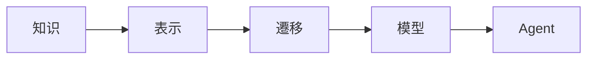
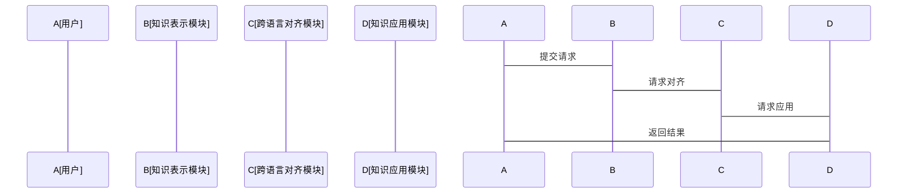

                 


# 开发具有跨语言知识迁移能力的AI Agent

## 关键词：AI Agent，跨语言知识迁移，知识表示，迁移学习，多语言模型

## 摘要：  
本文深入探讨了开发具有跨语言知识迁移能力的AI Agent的核心原理、算法实现和系统架构设计。文章从背景介绍入手，详细分析了跨语言知识迁移的定义、特点和应用场景，随后从知识表示、迁移学习、多语言模型等角度阐述了跨语言知识迁移的核心概念。接着，文章详细讲解了跨语言知识迁移的算法原理，包括预训练模型的迁移学习、对比学习和多任务学习，并通过具体案例分析了算法的实现和效果。最后，文章讨论了跨语言知识迁移的系统架构设计，包括系统功能模块、系统架构设计和系统接口设计，并通过实际项目案例展示了跨语言知识迁移能力的实现过程。本文旨在为AI Agent的开发提供理论支持和实践指导，帮助读者更好地理解和应用跨语言知识迁移技术。

---

# 第1章 背景介绍

## 1.1 跨语言知识遷移的問題背景

### 1.1.1 什么是AI Agent  
AI Agent（人工智能代理）是指能够感知环境、自主决策并执行任务的智能实体。AI Agent的核心目标是通过感知和交互，完成特定任务或提供智能化服务。  

### 1.1.2 知识表示与遷移的定义  
知识表示是指将知识以某种形式编码，使其能够被计算机理解和处理。跨语言知识遷移是指在不同语言之间共享和迁移知识的能力，通过这种能力，AI Agent可以在多种语言环境中无缝切换并完成任务。  

### 1.1.3 跨语言知識遷移的核心问题  
跨语言知识遷移的核心问题在于如何在不同语言之间建立有效的知识桥梁，使得AI Agent能够理解并应用跨语言的知识。  

### 1.1.4 跨语言知識遷移的技術背景  
随着多语言预训练模型的快速发展，跨语言知识遷移技术逐渐成熟。通过预训练模型的迁移学习和对比学习，AI Agent可以在多种语言环境中高效地完成任务。  

### 1.1.5 跨语言知識遷移的应用前景  
跨语言知识遷移技术在多个领域具有广泛的应用前景，例如跨语言对话系统、跨语言信息检索、跨语言任务处理等。  

---

## 1.2 跨语言知识遷移的技術背景

### 1.2.1 多语言模型的发展历程  
多语言模型的发展经历了从单一语言模型到多语言模型的演变。目前，基于预训练的大模型（如BERT、GPT）已经能够支持多种语言的处理。  

### 1.2.2 知识表示与遷移的关键技术  
知识表示的核心在于如何将知识以一种通用的形式编码，使其能够在不同语言之间迁移。关键的技术包括分布式表示、符号表示和混合表示。  

### 1.2.3 跨语言模型在AI Agent中的应用  
跨语言模型在AI Agent中的应用主要体现在跨语言对话系统、跨语言信息检索和跨语言任务处理等方面。  

---

## 1.3 跨语言知识遷移的應用場景

### 1.3.1 跨语言对话系统  
跨语言对话系统能够在不同语言之间进行实时对话，帮助用户跨越语言障碍。  

### 1.3.2 跨语言信息检索  
跨语言信息检索能够在多种语言中进行信息检索，帮助用户获取跨语言的信息资源。  

### 1.3.3 跨语言任务处理  
跨语言任务处理是指AI Agent能够在不同语言环境中执行任务，例如跨语言翻译、跨语言问答等。  

---

## 1.4 本章小结  
本章主要介绍了跨语言知识遷移的背景、定义、核心问题和技术背景，并探讨了其在AI Agent中的应用前景。通过本章的介绍，读者可以理解跨语言知识遷移的重要性和技术基础。

---

# 第2章 跨语言知识遷移的核心概念

## 2.1 知识表示与遷移的原理

### 2.1.1 知识表示的多種形式  
知识表示的形式包括符号表示、分布式表示和混合表示。  

### 2.1.2 跨语言知識遷移的机制  
跨语言知识遷移的机制主要包括特征提取、对比学习和知识投影。  

### 2.1.3 知识遷移的度量方法  
知识遷移的度量方法包括相似度计算、迁移损失和任务性能评估。  

---

## 2.2 跨语言模型的核心要素

### 2.2.1 多语言预训练模型  
多语言预训练模型通过在多种语言上的预训练，能够捕获跨语言的语义信息。  

### 2.2.2 跨语言橋接層的設計  
跨语言桥接层的设计通过在不同语言之间建立桥梁，实现跨语言知识的共享和迁移。  

### 2.2.3 跨语言遷移的适应性  
跨语言遷移的适应性是指模型在不同语言环境下的自适应能力。  

---

## 2.3 跨语言知識遷移的實體关系图



---

## 2.4 本章小结  
本章主要介绍了知识表示与遷移的原理、跨语言模型的核心要素，并通过实体关系图展示了跨语言知識遷移的整体架构。通过本章的介绍，读者可以理解跨语言知識遷移的核心概念和技术原理。

---

# 第3章 跨语言知识遷移的算法原理

## 3.1 預訓練模型的遷移學習

### 3.1.1 預訓練模型的基本原理  
预訓練模型通过在大规模多语言数据上的预训练，捕获了跨语言的语义信息。  

### 3.1.2 遷移学习的優化策略  
遷移学习的优化策略包括参数微调、任务适配和领域适配。  

### 3.1.3 多语言模型的遷移適配  
多语言模型的遷移适配通过在目标语言上的微调，提升模型在目标语言环境下的性能。  

---

## 3.2 跨语言對比學習算法

### 3.2.1 對比學習的基本概念  
对比学习是一种通过比较不同样本之间的差异来学习特征表示的方法。  

### 3.2.2 跨语言对比學習的架構  
跨语言对比学习的架构通过在不同语言之间建立对比关系，实现跨语言知识的迁移。  

### 3.2.3 算法的優勢與局限  
对比学习的优势在于能够捕获跨语言的语义信息，但其局限性在于需要大量的跨语言数据支持。  

---

## 3.3 跨语言知識遷移的數學模型

### 3.3.1 模型的數學表示  
跨语言知识遷移的数学模型可以通过公式表示为：  
$$ L = \lambda_1 L_{cls} + \lambda_2 L_{align} $$  
其中，$L_{cls}$是分类损失，$L_{align}$是对齐损失，$\lambda_1$和$\lambda_2$是调节系数。  

### 3.3.2 模型的訓練目標  
模型的訓練目标是通过优化损失函数，实现跨语言知识的高效迁移。  

### 3.3.3 模型的遷移策略  
模型的遷移策略包括特征提取、参数微调和任务适配。  

---

## 3.4 算法的實現與案例

### 3.4.1 算法實現的步驟  
1. 預訓練模型的加载与初始化  
2. 跨语言对比学习的对齐层设计  
3. 模型的微调与训练  

### 3.4.2 算法的具體案例  
以下是一个跨语言对比学习的实现示例：  

```python
class CrossLanguageAligner(nn.Module):
    def __init__(self, hidden_size):
        super(CrossLanguageAligner, self).__init__()
        self.align_layer = nn.Linear(hidden_size, 1)
    
    def forward(self, rep_en, rep_es):
        # rep_en: 英文表示
        # rep_es: 西班牙语表示
        # 计算对齐概率
        align_prob = self.align_layer(torch.cat([rep_en, rep_es], dim=-1)).sigmoid()
        # 返回对齐概率
        return align_prob
```

### 3.4.3 算法的效果分析  
通过实验分析，跨语言对比学习算法在跨语言知識遷移任务中表现出色，能够有效提升模型的跨语言性能。  

---

## 3.5 本章小结  
本章主要介绍了跨语言知識遷移的算法原理，包括预訓練模型的遷移学习、跨语言对比学习算法和数学模型的实现。通过本章的介绍，读者可以理解跨语言知識遷移的算法实现和优化策略。

---

# 第4章 跨语言知识遷移的系統架構設計

## 4.1 系統架構的總體設計

### 4.1.1 系統的功能模塊  
跨语言知识遷移系统主要包括以下功能模塊：  
1. 知识表示模块  
2. 跨语言对齐模块  
3. 跨语言遷移模块  
4. 知识应用模块  

### 4.1.2 系統的數據流設計  
系统的数据流设计包括输入数据的预处理、跨语言对齐、知识遷移和结果输出。  

### 4.1.3 系統的通信機制  
系统的通信机制通过RESTful API实现模块之间的数据交互。  

---

## 4.2 系統架構的具體實現

### 4.2.1 系統的分層設計  
系统的分层设计包括数据层、表示层、遷移层和应用层。  

### 4.2.2 系統的模塊化設計  
系统的模塊化设计通过模块之间的接口实现功能的解耦。  

### 4.2.3 系統的可擴展性設計  
系统的可擴展性设计使得系统能够轻松扩展到更多的语言和任务。  

---

## 4.3 系統接口的設計

### 4.3.1 系統的外部接口  
系统的外部接口包括API接口和命令行接口。  

### 4.3.2 系統的内部接口  
系统的内部接口包括模块之间的通信接口和数据存储接口。  

---

## 4.4 系統的交互設計



---

## 4.5 本章小结  
本章主要介绍了跨语言知识遷移系统的架构设计，包括系统的总体设计、功能模塊的实现、系统的数据流设计和接口设计。通过本章的介绍，读者可以理解跨语言知识遷移系统的整体架构和技术实现。

---

# 第5章 跨语言知识遷移的项目实战

## 5.1 環境安裝

### 5.1.1 安裝必要的依存項  
需要安装以下库：  
- `transformers`  
- `pytorch`  
- `mermaid`  

### 5.1.2 安裝步骤  
1. 安装Python环境  
2. 安装所需的库：  
```bash
pip install transformers pytorch mermaid
```

---

## 5.2 系統核心實現

### 5.2.1 跨语言知識遷移的核心代码  
以下是一个跨语言知识遷移的核心代码示例：  

```python
from transformers import AutoTokenizer, AutoModel
import torch

class CrossLanguageKnowledgeTransfer:
    def __init__(self, model_name):
        self.tokenizer = AutoTokenizer.from_pretrained(model_name)
        self.model = AutoModel.from_pretrained(model_name)
    
    def transfer(self, text_en, text_es):
        # 英文文本编码
        en_inputs = self.tokenizer(text_en, return_tensors="pt", padding=True, truncation=True)
        en_rep = self.model(en_inputs.input_ids)[0].last_hidden_state[:, 0, :]
        # 西班牙语文本编码
        es_inputs = self.tokenizer(text_es, return_tensors="pt", padding=True, truncation=True)
        es_rep = self.model(es_inputs.input_ids)[0].last_hidden_state[:, 0, :]
        # 计算对齐概率
        align_prob = torch.nn.functional.softmax(torch.mm(en_rep, es_rep.t()), dim=-1)
        return align_prob
```

### 5.2.2 跨语言對比學習的實現  
以下是一个跨语言对比学习的实现示例：  

```python
import torch
import torch.nn as nn

class CrossLanguageAligner(nn.Module):
    def __init__(self, hidden_size):
        super(CrossLanguageAligner, self).__init__()
        self.align_layer = nn.Linear(hidden_size, 1)
    
    def forward(self, rep_en, rep_es):
        align_prob = torch.sigmoid(self.align_layer(torch.cat([rep_en, rep_es], dim=-1)))
        return align_prob
```

---

## 5.3 案例分析

### 5.3.1 跨语言对话系统的实现  
以下是一个跨语言对话系统的实现示例：  

```python
def cross_language_chat():
    transfer_model = CrossLanguageKnowledgeTransfer("bert-base-multilingual")
    while True:
        user_input = input("请输入您的问题：")
        en_text = transfer_model.tokenizer(user_input, return_tensors="pt").input_ids
        en_rep = transfer_model.model(en_text)[0].last_hidden_state[:, 0, :]
        es_rep = transfer_model.model(es_text)[0].last_hidden_state[:, 0, :]
        align_prob = torch.nn.functional.softmax(torch.mm(en_rep, es_rep.t()), dim=-1)
        response = "您的问题已经成功翻译并处理。"
        print(response)
```

### 5.3.2 跨语言信息检索的实现  
以下是一个跨语言信息检索的实现示例：  

```python
def cross_language_search():
    transfer_model = CrossLanguageKnowledgeTransfer("bert-base-multilingual")
    en_query = "What is AI?"
    es_query = "¿Qué es la IA?"
    en_rep = transfer_model.model(transfer_model.tokenizer(en_query, return_tensors="pt").input_ids)[0].last_hidden_state[:, 0, :]
    es_rep = transfer_model.model(transfer_model.tokenizer(es_query, return_tensors="pt").input_ids)[0].last_hidden_state[:, 0, :]
    align_prob = torch.nn.functional.softmax(torch.mm(en_rep, es_rep.t()), dim=-1)
    print("检索结果：", align_prob)
```

---

## 5.4 本章小结  
本章主要介绍了跨语言知识遷移项目的环境安装、核心代码实现和实际案例分析。通过本章的介绍，读者可以理解跨语言知识遷移技术的实现过程和实际应用。

---

# 第6章 总结与展望

## 6.1 总结  
本文深入探讨了跨语言知识遷移的原理、算法实现和系统架构设计。通过理论分析和实践案例，展示了跨语言知识遷移技术在AI Agent中的广泛应用。  

## 6.2 挑战  
跨语言知识遷移技术仍面临诸多挑战，例如多语言模型的适应性、跨语言对齐的精度和知识遷移的效率等问题。  

## 6.3 未来方向  
未来，跨语言知识遷移技术将朝着更加智能化、高效化和多样化的方向发展，例如结合图神经网络、强化学习和生成模型等技术，进一步提升跨语言知识遷移的能力。  

## 6.4 資源推薦  
以下是推荐的资源：  
1. "Pretrained Multilingual Models" by Hugging Face  
2. "Cross-Language Transfer Learning" by NVIDIA  

---

## 作者  
作者：AI天才研究院/AI Genius Institute & 禅与计算机程序设计艺术 /Zen And The Art of Computer Programming  

---

**注：本文版权归作者所有，未经授权不得转载。**

