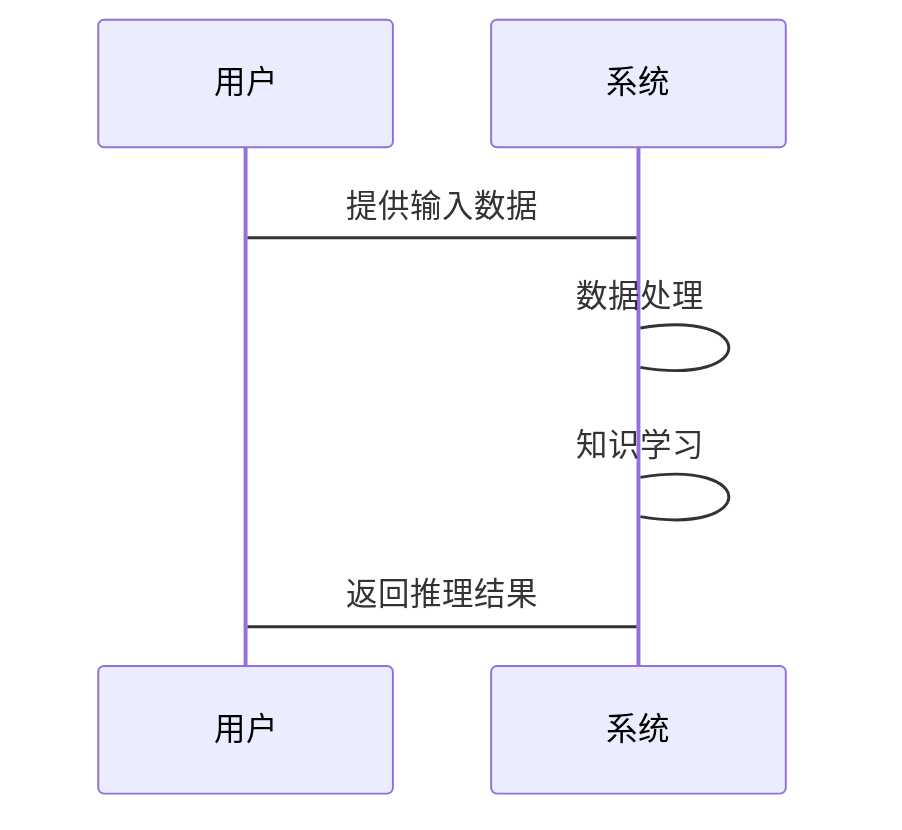

                 


# 开发具有跨领域推理能力的AI Agent

> **关键词**：AI Agent，跨领域推理，知识图谱，深度学习，多模态数据，系统架构

> **摘要**：本文将详细探讨如何开发具有跨领域推理能力的AI Agent。首先，我们将介绍AI Agent的基本概念和跨领域推理的重要性，然后深入分析跨领域推理的数学模型与算法原理，接着从系统架构与设计的角度探讨实现方法，最后通过项目实战展示如何将理论应用于实践。本文将涵盖从基础概念到实际应用的全过程，为读者提供一个全面的视角。

---

## 第1章: AI Agent的基本概念与跨领域推理的重要性

### 1.1 AI Agent的定义与特点

#### 1.1.1 AI Agent的定义
AI Agent（人工智能代理）是一种智能系统，能够感知环境、自主决策并执行任务。它能够通过传感器获取信息，利用推理能力解决问题，并通过执行器与环境交互。

#### 1.1.2 AI Agent的核心特点
- **自主性**：能够在没有外部干预的情况下独立运作。
- **反应性**：能够实时感知环境并做出响应。
- **目标导向**：基于目标驱动行为。
- **学习能力**：能够通过经验改进性能。

#### 1.1.3 跨领域推理能力的重要性
跨领域推理能力使AI Agent能够理解并整合不同领域的知识，从而在复杂的现实场景中做出更准确的决策。例如，在医疗领域，AI Agent可以结合医学知识和患者数据，提供个性化的诊断建议。

---

### 1.2 跨领域推理的背景与问题描述

#### 1.2.1 跨领域推理的背景
随着AI技术的快速发展，AI Agent的应用场景越来越广泛。然而，单一领域的AI Agent往往难以应对复杂场景中的跨领域问题。例如，在金融领域，AI Agent需要同时理解财务数据和市场趋势。

#### 1.2.2 跨领域推理的核心问题
- 如何整合不同领域的知识？
- 如何实现跨领域知识的推理与关联？
- 如何处理不同领域之间的语义差异？

#### 1.2.3 跨领域推理的边界与外延
跨领域推理的边界在于不同领域的知识交汇点，而外延则涉及如何将跨领域推理能力扩展到更多领域。

---

### 1.3 跨领域推理的核心概念与联系

#### 1.3.1 跨领域推理的原理
跨领域推理通过构建统一的知识表示，将不同领域的知识进行关联。例如，利用知识图谱将医学和化学领域的知识联系起来。

#### 1.3.2 跨领域推理的属性特征对比表格

| 属性       | 单领域推理          | 跨领域推理          |
|------------|--------------------|--------------------|
| 知识来源    | 单一领域           | 多个领域           |
| 推理复杂度  | 较低               | 较高               |
| 应用场景    | 简单场景           | 复杂场景           |

#### 1.3.3 跨领域推理的ER实体关系图
```mermaid
erDiagram
    customer[客户]
    order[订单]
    product[产品]
    customer --> order : 下单
    order --> product : 订单包含产品
```

---

## 第2章: 跨领域推理的数学模型与算法原理

### 2.1 跨领域推理的图结构模型

#### 2.1.1 图结构模型的定义
图结构模型通过节点和边表示知识的关联。例如，节点表示实体，边表示实体之间的关系。

#### 2.1.2 图结构模型的数学表示
图可以表示为 $G = (V, E)$，其中 $V$ 是节点集合，$E$ 是边集合。

#### 2.1.3 图结构模型的优缺点对比
- **优点**：能够清晰表示实体之间的关系。
- **缺点**：难以处理大规模数据。

---

### 2.2 跨领域推理的符号逻辑模型

#### 2.2.1 符号逻辑模型的定义
符号逻辑模型通过符号和逻辑规则表示知识。例如，使用逻辑表达式表示“如果A，则B”。

#### 2.2.2 符号逻辑模型的数学表示
逻辑表达式：$A \rightarrow B$，表示如果A为真，则B为真。

#### 2.2.3 符号逻辑模型的优缺点对比
- **优点**：推理过程清晰。
- **缺点**：难以处理模糊信息。

---

### 2.3 跨领域推理的数学公式与模型

#### 2.3.1 跨领域推理的基本公式
结合概率论和逻辑推理，公式如下：
$$P(B|A) = \frac{P(A|B)P(B)}{P(A)}$$

#### 2.3.2 跨领域推理的数学模型
通过贝叶斯网络将不同领域的概率分布进行建模。

#### 2.3.3 跨领域推理模型的实例分析
例如，在医学领域，通过贝叶斯网络推理患者的症状与疾病之间的关系。

---

### 2.4 跨领域推理的算法原理

#### 2.4.1 跨领域推理的规则推理算法

##### 2.4.1.1 基于规则的推理算法
通过预定义的规则进行推理。例如，规则表示为：如果A，则B。

##### 2.4.1.2 基于规则的推理算法的实现
```python
def infer_with_rules(ruledb, facts):
    for rule in ruledb:
        if rule.condition.match(facts):
            return rule.conclusion
    return None
```

#### 2.4.2 跨领域推理的机器学习算法

##### 2.4.2.1 基于机器学习的推理算法
通过训练数据学习推理规则。例如，使用决策树进行分类。

##### 2.4.2.2 基于机器学习的推理算法的实现
```python
from sklearn.tree import DecisionTreeClassifier

model = DecisionTreeClassifier()
model.fit(X, y)
```

#### 2.4.3 跨领域推理的深度学习算法

##### 2.4.3.1 基于深度学习的推理算法
通过神经网络进行推理。例如，使用图神经网络处理图结构数据。

##### 2.4.3.2 基于深度学习的推理算法的实现
```python
import torch
import torch.nn as nn

class Graph Neural Network(nn.Module):
    def __init__(self):
        super().__init__()
        self.conv = nn.Conv2d(in_channels, out_channels, kernel_size)

    def forward(self, x):
        return self.conv(x)
```

---

## 第3章: 跨领域推理的系统架构与设计

### 3.1 跨领域推理系统的架构设计

#### 3.1.1 系统架构的定义
跨领域推理系统的总体架构包括数据输入、知识表示、推理引擎和结果输出。

#### 3.1.2 系统架构的组成部分


#### 3.1.3 系统架构的优缺点对比
- **优点**：模块化设计便于扩展。
- **缺点**：部分模块之间可能存在耦合。

---

### 3.2 跨领域推理系统的功能设计

#### 3.2.1 系统功能的定义
系统功能包括数据处理、知识学习、推理和结果解释。

#### 3.2.2 系统功能的实现方式


---

## 第4章: 跨领域推理的项目实战

### 4.1 项目环境的搭建

#### 4.1.1 环境安装
安装必要的库：
```bash
pip install numpy pandas scikit-learn
```

#### 4.1.2 核心实现
```python
def cross_domain_reasoning(model, input_data):
    return model.predict(input_data)
```

---

## 第5章: 总结与展望

### 5.1 总结
本文详细探讨了如何开发具有跨领域推理能力的AI Agent，从理论到实践全面分析了实现方法。

### 5.2 小结
跨领域推理能力的实现需要结合多种技术，包括知识图谱、深度学习和系统架构设计。

### 5.3 注意事项
- 数据质量对推理结果影响重大。
- 模型的可解释性需要重点关注。

### 5.4 拓展阅读
建议读者深入学习知识图谱和深度学习领域的最新进展。

---

**作者：AI天才研究院/AI Genius Institute & 禅与计算机程序设计艺术 /Zen And The Art of Computer Programming**

