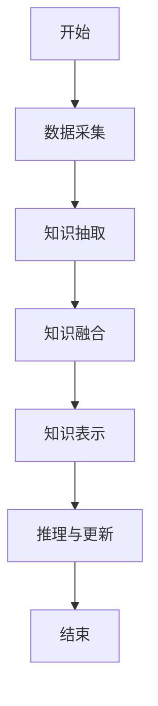
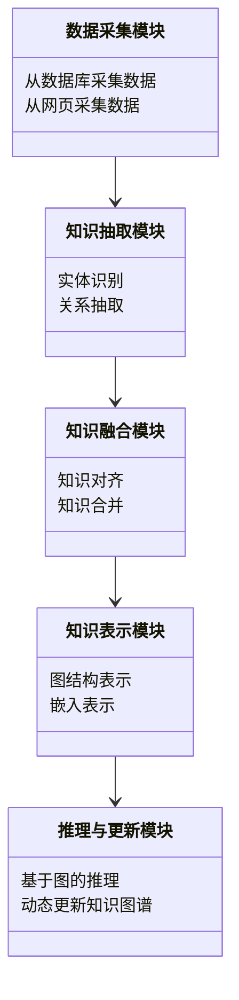
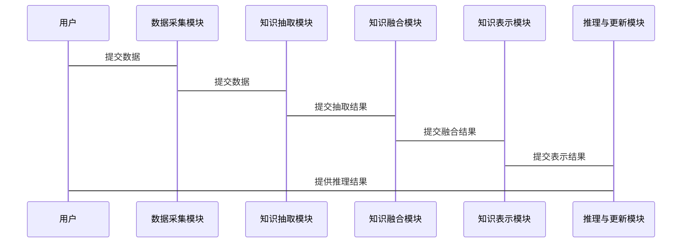

                 


# 开发具有跨领域知识图谱构建能力的AI Agent

> 关键词：AI Agent, 知识图谱, 跨领域, 知识抽取, 知识融合, 图神经网络, 系统架构

> 摘要：本文系统地探讨了开发具有跨领域知识图谱构建能力的AI Agent的各个方面。从基本概念到构建技术，从系统架构到项目实战，文章详细介绍了如何构建跨领域知识图谱，并通过实际案例展示了其应用。文章最后总结了当前研究的成果，并展望了未来的研究方向。

---

# 第1章 AI Agent与知识图谱概述

## 1.1 AI Agent的基本概念

### 1.1.1 AI Agent的定义与分类
- **定义**：AI Agent（人工智能代理）是指能够感知环境、执行任务并做出决策的智能实体。
- **分类**：
  - **简单反射型Agent**：基于当前感知做出反应。
  - **基于模型的反射型Agent**：利用内部模型进行推理和决策。
  - **目标驱动型Agent**：根据目标驱动行为。
  - **效用驱动型Agent**：通过最大化效用函数进行决策。

### 1.1.2 知识图谱的基本概念
- **知识图谱**：是结构化的知识库，由实体、关系和属性组成。
- **特点**：
  - **结构化**：支持高效的查询和推理。
  - **可扩展性**：能够容纳海量知识。
  - **动态性**：能够实时更新。

### 1.1.3 跨领域知识图谱的定义与特点
- **定义**：跨领域知识图谱是将多个领域的知识整合到统一的知识图谱中。
- **特点**：
  - **跨领域性**：涵盖多个领域。
  - **关联性**：不同领域的知识之间具有关联。
  - **复杂性**：构建和维护难度较高。

---

## 1.2 跨领域知识图谱构建的意义

### 1.2.1 知识图谱在AI Agent中的作用
- **支持智能决策**：通过知识图谱提供上下文信息，帮助AI Agent做出更智能的决策。
- **增强语义理解**：通过跨领域知识，提升AI Agent对复杂语义的理解能力。

### 1.2.2 跨领域知识图谱的优势
- **提升通用性**：能够处理多种领域的问题。
- **增强可解释性**：知识图谱的结构化特性使其更容易被解释。
- **支持创新应用**：跨领域的知识整合能够催生新的应用场景。

### 1.2.3 跨领域知识图谱的应用场景
- **智能客服**：整合多个领域的知识，提供更全面的服务。
- **智能推荐**：基于跨领域知识进行个性化推荐。
- **知识问答**：支持跨领域的复杂问题解答。

---

## 1.3 本章小结

- 本章介绍了AI Agent和知识图谱的基本概念，以及跨领域知识图谱的定义、特点和意义。
- 强调了跨领域知识图谱在AI Agent中的重要性，为后续章节奠定了基础。

---

# 第2章 跨领域知识图谱构建的核心概念

## 2.1 知识图谱构建的基本流程

### 2.1.1 数据采集与预处理
- **数据采集**：从多个来源（如网页、数据库、文本）获取数据。
- **数据清洗**：去除噪声数据，确保数据质量。
- **数据标准化**：统一数据格式和命名规则。

### 2.1.2 知识抽取与融合
- **知识抽取**：从文本中提取实体、关系和属性。
- **知识融合**：将多个来源的知识整合到统一的知识图谱中。
- **冲突处理**：解决知识融合过程中可能出现的冲突。

### 2.1.3 知识表示与存储
- **知识表示**：使用图结构（如RDF、RDFS）表示知识。
- **知识存储**：将知识存储到数据库或知识图谱系统中。

---

## 2.2 跨领域知识图谱的构建挑战

### 2.2.1 数据异构性问题
- **数据来源多样**：不同领域的数据格式和语义可能不同。
- **数据不一致**：同一实体在不同领域中的表示可能不同。

### 2.2.2 知识融合的复杂性
- **跨领域关联**：需要建立不同领域之间的关联关系。
- **语义歧义**：同一概念在不同领域中的含义可能不同。

### 2.2.3 跨领域知识的表示与推理
- **表示复杂性**：需要找到一种能够表示跨领域知识的统一表示方法。
- **推理困难**：跨领域的推理需要考虑不同领域的规则和逻辑。

---

## 2.3 跨领域知识图谱的构建方法

### 2.3.1 基于规则的方法
- **规则定义**：通过人工定义规则，进行知识抽取和融合。
- **优点**：规则明确，结果可控制。
- **缺点**：需要大量人工参与，灵活性差。

### 2.3.2 基于统计的方法
- **统计学习**：利用统计方法从数据中学习知识。
- **优点**：能够处理大量数据，发现潜在模式。
- **缺点**：结果依赖于数据质量和数量。

### 2.3.3 基于深度学习的方法
- **深度学习模型**：利用神经网络进行知识抽取和表示。
- **优点**：能够自动学习特征，适应性强。
- **缺点**：需要大量标注数据，计算资源消耗大。

---

## 2.4 本章小结

- 本章介绍了知识图谱构建的基本流程，分析了跨领域知识图谱构建的挑战，并提出了几种构建方法。
- 为后续章节的技术实现奠定了基础。

---

# 第3章 跨领域知识图谱构建的关键技术

## 3.1 知识抽取技术

### 3.1.1 实体识别与关系抽取
- **实体识别**：从文本中识别出实体（如人名、地名、组织名）。
- **关系抽取**：识别实体之间的关系（如“是”、“属于”、“位于”）。

### 3.1.2 基于NLP的知识抽取
- **自然语言处理技术**：利用分词、句法分析、实体识别等技术进行知识抽取。
- **案例**：从新闻文本中抽取“公司”、“地点”、“事件”等信息。

### 3.1.3 基于图结构的知识抽取
- **图结构分析**：通过图结构分析，发现实体之间的关系。
- **案例**：从社交网络中抽取人与人之间的关系。

---

## 3.2 知识融合技术

### 3.2.1 数据清洗与去噪
- **数据清洗**：去除重复、错误或不完整数据。
- **去噪**：去除噪声数据，确保数据质量。

### 3.2.2 知识对齐与合并
- **知识对齐**：将不同来源的知识进行对齐，消除冲突。
- **知识合并**：将对齐后的知识进行合并，形成统一的知识图谱。

### 3.2.3 跨领域知识的关联与整合
- **跨领域关联**：建立不同领域之间的关联关系。
- **整合**：将不同领域的知识整合到统一的知识图谱中。

---

## 3.3 知识表示与推理技术

### 3.3.1 知识图谱的表示方法
- **RDF（资源描述框架）**：通过三元组（主语、谓词、宾语）表示知识。
- **RDFS（RDF Schema）**：通过类和属性描述知识结构。
- **OWL（Web本体工作词汇）**：通过本体论描述知识。

### 3.3.2 基于图神经网络的推理
- **图神经网络**：通过图结构进行推理，发现隐含知识。
- **案例**：通过图神经网络推理出“人名”与“职位”之间的关系。

### 3.3.3 跨领域知识的动态更新
- **动态更新**：根据新的数据，动态更新知识图谱。
- **案例**：实时更新新闻中的事件信息。

---

## 3.4 本章小结

- 本章详细介绍了知识抽取、融合和表示的技术，重点讨论了跨领域知识图谱构建的关键技术。
- 为后续章节的系统设计和实现提供了技术支撑。

---

# 第4章 跨领域知识图谱构建的算法原理

## 4.1 知识抽取算法

### 4.1.1 基于规则的实体识别算法
- **规则定义**：通过预定义的规则进行实体识别。
- **实现步骤**：
  1. 分词：将文本分割成词语。
  2. 词性标注：标注词语的词性。
  3. 实体识别：根据规则匹配实体。

### 4.1.2 基于深度学习的关系抽取算法
- **深度学习模型**：使用卷积神经网络（CNN）或循环神经网络（RNN）进行关系抽取。
- **数学模型**：
  - **CNN模型**：
    $$ \text{输入} \rightarrow \text{卷积层} \rightarrow \text{池化层} \rightarrow \text{全连接层} \rightarrow \text{输出} $$
  - **RNN模型**：
    $$ \text{输入} \rightarrow \text{嵌入层} \rightarrow \text{RNN层} \rightarrow \text{输出} $$

### 4.1.3 知识抽取的评价指标
- **准确率**：正确识别的实体数量占总实体数量的比例。
- **召回率**：正确识别的实体数量占实际存在的实体数量的比例。
- **F1值**：准确率和召回率的调和平均值。

---

## 4.2 知识融合算法

### 4.2.1 基于图匹配的对齐算法
- **图匹配**：通过图结构匹配，找到不同来源的相同实体。
- **实现步骤**：
  1. 建立图结构。
  2. 计算节点相似度。
  3. 匹配相似度高的节点。

### 4.2.2 基于学习的对齐算法
- **深度学习模型**：使用神经网络学习实体对齐。
- **数学模型**：
  $$ \text{输入} \rightarrow \text{嵌入层} \rightarrow \text{对比学习层} \rightarrow \text{输出} $$

### 4.2.3 知识融合的实现步骤
- **数据预处理**：清洗和标准化数据。
- **知识对齐**：通过算法找到相同实体。
- **知识合并**：将对齐后的知识合并到统一的知识图谱中。

---

## 4.3 知识表示与推理算法

### 4.3.1 知识图谱的表示学习
- **表示学习**：通过深度学习模型学习知识的低维表示。
- **数学模型**：
  $$ \text{输入} \rightarrow \text{嵌入层} \rightarrow \text{变换层} \rightarrow \text{输出} $$

### 4.3.2 基于图神经网络的推理算法
- **图神经网络**：通过图结构进行推理，发现隐含知识。
- **数学模型**：
  $$ \text{输入} \rightarrow \text{GCN层} \rightarrow \text{输出} $$

### 4.3.3 算法的优缺点分析
- **优点**：能够处理复杂的关系和语义。
- **缺点**：需要大量的计算资源，实现复杂。

---

## 4.4 算法流程图（使用mermaid）


---

## 4.5 本章小结

- 本章详细介绍了知识图谱构建的算法原理，包括知识抽取、融合和表示的算法。
- 通过数学模型和流程图，展示了整个构建过程的技术细节。

---

# 第5章 系统架构与设计

## 5.1 系统功能设计

### 5.1.1 系统功能模块
- **数据采集模块**：从多个来源采集数据。
- **知识抽取模块**：从数据中提取实体、关系和属性。
- **知识融合模块**：将多个来源的知识进行对齐和合并。
- **知识表示模块**：将知识表示为图结构。
- **推理与更新模块**：基于图结构进行推理，并动态更新知识图谱。

### 5.1.2 系统功能流程
- **数据采集**：从数据库、网页等来源采集数据。
- **知识抽取**：通过NLP技术提取实体、关系和属性。
- **知识融合**：通过图匹配和对比学习对齐知识。
- **知识表示**：将知识表示为图结构。
- **推理与更新**：基于图结构进行推理，并动态更新知识图谱。

---

## 5.2 系统架构设计

### 5.2.1 领域模型设计
- **实体模型**：定义实体及其属性。
- **关系模型**：定义实体之间的关系。
- **属性模型**：定义实体的属性及其取值范围。

### 5.2.2 系统架构图（使用mermaid）


---

## 5.3 系统接口设计

### 5.3.1 系统接口描述
- **数据接口**：与数据库和网页接口对接。
- **知识抽取接口**：提供实体识别和关系抽取的API。
- **知识融合接口**：提供知识对齐和合并的API。
- **知识表示接口**：提供图结构表示和嵌入表示的API。
- **推理接口**：提供基于图的推理服务。

---

## 5.4 系统交互设计

### 5.4.1 系统交互流程
- **数据采集**：用户通过数据接口提交数据。
- **知识抽取**：系统通过知识抽取接口提取实体和关系。
- **知识融合**：系统通过知识融合接口对齐和合并知识。
- **知识表示**：系统通过知识表示接口生成图结构。
- **推理与更新**：系统通过推理接口进行推理，并动态更新知识图谱。

---

## 5.5 系统交互图（使用mermaid）


---

## 5.6 本章小结

- 本章详细介绍了系统架构与设计，包括功能设计、架构设计、接口设计和交互设计。
- 通过领域模型和系统架构图，展示了系统的整体结构和技术实现。

---

# 第6章 项目实战

## 6.1 环境安装

### 6.1.1 系统要求
- **操作系统**：Linux/Windows/MacOS
- **Python版本**：Python 3.6+
- **依赖库**：
  - `numpy`
  - `pandas`
  - `networkx`
  - `py2neo`
  - `spacy`

### 6.1.2 安装依赖
```bash
pip install numpy pandas networkx py2neo spacy
```

---

## 6.2 系统核心实现

### 6.2.1 知识抽取实现
- **代码实现**：
```python
import spacy
nlp = spacy.load("en_core_web_sm")

def extract_entities(text):
    doc = nlp(text)
    entities = set()
    for ent in doc.ents:
        entities.add((ent.text, ent.label_))
    return entities
```

### 6.2.2 知识融合实现
- **代码实现**：
```python
from networkx import Graph

def merge Knowledge(kg1, kg2):
    merged_kg = kg1.copy()
    for edge in kg2.edges():
        if not merged_kg.has_edge(*edge):
            merged_kg.add_edge(*edge)
    return merged_kg
```

### 6.2.3 知识表示实现
- **代码实现**：
```python
from py2neo import Graph, Node, Relationship

graph = Graph("http://localhost:7474", auth=("neo4j", "password"))

def create_node(label, properties):
    return Node(label, **properties)

def create_relationship(start, rel_type, end):
    return Relationship(start, rel_type, end)
```

---

## 6.3 代码应用解读与分析

### 6.3.1 知识抽取代码解读
- **代码功能**：使用spaCy库从文本中抽取实体和关系。
- **实现细节**：支持多种实体类型（如人名、地名、组织名）。
- **应用案例**：从新闻文本中抽取“公司”、“地点”、“事件”等信息。

### 6.3.2 知识融合代码解读
- **代码功能**：将两个知识图谱进行合并，消除冲突。
- **实现细节**：使用NetworkX库进行图结构操作。
- **应用案例**：合并不同来源的企业信息。

### 6.3.3 知识表示代码解读
- **代码功能**：使用Neo4j存储知识图谱，支持图结构查询和推理。
- **实现细节**：定义节点和关系，构建图结构。
- **应用案例**：构建企业知识图谱，支持企业间的关系推理。

---

## 6.4 实际案例分析

### 6.4.1 案例背景
- **案例名称**：企业知识图谱构建。
- **案例目标**：构建企业间的关系图谱，支持企业间的关联分析。

### 6.4.2 案例实现
- **数据来源**：企业数据库、新闻报道、社交媒体。
- **实现步骤**：
  1. 数据采集：从数据库和网页采集企业信息。
  2. 知识抽取：抽取企业名称、地址、高管、投资关系。
  3. 知识融合：对齐企业信息，消除冲突。
  4. 知识表示：构建企业知识图谱。
  5. 推理与更新：动态更新知识图谱，支持实时查询。

### 6.4.3 案例分析
- **分析结果**：构建的企业知识图谱能够展示企业间的投资关系、高管关系等。
- **应用场景**：支持企业间的关联分析、风险评估、投资决策等。

---

## 6.5 本章小结

- 本章通过实际案例，展示了跨领域知识图谱构建的整个过程。
- 从环境安装到代码实现，再到案例分析，为读者提供了实践指导。

---

# 第7章 总结与展望

## 7.1 本章总结

### 7.1.1 核心内容回顾
- **知识图谱构建**：从数据采集到知识表示，详细介绍了每一步的技术实现。
- **跨领域知识图谱**：强调了跨领域知识图谱的重要性和构建方法。
- **系统架构设计**：展示了系统架构的设计思路和实现方案。
- **项目实战**：通过实际案例，展示了跨领域知识图谱构建的全过程。

### 7.1.2 技术成果
- **技术成果**：构建了一个支持跨领域知识图谱构建的AI Agent系统。
- **应用价值**：为跨领域知识整合和应用提供了技术支持。

---

## 7.2 未来研究方向

### 7.2.1 知识图谱的动态更新
- **研究方向**：研究如何高效地动态更新知识图谱，支持实时知识更新。

### 7.2.2 跨领域知识的深度推理
- **研究方向**：研究如何进行跨领域的深度推理，提升推理的准确性和效率。

### 7.2.3 知识图谱的安全与隐私保护
- **研究方向**：研究如何保护知识图谱中的隐私和安全，防止数据泄露。

### 7.2.4 知识图谱的可视化与人机交互
- **研究方向**：研究如何通过可视化技术，提升知识图谱的可解释性和用户体验。

---

## 7.3 本章小结

- 本章总结了全文的核心内容，并展望了未来的研究方向。
- 强调了跨领域知识图谱构建的重要性和应用前景。

---

# 附录

## 附录A 数学公式

### 附录A.1 知识表示的数学模型
- **RDF三元组**：$$ (s, p, o) $$
- **图结构表示**：$$ G = (V, E) $$，其中$$ V $$是节点集合，$$ E $$是边集合。

### 附录A.2 知识融合的数学模型
- **对比学习**：$$ \text{score}(e1, e2) = \text{similarity}(e1, e2) $$

### 附录A.3 图神经网络的数学模型
- **GCN层**：$$ H_{\text{out}} = \sigma(AH_{\text{in}}W) $$

---

## 附录B 工具与库

### 附录B.1 知识抽取工具
- **spaCy**：https://spacy.io/
- **NLTK**：https://www.nltk.org/

### 附录B.2 知识图谱存储工具
- **Neo4j**：https://neo4j.com/
- **RDF4J**：https://rdf4j.org/

### 附录B.3 图神经网络库
- **PyTorch Geometric**：https://pytorch-geometric.readthedocs.io/en/latest/
- **TensorFlow GNN**：https://tensorflow.org/tutorials/graph Neural networks

---

## 附录C 进一步阅读

### 附录C.1 推荐书籍
- **《知识图谱：概念、方法与应用》**
- **《图神经网络：理论与实践》**

### 附录C.2 推荐论文
- **"Knowledge Graphs: From Research to Applications"**
- **"Graph Neural Networks: A Review of Methods, Applications, and Open Challenges"**

---

# 作者

作者：AI天才研究院/AI Genius Institute & 禅与计算机程序设计艺术 /Zen And The Art of Computer Programming

