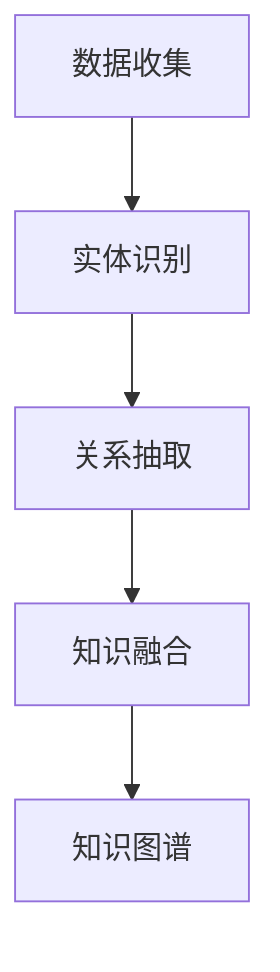
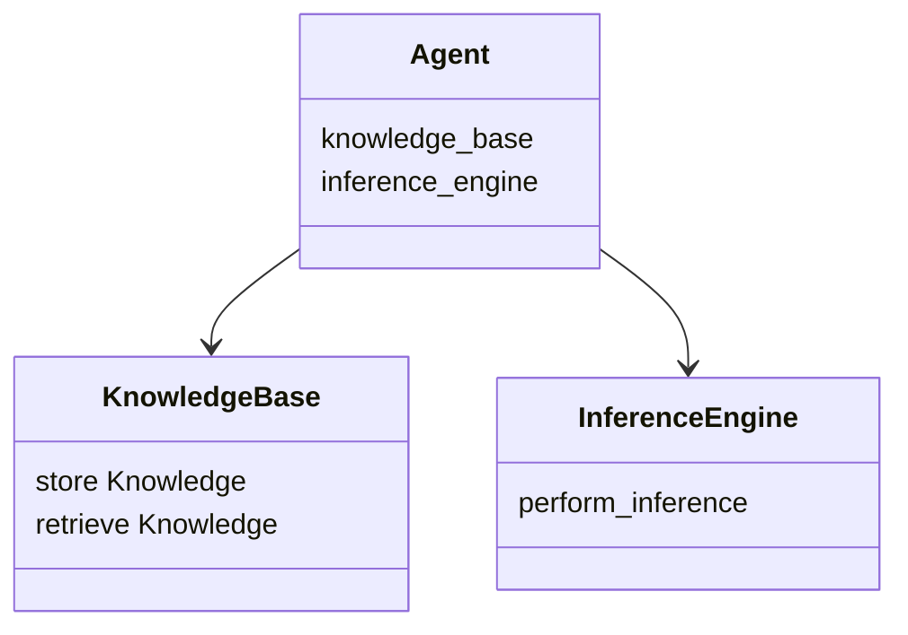
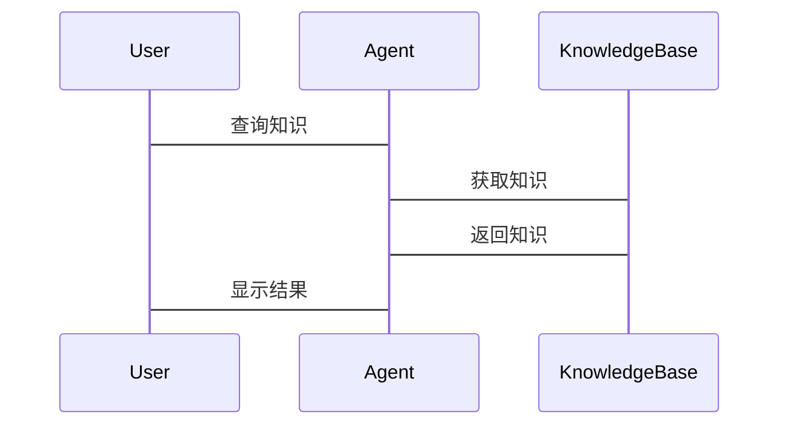

                 


# 开发具有跨领域知识整合能力的AI Agent

> 关键词：AI Agent，跨领域知识整合，知识图谱，自然语言处理，系统架构，Python代码，数学模型

> 摘要：本文详细探讨了开发具有跨领域知识整合能力的AI Agent的各个方面，从基础概念到算法原理，再到系统架构和项目实战，旨在帮助读者全面理解并掌握相关技术。

---

## 目录

1. [AI Agent与跨领域知识整合概述](#ai-agent与跨领域知识整合概述)
2. [跨领域知识整合的核心概念](#跨领域知识整合的核心概念)
3. [AI Agent的知识表示与推理](#ai-agent的知识表示与推理)
4. [跨领域知识整合的算法原理](#跨领域知识整合的算法原理)
5. [AI Agent的系统架构设计](#ai-agent的系统架构设计)
6. [跨领域知识整合的项目实战](#跨领域知识整合的项目实战)
7. [最佳实践与总结](#最佳实践与总结)

---

### 1. AI Agent与跨领域知识整合概述

#### 1.1 AI Agent的基本概念

- **定义**：AI Agent是一种智能体，能够感知环境、自主决策并执行任务。
- **跨领域知识整合的必要性**：AI Agent需要整合不同领域的知识，以提高其理解和决策能力。
- **核心能力**：包括知识表示、推理、学习和自适应能力。

#### 1.2 跨领域知识整合的背景与意义

- **当前AI技术的发展现状**：AI技术在多个领域取得了显著进展，但跨领域整合仍面临挑战。
- **挑战**：不同领域的知识表示方式和语义差异，增加了整合的难度。
- **意义**：跨领域整合能够提升AI Agent的泛化能力和应用场景的广度。

---

### 2. 跨领域知识整合的核心概念

#### 2.1 知识表示

- **符号表示法**：使用符号和规则表示知识，如逻辑表达式。
- **知识图谱表示法**：通过图结构表示实体及其关系，如节点和边。
- **矩阵表示法**：利用矩阵或向量表示知识，常用于深度学习模型。

#### 2.2 知识推理

- **前向推理**：从已知事实出发，推导新的结论。
- **反向推理**：从目标出发，寻找支持结论的事实。
- **不确定性推理**：处理模糊或不确定的知识。

#### 2.3 跨领域知识整合的实现方式

- **基于规则的方法**：通过预定义规则进行知识整合。
- **基于统计的方法**：利用统计学习技术进行模式识别。
- **基于深度学习的方法**：使用神经网络模型进行端到端学习。

---

### 3. AI Agent的知识表示与推理

#### 3.1 知识表示的基本方法

- **符号表示法**：例如，用谓词逻辑表示“狗是动物”。
- **知识图谱表示法**：例如，图结构表示“狗-属于-动物”。
- **矩阵表示法**：例如，使用Word2Vec生成词向量。

#### 3.2 知识推理的基本原理

- **逻辑推理**：基于逻辑规则进行推理，如命题逻辑和谓词逻辑。
- **概率推理**：基于概率论进行推理，如贝叶斯网络。
- **深度学习推理**：使用神经网络进行非线性推理。

#### 3.3 跨领域知识整合的推理模型

- **基于逻辑推理的模型**：如一阶逻辑推理。
- **基于概率推理的模型**：如马尔可夫逻辑网络。
- **基于深度学习的推理模型**：如图神经网络。

---

### 4. 跨领域知识整合的算法原理

#### 4.1 知识图谱构建

- **流程**：数据收集、实体识别、关系抽取、知识融合。
- **mermaid流程图**



- **Python代码示例**

```python
from kgtoolz import kg_builder
kg = kg_builder.build_kg(data)
```

#### 4.2 自然语言处理

- **任务**：文本分割、词性标注、句法分析、实体识别。
- **算法**：使用BERT进行上下文理解。

---

### 5. AI Agent的系统架构设计

#### 5.1 系统功能设计

- **领域模型**：定义系统的核心功能模块，如知识库、推理引擎。



#### 5.2 系统架构设计

- **分层架构**：数据层、知识层、推理层和应用层。


#### 5.3 系统接口设计

- **REST API**：提供HTTP接口，如`/api/query`。

#### 5.4 系统交互



---

### 6. 跨领域知识整合的项目实战

#### 6.1 环境安装

- **工具**：安装Python、TensorFlow、Keras、Numpy。
- **代码示例**

```python
import tensorflow as tf
import numpy as np

model = tf.keras.Sequential([
    tf.keras.layers.Dense(128, activation='relu'),
    tf.keras.layers.Dense(1, activation='sigmoid')
])
model.compile(optimizer='adam', loss='binary_crossentropy', metrics=['accuracy'])
model.fit(x_train, y_train, epochs=10, batch_size=32)
```

#### 6.2 案例分析

- **案例**：整合医疗和金融领域的知识，构建智能诊断系统。
- **流程**：
  1. 数据收集与预处理。
  2. 知识图谱构建。
  3. 推理引擎开发。
  4. 系统集成与测试。

---

### 7. 最佳实践与总结

#### 7.1 最佳实践

- **模块化设计**：将系统划分为独立模块，便于维护和扩展。
- **数据质量管理**：确保数据的准确性和完整性。
- **持续学习**：定期更新知识库，提升系统的适应能力。

#### 7.2 小结

开发具有跨领域知识整合能力的AI Agent是一个复杂但极具挑战性的任务。通过合理的设计和实现，可以显著提升AI Agent的能力和应用范围。

---

作者：AI天才研究院/AI Genius Institute & 禅与计算机程序设计艺术 /Zen And The Art of Computer Programming

