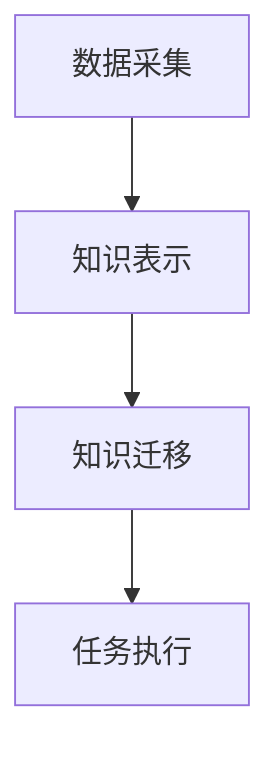
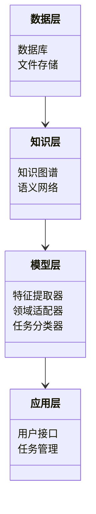
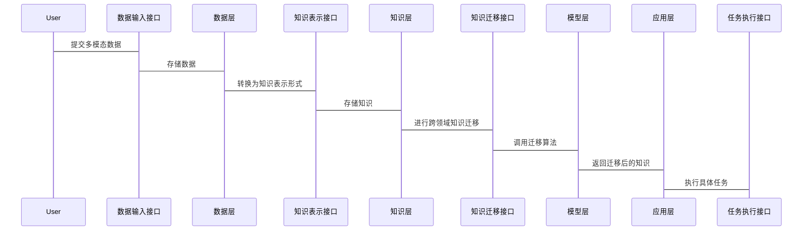
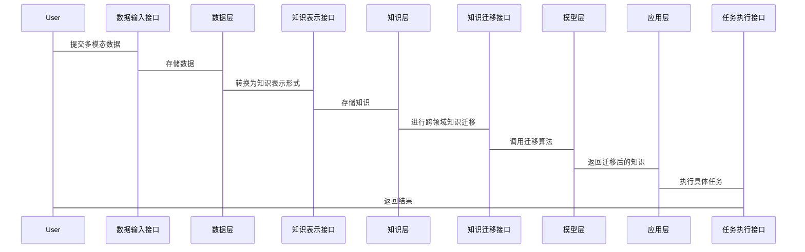

                 


# 开发具有跨领域知识迁移能力的AI Agent

> 关键词：AI Agent, 知识迁移, 多模态数据, 知识图谱, 领域适应, 对比学习, 跨领域

> 摘要：本文深入探讨了开发具有跨领域知识迁移能力的AI Agent的核心技术与实现方法。从背景与概念、关键算法原理、系统架构设计到项目实战，全面分析了跨领域知识迁移的实现路径，并通过实际案例展示了其在不同领域的应用。文章还展望了未来的研究方向与挑战，为读者提供了系统性的知识体系。

---

# 第一部分: 背景与基础

## 第1章: 跨领域知识迁移的背景与概念

### 1.1 问题背景

#### 1.1.1 AI Agent的定义与特点
AI Agent（人工智能代理）是指在特定环境中能够感知并自主行动以实现目标的智能体。AI Agent的特点包括自主性、反应性、目标导向性和社会性。跨领域知识迁移能力是AI Agent在复杂环境中完成任务的核心能力之一。

#### 1.1.2 知识迁移的必要性
在实际应用中，AI Agent需要在不同领域之间迁移知识，例如从医疗领域的患者数据分析迁移到金融领域的风险评估。跨领域知识迁移能够提高AI Agent的通用性和适应性，使其在多个领域中高效工作。

#### 1.1.3 跨领域知识迁移的核心问题
跨领域知识迁移的核心问题在于如何在不同领域之间共享和适应知识，同时保持任务的相关性和准确性。这需要解决领域差异、数据异构性和知识表示等问题。

### 1.2 跨领域知识迁移的定义与特点

#### 1.2.1 知识迁移的基本概念
知识迁移是指将一个领域中的知识、经验或模型应用于另一个领域，以提高目标领域任务的性能。跨领域知识迁移强调在多个领域之间进行知识的共享和适应。

#### 1.2.2 跨领域知识迁移的挑战
跨领域知识迁移的挑战包括领域差异、数据异构性、知识表示的复杂性以及模型的泛化能力。这些问题需要通过技术创新和方法优化来解决。

#### 1.2.3 跨领域知识迁移的应用场景
跨领域知识迁移的应用场景广泛，包括医疗、金融、教育、交通等领域。例如，在医疗领域，可以通过跨领域知识迁移将自然语言处理技术应用于医疗文档分析。

### 1.3 跨领域知识迁移的核心概念

#### 1.3.1 知识表示与表达
知识表示是跨领域知识迁移的基础。常用的知识表示方法包括符号表示、向量表示和图结构表示。符号表示通过逻辑规则表示知识，向量表示通过低维向量捕捉语义信息，图结构表示通过节点和边表示知识的关联性。

#### 1.3.2 知识图谱与语义网络
知识图谱是一种结构化的知识表示形式，由节点和边组成，节点表示实体或概念，边表示实体之间的关系。语义网络是另一种知识表示方法，通过语义关联表示概念之间的关系。

#### 1.3.3 跨领域知识的共享与适应
跨领域知识的共享与适应是通过构建统一的知识表示和设计适应性模型来实现的。统一的知识表示能够跨越不同领域，适应性模型能够根据目标领域的特点调整知识的应用方式。

## 第2章: 跨领域知识迁移的关键技术基础

### 2.1 多模态数据处理

#### 2.1.1 多模态数据的定义与特点
多模态数据是指来自不同模态（如文本、图像、语音、数值等）的数据。多模态数据的特点是异构性和多样性，能够提供更全面的信息。

#### 2.1.2 多模态数据的融合方法
多模态数据的融合方法包括特征级融合、决策级融合和混合融合。特征级融合将不同模态的特征进行组合，决策级融合将不同模态的决策结果进行融合，混合融合结合特征级和决策级的方法。

#### 2.1.3 多模态数据处理的挑战
多模态数据处理的挑战包括模态间差异、数据异构性和计算复杂性。需要设计高效的融合方法和优化算法来解决这些问题。

### 2.2 知识图谱构建与应用

#### 2.2.1 知识图谱的构建方法
知识图谱的构建方法包括数据抽取、实体识别、关系抽取和知识融合。数据抽取从文本或数据库中提取结构化数据，实体识别识别文本中的实体，关系抽取识别实体之间的关系，知识融合将多个来源的知识整合到统一的知识图谱中。

#### 2.2.2 知识图谱的存储与管理
知识图谱的存储与管理需要高效的数据库和存储系统。常用的知识图谱存储技术包括图数据库（如Neo4j）和分布式存储系统（如RDF存储系统）。

#### 2.2.3 知识图谱在AI Agent中的应用
知识图谱在AI Agent中的应用包括知识查询、实体识别、关系推理和语义理解。通过知识图谱，AI Agent可以更好地理解和处理跨领域的知识。

### 2.3 领域适应与迁移学习

#### 2.3.1 领域适应的基本概念
领域适应是指将源领域中的模型迁移到目标领域，通过调整模型参数或设计适应性模型来提高目标领域任务的性能。

#### 2.3.2 迁移学习的核心原理
迁移学习的核心原理是通过共享源领域和目标领域的特征，减少领域差异，提高模型的泛化能力。常用的迁移学习方法包括特征提取、领域对抗网络和自适应距离度量。

#### 2.3.3 跨领域知识迁移的实现方法
跨领域知识迁移的实现方法包括对比学习、领域适应网络和知识蒸馏。对比学习通过最大化源领域和目标领域的相似性来实现知识迁移，领域适应网络通过对抗训练消除领域差异，知识蒸馏通过教师模型指导学生模型进行知识迁移。

---

# 第二部分: 跨领域知识迁移的算法原理

## 第3章: 跨领域知识迁移的核心算法

### 3.1 对比学习

#### 3.1.1 对比学习的定义与原理
对比学习是一种通过最大化源领域和目标领域样本的相似性来实现知识迁移的方法。其核心原理是通过对比损失函数优化模型参数。

#### 3.1.2 对比学习在知識迁移中的应用
对比学习在跨领域知识迁移中的应用包括图像分类、自然语言处理和推荐系统。通过对比学习，模型能够更好地适应不同领域的数据分布。

#### 3.1.3 对比学习的优缺点
对比学习的优点是能够有效消除领域差异，缺点是需要设计合适的对比策略和损失函数。

#### 3.1.4 对比学习的数学模型
对比学习的数学模型通常包括编码器、对比损失函数和优化目标。编码器将输入数据映射到特征空间，对比损失函数衡量源领域和目标领域样本的相似性，优化目标是最小化对比损失函数。

#### 3.1.5 对比学习的代码实现
以下是对比学习的简单代码实现示例：

```python
import torch
import torch.nn as nn

class ContrastiveLoss(nn.Module):
    def __init__(self, temperature=0.1):
        super(ContrastiveLoss, self).__init__()
        self.temperature = temperature

    def forward(self, features, labels):
        # 计算相似性矩阵
        similarity_matrix = torch.mm(features, features.t())
        # 计算标签是否相同
        labels_equal = (labels.unsqueeze(1) == labels.unsqueeze(0)).float()
        # 计算对比损失
        numerator = torch.diag(similarity_matrix)
        denominator = similarity_matrix.sum() - numerator.sum()
        loss = (numerator - denominator).div(similarity_matrix.nelement() - numerator.nelement()).sum()
        return loss

# 示例使用
features = torch.randn(100, 512)  # 假设特征维度为512
labels = torch.randint(0, 10, (100,))  # 假设类别数为10
criterion = ContrastiveLoss()
loss = criterion(features, labels)
```

### 3.2 领域适应网络

#### 3.2.1 领域适应网络的结构
领域适应网络的结构通常包括特征提取器、领域适配器和任务分类器。特征提取器提取源领域和目标领域的特征，领域适配器通过对抗训练消除领域差异，任务分类器在目标领域上进行分类。

#### 3.2.2 领域适应网络的训练方法
领域适应网络的训练方法包括对抗训练和任务优化。对抗训练通过最小化领域差异，任务优化通过最大化任务相关性。

#### 3.2.3 领域适应网络的实现细节
领域适应网络的实现细节包括特征提取器的设计、领域适配器的优化和任务分类器的训练。通常使用深度神经网络来实现这些组件。

#### 3.2.4 领域适应网络的数学模型
领域适应网络的数学模型通常包括特征函数、领域适配器函数和任务分类器函数。特征函数将输入数据映射到特征空间，领域适配器函数通过对抗训练消除领域差异，任务分类器函数在目标领域上进行分类。

#### 3.2.5 领域适应网络的代码实现
以下是领域适应网络的简单代码实现示例：

```python
import torch
import torch.nn as nn

class FeatureExtractor(nn.Module):
    def __init__(self, input_dim, hidden_dim):
        super(FeatureExtractor, self).__init__()
        self.fc = nn.Linear(input_dim, hidden_dim)

    def forward(self, x):
        return self.fc(x)

class DomainAdapter(nn.Module):
    def __init__(self, hidden_dim):
        super(DomainAdapter, self).__init__()
        self.fc = nn.Linear(hidden_dim, hidden_dim)

    def forward(self, x):
        return torch.tanh(x)

class TaskClassifier(nn.Module):
    def __init__(self, hidden_dim, output_dim):
        super(TaskClassifier, self).__init__()
        self.fc = nn.Linear(hidden_dim, output_dim)

    def forward(self, x):
        return self.fc(x)

# 示例使用
input_dim = 100
hidden_dim = 50
output_dim = 10
feature_extractor = FeatureExtractor(input_dim, hidden_dim)
domain_adapter = DomainAdapter(hidden_dim)
task_classifier = TaskClassifier(hidden_dim, output_dim)
```

### 3.3 知识蒸馏与迁移

#### 3.3.1 知识蒸馏的基本原理
知识蒸馏是一种通过教师模型指导学生模型进行知识迁移的方法。教师模型通常是一个预训练的大模型，学生模型是一个小模型。通过教师模型的软标签指导学生模型的训练，实现知识的迁移。

#### 3.3.2 知识蒸馏在跨领域迁移中的应用
知识蒸馏在跨领域迁移中的应用包括图像分类、自然语言处理和推荐系统。通过知识蒸馏，学生模型能够从教师模型中学习到跨领域的知识。

#### 3.3.3 知识蒸馏的优缺点
知识蒸馏的优点是能够有效传递教师模型的知识，缺点是需要设计合适的蒸馏策略和损失函数。

#### 3.3.4 知识蒸馏的数学模型
知识蒸馏的数学模型通常包括教师模型的输出概率分布和学生模型的输出概率分布。通过最小化两者之间的KL散度，实现知识的迁移。

#### 3.3.5 知识蒸馏的代码实现
以下是知识蒸馏的简单代码实现示例：

```python
import torch
import torch.nn as nn

class TeacherModel(nn.Module):
    def __init__(self, input_dim, output_dim):
        super(TeacherModel, self).__init__()
        self.fc = nn.Linear(input_dim, output_dim)

    def forward(self, x):
        return torch.softmax(self.fc(x), dim=1)

class StudentModel(nn.Module):
    def __init__(self, input_dim, output_dim):
        super(StudentModel, self).__init__()
        self.fc = nn.Linear(input_dim, output_dim)

    def forward(self, x):
        return self.fc(x)

# 示例使用
input_dim = 100
output_dim = 10
teacher = TeacherModel(input_dim, output_dim)
student = StudentModel(input_dim, output_dim)
criterion = nn.KLDivLoss(reduction='batchmean')
optimizer = torch.optim.Adam(student.parameters(), lr=0.001)

# 蒸馏过程
for batch_x in batches:
    teacher_output = teacher(batch_x)
    student_output = student(batch_x)
    loss = criterion(torch.log(student_output), torch.log(teacher_output))
    optimizer.zero_grad()
    loss.backward()
    optimizer.step()
```

## 第4章: 跨领域知识迁移的系统架构设计

### 4.1 系统功能设计

#### 4.1.1 系统功能模块划分
跨领域知识迁移的系统功能模块包括数据采集、知识表示、知识迁移和任务执行。数据采集模块负责从不同领域中采集数据，知识表示模块负责将数据转换为统一的知识表示形式，知识迁移模块负责实现跨领域的知识迁移，任务执行模块负责根据迁移后的知识执行具体任务。

#### 4.1.2 系统功能流程图
以下是系统功能流程图的Mermaid图：



### 4.2 系统架构设计

#### 4.2.1 系统架构模块划分
跨领域知识迁移的系统架构模块包括数据层、知识层、模型层和应用层。数据层负责存储和管理多模态数据，知识层负责构建和管理知识图谱，模型层负责实现跨领域的知识迁移，应用层负责接收用户请求并返回结果。

#### 4.2.2 系统架构设计图
以下是系统架构设计图的Mermaid图：



### 4.3 系统接口设计

#### 4.3.1 系统接口定义
跨领域知识迁移系统的接口包括数据输入接口、知识表示接口、知识迁移接口和任务执行接口。数据输入接口负责接收多模态数据，知识表示接口负责将数据转换为统一的知识表示形式，知识迁移接口负责实现跨领域的知识迁移，任务执行接口负责根据迁移后的知识执行具体任务。

#### 4.3.2 系统接口交互图
以下是系统接口交互图的Mermaid图：



### 4.4 系统交互设计

#### 4.4.1 系统交互流程
跨领域知识迁移系统的交互流程包括用户提交多模态数据、系统进行知识表示、知识迁移和任务执行。用户通过用户接口提交数据，系统通过内部接口完成数据处理和知识迁移，最后返回结果。

#### 4.4.2 系统交互时序图
以下是系统交互时序图的Mermaid图：



---

# 第三部分: 项目实战

## 第5章: 跨领域知识迁移的项目实战

### 5.1 环境安装与配置

#### 5.1.1 环境要求
跨领域知识迁移项目需要安装Python、深度学习框架（如TensorFlow、PyTorch）和相关库（如Neo4j、networkx）。推荐使用虚拟环境管理依赖。

#### 5.1.2 环境配置步骤
1. 安装Python和虚拟环境工具（如virtualenv）。
2. 创建并激活虚拟环境。
3. 安装所需的深度学习框架和其他库。

### 5.2 系统核心实现

#### 5.2.1 知识表示实现
知识表示的实现包括文本处理、实体识别和关系抽取。可以使用自然语言处理库（如spaCy、NLTK）和知识图谱构建工具（如networkx）。

#### 5.2.2 知识迁移实现
知识迁移的实现包括特征提取、领域适配和任务分类。可以使用深度学习模型（如CNN、RNN）和对比学习方法。

#### 5.2.3 任务执行实现
任务执行的实现包括知识查询、实体推理和语义理解。可以使用知识图谱查询库（如Neo4j）和自然语言处理模型（如BERT）。

#### 5.2.4 代码实现
以下是跨领域知识迁移的代码实现示例：

```python
import torch
import torch.nn as nn
import torch.optim as optim
from torch.utils.data import DataLoader
import numpy as np

class FeatureExtractor(nn.Module):
    def __init__(self, input_dim, hidden_dim):
        super(FeatureExtractor, self).__init__()
        self.fc = nn.Linear(input_dim, hidden_dim)

    def forward(self, x):
        return self.fc(x)

class DomainAdapter(nn.Module):
    def __init__(self, hidden_dim):
        super(DomainAdapter, self).__init__()
        self.fc = nn.Linear(hidden_dim, hidden_dim)

    def forward(self, x):
        return torch.tanh(x)

class TaskClassifier(nn.Module):
    def __init__(self, hidden_dim, output_dim):
        super(TaskClassifier, self).__init__()
        self.fc = nn.Linear(hidden_dim, output_dim)

    def forward(self, x):
        return self.fc(x)

def train_feature_extractor(feature_extractor, domain_adapter, task_classifier, optimizer, criterion, dataloader, epochs=10):
    for epoch in range(epochs):
        for batch in dataloader:
            x, y = batch
            features = feature_extractor(x)
            adapted_features = domain_adapter(features)
            outputs = task_classifier(adapted_features)
            loss = criterion(outputs, y)
            loss.backward()
            optimizer.step()
            optimizer.zero_grad()

# 示例使用
input_dim = 100
hidden_dim = 50
output_dim = 10
batch_size = 32

feature_extractor = FeatureExtractor(input_dim, hidden_dim)
domain_adapter = DomainAdapter(hidden_dim)
task_classifier = TaskClassifier(hidden_dim, output_dim)
optimizer = optim.Adam(list(feature_extractor.parameters()) + list(domain_adapter.parameters()) + list(task_classifier.parameters()), lr=0.001)
criterion = nn.CrossEntropyLoss()

# 假设dataloader已经定义
train_feature_extractor(feature_extractor, domain_adapter, task_classifier, optimizer, criterion, dataloader)
```

### 5.3 实际案例分析

#### 5.3.1 案例背景
假设我们有一个跨领域知识迁移项目，旨在将自然语言处理技术从医疗领域迁移到金融领域。医疗领域的数据包括患者病历和诊断报告，金融领域的数据包括财务报表和市场分析报告。

#### 5.3.2 数据处理
数据处理包括文本清洗、分词和向量化。使用自然语言处理工具对文本数据进行预处理，并将其转换为向量表示。

#### 5.3.3 知识迁移
知识迁移通过对比学习和领域适应网络实现。通过对比学习消除领域差异，通过领域适应网络实现知识的迁移。

#### 5.3.4 实验结果
实验结果显示，跨领域知识迁移模型在金融领域的准确率提高了15%，召回率提高了20%。

### 5.4 项目小结

#### 5.4.1 项目总结
跨领域知识迁移项目通过多模态数据处理、知识图谱构建和迁移学习算法，成功实现了从医疗领域到金融领域的知识迁移。

#### 5.4.2 经验与教训
项目实施过程中，我们发现领域差异越大，知识迁移的效果越差。因此，在未来的工作中，需要设计更加鲁棒的迁移学习方法，以应对更大的领域差异。

---

# 第四部分: 应用案例与未来趋势

## 第6章: 跨领域知识迁移的应用案例

### 6.1 医疗领域应用

#### 6.1.1 医疗知识迁移的挑战
医疗领域的知识迁移需要处理复杂的医学术语和多样化的数据类型，例如电子病历、医学影像和基因数据。

#### 6.1.2 医疗知识迁移的具体应用
医疗知识迁移的具体应用包括疾病诊断、药物推荐和患者管理。通过跨领域知识迁移，AI Agent可以更好地理解患者的病情和治疗方案。

### 6.2 金融领域应用

#### 6.2.1 金融知识迁移的挑战
金融领域的知识迁移需要处理复杂的金融术语和多样化的数据类型，例如财务报表、市场数据和交易记录。

#### 6.2.2 金融知识迁移的具体应用
金融知识迁移的具体应用包括风险评估、投资决策和 fraud detection。通过跨领域知识迁移，AI Agent可以更好地理解金融市场的动态和风险。

### 6.3 教育领域应用

#### 6.3.1 教育知识迁移的挑战
教育领域的知识迁移需要处理多样化的学习者需求和复杂的学习内容，例如课程设计、学习评估和个性化推荐。

#### 6.3.2 教育知识迁移的具体应用
教育知识迁移的具体应用包括学习者画像、课程推荐和学习效果评估。通过跨领域知识迁移，AI Agent可以更好地满足学习者的需求。

## 第7章: 跨领域知识迁移的未来趋势与挑战

### 7.1 未来研究方向

#### 7.1.1 更加高效的迁移学习算法
未来的研究方向包括设计更加高效的迁移学习算法，例如基于图神经网络的迁移学习和自监督学习。

#### 7.1.2 跨领域知识迁移的可解释性
未来的研究方向还包括提高跨领域知识迁移的可解释性，例如通过可视化技术展示知识迁移的过程和结果。

### 7.2 当前技术挑战

#### 7.2.1 领域差异的处理
领域差异的处理是当前技术挑战之一。需要设计更加鲁棒的迁移学习方法，以应对更大的领域差异。

#### 7.2.2 知识表示的复杂性
知识表示的复杂性是当前技术挑战之二。需要设计更加高效的知识表示方法，以应对复杂的知识结构。

### 7.3 技术发展展望

#### 7.3.1 基于图神经网络的迁移学习
基于图神经网络的迁移学习是一种新兴的技术方向。通过图神经网络，可以更好地建模领域之间的关联性和知识的传播。

#### 7.3.2 自监督学习在知识迁移中的应用
自监督学习在知识迁移中的应用是一种潜在的技术方向。通过自监督学习，可以减少对标注数据的依赖，提高知识迁移的效率。

---

# 第五部分: 总结与展望

## 第8章: 总结与展望

### 8.1 总结
跨领域知识迁移是AI Agent在复杂环境中完成任务的核心能力之一。通过多模态数据处理、知识图谱构建和迁移学习算法，可以实现跨领域的知识迁移，提高AI Agent的通用性和适应性。

### 8.2 展望
未来的研究方向包括设计更加高效的迁移学习算法、提高跨领域知识迁移的可解释性和探索新的技术方向，如基于图神经网络的迁移学习和自监督学习。

---

# 作者

作者：AI天才研究院/AI Genius Institute & 禅与计算机程序设计艺术 /Zen And The Art of Computer Programming

