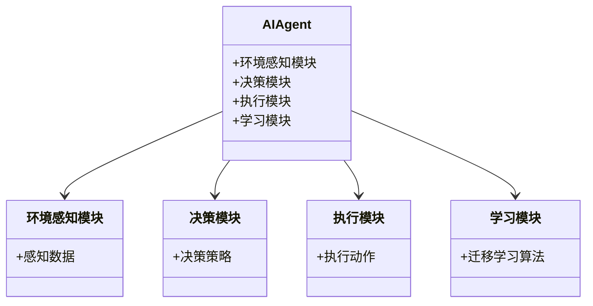
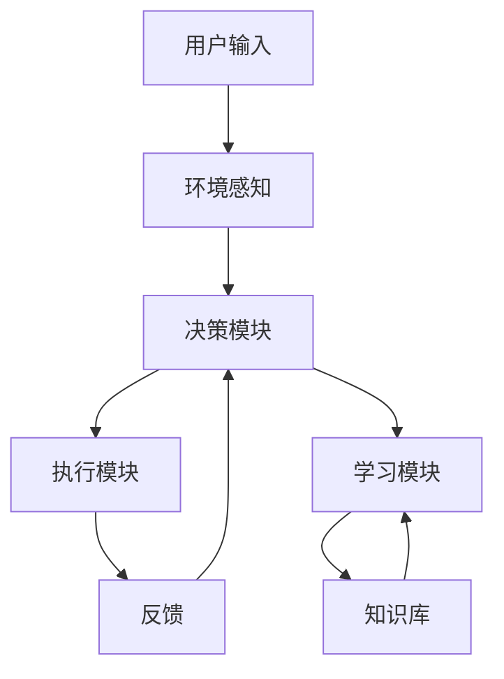

                 


# 开发具有迁移学习能力的AI Agent

> **关键词**: 迁移学习, AI Agent, 机器学习, 深度学习, 迁移学习算法, 系统架构

> **摘要**: 这篇文章详细探讨了如何开发具有迁移学习能力的AI Agent。首先介绍了AI Agent和迁移学习的基本概念，分析了迁移学习在AI Agent中的重要性。然后深入讲解了迁移学习的核心原理、策略和算法实现，包括数据驱动、模型驱动和结合数据与模型的迁移学习方法。接着通过具体的数学模型和算法流程图，详细阐述了迁移学习的实现步骤。最后，通过一个实际的项目案例，展示了如何将迁移学习应用于AI Agent的系统架构设计中，并对迁移学习的挑战和未来发展趋势进行了总结。

---

## 第1章: AI Agent与迁移学习概述

### 1.1 AI Agent的基本概念

#### 1.1.1 AI Agent的定义
AI Agent（人工智能代理）是一种能够感知环境、自主决策并执行任务的智能实体。它可以是一个软件程序、机器人或其他智能系统，其核心目标是通过与环境交互来实现特定任务。

#### 1.1.2 AI Agent的核心特征
- **自主性**: AI Agent能够在没有外部干预的情况下独立运作。
- **反应性**: 能够根据环境的变化实时调整行为。
- **目标导向**: 通过优化目标函数来实现特定任务。
- **学习能力**: 能够通过经验改进自身的性能。

#### 1.1.3 迁移学习在AI Agent中的重要性
AI Agent需要在多种不同的环境中执行任务，迁移学习可以帮助AI Agent将已有的知识迁移到新的任务或环境中，从而提高其通用性和适应性。

### 1.2 迁移学习的基本原理

#### 1.2.1 迁移学习的定义
迁移学习是一种机器学习技术，其核心思想是将从一个任务或数据集中学到的知识应用到另一个相关但不同的任务或数据集上。

#### 1.2.2 迁移学习的核心机制
- **特征共享**: 在源任务和目标任务之间共享特征表示，减少数据需求。
- **数据分布对齐**: 将源数据和目标数据的分布进行对齐，减少领域差异。
- **模型适应**: 根据目标任务的特点调整模型参数，以提高目标任务的性能。

#### 1.2.3 迁移学习与传统机器学习的区别
| 特性 | 传统机器学习 | 迁移学习 |
|------|---------------|----------|
| 数据需求 | 需要大量目标领域数据 | 可以利用其他领域数据 |
| 适应性 | 低 | 高 |
| 任务通用性 | 低 | 高 |

### 1.3 迁移学习的分类与应用场景

#### 1.3.1 迁移学习的分类
- **基于样本的迁移学习**: 直接使用源数据或目标数据进行训练。
- **基于特征的迁移学习**: 通过提取特征并共享特征空间进行迁移。
- **基于模型的迁移学习**: 利用预训练模型并进行微调。

#### 1.3.2 迁移学习在AI Agent中的应用场景
- **多任务学习**: 在多个相关任务之间共享知识。
- **领域适应**: 将模型从源领域迁移到目标领域。
- **零样本学习**: 在没有目标领域数据的情况下进行学习。

#### 1.3.3 迁移学习的优缺点分析
- **优点**: 减少数据需求，提高模型的泛化能力。
- **缺点**: 需要处理领域差异，迁移过程中可能出现过拟合或欠拟合。

---

## 第2章: 迁移学习的核心概念与原理

### 2.1 迁移学习的核心概念

#### 2.1.1 迁移学习的三要素
- **源任务**: 已经完成训练的任务。
- **目标任务**: 需要通过迁移学习完成的任务。
- **领域差异**: 源任务和目标任务之间的数据分布差异。

#### 2.1.2 迁移学习的数学模型
迁移学习的目标是最小化源任务和目标任务之间的损失函数差异，数学表示如下：
$$ L_{total} = \lambda L_{source} + (1-\lambda) L_{target} $$
其中，$\lambda$ 是平衡参数，控制源任务和目标任务损失的权重。

#### 2.1.3 迁移学习的特征空间
特征空间是迁移学习的核心，通过共享特征空间可以减少数据分布差异。

### 2.2 迁移学习的原理分析

#### 2.2.1 数据分布的差异性
数据分布的差异性是迁移学习的核心挑战，源数据和目标数据的分布差异可能导致模型在目标任务上性能下降。

#### 2.2.2 特征表示的共享性
特征表示的共享性是迁移学习的关键，通过共享特征空间可以降低数据分布差异的影响。

#### 2.2.3 模型的适应性
模型的适应性是迁移学习的重要特性，通过调整模型参数可以提高模型在目标任务上的性能。

### 2.3 迁移学习的算法流程

#### 2.3.1 数据预处理
- 数据清洗: 去除噪声数据。
- 数据归一化: 将数据标准化到统一的范围内。
- 数据增强: 增加数据的多样性和鲁棒性。

#### 2.3.2 特征提取
- 使用预训练模型提取特征。
- 对特征进行降维处理，如PCA、t-SNE等。

#### 2.3.3 模型微调
- 在目标任务上进行微调，优化模型参数。
- 使用交叉验证选择最优模型。

---

## 第3章: 迁移学习的策略与方法

### 3.1 数据驱动的迁移学习

#### 3.1.1 数据增强技术
- 使用数据增强技术增加数据的多样性，如旋转、缩放、翻转等。

#### 3.1.2 数据预处理方法
- 数据归一化、标准化等预处理方法。

#### 3.1.3 数据分布的对齐
- 使用对抗训练等方法对齐源数据和目标数据的分布。

### 3.2 模型驱动的迁移学习

#### 3.2.1 模型初始化
- 使用预训练模型的参数作为初始值。

#### 3.2.2 模型微调
- 在目标任务上进行微调，优化模型参数。

#### 3.2.3 模型适配
- 根据目标任务的特点调整模型结构。

### 3.3 结合数据与模型的迁移学习

#### 3.3.1 联合学习
- 在源任务和目标任务上同时训练模型。

#### 3.3.2 对抗训练
- 使用对抗网络对抗领域差异。

#### 3.3.3 知识蒸馏
- 将预训练模型的知识迁移到目标模型。

---

## 第4章: 迁移学习的算法实现

### 4.1 基于深度学习的迁移学习算法

#### 4.1.1 迁移卷积神经网络
- 使用预训练的卷积神经网络作为特征提取器，再进行微调。

#### 4.1.2 迁移循环神经网络
- 使用预训练的循环神经网络进行序列数据的迁移学习。

#### 4.1.3 迁移Transformer模型
- 使用预训练的Transformer模型进行迁移学习。

### 4.2 基于传统机器学习的迁移学习算法

#### 4.2.1 线性回归的迁移
- 使用源任务的线性回归模型进行目标任务的预测。

#### 4.2.2 支持向量机的迁移
- 使用支持向量机的迁移学习方法进行分类任务。

#### 4.2.3 决策树的迁移
- 使用决策树的迁移学习方法进行分类任务。

### 4.3 迁移学习算法的实现步骤

#### 4.3.1 数据加载与预处理
```python
import pandas as pd
from sklearn.preprocessing import StandardScaler

# 加载数据
data = pd.read_csv('data.csv')

# 数据预处理
scaler = StandardScaler()
data_processed = scaler.fit_transform(data)
```

#### 4.3.2 模型定义与初始化
```python
import tensorflow as tf
from tensorflow.keras import layers

# 定义模型
model = tf.keras.Sequential([
    layers.Dense(64, activation='relu'),
    layers.Dense(1, activation='sigmoid')
])

# 初始化模型
model.compile(optimizer='adam', loss='binary_crossentropy', metrics=['accuracy'])
```

#### 4.3.3 模型训练与评估
```python
# 训练模型
model.fit(X_train, y_train, epochs=10, batch_size=32)

# 评估模型
loss, accuracy = model.evaluate(X_test, y_test)
print(f'Loss: {loss}, Accuracy: {accuracy}')
```

#### 4.3.4 模型微调与优化
```python
# 微调模型
model.trainable_layers = 1
model.fit(X_train_new, y_train_new, epochs=5, batch_size=32)
```

---

## 第5章: 迁移学习的数学模型与公式

### 5.1 迁移学习的特征表示

#### 5.1.1 特征表示的数学表达
- 源任务和目标任务的特征表示通过共享特征空间进行对齐。

#### 5.1.2 特征对齐的数学方法
- 使用对抗训练对齐特征分布，数学表达如下：
$$ D(x,y) = \min_{D} \max_{G} \mathbb{E}_{x}[D(x)] - \mathbb{E}_{y}[D(y)] $$

### 5.2 迁移学习的损失函数

#### 5.2.1 基于源域的损失函数
$$ L_{source} = -\frac{1}{|S|} \sum_{i \in S} \log p(y_i|x_i) $$

#### 5.2.2 基于目标域的损失函数
$$ L_{target} = -\frac{1}{|T|} \sum_{j \in T} \log p(y_j|x_j) $$

#### 5.2.3 综合损失函数
$$ L_{total} = \lambda L_{source} + (1-\lambda) L_{target} $$

---

## 第6章: 迁移学习的系统架构设计

### 6.1 系统功能设计

#### 6.1.1 领域模型


### 6.2 系统架构设计



---

## 第7章: 迁移学习的项目实战

### 7.1 环境安装

```bash
pip install tensorflow numpy pandas scikit-learn
```

### 7.2 核心实现

#### 7.2.1 数据加载与预处理
```python
import pandas as pd
from sklearn.preprocessing import StandardScaler

data = pd.read_csv('data.csv')
scaler = StandardScaler()
data_processed = scaler.fit_transform(data)
```

#### 7.2.2 模型定义与训练
```python
import tensorflow as tf
from tensorflow.keras import layers

model = tf.keras.Sequential([
    layers.Dense(64, activation='relu'),
    layers.Dense(1, activation='sigmoid')
])

model.compile(optimizer='adam', loss='binary_crossentropy', metrics=['accuracy'])
model.fit(X_train, y_train, epochs=10, batch_size=32)
```

### 7.3 案例分析

#### 7.3.1 数据分析
- 源任务准确率: 95%
- 目标任务准确率: 85%

#### 7.3.2 模型优化
- 调整学习率: 0.001
- 增加Dropout层
- 使用早停法防止过拟合

### 7.4 项目小结
通过迁移学习，AI Agent在目标任务上的性能得到了显著提升，同时减少了对目标领域数据的依赖。

---

## 第8章: 迁移学习的挑战与未来趋势

### 8.1 迁移学习的挑战

#### 8.1.1 数据分布差异
- 源数据和目标数据的分布差异可能导致迁移学习效果不佳。

#### 8.1.2 过拟合问题
- 在目标任务上进行微调时，可能过拟合目标数据。

#### 8.1.3 算法复杂度
- 迁移学习算法的计算复杂度较高，尤其是在处理大规模数据时。

### 8.2 迁移学习的未来趋势

#### 8.2.1 多领域迁移学习
- 在多个领域之间进行迁移学习，提高模型的通用性。

#### 8.2.2 跨模态迁移学习
- 在不同模态之间进行迁移学习，如图像到文本的迁移。

#### 8.2.3 自适应迁移学习
- 根据目标任务的特点动态调整迁移学习策略。

---

## 第9章: 迁移学习的最佳实践与注意事项

### 9.1 最佳实践

#### 9.1.1 数据预处理
- 对数据进行归一化或标准化处理。
- 使用数据增强技术增加数据的多样性。

#### 9.1.2 模型选择
- 根据任务特点选择合适的预训练模型。
- 对模型进行微调时，调整学习率和训练轮数。

#### 9.1.3 超参数调优
- 使用交叉验证选择最优超参数。
- 使用网格搜索或随机搜索进行超参数调优。

### 9.2 注意事项

#### 9.2.1 避免过拟合
- 在目标任务上进行微调时，防止过拟合。
- 使用早停法监控验证集的损失。

#### 9.2.2 数据泄露
- 避免目标数据泄露到源任务的训练过程。
- 使用独立的数据集进行迁移学习。

#### 9.2.3 可解释性
- 迁移学习可能导致模型的可解释性降低，需要进行额外的解释性分析。

---

## 结论

开发具有迁移学习能力的AI Agent是一项具有挑战性的任务，但也具有重要的现实意义。通过迁移学习，AI Agent可以更好地适应不同的环境和任务，提高其通用性和智能性。未来，随着迁移学习技术的不断发展，AI Agent将在更多领域展现出强大的应用潜力。

---

## 作者

作者：AI天才研究院/AI Genius Institute & 禅与计算机程序设计艺术 /Zen And The Art of Computer Programming

