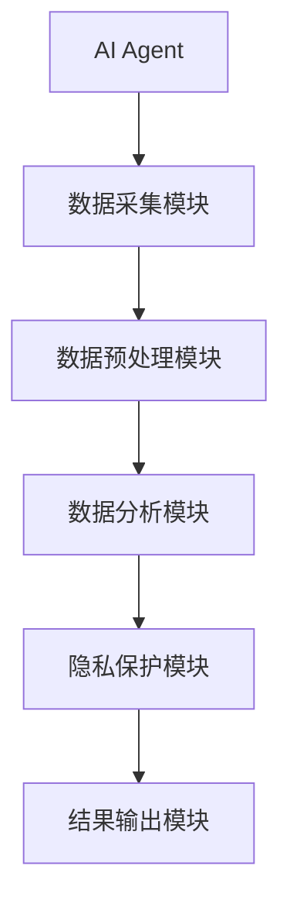
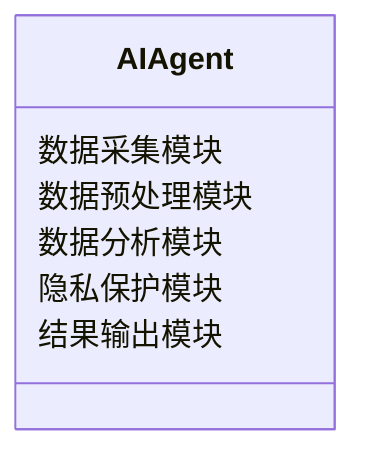
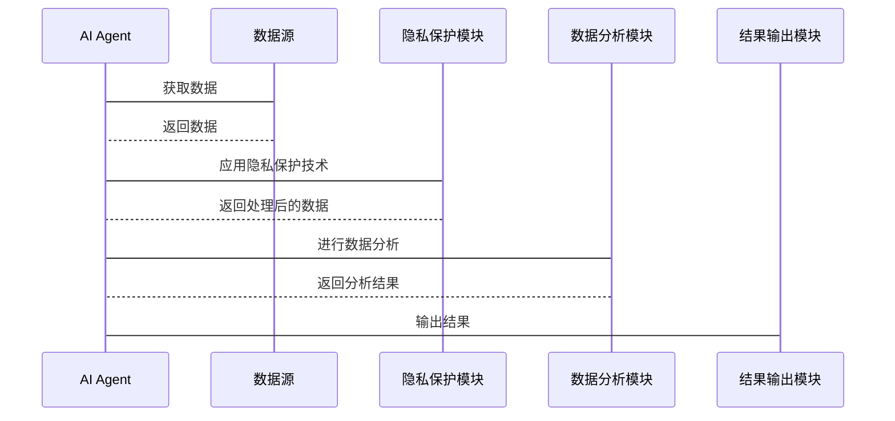

                 


# 开发具有隐私保护数据分析能力的AI Agent

> 关键词：AI Agent，隐私保护，数据分析，同态加密，差分隐私，数据脱敏

> 摘要：本文详细探讨了开发具有隐私保护数据分析能力的AI Agent的方法。首先介绍了AI Agent和隐私保护的基本概念，分析了隐私保护与数据分析的矛盾，接着讲解了数据脱敏、同态加密和差分隐私等核心技术，通过算法原理和系统架构设计展示了如何在AI Agent中实现隐私保护。最后，通过一个实际项目案例，展示了如何将这些技术应用于现实场景，并提出了最佳实践和未来发展建议。

---

# 第一部分：引言

## 第1章：AI Agent与隐私保护数据分析概述

### 1.1 AI Agent的基本概念

AI Agent是一种智能代理，能够在没有人类干预的情况下自主执行任务。其核心能力包括感知环境、理解数据、做出决策和执行操作。数据分析能力是AI Agent的关键组成部分，它使AI Agent能够从数据中提取有价值的信息，支持决策和行动。

### 1.2 隐私保护的核心意义

随着数据驱动决策的普及，数据隐私保护变得尤为重要。AI Agent在处理敏感数据时，必须确保数据的机密性和完整性。隐私保护不仅仅是技术问题，还涉及法律和伦理层面的要求。

### 1.3 本章小结

本章介绍了AI Agent和隐私保护的基本概念，并指出了两者之间的矛盾与平衡的重要性。理解这些概念是开发具有隐私保护数据分析能力的AI Agent的基础。

---

# 第二部分：核心技术与算法原理

## 第2章：隐私保护数据分析的核心技术

### 2.1 数据脱敏技术

数据脱敏是一种通过数据替换、删除或加密等方法，将敏感数据转化为不可逆的非敏感数据的技术。常用的数据脱敏方法包括替换、遮蔽和删除等。

#### 2.1.1 数据脱敏的定义与原理

数据脱敏的目的是在保留数据有用性的同时，隐藏敏感信息。例如，将姓名替换为代号，或对日期进行部分遮蔽。

#### 2.1.2 数据脱敏的实现方式

- **替换法**：将敏感字段替换为随机值或代号。
- **遮蔽法**：隐藏部分数据，如只显示手机号的后四位。
- **删除法**：永久删除敏感字段。

### 2.2 同态加密

同态加密是一种允许在加密数据上进行计算的技术，结果在解密后与直接在明文上计算的结果相同。

#### 2.2.1 同态加密的定义与原理

同态加密允许对加密数据进行操作，而无需知道密钥。例如，可以对加密的数字进行加法或乘法运算，结果保持加密状态。

#### 2.2.2 同态加密的实现方式

- **加法同态加密**：允许对加密数据进行加法运算。
- **乘法同态加密**：允许对加密数据进行乘法运算。

### 2.3 差分隐私

差分隐私通过在数据中添加噪声，确保单个数据点的改变不会影响整体数据分析结果。

#### 2.3.1 差分隐私的定义与原理

差分隐私确保了在数据集中添加或删除一个数据点，不会改变数据分析结果的分布。这通过在数据中添加随机噪声实现。

#### 2.3.2 差分隐私的实现方式

- **拉普拉斯噪声**：用于保护数值型数据的隐私。
- **指数机制**：用于保护非数值型数据的隐私。

### 2.4 本章小结

本章介绍了几种隐私保护技术，包括数据脱敏、同态加密和差分隐私。这些技术在AI Agent中的数据分析模块中可以单独或组合使用，以保护数据隐私。

---

## 第3章：隐私保护数据分析的算法原理

### 3.1 数据脱敏算法

数据脱敏算法通过替换、遮蔽或删除敏感信息，确保数据在分析过程中不被滥用。

#### 3.1.1 数据脱敏算法的实现

```python
def data_masking(dataframe, sensitive_columns):
    masked_data = dataframe.copy()
    for col in sensitive_columns:
        if dataframe[col].dtype == 'object':
            masked_data[col] = dataframe[col].apply(lambda x: '*' * len(x))
        else:
            masked_data[col] = dataframe[col].apply(lambda x: x % 1000)
    return masked_data
```

### 3.2 同态加密算法

同态加密算法允许在加密数据上进行计算，保持数据的机密性。

#### 3.2.1 同态加密算法的实现

```python
class HomomorphicEncryption:
    def __init__(self, modulus, multiplier):
        self.modulus = modulus
        self.multiplier = multiplier

    def encrypt(self, x):
        return (x * self.multiplier) % self.modulus

    def decrypt(self, y):
        return y // self.multiplier

    def add(self, y1, y2):
        return (y1 + y2) % self.modulus

    def multiply(self, y1, y2):
        return (y1 * y2) % self.modulus
```

### 3.3 差分隐私算法

差分隐私算法通过添加噪声来保护数据隐私。

#### 3.3.1 差分隐私算法的实现

```python
import numpy as np

def laplace_noise(budget_epsilon):
    return np.random.laplace(0, 1/budget_epsilon)

# 示例：在数据分析中添加拉普拉斯噪声
def add_laplace_noise(series, epsilon):
    noise = laplace_noise(epsilon)
    return series + noise
```

### 3.4 本章小结

本章详细讲解了数据脱敏、同态加密和差分隐私的算法原理，并通过代码示例展示了这些算法的实现方式。这些算法可以用于保护AI Agent中的数据隐私。

---

## 第4章：系统架构与设计

### 4.1 系统架构设计

AI Agent的系统架构应包括数据采集、数据预处理、数据分析、隐私保护和结果输出模块。

#### 4.1.1 系统架构图



### 4.2 系统功能设计

#### 4.2.1 领域模型设计



### 4.3 交互流程设计



### 4.4 本章小结

本章展示了AI Agent的系统架构设计，包括各个模块的交互流程和功能设计。通过Mermaid图展示了系统的整体架构和交互流程。

---

## 第5章：项目实战与案例分析

### 5.1 项目背景

假设我们正在开发一个医疗AI Agent，需要分析患者的医疗数据，同时保护患者的隐私。

### 5.2 项目实现

#### 5.2.1 环境安装

需要安装以下Python库：
- `numpy`
- `pandas`
- `scipy`
- `mermaid`

#### 5.2.2 核心代码实现

```python
import numpy as np
import pandas as pd
from sklearn.model_selection import train_test_split
from sklearn.linear_model import LogisticRegression

# 示例数据集
data = pd.DataFrame({
    'age': [20, 30, 40, 50],
    'salary': [50000, 60000, 70000, 80000],
    'disease': ['yes', 'no', 'yes', 'no']
})

# 数据预处理
X = data[['age', 'salary']]
y = data['disease']

# 应用拉普拉斯噪声进行隐私保护
epsilon = 1.0
noise = np.random.laplace(0, 1/epsilon, X.shape[0])
X_perturbed = X + noise

# 训练模型
X_train, X_test, y_train, y_test = train_test_split(X_perturbed, y, test_size=0.2)
model = LogisticRegression()
model.fit(X_train, y_train)

# 预测结果
y_pred = model.predict(X_test)
print('预测结果:', y_pred)
print('真实结果:', y_test)
```

### 5.3 案例分析

在上述代码中，我们使用拉普拉斯噪声对患者的年龄和薪水数据进行了隐私保护，然后训练了一个逻辑回归模型来预测患者是否患有某种疾病。结果显示，模型在保护隐私的前提下，仍然能够进行有效的数据分析。

### 5.4 本章小结

本章通过一个医疗数据分析的案例，展示了如何在实际项目中应用隐私保护技术。通过代码示例和案例分析，帮助读者理解如何在AI Agent中实现隐私保护的数据分析。

---

# 第三部分：总结与展望

## 第6章：总结与最佳实践

### 6.1 本章总结

本文详细介绍了开发具有隐私保护数据分析能力的AI Agent的方法，包括核心技术、算法原理、系统架构设计和项目实战。通过这些内容，读者可以了解如何在AI Agent中实现隐私保护。

### 6.2 最佳实践

- **数据脱敏**：在数据预处理阶段，使用数据脱敏技术保护敏感信息。
- **同态加密**：在需要进行复杂计算时，使用同态加密保护数据隐私。
- **差分隐私**：在数据分析过程中，使用差分隐私添加噪声，保护数据隐私。
- **系统设计**：在系统架构设计时，确保隐私保护模块与数据分析模块紧密结合。

### 6.3 注意事项

- 隐私保护技术的选择应根据具体场景和需求进行调整。
- 在使用同态加密和差分隐私时，需要考虑性能影响。
- 数据隐私保护不仅仅是技术问题，还需要考虑法律和伦理要求。

### 6.4 拓展阅读

- "Homomorphic Encryption: A Practical Perspective" by Craig Gentry
- "Differential Privacy: A Survey of the State of the Art on Privacy-Preserving Data Mining" by Adam D. Smith

### 6.5 本章小结

本章总结了全文内容，并提出了开发隐私保护数据分析AI Agent的最佳实践和注意事项。同时，为读者提供了进一步学习和扩展的资源。

---

# 结语

开发具有隐私保护数据分析能力的AI Agent是一个复杂而重要的任务。通过本文的介绍，读者可以了解如何在AI Agent中实现隐私保护，并掌握相关的核心技术。未来，随着数据隐私保护需求的增加，AI Agent在隐私保护方面的应用将会更加广泛和深入。

---

# 作者：AI天才研究院/AI Genius Institute & 禅与计算机程序设计艺术 /Zen And The Art of Computer Programming

---

以上是《开发具有隐私保护数据分析能力的AI Agent》的文章内容，涵盖了从基本概念到实际应用的各个方面。希望对您有所帮助！

