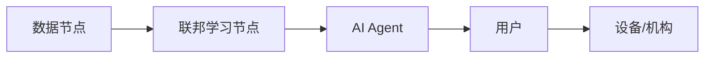
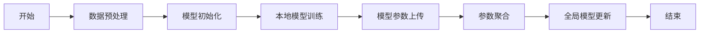
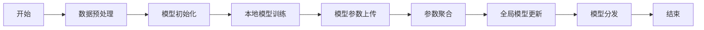
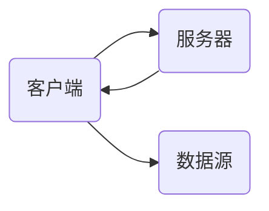

                 


# 开发具有隐私保护联邦学习能力的AI Agent

> 关键词：联邦学习，AI Agent，隐私保护，数据安全，分布式计算

> 摘要：随着人工智能技术的快速发展，隐私保护已成为AI Agent开发中的核心问题。联邦学习作为一种分布式机器学习技术，能够在保护数据隐私的前提下，实现多个机构或设备之间的协作学习。本文将详细探讨如何开发具有隐私保护能力的联邦学习AI Agent，涵盖联邦学习的核心概念、算法原理、系统架构设计以及实际项目实现。

---

# 第一部分: 联邦学习与AI Agent的背景与概念

# 第1章: 联邦学习与AI Agent概述

## 1.1 联邦学习的基本概念
### 1.1.1 联邦学习的定义
联邦学习（Federated Learning，FL）是一种分布式机器学习技术，允许多个数据拥有者（如不同机构或设备）在不共享原始数据的情况下，协作训练一个共同的模型。通过在本地设备上进行模型训练，并仅上传模型更新到云端进行聚合，联邦学习能够在保护数据隐私的前提下实现全局模型的优化。

### 1.1.2 联邦学习的核心特点
- **数据局部性**：数据保留在原始设备或机构，仅模型更新信息在不同节点之间传输。
- **隐私保护**：通过数据不出域的方式，确保原始数据不被泄露。
- **分布式计算**：多个节点协作完成模型训练，避免单点数据集中化。

### 1.1.3 联邦学习与传统机器学习的区别
| **维度**       | **联邦学习（FL）**                     | **传统机器学习（TML）**               |
|----------------|---------------------------------------|---------------------------------------|
| 数据分布       | 数据分布在多个节点，不共享原始数据     | 数据集中化，所有数据存储在单个位置   |
| 隐私保护       | 高                                   | 低                                   |
| 计算效率       | 分布式计算，可能需要多次通信           | 集中计算，效率较高                   |
| 应用场景       | 特别适用于数据敏感场景（如医疗、金融） | 数据不敏感或集中存储场景             |

---

## 1.2 AI Agent的基本概念
### 1.2.1 AI Agent的定义
AI Agent（人工智能代理）是一种能够感知环境、执行任务并做出决策的智能实体。它可以是一个软件程序、机器人或任何能够与环境交互的智能系统。AI Agent的核心目标是通过自主决策和行动，为用户或系统提供智能化服务。

### 1.2.2 AI Agent的核心功能
- **感知环境**：通过传感器或其他数据源获取环境信息。
- **决策与推理**：基于获取的信息，进行推理和决策。
- **执行行动**：根据决策结果执行具体的操作。
- **学习与优化**：通过与环境的交互不断优化自身行为。

### 1.2.3 联邦学习与AI Agent的结合
联邦学习为AI Agent提供了一种在分布式环境中协作学习的能力，使其能够在不共享原始数据的情况下，与其他AI Agent或系统共同优化模型。这种结合不仅增强了AI Agent的隐私保护能力，还扩展了其在数据敏感领域的应用潜力。

---

## 1.3 联邦学习在AI Agent中的应用背景
### 1.3.1 数据隐私保护的重要性
在AI Agent的应用场景中，数据往往涉及用户的隐私信息（如医疗记录、金融数据等）。保护这些数据不被未经授权的机构或个人访问，是开发隐私保护AI Agent的核心目标。

### 1.3.2 联邦学习如何解决数据隐私问题
通过联邦学习，AI Agent可以在本地设备上进行模型训练，仅上传模型参数更新到云端或其他协作节点。这种机制确保了原始数据不会离开设备，从而有效保护用户隐私。

### 1.3.3 联邦学习在AI Agent中的潜在应用
- **医疗领域**：多个医疗机构协作训练医疗诊断模型，同时保护患者隐私。
- **金融领域**：多家金融机构联合训练风险评估模型，避免数据泄露。
- **物联网领域**：智能家居设备协作优化能耗模型，同时保护用户数据。

---

## 1.4 本章小结
本章介绍了联邦学习的基本概念、核心特点以及与传统机器学习的区别，并详细阐述了AI Agent的定义、功能及其与联邦学习的结合。通过联邦学习，AI Agent能够在保护数据隐私的前提下，实现分布式协作学习，为多个领域提供了新的解决方案。

---

# 第二部分: 联邦学习的核心概念与原理

# 第2章: 联邦学习的核心概念与联系

## 2.1 联邦学习的核心概念
### 2.1.1 数据隐私保护机制
联邦学习通过加密通信和差分隐私等技术，确保模型更新过程中数据不会被泄露。例如，使用同态加密技术对模型参数进行加密，确保只有授权节点能够解密并使用这些参数。

### 2.1.2 联邦学习的通信协议
联邦学习中的通信协议负责在各个节点之间传输模型更新信息。常见的通信协议包括：

- **gRPC**：高性能的 RPC 通信协议，适用于分布式系统。
- **HTTP/HTTPS**：基于 RESTful API 的通信协议，适用于简单的联邦学习场景。
- **WebSocket**：实时双向通信协议，适用于需要实时更新的场景。

### 2.1.3 联邦学习的同步机制
联邦学习中的同步机制决定了各个节点如何将模型更新聚合到全局模型中。常见的同步机制包括：

- **同步联邦学习**：所有节点同时更新模型，并将结果上传到云端进行聚合。
- **异步联邦学习**：节点可以按需更新模型，并在任意时间上传更新结果。

---

## 2.2 联邦学习与AI Agent的核心要素对比
### 2.2.1 联邦学习与AI Agent的对比表格
| **维度**       | **联邦学习（FL）**                     | **AI Agent**                         |
|----------------|---------------------------------------|---------------------------------------|
| 核心目标       | 协作训练模型，保护数据隐私             | 感知环境、决策与行动、学习与优化     |
| 数据处理       | 分布式数据，不共享原始数据             | 可能涉及本地或分布式数据             |
| 应用场景       | 医疗、金融、物联网等领域               | 智能家居、自动驾驶、智能助手等         |
| 技术挑战       | 数据异构性、通信开销、模型收敛性       | 数据隐私、环境感知、决策优化         |

### 2.2.2 联邦学习与AI Agent的ER实体关系图


---

## 2.3 本章小结
本章详细介绍了联邦学习的核心概念，包括数据隐私保护机制、通信协议和同步机制，并通过对比表格和ER实体关系图，展示了联邦学习与AI Agent之间的联系。理解这些核心概念是开发具有隐私保护能力的联邦学习AI Agent的基础。

---

# 第三部分: 联邦学习的算法原理

# 第3章: 联邦学习的算法原理

## 3.1 联邦学习的核心算法
### 3.1.1 联邦平均算法(FedAvg)
FedAvg（Federated Average）是一种经典的联邦学习算法，适用于分类、回归等任务。其核心思想是：

1. 每个节点在本地数据上训练模型，并生成模型参数更新。
2. 各节点将模型参数更新上传到云端或其他协作节点。
3. 云端对所有节点的模型参数更新进行加权平均，生成全局模型。
4. 全局模型分发给各节点，供其继续训练。

### 3.1.2 联邦学习的同步机制


---

## 3.2 联邦学习算法的数学模型
### 3.2.1 模型更新公式
$$\theta_{new} = \frac{\sum w_i \theta_i}{\sum w_i}$$

其中，$\theta_{new}$ 是全局模型参数，$w_i$ 是第 $i$ 个节点的权重，$\theta_i$ 是第 $i$ 个节点的模型参数。

### 3.2.2 模型聚合公式
$$\theta_{global} = \sum_{i=1}^n w_i \theta_i / \sum_{i=1}^n w_i$$

---

## 3.3 联邦学习算法的实现示例
以下是一个简单的FedAvg算法实现示例：

```python
import numpy as np

# 模型参数初始化
theta = np.random.randn(2, 1)

# 节点数量
n = 3

# 权重向量（假设各节点权重相同）
weights = np.array([1, 1, 1]) / n

# 模型更新
new_theta = np.zeros_like(theta)
for i in range(n):
    new_theta += weights[i] * theta_i[i]  # theta_i为各节点的模型参数
theta = new_theta
```

---

## 3.4 本章小结
本章详细介绍了联邦学习的核心算法FedAvg，并通过数学公式和代码示例，展示了模型更新的基本原理。理解这些算法原理是开发具有隐私保护能力的联邦学习AI Agent的关键。

---

# 第四部分: 联邦学习AI Agent的系统架构与实现

# 第4章: 联邦学习AI Agent的系统架构设计

## 4.1 系统功能设计
### 4.1.1 系统功能模块
- **数据预处理模块**：对本地数据进行清洗、归一化等预处理。
- **模型训练模块**：在本地数据上训练模型，并生成模型参数更新。
- **模型聚合模块**：将各节点的模型参数更新进行聚合，生成全局模型。
- **模型分发模块**：将全局模型分发给各节点，供其继续训练。

### 4.1.2 系统功能流程图


---

## 4.2 系统架构设计
### 4.2.1 系统架构图


### 4.2.2 系统接口设计
- **客户端接口**：
  - `train_model()`: 在本地数据上训练模型。
  - `upload_params()`: 上传模型参数更新。
  - `download_global_model()`: 下载全局模型。

- **服务器接口**：
  - `aggregate_models()`: 聚合各节点的模型参数。
  - `push_global_model()`: 分发全局模型。

---

## 4.3 本章小结
本章详细设计了联邦学习AI Agent的系统架构，并通过功能流程图和系统架构图展示了系统的整体结构。理解这些设计是实现具有隐私保护能力的联邦学习AI Agent的基础。

---

# 第五部分: 联邦学习AI Agent的项目实战

# 第5章: 联邦学习AI Agent的实现与应用

## 5.1 项目环境搭建
### 5.1.1 环境需求
- **Python**：3.6+
- **TensorFlow**或**Keras**：用于模型训练。
- **Flask**或**gRPC**：用于通信协议实现。
- **NumPy**：用于数据处理。

### 5.1.2 环境安装
```bash
pip install tensorflow numpy flask
```

---

## 5.2 项目核心代码实现
### 5.2.1 本地模型训练代码
```python
import numpy as np
import tensorflow as tf
from tensorflow.keras import layers

# 数据生成（示例）
X = np.random.random((100, 2))
y = np.random.random((100, 1))

# 模型定义
model = tf.keras.Sequential([
    layers.Dense(2, activation='relu'),
    layers.Dense(1, activation='sigmoid')
])

# 模型训练
model.compile(optimizer='adam', loss='binary_crossentropy')
model.fit(X, y, epochs=10)
```

### 5.2.2 模型参数上传与聚合代码
```python
# 模型参数提取
weights = model.get_weights()

# 模型参数上传到服务器
# （实际实现中需要考虑通信协议，如gRPC或HTTP）
```

---

## 5.3 项目应用与分析
### 5.3.1 应用场景分析
以医疗数据分类为例，多个医疗机构可以在不共享患者数据的前提下，协作训练一个全局的疾病诊断模型。

### 5.3.2 模型性能分析
- **训练时间**：与数据量和计算能力相关。
- **模型精度**：依赖于数据分布和模型结构。
- **通信开销**：与节点数量和通信协议相关。

---

## 5.4 本章小结
本章通过具体的项目实现，展示了如何开发具有隐私保护能力的联邦学习AI Agent。从环境搭建到核心代码实现，再到实际应用场景分析，为读者提供了完整的开发流程。

---

# 第六部分: 联邦学习AI Agent的最佳实践

# 第6章: 联邦学习AI Agent的优化与扩展

## 6.1 优化建议
### 6.1.1 数据预处理优化
- **数据清洗**：去除噪声数据，提高模型训练效率。
- **数据增强**：通过数据增强技术增加数据多样性。

### 6.1.2 模型优化
- **模型压缩**：减少模型参数量，降低通信开销。
- **模型并行化**：通过并行计算加速模型训练。

---

## 6.2 注意事项
### 6.2.1 数据隐私保护
- 确保模型更新过程中数据不会被泄露。
- 使用加密技术保护通信过程。

### 6.2.2 模型收敛性
- 处理数据异构性问题，确保模型能够收敛。
- 定期监控模型性能，及时调整训练策略。

---

## 6.3 扩展阅读
### 6.3.1 联邦学习的最新研究
- **异构联邦学习**：处理数据异构性问题。
- **高效通信协议**：优化联邦学习中的通信开销。

### 6.3.2 AI Agent的未来发展方向
- **多模态AI Agent**：结合视觉、听觉等多种感知方式。
- **自适应AI Agent**：能够根据环境动态调整自身行为。

---

## 6.4 本章小结
本章提供了联邦学习AI Agent的优化建议和注意事项，并通过扩展阅读引导读者了解相关领域的最新进展。这些内容将帮助读者更好地开发和应用具有隐私保护能力的联邦学习AI Agent。

---

# 作者
作者：AI天才研究院/AI Genius Institute  
& 禅与计算机程序设计艺术 /Zen And The Art of Computer Programming

