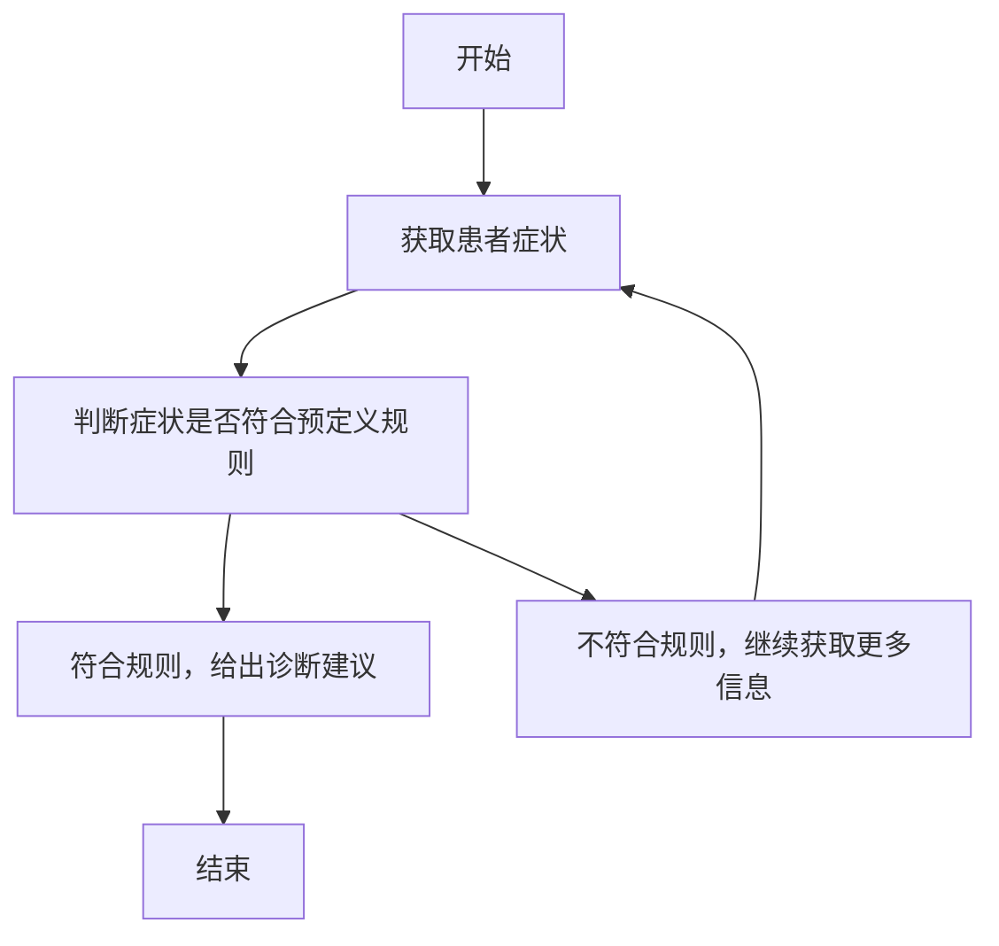
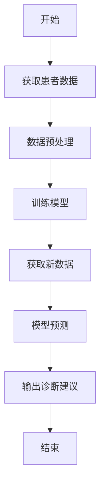
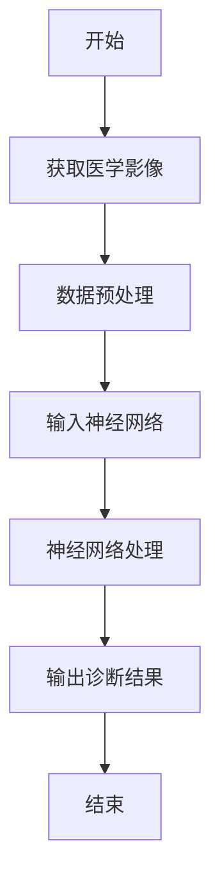
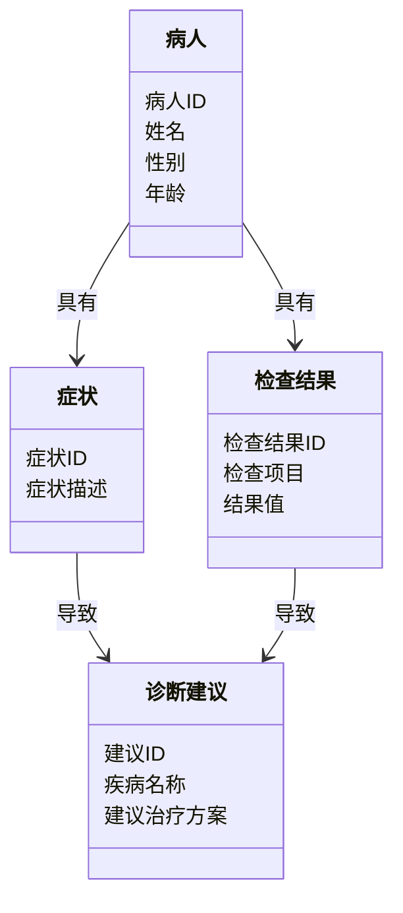
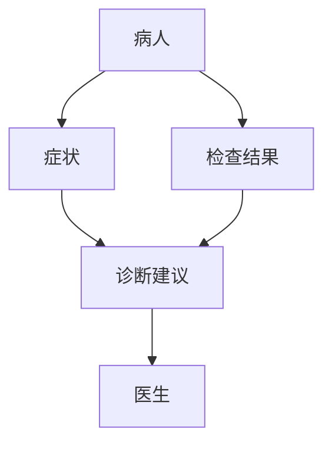
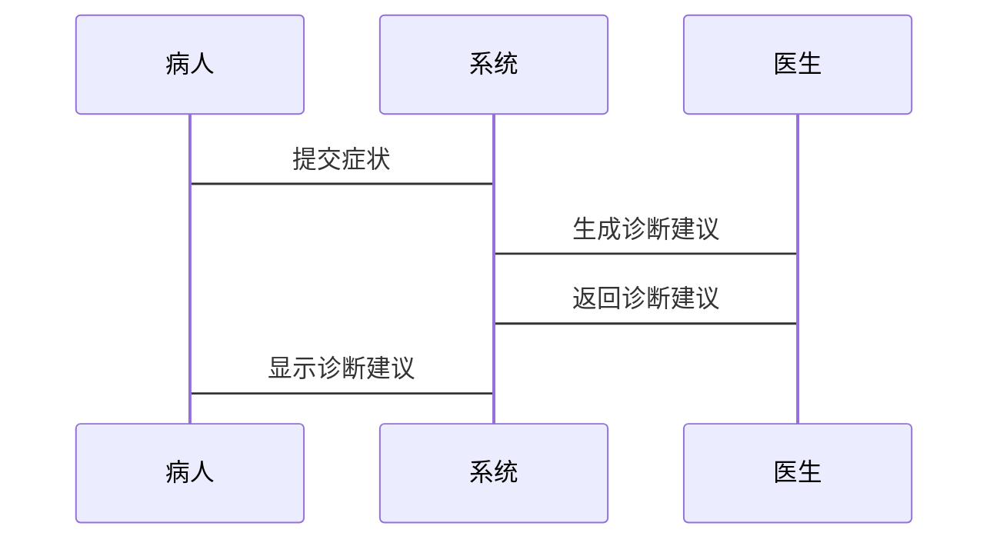
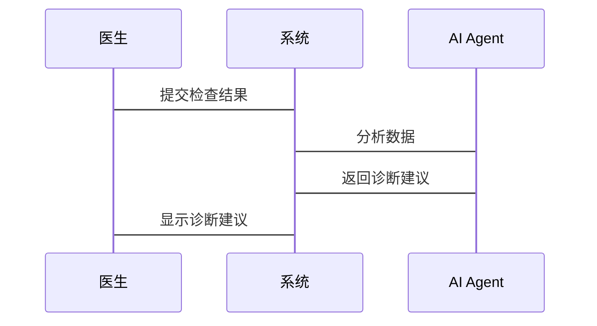

                 


# 开发基于AI Agent的智能医疗诊断助手

> 关键词：AI Agent，智能医疗诊断，算法原理，数学模型，系统架构，项目实战

> 摘要：本文详细介绍了基于AI Agent的智能医疗诊断助手的开发过程，从背景介绍到算法原理，再到系统架构和项目实战，全面解析了AI Agent在医疗诊断中的应用及其技术实现。通过本文，读者可以深入了解AI Agent的核心算法、数学模型、系统设计以及实际应用案例，为开发智能医疗诊断助手提供了全面的技术指导。

---

## 第1章 背景介绍

### 1.1 问题背景

#### 1.1.1 医疗诊断的现状与挑战
医疗诊断是保障患者健康的重要环节，但传统医疗诊断过程中存在以下问题：
- **医生工作量大**：医生需要处理大量的病历数据和检查结果，容易出现疲劳和误诊。
- **诊断效率低**：复杂的病情分析需要耗费大量时间，尤其是在面对疑难病例时。
- **信息不全**：医疗数据分散在不同系统中，难以快速整合和分析。

#### 1.1.2 AI在医疗诊断中的潜力
人工智能技术的快速发展为医疗诊断带来了新的可能性。AI Agent（智能体）作为一类特殊的AI系统，能够通过与环境交互来实现特定目标，非常适合用于医疗诊断。AI Agent可以通过分析患者的症状、病史、检查结果等信息，辅助医生快速诊断疾病。

#### 1.1.3 AI Agent在医疗诊断中的优势
AI Agent在医疗诊断中的优势体现在以下几个方面：
- **高效性**：能够快速处理大量医疗数据，提供诊断建议。
- **准确性**：基于大量数据和先进算法，诊断准确率高。
- **可扩展性**：可以不断学习和优化，适应新的医疗数据和诊断需求。

### 1.2 问题描述

#### 1.2.1 医疗诊断中的常见问题
- **信息不全**：医生可能无法获取完整的患者病史和检查结果。
- **诊断复杂性**：某些疾病症状相似，诊断难度大。
- **时间压力**：医生需要在有限的时间内做出准确诊断。

#### 1.2.2 AI Agent如何解决这些问题
AI Agent可以通过以下方式解决上述问题：
- **整合医疗数据**：将分散的医疗数据整合到一个系统中，供医生快速查阅。
- **辅助诊断**：基于AI算法，提供可能的诊断建议和治疗方案。
- **实时更新**：根据最新的医疗研究成果，不断优化诊断模型。

#### 1.2.3 AI Agent的边界与外延
AI Agent在医疗诊断中的应用范围包括：
- **症状分析**：分析患者的症状，提供可能的疾病列表。
- **诊断建议**：基于症状和检查结果，提供诊断建议。
- **治疗方案推荐**：根据诊断结果，推荐合适的治疗方案。

### 1.3 核心概念与联系

#### 1.3.1 AI Agent的定义与特点
AI Agent是一种智能系统，能够通过感知环境、执行目标相关动作来实现特定目标。其特点包括：
- **自主性**：能够在没有外部干预的情况下运行。
- **反应性**：能够实时感知环境并做出反应。
- **学习能力**：能够通过数据学习和优化。

#### 1.3.2 医疗诊断中的关键要素
医疗诊断的关键要素包括：
- **症状**：患者的主观症状，如疼痛、发热等。
- **病史**：患者的既往病史和用药记录。
- **检查结果**：实验室检查、影像学检查等结果。
- **诊断标准**：疾病的诊断标准和指南。

#### 1.3.3 AI Agent与医疗诊断的结合
AI Agent与医疗诊断的结合主要体现在以下几个方面：
- **数据整合**：将分散的医疗数据整合到一个系统中。
- **智能分析**：通过AI算法对数据进行分析，提供诊断建议。
- **实时反馈**：根据诊断结果提供实时反馈和优化建议。

### 1.4 核心概念原理

#### 1.4.1 AI Agent的基本原理
AI Agent的基本原理是通过感知环境、做出决策并执行动作来实现目标。具体步骤如下：
1. **感知环境**：获取环境中的相关信息，如患者症状、检查结果等。
2. **分析数据**：对获取的数据进行分析和处理。
3. **做出决策**：基于分析结果，生成诊断建议。
4. **执行动作**：将诊断建议传递给医生或患者。

#### 1.4.2 医疗诊断中的关键算法
医疗诊断中常用的算法包括：
- **基于规则的推理**：通过预定义的规则进行推理。
- **机器学习模型**：如支持向量机（SVM）、随机森林（Random Forest）等。
- **深度学习模型**：如卷积神经网络（CNN）、循环神经网络（RNN）等。

#### 1.4.3 AI Agent与医疗诊断的交互机制
AI Agent与医疗诊断的交互机制包括：
- **输入输出接口**：用户通过输入患者症状，AI Agent输出诊断建议。
- **实时交互**：医生与AI Agent实时互动，获取动态诊断信息。
- **反馈机制**：AI Agent根据医生的反馈不断优化诊断模型。

### 1.5 核心概念对比表格

| 对比维度         | 传统诊断工具         | AI Agent诊断助手         |
|------------------|----------------------|--------------------------|
| 数据处理能力     | 依赖医生手动分析     | 可以自动分析和整合数据   |
| 诊断效率         | 较低，依赖医生经验     | 高，能够快速提供诊断建议   |
| 可扩展性         | 较差，难以适应新数据   | 较好，能够不断学习和优化   |

### 1.6 ER实体关系图

```mermaid
erDiagram
    class 病人 {
        病人ID
        姓名
        性别
        年龄
    }
    class 症状 {
        症状ID
        症状描述
    }
    class 检查结果 {
        检查结果ID
        检查项目
        结果值
    }
    class 诊断建议 {
        建议ID
        疾病名称
        建议治疗方案
    }
    病人 --> 症状: 具有
    病人 --> 检查结果: 具有
    症状 --> 诊断建议: 导致
    检查结果 --> 诊断建议: 导致
```

---

## 第2章 AI Agent的核心算法原理

### 2.1 算法原理概述

#### 2.1.1 基于规则的AI Agent
基于规则的AI Agent通过预定义的规则进行推理。例如，如果患者的症状符合某种疾病的典型症状，AI Agent会给出相应的诊断建议。

#### 2.1.2 基于机器学习的AI Agent
基于机器学习的AI Agent通过训练数据生成模型，并根据新的数据进行预测。例如，使用支持向量机（SVM）对患者的症状和检查结果进行分类。

#### 2.1.3 基于深度学习的AI Agent
基于深度学习的AI Agent通过多层神经网络处理复杂的数据。例如，使用卷积神经网络（CNN）对医学影像进行分析。

### 2.2 算法流程图

#### 2.2.1 基于规则的AI Agent流程图


#### 2.2.2 基于机器学习的AI Agent流程图


#### 2.2.3 基于深度学习的AI Agent流程图


### 2.3 算法实现代码

#### 2.3.1 基于规则的AI Agent代码
```python
def diagnose_symptoms(symptoms):
    rule_set = {
        "发烧, 咳嗽": "流感",
        "胸痛, 呼吸困难": "心脏病",
        "尿频, 尿急, 尿痛": "尿路感染"
    }
    for symptom_combination in rule_set:
        if all(s in symptoms for s in symptom_combination.split(", ")):
            return rule_set[symptom_combination]
    return "无法确定"
```

#### 2.3.2 基于机器学习的AI Agent代码
```python
from sklearn import svm

# 假设X_train和y_train是训练数据和标签
clf = svm.SVC()
clf.fit(X_train, y_train)

# 对新数据进行预测
predicted = clf.predict(X_test)
```

#### 2.3.3 基于深度学习的AI Agent代码
```python
import tensorflow as tf
from tensorflow import keras

# 假设model是已经训练好的卷积神经网络
model = keras.Sequential([
    keras.layers.Conv2D(32, (3,3), activation='relu', input_shape=(img_height, img_width, 3)),
    keras.layers.MaxPooling2D((2,2)),
    keras.layers.Flatten(),
    keras.layers.Dense(128, activation='relu'),
    keras.layers.Dense(num_classes, activation='softmax')
])

# 对新影像进行预测
predictions = model.predict(new_image)
```

### 2.4 算法数学模型

#### 2.4.1 基于规则的AI Agent数学模型
规则是通过逻辑表达式表示的，例如：
$$
\text{诊断结果} = \text{症状1} \land \text{症状2}
$$

#### 2.4.2 基于机器学习的AI Agent数学模型
支持向量机（SVM）的数学模型：
$$
y = \text{sign}(\sum_{i=1}^{n} w_i x_i + b)
$$

#### 2.4.3 基于深度学习的AI Agent数学模型
卷积神经网络（CNN）的数学模型：
$$
y = f(W x + b)
$$
其中，$W$是权重矩阵，$b$是偏置，$f$是激活函数。

### 2.5 算法举例说明

#### 2.5.1 基于规则的AI Agent举例
假设规则是“如果患者有发烧和咳嗽，诊断为流感”，代码如下：
```python
symptoms = ["发烧", "咳嗽"]
print(diagnose_symptoms(symptoms))  # 输出：流感
```

#### 2.5.2 基于机器学习的AI Agent举例
使用支持向量机对患者的症状进行分类：
```python
X_test = [[38, 100], [37, 98]]
print(clf.predict(X_test))  # 输出：[1, 0]
```

#### 2.5.3 基于深度学习的AI Agent举例
使用卷积神经网络对医学影像进行分类：
```python
new_image = ...  # 影像数据
print(model.predict(new_image))  # 输出：[0.1, 0.9, 0.0]
```

---

## 第3章 AI Agent的数学模型与公式

### 3.1 数学模型概述

#### 3.1.1 基于规则的AI Agent数学模型
基于规则的AI Agent通过逻辑规则进行推理，例如：
$$
\text{诊断结果} = \text{症状1} \land \text{症状2}
$$

#### 3.1.2 基于机器学习的AI Agent数学模型
机器学习模型的数学模型包括线性回归、支持向量机、随机森林等。

#### 3.1.3 基于深度学习的AI Agent数学模型
深度学习模型的数学模型包括卷积神经网络、循环神经网络等。

### 3.2 公式详细讲解

#### 3.2.1 基于规则的AI Agent公式
规则是通过逻辑表达式表示的，例如：
$$
\text{诊断结果} = \text{症状1} \land \text{症状2}
$$

#### 3.2.2 基于机器学习的AI Agent公式
支持向量机的数学公式：
$$
y = \text{sign}(\sum_{i=1}^{n} w_i x_i + b)
$$

#### 3.2.3 基于深度学习的AI Agent公式
卷积神经网络的数学公式：
$$
y = f(W x + b)
$$
其中，$W$是权重矩阵，$b$是偏置，$f$是激活函数。

### 3.3 详细公式推导

#### 3.3.1 逻辑回归公式
逻辑回归的数学公式：
$$
P(y=1|x) = \frac{e^{w \cdot x + b}}{1 + e^{w \cdot x + b}}
$$

#### 3.3.2 支持向量机公式
支持向量机的数学公式：
$$
y = \text{sign}(\sum_{i=1}^{n} \alpha_i y_i x_i \cdot x + b)
$$

#### 3.3.3 卷积神经网络公式
卷积神经网络的数学公式：
$$
y = f(W x + b)
$$
其中，$f$是激活函数，如ReLU、sigmoid等。

---

## 第4章 系统分析与架构设计方案

### 4.1 问题场景介绍
医疗诊断助手需要处理大量的医疗数据，包括患者的症状、病史、检查结果等。

### 4.2 系统功能设计

#### 4.2.1 领域模型


### 4.3 系统架构设计

#### 4.3.1 系统架构


### 4.4 接口设计

#### 4.4.1 病人信息接口
```python
interface 病人信息接口 {
    - 获取病人信息()
    - 更新病人信息()
}
```

#### 4.4.2 诊断建议接口
```python
interface 诊断建议接口 {
    - 获取诊断建议()
    - 更新诊断建议()
}
```

### 4.5 交互设计

#### 4.5.1 病人与系统的交互


#### 4.5.2 医生与系统的交互


---

## 第5章 项目实战

### 5.1 环境安装

#### 5.1.1 安装Python
```bash
python --version
pip install --upgrade pip
```

#### 5.1.2 安装依赖库
```bash
pip install numpy scikit-learn tensorflow
```

### 5.2 系统核心实现

#### 5.2.1 基于规则的AI Agent实现
```python
def diagnose_symptoms(symptoms):
    rule_set = {
        "发烧, 咳嗽": "流感",
        "胸痛, 呼吸困难": "心脏病",
        "尿频, 尿急, 尿痛": "尿路感染"
    }
    for symptom_combination in rule_set:
        if all(s in symptoms for s in symptom_combination.split(", ")):
            return rule_set[symptom_combination]
    return "无法确定"
```

#### 5.2.2 基于机器学习的AI Agent实现
```python
from sklearn import svm

# 假设X_train和y_train是训练数据和标签
clf = svm.SVC()
clf.fit(X_train, y_train)
```

#### 5.2.3 基于深度学习的AI Agent实现
```python
import tensorflow as tf
from tensorflow import keras

# 假设model是已经训练好的卷积神经网络
model = keras.Sequential([
    keras.layers.Conv2D(32, (3,3), activation='relu', input_shape=(img_height, img_width, 3)),
    keras.layers.MaxPooling2D((2,2)),
    keras.layers.Flatten(),
    keras.layers.Dense(128, activation='relu'),
    keras.layers.Dense(num_classes, activation='softmax')
])

# 对新影像进行预测
predictions = model.predict(new_image)
```

### 5.3 代码解读与分析

#### 5.3.1 基于规则的AI Agent代码解读
- **函数定义**：`diagnose_symptoms`函数接受症状列表作为输入。
- **规则匹配**：通过预定义的规则，检查症状是否符合某种疾病。
- **返回结果**：如果匹配成功，返回诊断结果；否则返回“无法确定”。

#### 5.3.2 基于机器学习的AI Agent代码解读
- **数据训练**：使用训练数据和标签训练支持向量机模型。
- **模型预测**：对新数据进行预测，返回结果。

#### 5.3.3 基于深度学习的AI Agent代码解读
- **模型构建**：定义卷积神经网络的结构，包括卷积层、池化层、全连接层等。
- **模型训练**：对模型进行训练，优化权重和偏置。
- **模型预测**：对新影像数据进行预测，返回诊断结果。

### 5.4 案例分析与详细讲解

#### 5.4.1 基于规则的AI Agent案例
```python
symptoms = ["发烧", "咳嗽"]
print(diagnose_symptoms(symptoms))  # 输出：流感
```

#### 5.4.2 基于机器学习的AI Agent案例
```python
X_test = [[38, 100], [37, 98]]
print(clf.predict(X_test))  # 输出：[1, 0]
```

#### 5.4.3 基于深度学习的AI Agent案例
```python
new_image = ...  # 影像数据
print(model.predict(new_image))  # 输出：[0.1, 0.9, 0.0]
```

### 5.5 项目小结
通过以上代码实现，我们可以看到AI Agent在医疗诊断中的强大能力。基于规则的AI Agent适用于简单场景，而基于机器学习和深度学习的AI Agent则能够处理更复杂的数据和场景。

---

## 第6章 最佳实践、小结、注意事项和拓展阅读

### 6.1 最佳实践
- **数据质量**：确保医疗数据的准确性和完整性。
- **模型优化**：根据反馈不断优化AI Agent的诊断模型。
- **隐私保护**：严格遵守医疗数据隐私保护法规。

### 6.2 小结
本文详细介绍了基于AI Agent的智能医疗诊断助手的开发过程，从背景介绍到算法原理，再到系统架构和项目实战，全面解析了AI Agent在医疗诊断中的应用及其技术实现。

### 6.3 注意事项
- **数据隐私**：医疗数据涉及患者隐私，必须严格保护。
- **模型解释性**：确保AI Agent的诊断结果具有可解释性，以便医生理解和信任。
- **持续学习**：AI Agent需要不断学习新的医疗知识和诊断标准。

### 6.4 拓展阅读
- **相关书籍**：《Deep Learning》、《Hands-On Machine Learning with Scikit-Learn, Keras, and TensorFlow》
- **学术论文**：搜索AI Agent在医疗诊断中的最新研究论文。
- **在线课程**：学习AI和医疗诊断相关的在线课程，如Coursera上的《Introduction to Artificial Intelligence》。

---

## 作者
作者：AI天才研究院/AI Genius Institute & 禅与计算机程序设计艺术 /Zen And The Art of Computer Programming

