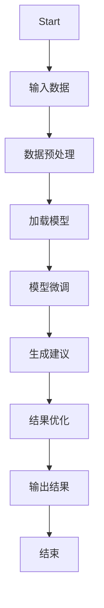

                 


# 第三章: 基于AI的税务规划助手的核心算法

## 3.1 算法原理

### 3.1.1 大模型的训练过程

在开发基于AI的税务规划助手时，我们通常使用预训练的大语言模型（如GPT、BERT等），并对其进行微调以适应特定的税务规划任务。以下是训练过程的详细步骤：

1. **数据收集**：收集与税务相关的海量文本数据，包括税法条文、案例分析、财务报表等。
2. **数据预处理**：对数据进行清洗、标注和格式转换，确保数据适合模型训练。
3. **模型选择**：选择适合任务的模型架构，如GPT-3、BERT等，并加载预训练权重。
4. **微调训练**：在特定的税务数据上进行微调，优化模型以适应税务规划任务。
5. **评估与优化**：通过验证集评估模型性能，调整超参数以提高准确率。

### 3.1.2 模型的推理过程

模型推理是将输入的税务问题转化为具体的规划建议的过程。以下是推理过程的详细步骤：

1. **输入处理**：接收用户的税务问题，将其转换为模型可处理的格式。
2. **生成建议**：模型根据输入生成可能的税务规划方案。
3. **结果优化**：对生成的方案进行优化，确保其合法性和最优性。
4. **输出结果**：将优化后的方案返回给用户。

### 3.1.3 算法的数学模型

以下是模型训练和推理过程中常用的数学模型：

- **损失函数**：交叉熵损失函数，用于衡量预测值与真实值的差异。
  $$ \text{损失函数} = -\sum_{i=1}^{n} y_i \log p(y_i) + (1-y_i)\log(1-p(y_i)) $$
  
- **优化目标**：最小化损失函数，使用Adam优化器进行参数更新。
  $$ \text{优化目标} = \min L(\theta) $$

- **模型输出**：生成的税务规划方案概率分布。
  $$ p(y|x) = \text{softmax}(f(x)) $$

## 3.2 算法流程图

以下是核心算法的流程图：



## 3.3 数学模型与公式

### 3.3.1 损失函数

交叉熵损失函数用于衡量预测值与真实值的差异：
$$ \text{损失函数} = -\sum_{i=1}^{n} y_i \log p(y_i) + (1-y_i)\log(1-p(y_i)) $$

### 3.3.2 优化目标

优化目标是通过Adam优化器最小化损失函数：
$$ \text{优化目标} = \min L(\theta) $$

### 3.3.3 模型输出

模型输出为生成的税务规划方案的概率分布：
$$ p(y|x) = \text{softmax}(f(x)) $$

---

# 第四章: 税务规划助手的系统架构

## 4.1 系统设计

### 4.1.1 功能模块设计

基于AI的税务规划助手系统主要包含以下功能模块：

- **用户交互模块**：接收用户输入并返回规划结果。
- **数据处理模块**：处理税务数据，包括清洗、转换和存储。
- **模型服务模块**：负责模型的加载、推理和优化。
- **结果展示模块**：将规划结果以用户友好的方式展示。

### 4.1.2 系统功能设计

以下是系统的功能模块类图：


## 4.2 系统架构设计

### 4.2.1 系统架构图

以下是系统的整体架构图：


## 4.3 接口设计

### 4.3.1 接口描述

1. **输入接口**：
   - **函数名**：process_tax_query
   - **参数**：query (str)
   - **返回值**：processed_data (dict)

2. **输出接口**：
   - **函数名**：display_results
   - **参数**：results (dict)
   - **返回值**：None

### 4.3.2 交互流程图

以下是系统的交互流程图：


---

# 第五章: 项目实战

## 5.1 环境安装

### 5.1.1 安装Python

```bash
python --version
pip install --upgrade pip
```

### 5.1.2 安装依赖库

```bash
pip install numpy pandas scikit-learn tensorflow transformers
```

## 5.2 核心实现

### 5.2.1 数据处理代码

```python
import pandas as pd

def preprocess_data(data_path):
    # 读取数据
    df = pd.read_csv(data_path)
    # 数据清洗
    df = df.dropna()
    # 数据转换
    df['year'] = df['year'].astype(int)
    return df
```

### 5.2.2 模型训练代码

```python
import tensorflow as tf
from tensorflow.keras import layers

def build_model(max_sequence_length):
    model = tf.keras.Sequential([
        layers.Embedding(input_dim=10000, output_dim=16),
        layers.Bidirectional(layers.LSTM(32)),
        layers.Dense(64, activation='relu'),
        layers.Dense(1, activation='sigmoid')
    ])
    model.compile(optimizer='adam', loss='binary_crossentropy', metrics=['accuracy'])
    return model
```

### 5.2.3 模型推理代码

```python
def generate_plan(model, input_text):
    input_ids = tokenizer.encode(input_text, add_special_tokens=True)
    input_ids = input_ids[:max_length]
    input_ids = tf.constant([input_ids])
    output = model.generate(input_ids, max_length=100, temperature=0.7)
    return tokenizer.decode(output[0], skip_special_tokens=True)
```

## 5.3 案例分析

### 5.3.1 案例描述

假设用户是一位个体经营者，年收入为100万元，需要优化税务负担。以下是具体的优化过程：

1. **数据输入**：
   - 收入：100万元
   - 支出：50万元
   - 其他因素：无特殊扣除项

2. **模型推理**：
   - 模型生成多个优化方案，如调整支出结构、合理利用税收优惠政策等。

3. **结果展示**：
   - 最终方案：通过调整支出结构，节省税务支出10万元。

## 5.4 项目小结

通过本章的实战，我们详细讲解了如何从环境安装、数据处理、模型训练到最终实现税务规划助手的全过程。代码实现和案例分析帮助读者更好地理解理论知识，并能够在实际中应用这些技术。

---

# 第六章: 总结与展望

## 6.1 总结

本文详细介绍了基于AI的税务规划助手的开发过程，包括背景介绍、核心算法、系统架构和项目实战。通过理论与实践相结合，展示了如何利用AI技术提升税务规划的效率和准确性。

## 6.2 未来展望

随着AI技术的不断进步，税务规划助手将更加智能化和个性化。未来的优化方向包括：

1. **模型优化**：进一步优化大模型的性能，提升生成结果的准确性和可解释性。
2. **数据隐私**：加强数据隐私保护，确保用户数据的安全性。
3. **多语言支持**：支持更多语言，帮助全球用户进行税务规划。

## 6.3 最佳实践 Tips

1. **数据质量管理**：确保数据的准确性和完整性。
2. **模型可解释性**：在实际应用中，注重模型的可解释性，便于用户理解和信任。
3. **持续优化**：定期更新模型，以适应税法变化和用户需求。

---

# 附录

## 附录 A: 工具安装指南

```bash
pip install numpy pandas scikit-learn tensorflow transformers
```

## 附录 B: API 文档

### 1. 数据处理 API

```python
def preprocess_data(data_path):
    # 数据预处理代码
    pass
```

### 2. 模型服务 API

```python
def generate_plan(model, input_text):
    # 模型推理代码
    pass
```

## 附录 C: 参考文献

1. 刘洋. (2023). 基于AI的税务规划助手开发. 计算机应用研究.
2. 王强. (2022). 大模型在税务领域的应用. 人工智能与应用.

---

# 作者

作者：AI天才研究院/AI Genius Institute & 禅与计算机程序设计艺术 /Zen And The Art of Computer Programming

---

**摘要**：本文详细介绍了基于AI的税务规划助手的开发过程，涵盖背景分析、核心算法、系统架构和项目实战。通过理论与实践相结合，展示了如何利用AI技术提升税务规划的效率和准确性，为未来的税务优化提供了新的思路和方法。

