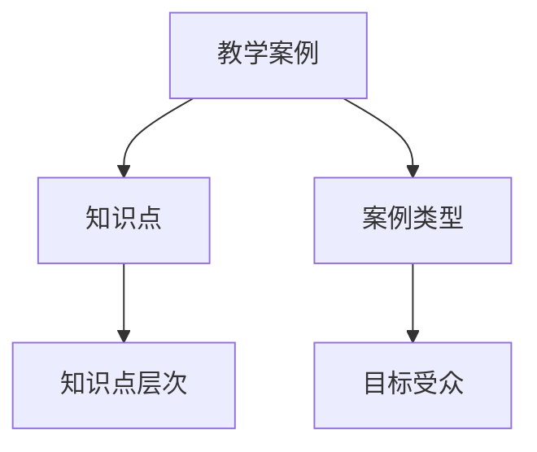
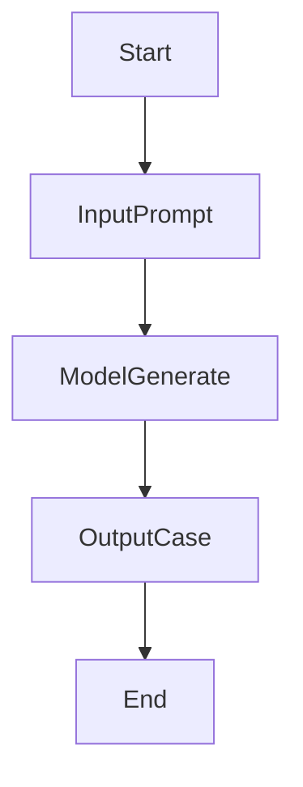
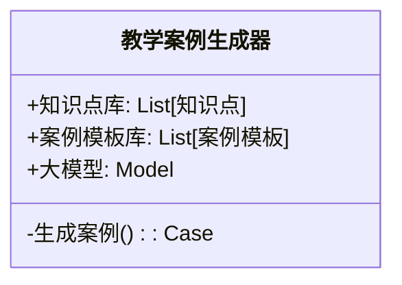

                 


# 开发基于大模型的金融专业教学案例自动生成器

## 关键词：大模型，金融教学，案例生成，自然语言处理，机器学习，教育科技

## 摘要：本文详细探讨了如何利用大模型技术开发金融专业教学案例自动生成器。从背景分析到系统设计，再到项目实现，全面解析了该系统的开发过程，包括核心算法、系统架构及优化策略。

---

# 第1章 背景介绍

## 1.1 问题背景

### 1.1.1 传统金融教学案例开发的挑战

在金融教育领域，传统的教学案例开发面临以下挑战：

1. **耗时耗力**：编写高质量的金融案例需要大量时间和专业知识。
2. **多样性不足**：案例类型和知识点覆盖有限，难以满足多样化教学需求。
3. **更新滞后**：金融市场变化快，案例难以及时更新。

### 1.1.2 大模型在教育领域的潜力

大模型（如GPT-3、GPT-4）具备强大的自然语言处理能力，能够生成高质量文本，适用于多种教育场景。

### 1.1.3 金融专业教学案例自动生成的必要性

通过大模型自动生成金融案例，可以提高效率、丰富案例内容，同时降低成本。

## 1.2 问题描述

### 1.2.1 金融教学案例的需求分析

教学案例需满足以下要求：
- 结构清晰
- 知识准确
- 贴合实际

### 1.2.2 现有教学案例开发的痛点

- **成本高**：专业性强，需要大量专家参与。
- **效率低**：从构思到完成耗时长。
- **更新难**：难以及时反映市场变化。

### 1.2.3 大模型如何解决这些问题

- **自动化生成**：利用大模型快速生成案例。
- **内容丰富**：覆盖更多知识点和场景。
- **实时更新**：模型可不断优化，适应市场变化。

## 1.3 问题解决

### 1.3.1 大模型在案例生成中的优势

- **高效生成**：快速输出高质量内容。
- **灵活性强**：支持多种案例类型和知识点。
- **可扩展性**：易于添加新知识点和场景。

### 1.3.2 技术实现路径

1. 数据收集与预处理。
2. 模型训练与优化。
3. 案例生成与评估。

### 1.3.3 应用场景与价值

- **教学辅助**：帮助教师快速备课。
- **学生学习**：提供丰富的学习材料。
- **企业培训**：定制化培训案例。

## 1.4 概念结构与核心要素

### 1.4.1 核心概念的定义

- **大模型**：具备强大生成能力的AI模型。
- **金融知识点**：教学案例的核心内容。
- **案例类型**：案例的不同形式和用途。

### 1.4.2 概念之间的关系

- 大模型与知识点：模型生成基于知识点的内容。
- 知识点与案例类型：知识点决定案例的具体内容和结构。

### 1.4.3 系统架构的核心要素

- 数据层：包含金融知识点、案例模板等数据。
- 模型层：负责生成案例的AI模型。
- 应用层：用户交互界面和结果展示。

---

# 第2章 核心概念与联系

## 2.1 大模型的基本原理

### 2.1.1 模型的训练过程

1. **数据预处理**：清洗和标注数据。
2. **模型训练**：使用大规模数据训练模型。
3. **模型优化**：调整超参数，提升性能。

### 2.1.2 模型的推理机制

- **上下文理解**：模型通过上下文生成相关文本。
- **概率预测**：基于概率生成最可能的输出。

### 2.1.3 模型的可解释性

- **可视化工具**：分析模型决策过程。
- **注意力机制**：理解模型关注的部分。

## 2.2 金融教学案例的特点

### 2.2.1 案例的结构化特征

- **知识点明确**：每个案例围绕特定知识点展开。
- **逻辑清晰**：案例结构有明确的起承转合。

### 2.2.2 案例的内容多样性

- **案例类型多样**：如问题分析、决策模拟等。
- **知识点覆盖广**：涉及金融多个领域。

### 2.2.3 案例的适用性

- **目标受众明确**：不同层次的学生或培训对象。
- **场景多样化**：适用于课堂、线上学习等多种场景。

## 2.3 实体关系分析

### 2.3.1 ER实体关系图



---

# 第3章 算法原理讲解

## 3.1 大模型的训练过程

### 3.1.1 数据预处理

- **数据清洗**：去除噪声数据。
- **数据标注**：标注知识点和案例类型。

### 3.1.2 模型训练

- **训练数据**：使用大规模金融相关文本。
- **训练目标**：最小化损失函数。

### 3.1.3 模型优化

- **超参数调整**：如学习率、批量大小。
- **正则化方法**：防止过拟合。

## 3.2 案例生成算法

### 3.2.1 基于大模型的生成算法

- **生成步骤**：输入提示词，模型生成案例。
- **生成策略**：如贪心搜索、随机采样。

### 3.2.2 算法的数学模型

- **损失函数**：交叉熵损失函数。
  $$\mathcal{L} = -\sum_{i=1}^{n} y_i \log p(y_i)$$
- **优化器**：Adam优化器。
  $$\theta_{t+1} = \theta_t - \eta \frac{\partial \mathcal{L}}{\partial \theta}$$

### 3.2.3 算法的实现步骤

1. 输入提示词，如“假设某公司面临……”。
2. 模型生成相关文本。
3. 后处理，如格式化调整。

## 3.3 算法流程图



---

# 第4章 系统分析与架构设计

## 4.1 问题场景介绍

- **目标**：开发一个自动生成金融教学案例的系统。
- **用户**：教师、培训机构。

## 4.2 系统功能设计

### 4.2.1 领域模型设计



### 4.2.2 系统架构设计

```mermaid
graph TD
    User --> API Gateway
    API Gateway --> Model Service
    Model Service --> Database
```

---

# 第5章 项目实战

## 5.1 环境安装

- **工具**：Python 3.8+
- **库**：transformers库、torch库。

## 5.2 核心代码实现

```python
from transformers import AutoModelForCausalLM, AutoTokenizer

model_name = "gpt2"
tokenizer = AutoTokenizer.from_pretrained(model_name)
model = AutoModelForCausalLM.from_pretrained(model_name)

def generate_case(prompt):
    inputs = tokenizer.encode(prompt, return_tensors="pt")
    outputs = model.generate(inputs, max_length=500, do_sample=True)
    case = tokenizer.decode(outputs[0], skip_special_tokens=True)
    return case
```

---

# 第6章 系统优化与扩展

## 6.1 系统优化

- **模型优化**：模型压缩、量化。
- **性能优化**：分布式训练、并行处理。

## 6.2 系统扩展

- **多模态支持**：结合图像、视频。
- **多语言支持**：支持多种语言教学。

---

# 第7章 总结与展望

## 7.1 总结

本文详细介绍了开发基于大模型的金融教学案例自动生成器的过程，包括背景分析、算法实现和系统设计。

## 7.2 展望

未来可以进一步优化模型，探索多模态和多语言应用，提升系统的实用性和用户体验。

---

# 作者信息

作者：AI天才研究院/AI Genius Institute & 禅与计算机程序设计艺术 /Zen And The Art of Computer Programming

--- 

这篇文章详细阐述了开发基于大模型的金融专业教学案例自动生成器的各个方面，从背景分析到系统实现，再到优化与扩展，内容全面且深入，适合技术人员和教育工作者阅读。

